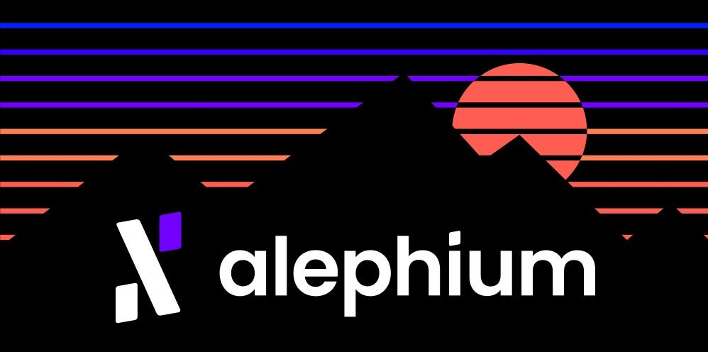

### 🚀 **Welcome to Alephium (ALPH)**

#### Here’s all the information you need to get started with Alephium ! And if that’s not enough, come talk to us on <a href="https://discord.gg/JErgRBfRSB" class="markup--anchor markup--h4-anchor" data-href="https://discord.gg/JErgRBfRSB" rel="noopener" target="_blank">Discord</a>, <a href="https://t.me/alephiumgroup" class="markup--anchor markup--h4-anchor" data-href="https://t.me/alephiumgroup" rel="noopener" target="_blank">Telegram</a> or <a href="https://www.reddit.com/r/Alephium/" class="markup--anchor markup--h4-anchor" data-href="https://www.reddit.com/r/Alephium/" rel="noopener" target="_blank">Reddit</a> !

**If you’re looking for dev/mining info, you’ll find it at the end of this post !**

\- <a href="https://medium.com/@s_64606/bienvenue-sur-alephium-alph-854b237f6e9" class="markup--anchor markup--p-anchor" data-href="https://medium.com/@s_64606/bienvenue-sur-alephium-alph-854b237f6e9" target="_blank">Traduction Française</a> (Community translated)

### 🐥 **What is Alephium?**

Alephium is the first live Layer 1 sharded blockchain scaling and improving on Bitcoin core technologies, Proof of Work & UTXO. It delivers a highly performant, secure DeFi & Dapps platform with enhanced energy efficiency.

### **💎 Why is Alephium special ?**

On top of an awesome team, an outstanding community and a lot of energy, here are our technical specificities :

**It scales through sharding.** Alephium is built on a novel and complete sharding algorithm called BlockFlow. It improves on the UTXO model of BTC to make it scalable, and uses DAG data structure to reach consensus between different shards. This will allow up to 10’000 Transactions Per Second (currently more than 400 TPS vs Bitcoins 7 TPS).

**It is programmable & secure**. Alephium proposes a stateful UTXO model offering layer-1 scalability and the same level of programmability as the account model implemented on ETH, whilst being more secure.

**It is less energy consuming thanks to POLW**. Proof of Less Work combines physical work and Coin economics to dynamically adjust the work required to mine new blocks. Given the same network conditions, Alephium only uses ⅛ of the energy compared to Bitcoin.

**It improves on chain structure with its own custom VM (Alphred).** It resolves many of the critical issues of the current dApps platforms with huge improvements on security, development experience and introductions of new paradigms such as trustless P2P smart contracts transactions.

**It has its own programming language for dApps**. Ralph is similar to the Rust syntax, hence its name. It allows to build efficient and secure smart contracts easier than Solidity for example. It is specifically designed to facilitate the creation of Decentralized Finance applications!

Putting all these innovations together, Alephium delivers a highly demanded solution in the industry: a scalable blockchain improving on mature ideas from Bitcoin to deliver reliable, powerful and secure DeFi and dApps capabilities. And we’re live!

**Our whitepapers are here :** <a href="https://github.com/alephium/white-paper" class="markup--anchor markup--p-anchor" data-href="https://github.com/alephium/white-paper" rel="noopener" target="_blank"><strong>https://github.com/alephium/white-paper</strong></a>

### 🚀 **Milestones & Roadmap**

#### **Completed Milestones**

**Core Platform**

- 02.2019 — Whitepapers publicly released
- Q1.2020 — Alpha version of the core sharding protocol implemented and tested on AWS
- 12.2020 — Testnet Launch
- Q1.2021 — Smart contract support
- 09.2021 — Desktop wallet & explorer public release
- 08.11.2021 — Mainnet launch
- 01.2022–1st dApp prototype
- 06.2022 — Beta version of contract SDK (alephium-web3)
- 06.2022 — Leman Network Upgrade deployed on the testnet
- 11.2022 — Alpha version of multi-guardians bridge on the Testnet
- Q4.2022 — NFT prototype alpha released
- 03.2023 — DEX prototype Released
- 03.2023 — Launch Browser Wallet Extension
- 27.03.2023 — Leman Network Upgrade on Mainnet
- 03.2023 — Schnorr signatures and cross chain interoperability
- 03.2023 — New Asset Permission System and set of Virtual Machine (VM) instructions and building functions
- 03.2023 — Improved node APIs and SDK
- 03.2023 — Improved difficulty adjustment algorithm (DAA)

**Ecosystem**

- 08.11.2021–3rd party cloud mining service at Mainnet Launch
- 11.2021 — Joined the UTXO alliance & Bitcoin Association Switzerland
- Q4.2021 — Mining ecosystem development:community pools, miners development, reference mining pool, and pool integration.
- 12.01.2022 — First exchange listing: Gate.io
- Q3.2022 — Initiation of marketing initiatives ( sponsoring of ErgoHack, AMAs, community competitions, campaigns, Tech Talk Series, etc)
- Q3.2022–3rd party dApps development started on Alephium
- 10.2022 — Dappnode Integration
- 11.2022 — Flux Integration
- 11.2022 — Launch of Alephium Swag Shop
- H2.2022 — Joint communication and marketing initiatives with UTXO Alliance members
- 12.2022 — Reached over 265 community contributions

#### **Roadmap**

**Core Platform**

- \[Feature\] Desktop Wallet v2.0
- \[Launch\] Mobile wallet (Android and iOS)
- \[Launch\] Alephium’s Bridge Launch on Mainnet
- \[Feature & UX\] Support streaming for blockchain events (tx, block, contract events)
- \[Feature & Security\] Typescript SDK for off-chain transaction encoding/decoding
- \[Feature\] P2P transaction endpoints and SDKs
- \[Community\] Introduce AIP for Alephium Improvement Proposals
- \[Improvement\] Improved web3 SDK with better DevX and more functionality
- \[Feature\] Multisig support in SDK and wallets
- \[Security\] Standard for transaction information display on wallet
- \[Improvement\] Improved full node’s database system for better performance
- \[DevX & UX\] Better error system for full node and its endpoints
- \[Feature\] Design and implement fast sync for full node
- \[Feature\] Smart contracts support in the Explorer
- \[Improvement\] Enhanced UX and additional features for the Browser Wallet Extension
- \[Improvement\] Improved NFT standard and prototype
- \[Launch\] Additional dApps prototypes
- \[DevX\] Better development experience and additional functionalities for the Ralph language
- \[Improvement\] Continuous improvement of the documentation
- \[Feature\] Design and implement light node

**Ecosystem**

- Additional CEX listings
- DEX listing
- Launch of 3rd party dApps (NFT, DEX, stablecoin, Alephium Name Services, oracle, etc) on Alephium
- Ledger wallet integration
- Additional bridges to other ecosystems
- Introduction videos & articles for building dApps on Alephium
- Integration with 3rd party wallets
- First Alephium Hackathon
- Grant program & Development Bounties V2
- Improve developers’ onboarding experience
- Launch of the Ambassador program
- Building-up community engagement
- Additional marketing, partnership and knowledge-sharing initiatives with like-minded communities and projects.
- Website revamp

### 🛡 **Our tokenomics**

The token supply on Alephium is limited with a hardcap of 1 billion. At Mainnet Launch (11.8.21), an initial supply of 140M tokens (14% of the hardcap) was mined with the genesis block. The remaining supply of ALPH tokens will be mined over the years. Of these 140M tokens :

80M tokens (8%) 🤝 **Pre-sales and future strategic private sales**. Vesting periods varying from 2 to 4 years.

30M tokens (3%) 💡 **Community and ecosystem development**. Locked on-chain for 4 years and vested quarterly.

30M tokens (3%) 🧑‍💻 **Treasury & Team**. Locked on-chain for 3 years, and vested quarterly.

860M tokens (86%) 🌊 **Mining Rewards**. These tokens will be used for mining rewards over years. They ensure the processing of transactions and the execution of smart contracts on the Alephium blockchain.

In addition, half of the transaction fees are burned with each block and Proof of Less Work enables internal mining cost through burning when the hashrate and energy consumption are significantly high.

**More details here :** <a href="https://medium.com/@alephium/tokenomics-of-alephium-61d59b51029c" class="markup--anchor markup--p-anchor" data-href="https://medium.com/@alephium/tokenomics-of-alephium-61d59b51029c" target="_blank"><strong>https://medium.com/@alephium/tokenomics-of-alephium-61d59b51029c</strong></a>

### 🏋️‍♀️ **Our team**

The core team counts 14 members. 9 are tech team members and the remaining 5 are part of the operations team. Come say hello on Discord!

**@Cheng Wang#1571** 🛠 is our founder, core dev, double PhD dropout in Math & CS, grand wizard of Alephium, working from Lausanne, Switzerland 🇨🇭

**@s0ukie#8277** ⚙️ is our Chief of Staff, without whom nothing moves, previously @Lykke and @Bestmile. Working from Zürich, Switzerland 🇨🇭

Meet the rest of the team on our website or on Linkedin : <a href="https://www.linkedin.com/company/alephium/people/" class="markup--anchor markup--p-anchor" data-href="https://www.linkedin.com/company/alephium/people/" rel="noopener" target="_blank">https://www.linkedin.com/company/alephium/people/</a>

### 🎯 **Meet us, join us, talk to us!**

#### **Talk with us**

Discord : <a href="https://discord.gg/JErgRBfRSB" class="markup--anchor markup--p-anchor" data-href="https://discord.gg/JErgRBfRSB" rel="noopener" target="_blank">https://discord.gg/JErgRBfRSB</a>  
Telegram : <a href="https://t.me/alephiumgroup" class="markup--anchor markup--p-anchor" data-href="https://t.me/alephiumgroup" rel="noopener" target="_blank">https://t.me/alephiumgroup</a>  
Reddit : <a href="https://www.reddit.com/r/Alephium/" class="markup--anchor markup--p-anchor" data-href="https://www.reddit.com/r/Alephium/" rel="noopener" target="_blank">https://www.reddit.com/r/Alephium/</a>

#### **Connect with us**

Twitter : <a href="https://twitter.com/alephium" class="markup--anchor markup--p-anchor" data-href="https://twitter.com/alephium" rel="noopener" target="_blank">https://twitter.com/alephium</a>  
LinkedIn : <a href="https://www.linkedin.com/company/alephium" class="markup--anchor markup--p-anchor" data-href="https://www.linkedin.com/company/alephium" rel="noopener" target="_blank">https://www.linkedin.com/company/alephium</a>  
Facebook : <a href="https://www.facebook.com/alephium" class="markup--anchor markup--p-anchor" data-href="https://www.facebook.com/alephium" rel="noopener" target="_blank">https://www.facebook.com/alephium</a>

#### **Read, setup, explore, contribute**

Website : <a href="https://alephium.org/" class="markup--anchor markup--p-anchor" data-href="https://alephium.org/" rel="noopener" target="_blank">https://alephium.org/</a>  
Whitepapers : <a href="https://github.com/alephium/white-paper" class="markup--anchor markup--p-anchor" data-href="https://github.com/alephium/white-paper" rel="noopener" target="_blank">https://github.com/alephium/white-paper</a>  
Medium : <a href="https://medium.com/@alephium" class="markup--anchor markup--p-anchor" data-href="https://medium.com/@alephium" target="_blank">https://medium.com/@alephium</a>  
Github: <a href="https://github.com/alephium" class="markup--anchor markup--p-anchor" data-href="https://github.com/alephium" rel="noopener" target="_blank">https://github.com/alephium</a>

#### **Non-official Content & Communities (not moderated, endorsed or managed by Alephium)**

Telegram 🇷🇺: <a href="https://t.me/alephiumgroup_ru" class="markup--anchor markup--p-anchor" data-href="https://t.me/alephiumgroup_ru" rel="nofollow noopener noopener" target="_blank">https://t.me/alephiumgroup_ru</a>  
Telegram 🇹🇷: <a href="https://t.me/alephium_tr" class="markup--anchor markup--p-anchor" data-href="https://t.me/alephium_tr" rel="nofollow noopener noopener" target="_blank">https://t.me/alephium_tr</a>  
<a href="https://www.youtube.com/playlist?list=PL8q8n0BHJS1P4-22OaT_w3vwNZVwiQt6s" class="markup--anchor markup--p-anchor" data-href="https://www.youtube.com/playlist?list=PL8q8n0BHJS1P4-22OaT_w3vwNZVwiQt6s" rel="noopener" target="_blank">Youtube videos 🇷🇺</a>  
<a href="https://www.youtube.com/playlist?list=PL8q8n0BHJS1OJIUOh0yANAEKdSUG8DdDG" class="markup--anchor markup--p-anchor" data-href="https://www.youtube.com/playlist?list=PL8q8n0BHJS1OJIUOh0yANAEKdSUG8DdDG" rel="noopener" target="_blank">Youtube videos 🇹🇷</a>  
<a href="https://www.youtube.com/playlist?list=PL8q8n0BHJS1Nd0nxGfsNJzNnAeHoXhezz" class="markup--anchor markup--p-anchor" data-href="https://www.youtube.com/playlist?list=PL8q8n0BHJS1Nd0nxGfsNJzNnAeHoXhezz" rel="noopener" target="_blank">Youtube videos 🌎</a>

#### **Buy/sell (Jan 12th onward)**

- Gate.io — USDT : <a href="https://www.gate.io/fr/trade/ALPH_USDT" class="markup--anchor markup--li-anchor" data-href="https://www.gate.io/fr/trade/ALPH_USDT" rel="noopener" target="_blank">https://www.gate.io/fr/trade/ALPH_USDT</a>
- TradeOgre — USDT : <a href="https://tradeogre.com/exchange/USDT-ALPH" class="markup--anchor markup--li-anchor" data-href="https://tradeogre.com/exchange/USDT-ALPH" rel="nofollow noopener" target="_blank">https://tradeogre.com/exchange/USDT-ALPH</a>
- TradeOgre — BTC : <a href="https://tradeogre.com/exchange/USDT-ALPH" class="markup--anchor markup--li-anchor" data-href="https://tradeogre.com/exchange/USDT-ALPH" rel="nofollow noopener" target="_blank">https://tradeogre.com/exchange/BTC-ALPH</a>

### **Our partners**

- UTXO Alliance : <a href="https://utxo-alliance.org/" class="markup--anchor markup--li-anchor" data-href="https://utxo-alliance.org/" rel="noopener" target="_blank">https://utxo-alliance.org/</a>
- Bitcoin Association Switzerland : <a href="https://medium.com/@alephium/alephium-becomes-a-member-of-bitcoin-association-switzerland-2293fec16fc9" class="markup--anchor markup--li-anchor" data-href="https://medium.com/@alephium/alephium-becomes-a-member-of-bitcoin-association-switzerland-2293fec16fc9" target="_blank">https://medium.com/@alephium/alephium-becomes-a-member-of-bitcoin-association-switzerland-2293fec16fc9</a>
- Cetacean Capital: <a href="https://cetacean.capital/" class="markup--anchor markup--li-anchor" data-href="https://cetacean.capital/" rel="nofollow noopener" target="_blank">https://cetacean.capital</a>
- Crypto Valley Association : <a href="https://cryptovalley.swiss/" class="markup--anchor markup--li-anchor" data-href="https://cryptovalley.swiss/" rel="nofollow noopener" target="_blank">https://cryptovalley.swiss/</a>
- Dappnode: <a href="https://dappnode.io" class="markup--anchor markup--li-anchor" data-href="https://dappnode.io" rel="nofollow noopener" target="_blank">https://dappnode.io</a>
- Ergo : <a href="https://ergoplatform.org/" class="markup--anchor markup--li-anchor" data-href="https://ergoplatform.org/" rel="nofollow noopener" target="_blank">https://ergoplatform.org/</a>
- Flux Labs : <a href="https://runonflux.io/fluxlabs.html" class="markup--anchor markup--li-anchor" data-href="https://runonflux.io/fluxlabs.html" rel="nofollow noopener" target="_blank">https://runonflux.io/fluxlabs.html</a>
- Hodling SA : <a href="https://www.hodling.ch/" class="markup--anchor markup--li-anchor" data-href="https://www.hodling.ch/" rel="nofollow noopener" target="_blank">https://www.hodling.ch/</a>

### **🛠 If you’re a dev, start here:**

Here’s our latest code update: <a href="https://github.com/alephium/alephium/releases/latest/" class="markup--anchor markup--p-anchor" data-href="https://github.com/alephium/alephium/releases/latest/" rel="noopener" target="_blank">https://github.com/alephium/alephium/releases/latest/</a>

Come commit and pull request with us: <a href="https://github.com/alephium" class="markup--anchor markup--p-anchor" data-href="https://github.com/alephium" rel="noopener" target="_blank">https://github.com/alephium</a>

Full node : <a href="https://github.com/alephium/alephium" class="markup--anchor markup--p-anchor" data-href="https://github.com/alephium/alephium" rel="noopener" target="_blank">https://github.com/alephium/alephium</a>  
Wallet : <a href="https://github.com/alephium/alephium-wallet/releases/latest" class="markup--anchor markup--p-anchor" data-href="https://github.com/alephium/alephium-wallet/releases/latest" rel="noopener" target="_blank">https://github.com/alephium/alephium-wallet/releases/latest</a>  
Explorer : <a href="https://github.com/alephium/explorer" class="markup--anchor markup--p-anchor" data-href="https://github.com/alephium/explorer" rel="noopener" target="_blank">https://github.com/alephium/explorer</a>  
JS/TS lib : <a href="https://github.com/alephium/alephium-js" class="markup--anchor markup--p-anchor" data-href="https://github.com/alephium/alephium-js" rel="noopener" target="_blank">https://github.com/alephium/alephium-js</a>  
Wiki : <a href="https://github.com/alephium/wiki" class="markup--anchor markup--p-anchor" data-href="https://github.com/alephium/wiki" rel="noopener" target="_blank">https://github.com/alephium/wiki</a>  
Awesome Alphium ! <a href="https://github.com/alephium/awesome-alephium" class="markup--anchor markup--p-anchor" data-href="https://github.com/alephium/awesome-alephium" rel="noopener" target="_blank">https://github.com/alephium/awesome-alephium</a>

### **⛏ If you’re a miner, start here !**

Start by joining the dedicated Mining channel on discord : <a href="https://discord.gg/53QSMpKZyR" class="markup--anchor markup--p-anchor" data-href="https://discord.gg/53QSMpKZyR" rel="noopener" target="_blank">https://discord.gg/53QSMpKZyR</a>

Find our Miner starter pack on Github : <a href="https://github.com/alephium/alephium-miner-getting-started" class="markup--anchor markup--p-anchor" data-href="https://github.com/alephium/alephium-miner-getting-started" rel="noopener" target="_blank">https://github.com/alephium/alephium-miner-getting-started</a>

And the specific repos :

- <a href="https://github.com/alephium/gpu-miner" class="markup--anchor markup--li-anchor" data-href="https://github.com/alephium/gpu-miner" rel="noopener" target="_blank">https://github.com/alephium/gpu-miner</a>
- <a href="https://github.com/alephium/fpga-miner" class="markup--anchor markup--li-anchor" data-href="https://github.com/alephium/fpga-miner" rel="noopener" target="_blank">https://github.com/alephium/fpga-miner</a>
- <a href="https://github.com/alephium/mining-pool" class="markup--anchor markup--li-anchor" data-href="https://github.com/alephium/mining-pool" rel="noopener" target="_blank">https://github.com/alephium/mining-pool</a>

And here is a video of how to get started for solo mining : <a href="https://www.youtube.com/watch?v=hdPH6inWjhc" class="markup--anchor markup--p-anchor" data-href="https://www.youtube.com/watch?v=hdPH6inWjhc" rel="noopener" target="_blank">https://www.youtube.com/watch?v=hdPH6inWjhc</a>

And if you’d rather join a pool, you will find list of available pools at the time of writing <a href="https://wiki.alephium.org/Pool-Mining-Guide.html#community-pools" class="markup--anchor markup--p-anchor" data-href="https://wiki.alephium.org/Pool-Mining-Guide.html#community-pools" rel="noopener" target="_blank">here.</a>
