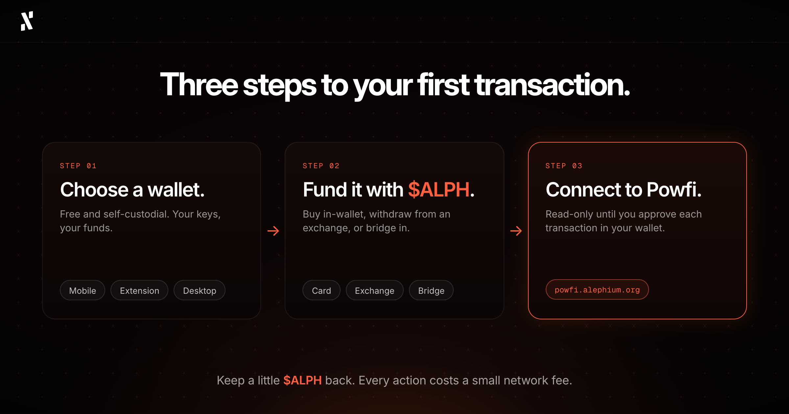
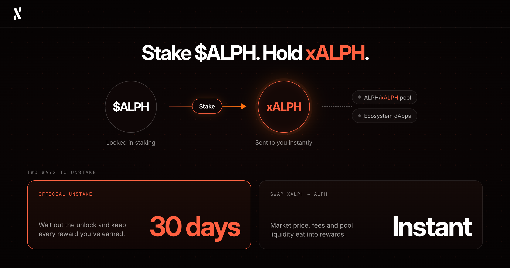
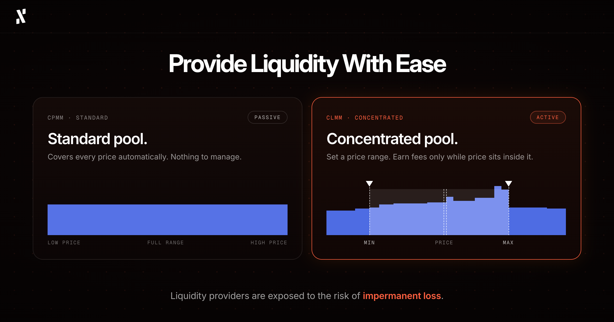
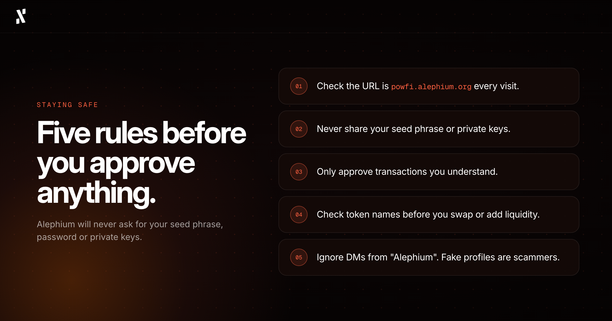

*By Pepper, Head of Marketing at Alephium*

- - -

Welcome back to the Alephium blog. While I usually write thought leadership columns, opinion pieces, and industry commentary, this time I’d like to walk you through Powfi from a fellow user’s PoV. Before we proceed, I’ll quickly remind you that if you want a very to-the-point walkthrough of Powfi, its tech, and how to get started, we’ve created the [Powfi Docs](https://docs.alephium.org/powfi) to help.

If, instead, you’d like a human hand to guide you through it, stick with me.

## What is Powfi?

The Alephium community is well aware of Powfi, but you might be new around here (if so, welcome again). Powfi is Alephium’s “core dApp”, a protocol-owned decentralised application which offers a number of DeFi tools. 

If you have our utility coin, $ALPH, Powfi lets you stake it to get a yield. It also lets you provide two-sided liquidity to “liquidity pools”, giving you a share of the transaction fees (don’t worry, we’ll cover what this means). The platform also offers a user-friendly portal for swapping tokens on the Alephium blockchain, such as $ALPH, $USDTeth, $AURA, and many more.

By the way, the official app is located at [powfi.alephium.org](http://powfi.alephium.org), you might want to open it in a separate tab so you can see what I’m writing about in real-time. 

## What You Need to Get Started

There are only two things you need (beyond the obvious, like a device and an internet connection).

1. An Alephium wallet ([available here](https://alephium.org/wallets/) on desktop, mobile, and as a browser extension)
2. Some $ALPH (for staking, swapping, providing liquidity, and covering small network fees)

That’s it, but let’s assume you have neither of these and are a true beginner.*

\**If you have ALPH in your wallet, you can skip ahead.*

## Step 1: Choose Your Wallet

Everyone has a different preference about crypto storage, so our devs built three official wallets to meet all kinds of users. All three of these wallets are completely free and fully self-custodial, meaning you control your funds and their security is entirely in your hands.

### Mobile Wallet

This is best for people who prefer to store their crypto on their smartphones, both [iOS](https://apps.apple.com/us/app/alephium-wallet/id6469043072) and [Android](https://play.google.com/store/apps/details?id=org.alephium.wallet&hl=en).

Once you connect your wallet to Powfi, you can buy $ALPH with a card or bank transfer (location permitting), swap coins/tokens on Alephium, and even have the added benefit of natively staking $ALPH within the app.

### Browser Extension wallet

Best for people who use their laptops often and want to access Powfi from a desktop browser.

We’ve built the extension wallet to be compatible with Chrome, Brave, and Firefox, three of the world’s most popular browsers. It’s quick and easy to set up, and makes it intuitive for users to connect to Powfi, as well as other Alephium dApps, like Linx, Elexium, and Chain Reaction.

### Desktop Wallet

I’d recommend this option for people who want a more complete experience on their PC or Mac.

This wallet is suitable whether you’re using Windows, macOS, or Linux. Also, if you’re using a hardware wallet, this connects to the desktop wallet when performing on-chain activities.

### Other Options

As mentioned above, some people like to use hardware wallets, which are physical devices dedicated to safely storing crypto. Some of the best-trusted options are OneKey, SafePal, Tangem, and Ledger. There are actually some Alephium x OneKey special edition wallets that we give away at events and in competitions (very rare merch). 

Another option is the [Linx Wallet](https://linxlabs.org/wallet), built by the Linx team.

Some final advice if all of this is new to you:

1. Verify you are downloading the official version of a wallet before doing any kind of installation. 
2. NEVER share your seed phrase or private key with anyone. If someone gets hold of these, they can drain your wallet. Write your seed phrase down on paper and store it somewhere safe. Please don’t put it in your phone’s notes app.

Ok, now you’ve got your wallet, we can go ahead and get some $ALPH in it.

## Step 2: Fund Your Wallet

To do anything meaningful on Powfi (other than look at it and admire the nice design), you will need some $ALPH in your wallet. Luckily, there are some good options to do just that.

### Buy ALPH Within Your Wallet

This is the easiest way for beginners to get some $ALPH, so we’ll start here. Both the mobile and desktop Alephium wallets let you buy $ALPH directly using a debit or credit card, bank transfer, or Apple/Google Pay. Some of our payment partners are restricted in certain regions, so if this affects you, you’ll need to try an alternate method.

The process is nice and easy:

1. Open your wallet
2. Select the option to buy $ALPH
3. Set the amount
4. Choose your payment method
5. Follow the steps on screen to complete the payment
6. Wait for the $ALPH to arrive in your wallet.

### Send ALPH From a Centralised Exchange

You can use a centralised exchange to buy $ALPH and then send it over to your Alephium wallet. At this time, the recommended exchanges for buying $ALPH as a beginner are BitGet, Gate, and MEXC. Each exchange has a slightly different purchasing process, but it’s all very intuitive once you’ve made and verified an account with them.

Once you have bought some $ALPH and it’s in your exchange wallet, it’s time to send it over to your Alephium wallet:

1. Open your Alephium wallet
2. Copy your Alephium wallet’s address
3. Head over to the exchange’s withdrawal section and select “ALPH”
4. Paste your Alephium wallet address in the recipient field (triple-check it’s correct)
5. Make sure to select the Alephium network (otherwise the transaction will fail)
6. Confirm the withdrawal
7. Your $ALPH will soon arrive in your Alephium wallet. 

Now, if this is your first time, I’d suggest your first transaction is a small one. This test transfer of a tiny amount will help you know that you got the process right and avoids you accidentally losing significant funds. 

### Bridge from Ethereum or BSC

If you’re new to Alephium, but not new to the world of crypto, you might already have some crypto on other chains and crypto wallets. If you have $ALPH on Ethereum or Binance Smart Chain, you can easily bridge it over at [bridge.alephium.org](http://bridge.alephium.org) (just follow the on-screen instructions). 

This process also works for $USDT and $USDC on Ethereum, as we have $USDTeth and $USDCeth bridged versions that are widely used in our ecosystem.

Just note that transfers can take up to 30 minutes, so you’ll need to be patient and trust the process. If you’re bridging from Ethereum, you need to hold some $ETH for the network fees (known as gas). For Binance Smart Chain (BSC), you need some $BNB. 

I’ll refer you back to the [Powfi docs](https://docs.alephium.org/powfi/funding-a-wallet) section on funding a wallet for a better explanation of this process.

### Receive ALPH From Someone Else

While this isn’t as common, you might have a friend who wants to send you some $ALPH and help you get started in the Alephium ecosystem.

For this, you share your public wallet address with your friend and let them handle the transfer. You just need to wait.

Of course, anyone with $ALPH can send you some, as long as you have an Alephium wallet. That doesn’t necessarily mean you should accept it. Like with any Web3 community, there are some scammers lurking in the shadows, waiting for a chance to strike. If a stranger promises to send you some $ALPH, be very careful, as you don’t know what their true intentions may be.

**Quick Tip:** Every action and transaction on the Alephium blockchain requires a tiny $ALPH fee, so when you stake, swap, or send, don’t use your entire balance. Keep a bit for yourself.

### Trade ALPH on Uniswap

Here are the two pages you need, depending on what chain your current cryptocurrency is on:

* [ALPH on Uniswap (Ethereum chain) ](https://app.uniswap.org/explore/tokens/ethereum/0x590f820444fa3638e022776752c5eef34e2f89a6)
* [ALPH on Uniswap (BNB Chain)](https://app.uniswap.org/explore/tokens/bnb/0x8683BA2F8b0f69b2105f26f488bADe1d3AB4dec8)

If you have any existing cryptocurrency that you’d like to swap for $ALPH, you can do that on Uniswap. Then, when you have $ALPH in your wallet, head over to the [Alephium Bridge](https://bridge.alephium.org/#/bridge) and follow the on-screen instructions.

## Step 3: Connect to Powfi

This is the easy part.

1. Go to [powfi.alephium.org](http://powfi.alephium.org), but of course, double-check the URL before connecting
2. Click “Connect Wallet” and choose your wallet
3. A connection message will pop up from your wallet, and you need to approve this to continue

Connecting to Powfi only allows it to read your balance and prepare transactions. It cannot move any funds without explicit approval, and that approval process will take place on every single transaction that you initiate.

Now comes the fun stuff. Let’s move on.

## Staking ALPH

We can say that staking is probably the simplest action on Powfi. You deposit $ALPH and receive xALPH in return. xALPH is a token that represents your staked $ALPH, a kind of receipt, with the impressive difference that you can use this token across Alephium’s DeFi ecosystem. 

You’ve probably seen us say that xALPH is a “liquid” token, or a “liquid” version of your staked $ALPH. It is described as **liquid** because of its usability, despite the underlying asset (your $ALPH) being staked.

### What Happens When You Stake ALPH?

When you stake $ALPH:

* Your $ALPH gets “locked” in the staking system
* xALPH is sent to your wallet (immediately)
* At launch, 1 xALPH = 1 $ALPH, but over time, as staking rewards accumulate, each xALPH gradually represents slightly more $ALPH (you can see the current rate on [powfi.alephium.org/staking](http://powfi.alephium.org/staking))
* This xALPH that you now hold can be used to provide liquidity in Powfi's ALPH/xALPH pool (explained in the next section)
* xALPH can also be used with the growing number of supported decentralised applications in our ecosystem

### How to Actually Stake Your ALPH

Here’s how I do it, have done it, and will do it again. Follow along with me:

1. Go to the “Staking” page on Powfi
2. Enter the amount of $ALPH you want to stake (remember, slightly less than 100% is smart because of network fees)
3. Check the APR shown, as this is the estimated percentage of rewards you’d get in one year
4. Click the big “Stake” button
5. Review all of the details and approve the transaction in your wallet (this looks slightly different depending on which wallet you use)
6. xALPH will appear in your wallet once confirmed

### How to Unstake Your ALPH

After a while, you may decide you are ready to collect your rewards after a nice long time staking your $ALPH. In that case, you have just two options, and your decision will come down to speed versus cost.

* **Official unstaking:** This is a 30-day unlock period through Powfi which gives the most patient users all of the rewards they have earned
* **Swap xALPH for ALPH:** Take the xALPH in your wallet and trade it immediately via the “Swap” page, however, this trade is subject to market price, platform fees, and available liquidity on the DEX, all of which will eat into your rewards.

There we have it. Staking is covered.

## Providing Liquidity

The term sounds complex and technical, which puts off a lot of DeFi users, but it’s actually pretty straightforward. Instead of using one coin to stake, you use two, with these two coins being deposited on opposite sides of a “pool”. When other users swap through that pool, the transaction fees get shared with the providers, giving them a reward for providing their liquidity (without any liquidity, swaps can’t happen, and with lots of liquidity, swaps happen much more smoothly).

This is just another way to put your assets to work on Powfi, and it has proven very popular because we’ve made it so easy, and because so many $ALPH holders already hold other ecosystem tokens, like $AURA, $EXY, and $PEPE.

### Powfi’s two types of pools

Let’s start with the **standard pool** (CPMM), which is the simpler and more passive of the two pool types. Your liquidity covers all price levels automatically, with no price range to set or manage. I’d recommend this for beginners who want simplicity and a hands-off kind of experience.

For the pros, Powfi offers the **concentrated pool** (CLMM), which is a more active and efficient option, but requires more work on your part. You choose a specific price range for your liquidity, like a window between price A and price B. You only earn fees when the market price is within your range, which means you need to monitor it and adjust it at times. This is the pool type you must use to qualify for Powfi’s ALPH x USDTeth farming campaigns.

### How to actually provide liquidity (step-by-step)

Whichever pool you’d like to provide liquidity to, the first few steps are the same.

1. Go to the “Pools” page on Powfi and click “Add Liquidity”
2. Select your token pair (for example, ALPH and USDTeth)
3. Now, choose your pool type: **Standard** or **Concentrated**
4. * If you select “Concentrated”, this is when you’ll set your price range
5. Enter an amount for one token
6. Powfi calculates the other automatically (you need to have enough of both tokens to provide liquidity)
7. Review the deposit amounts and your share of the pool
8. If you’re happy, hit “Confirm”
9. Go to your wallet and approve the transaction

Now, what if you, for whatever reason, wanted to undo this action?

### How to remove liquidity:

1. Open your liquidity position in Powfi (on the “Portfolio” page)
2. Click “Remove Liquidity”
3. Choose how much to remove (it doesn’t have to be all of it)
4. Confirm and approve in your wallet, like before

The amount of what you receive back may differ slightly from what you deposited. This is because the pool's composition shifts as trades happen, and your liquidity adjusts to reflect it.

#### What if your CLMM position goes “out of range”?

“Out of range” is when the market price has moved outside your selected range in a concentrated pool.

Your position is still open, but it won’t be actively earning fees. You can either wait for the price to return, or adjust your position. The choice is yours.

### The Risk of Providing Liquidity

Before you add liquidity, there is one risk I want you to understand properly, and it’s something the industry has termed “impermanent loss”.

When you provide liquidity, the pool rebalances your two tokens as people trade. If the price of one token moves compared to the other, the pool ends up holding less of the token that is rising and more of the token that is falling. This means your position can be worth less than if you had simply kept both tokens in your wallet. That difference is called impermanent loss.

Let me give you a simple example. 

Say you add $ALPH and $USDTeth to a standard pool, and the price of $ALPH then doubles. When you withdraw, you'll have less $ALPH and more $USDTeth than you started with, and your position will be worth about 5.7% less than if you had just held both tokens. The same applies if the price halves. The bigger the price movement in either direction, the bigger the gap becomes.

So why is it called "impermanent"? Because the loss only exists on paper while your liquidity stays in the pool. If prices return to where they were when you deposited, the gap closes. If you withdraw while prices are different, the loss becomes permanent.

The trading fees you earn can offset impermanent loss, and sometimes more than cover it, but this is never guaranteed. It depends on trading volume, the pool's fee, and how far prices move.

## Swapping Tokens

Powfi’s swapping feature lets you exchange one token for another at the current price. 

Here’s how I’ve been doing swaps since Powfi launched:

1. Go to the “Swap” page on Powfi
2. Select the token you want to send (from) and the token you want to receive (to)
3. Enter the amount
4. Take a look at the quote which pops up with the estimated amount you'll receive, the fee, and the price impact
5. If you approve of the details, click “Swap”
6. Review the transaction and approve it in your wallet

Before you confirm anything, check these things first:

* You're swapping the correct tokens (because sometimes similar names can be completely different assets, like USDTeth and USDCeth)
* **That you have enough $ALPH left for network fees after the swap!**
* The price impact shown is not unusually high (this is sometimes the case, and it means you won’t be getting a very good deal)

After the swap completes, your wallet balance will immediately update to reflect the change.

## Staying Safe on Powfi

Let’s finish with a bit of safety guidance, because the last thing I’d want to see would be members of my favourite community sharing posts that something had gone drastically wrong. 

These 5 tips should do the trick:

1. Always use [powfi.alephium.org](http://powfi.alephium.org) and please check the URL every time you visit
2. Never share your seed phrase or private keys with anyone, for any reason, EVER
3. Only approve transactions you understand (if something looks wrong, reject it)
4. Check token names carefully before swapping or providing liquidity
5. Alephium will never ask for your seed phrase, password, or private keys, but scammers love to create fake profiles to try and trick you (pathetic, but I guess everyone needs a hobby)

Alright then, ready to start? 

Scroll back up to the most relevant starting point and let me re-guide you.

Thanks for reading, and I hope you enjoy using Powfi!
