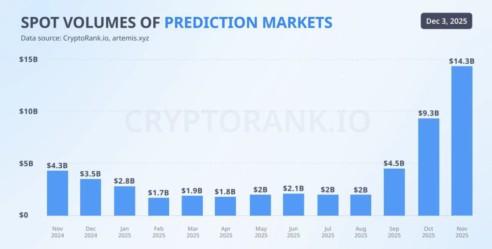

The following article has been written by Hayden, founder of [Aura Markets](https://x.com/AuraMarkets), an upcoming decentralized prediction market platform being built on Alephium.

**Note:** The opinions expressed in this article may not reflect Alephium's official position.

- - -

This past year has been nothing short of explosive for **prediction markets**. 

Platforms like Kalshi and Polymarket have shattered records, with combined trading volumes nearing $60 Billion in 2025 alone. Kalshi now regularly handles around $1 Billion in trades per week (an annual run rate of over $50 Billion), a 1000% increase on last year. 

Valuations have followed suit. Kalshi’s valuation surged to $11 Billion by the end of 2025 (up from $5 billion after a $300 Million funding round earlier in the year). Its main competitor, Polymarket, is reportedly seeking a $12-15 Billion valuation on the back of this momentum. 

Even the mainstream media has taken notice. For instance, CNN recently struck a partnership with Kalshi to integrate real time prediction markets into their news coverage, a clear sign that these markets have entered the public conversation. 

By all accounts, 2025 was the year prediction markets went mainstream. The sector's sudden boom vindicated long held beliefs that trading on the outcome of real world events could be a massive industry. However, as the **founder of Aura**, I view this triumph with cautious optimism. 

Yes, the record volumes and big headlines validate the concept we’ve championed for years, yet they also highlight the growing paradox that today’s prediction market surge is happening largely on centralized, corporate platforms. This is an ironic twist for a sector born from the ethos of Web3 decentralization. 

The very success we’re celebrating may be built on a shaky foundation that contradicts the core principles of open, trustless finance. 

## Validation at a Cost: The Centralization Dilemma 

The current boom is a double edged sword. On one hand, it proves that prediction markets can achieve scale. Early decentralized projects like Augor and Omen showed the idea’s promise, and now Kalshi and Polymarket have shown it can reach tens of billions in volume and multi billion dollar businesses. 

On the other hand, growth has come by reverting to a Web-2 style model. This features walled gardens, company oversight, and the same old weaknesses found in centralized systems. This is a Pyrrhic victory for those of us who believe in the original vision of Web3. 

The surge of interest is welcome, but not at any cost. It’s time to ask, “What price are we paying for this centralized success, and is there a better path forward?”

I’ve identified some major flaws inherent in today’s centralized prediction platforms and why they threaten the long-term promise of this industry.

### Single Point of Failure

Corporate prediction markets are essentially single entities controlling the platform. This means they decide what events can be traded, how markets are resolved, and they hold the power to shutdown markets or even the entire service. 

Such a central authority creates obvious failure points, from censorship and biased manipulation of outcomes, to technical outages or downtime that freeze trading. Users are at the mercy of one platform's uptime and integrity. If a controversial market topic makes the company (or its partners) uncomfortable or draws regulatory heat, it can be unilaterally censored. If a centralized resolution decision is disputed, traders have little recourse. 

In short, trust is required in the middleman, the antithesis of a trustless web3 ideal.

### Regulatory Fragility

Since these platforms operate as businesses, they are exposed to the full brunt of local regulations and political pressure. A single court order or policy can cripple the entire marketplace overnight. 

We’ve already seen this happen, for example, when Polymarket was forced to geofence US users in 2022 and pay hefty fines after a regulatory crackdown. Kalshi itself fought a years-long battle with the CFTC just to list election markets. 

Relying on a centrally operated exchange means one jurisdiction's decision can shut off access for everyone. This fragility stifles the very utility of prediction markets. The promise was global insight into future events, but a centralized platform can be shut down by authorities, turning off the lights on that collective intelligence with a stroke of a pen. 

### Users as Renters, Not Owners

Perhaps the most damning flaw is the extractionary economics. On traditional platforms, users create all the value. They trade, bring information, and provide liquidity, yet all the profit and power accrue to the platforms’ owners and investors. 

Exchanges hold the data, take the fees and grow its valuation (as we saw with Kalshi’s $11 Billion valuation jump) while the community of users sees none of that upside. Users are effectively renting the platform. They pay fees (often high ones) which enrich the company, but they have no ownership stake or governance voice in the system they are building with their participation. 

Your activity makes the platform more valuable, but that value flows only to the corporate stakeholders. This not only feels unjust, but it’s also bad for long term growth, as users have no skin in the game beyond their individual bets.

### Web3 is Being Undermined

Each of these flaws undermines the fundamental ethos of Web3 and open finance. The idea of prediction markets and turning information into a tradeable asset was supposed to be liberating, harnessing the wisdom of crowds without central gatekeepers. Instead, we risk recreating the same old centralized silos, where a few profit and control the many. 

**It doesn’t have to be this way.** 

The next era of prediction markets can and must take a different path, one that embraces decentralization, trustless architecture, and community ownership. **At Aura, this conviction is our North Star**. 

### What Next?

*In Part 2, Aura's founder, Hayden, will present a solution to the centralized dilemma, with an open, community-governed prediction market protocol that returns to Web3 roots while achieving the scale proven by corporate platforms. This solution, built on Alephium for performance, focuses on trustless, community-led resolution (where $AURA stakers govern outcomes), community ownership via $AURA (where fees are recycled to reward all contributors), and user-created markets (which allow for organic, bottom-up content creation), all while ensuring a smooth, Web2-like user experience with stablecoins and gas abstraction to make decentralization accessible.*
