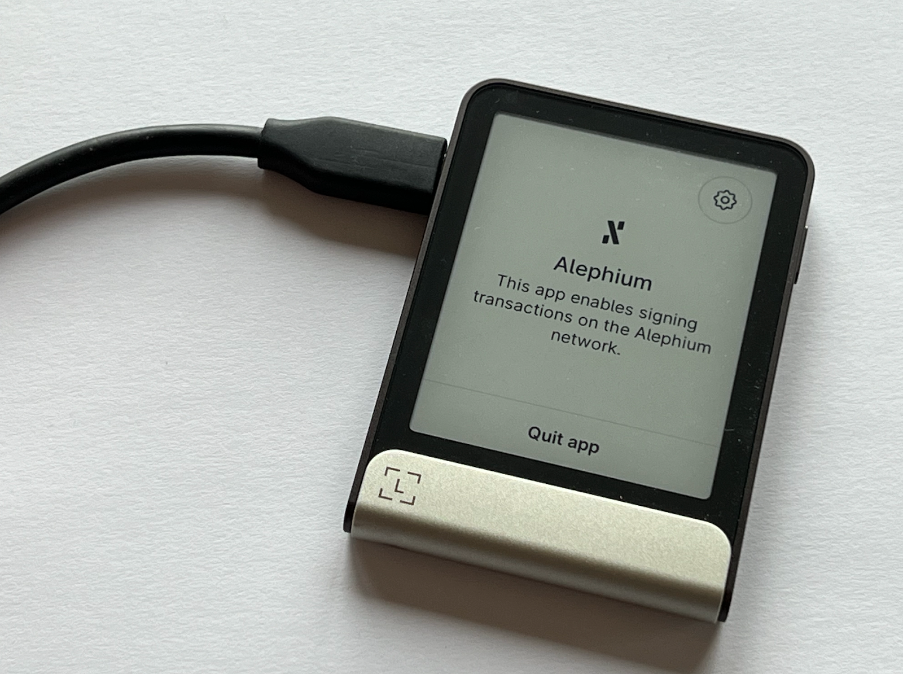

**Alephium x Ledger—**Alephium is thrilled to announce its integration with Ledger hardware wallets, which will give users enhanced security and control over their digital assets.

**Ledger Wallets** — This integration allows users to securely store, send tokens, and interact with decentralized applications (dApps) while keeping their assets protected offline with the full suite of recent Ledger HW (Nano S+ / Nano X / Stax / Flex) — (note that it’s not available for the Nano S)

**Keeping it offline** — By integrating with Ledger, Alephium provides users with a secure way to manage their digital assets, keeping their private keys offline and safe on Ledger’s hardware devices, known for their reliability and security.

**All Alephium Wallets** — Alephium has always proposed beautifully designed & easy to use [wallets](/wallets). From advanced [developer tools](https://docs.alephium.org/sdk/getting-started) to [multisig wallet software](https://alephium.github.io/alephium-toolkit/#/), Alephium prides itself on helping people have more control and ownership over their assets. The ability to use Alephium’s wallets with Ledger HW is a huge step forward in helping people get extra security for their asset’s custody.

**Ledger support is available today on the [browser extension and desktop wallet](/wallets)**. It is currently being implemented in the mobile wallet and will be available very soon!

## **How to get started?**

1.  Open the Ledger Live, connect your Ledger device and access the “My Ledger” tab.
2.  [Install](https://support.ledger.com/article/Alephium-ALPH) the Alephium app on your Ledger Nano S+ / Nano X / Stax / Flex.
3.  Connect your Ledger device to the Alephium Browser Extension wallet available on [Chrome](https://chromewebstore.google.com/detail/alephium-extension-wallet/gdokollfhmnbfckbobkdbakhilldkhcj) and [Firefox](https://addons.mozilla.org/en-US/firefox/addon/alephiumextensionwallet/).
4.  Follow the on-screen instructions to complete the setup.

For more detailed instructions, visit [Alephium’s Ledger guide.](https://docs.alephium.org/wallet/ledger/)

You can also check on Ledger’s support website [here](https://support.ledger.com/article/Alephium-ALPH).

More is coming… Soon!

---

For any questions or feedback, reach out to us on [Discord](/discord) or [Telegram](https://t.me/alephiumgroup), and follow [@alephium on Twitter](https://x.com/alephium) for the latest updates!
