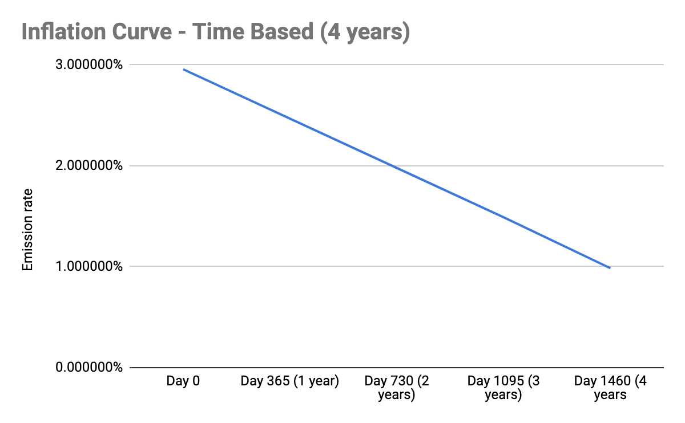
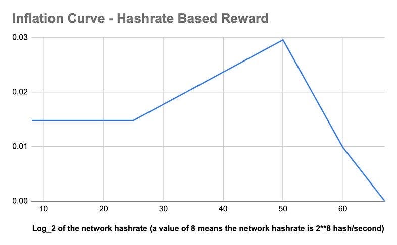

#### An in-depth analysis of the Block rewards, explaining the time-based and hashrate-based components of the reward emission rates.

**_Disclaimer: This article was edited on June 12th, 2024 when block time was reduced from 64 to 16s_**

Mining is a critical component of maintaining and developing a public ledger. It is the process of validating transactions and adding them to the Alephium blockchain. In addition, mining is the only way to issue new Alephium tokens. A consensus protocol has been implemented to ensure only Alephium miners can mine and validate transactions. In Alephium, this is called <a href="https://medium.com/@alephium/tech-talk-1-the-ultimate-guide-to-proof-of-less-work-the-universe-and-everything-ba70644ab301" >“Proof-of-Less-Work” (PoLW)</a>.

For this process to be decentralized, having as many miners participating as possible is important. Hence, to incentivize the mining, the blockchain rewards the miner who successfully issues a new block and facilitates the transactions.

At the time of writing this article, Alephium Mainnet has 16 shards live, and the average block time is 16 seconds.

### Block Rewards (a.k.a Mining Rewards)

Alephium’s reward for newly generated blocks is also called Mining Reward (MR). After distribution, the block rewards are locked for 500 minutes.

The mining reward is bound by two curves based on hashrate and timestamp. At a given time and for a given hashrate, the reward per block equals the minimum between the time-based reward and the hashrate-based reward.

> Block Reward = min (time-based reward, hashrate-based reward)**.**

<a href="https://github.com/alephium/alephium/blob/master/protocol/src/main/scala/org/alephium/protocol/mining/Emission.scala" >Mining Reward GitHub Implementation</a>

#### Timestamp

The time-based reward emission rate for the first four years evolves as follows:

<figure id="f8c7" class="graf graf--figure graf-after--p">

<figcaption>If you want to know the precise numbers, <a href="https://github.com/alephium/alephium/blob/master/protocol/src/main/resources/time-inflation.csv" class="markup--anchor markup--figure-anchor" >here is the GitHub CSV file.</a></figcaption>
</figure>

Over four years, the time-based mining reward drops gradually from 15 ALPH (shared by 16 chains) per block period (16 seconds) to 5 ALPH. After 4 years, the time-based reward will be fixed to 5 ALPH per block period and drops to 0 ALPH after 82 years.

#### Hashrate

<figure id="f83a" class="graf graf--figure graf-after--h4">

<figcaption>If you want to know the precise numbers, <a href="https://github.com/alephium/alephium/blob/master/protocol/src/main/resources/hashrate-inflation.csv" class="markup--anchor markup--figure-anchor" >here is the GitHub CSV file.</a> (The first column is the log_2 of the network hashrate, a value of 8 means the network hashrate is 2**8 hash/second)</figcaption>
</figure>

- *When the hashrate remains within the \[0 hash/sec, 1 Ph/sec\] range.   
  *The hashrate-based mining reward increases gradually from 0 ALPH to 15 ALPH (shared by 16 chains) per block period with a minimum of 7.5 ALPH guaranteed. The idea is to incentivize more miners to join the project without only benefitting the early adopters.
- *When the hashrate is within the \[1 Ph/sec, 1 Eh/sec\] range  
  *The hashrate-based gradually decreases from 15 ALPH to 5 ALPH per block period.
- *When the network hashrate is within the \[1 Eh/sec, 128Eh/sec\] range  
  *The hashrate-based gradually decreases from 5 ALPH to 0 ALPH.

**Note:**

1. The inflation rates are estimations, as the block time is very dynamic on a real network.
2. When the hashrate surpasses 1 Eh/sec, PoLW will be triggered.

### Orphan and Uncle Blocks

Alephium uses the ghost algorithm similar to ETH. A main chain block may reference uncle blocks, and both the miner of the main chain block and the miner of the uncle block will receive rewards.

<figure id="aa12" class="graf graf--figure graf--iframe graf-after--p">

</figure>

You may need to wait for a while to confirm whether an orphan block is an uncle block. If the height of the orphan block is `h`, it can be referenced by a main chain block with a height in the range of `[h+1, h+7]`. Therefore, you need to wait about `7 * 16s`. However, due to variability in block time, you may need to wait longer to ensure that the uncle block miners receive their rewards.

The max reward is 7/8th of the regular reward and is defined by the time/distance between the main chain block and the uncle block. If the uncle block hash is added quickly to the new block header (e.g., the uncle block happened just before the “nephew” one), it will receive 7/8 of the regular reward. OTOH, if it is farther (i.e., it happens seven blocks after the uncle was produced), it will receive 1/8 of the regular reward.

If an uncle block is not referenced by any mainchain block, it means that the uncle block is an orphan block and will not receive any rewards.

### Transaction Fee (TF)

Transaction Fees are a way for network participants to incentivize miners to process their transactions faster. In the Alephium Blockchain, all Transaction Fees are burnt, to keep the mining incentives equally distributed between all chains.

---

_Disclaimer: This document is for informational purposes only. Nothing in this document shall be deemed to constitute a prospectus of any sort or a solicitation for investment. The information in this document does not constitute a recommendation by any person to purchase any ALPH Tokens, or any other cryptographic token or currency, or to purchase any equity or other investment in any entity and no person has authorized any person to make any such recommendations._
