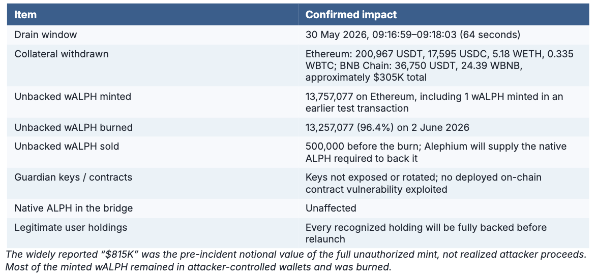
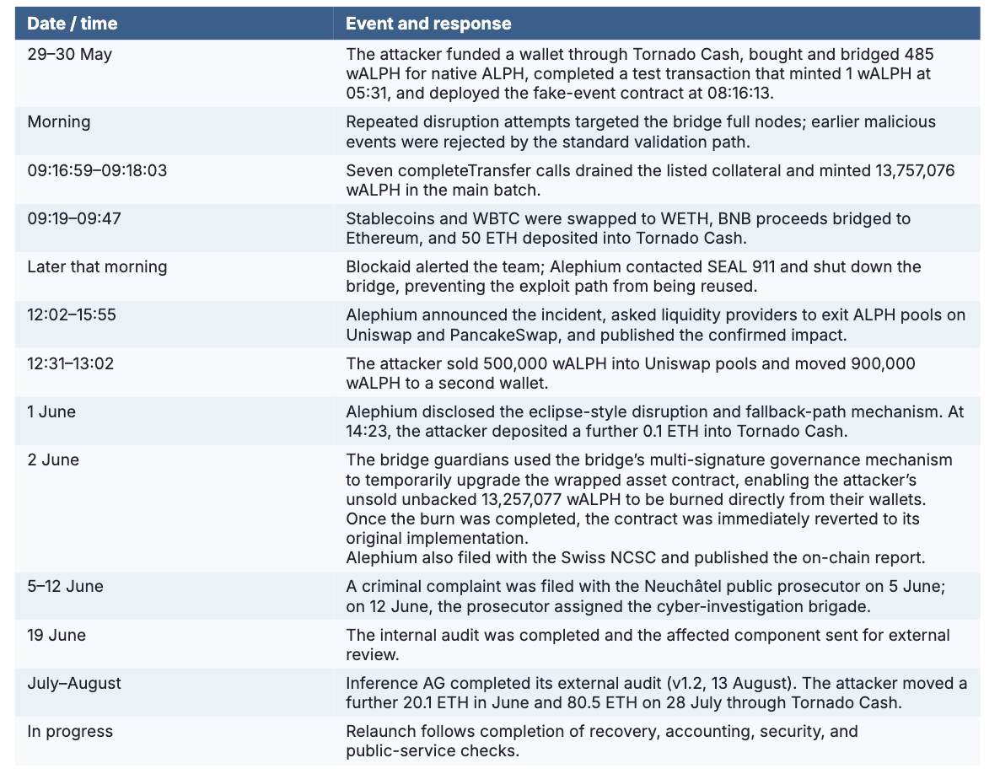

## **Summary**

On 30 May 2026, the Alephium Bridge was exploited. Approximately $305,000 of collateral was withdrawn from the TokenBridge contracts on Ethereum and BNB Chain, and about 13.76 million unbacked wrapped ALPH (wALPH) was minted on Ethereum. The bridge was shut down the same morning and the exploit path has been closed since.

The attacker did not compromise guardian keys or any on-chain contract. They exploited a missing validation in the bridge's off-chain re-observation path, combined with an eclipse-style attack on the bridge full nodes that forced traffic onto that weaker path, leading the legitimate guardians to sign cryptographically valid but unauthorized messages.

The vulnerability has been fixed and independently audited, 96.4% of the unbacked wALPH was burned on-chain, all legitimate user assets are being re-backed so that no user loses funds, and the bridge is being relaunched in coordination with the guardians. This document consolidates the [on-chain report](https://alephium.org/news/post/the-alephium-bridge-exploit-on-chain-report/), the [burn explainer](https://alephium.org/news/post/how-the-attackers-walph-was-burned/) and the [external audit report](https://github.com/InferenceAG/ReportPublications/blob/master/Inference%20AG%20-%20Alephium's%20Watcher%20-%20v1.2.pdf) into one account.

## **Impact**

## **Root Cause**

The bridge architecture is derived from Wormhole, but the vulnerable code was Alephium-specific watcher and re-observation infrastructure; the Wormhole protocol itself was not implicated. Guardians normally observe source-chain events through watcher software and sign a message (VAA) only after the event is validated.

The attacker combined an eclipse-style disruption of the bridge’s own full nodes with a mismatch between the standard observation path and its fallback. When the standard path stalled, the fallback re-fetched events for transactions that had not been synced from the full node and had interacted with the bridge. This required an eclipse attack to keep the transaction unsynced, while a legitimate bridge interaction allowed a crafted bridge-formatted event to be included and accepted by the fallback.

Legitimate guardian software therefore signed cryptographically valid but unauthorized VAAs, which were redeemed on Ethereum and BNB Chain. The guardian keys were never exposed and the guardian set was not rotated.

The Alephium network was unaffected.

## **Timeline and response**

The 64-second drain completed before manual intervention was possible. Shutdown therefore focused on preventing another round, while the liquidity-withdrawal request reduced the liquidity available for further sales.

**Further detail:** [on-chain report](https://alephium.org/news/post/the-alephium-bridge-exploit-on-chain-report/) · [burn explainer
](https://alephium.org/news/post/how-the-attackers-walph-was-burned/)

## **Remediation and assurance**

**Fix, hardening and internal review.** The fallback path was fixed so normal and re-observation paths enforce the same validations. Beyond addressing the specific vulnerability, broader hardening of the bridge codebase was carried out. Alephium then completed a manual and AI-assisted audit of the entire bridge codebase on 19 June, covering the exploited path as well as the wider validation and operational workflows.

**Independent external audit.** [Inference AG](https://github.com/InferenceAG/ReportPublications/blob/master/Inference%20AG%20-%20Alephium's%20Watcher%20-%20v1.2.pdf) separately reviewed the affected Alephium watcher component, including the fix, through manual and AI-assisted work by two auditors. The audit covered message origination, finality, canonical-chain verification, and event processing in normal and re-observation modes. Two low-severity issues were found and resolved; the report also notes two informational recommendations.

**Security posture.** Our investigation suggests the attacker likely used AI-assisted tools to find and combine the relevant edge cases. Alephium combined AI-assisted internal review, independent manual and AI-assisted assessment, and tighter access to security-critical watcher and guardian code. Operational configuration and detection details that could help attackers probe the bridge are not published; restricted access supplements, but does not replace, validation, testing, or external review.

## **User assets and relaunch**

Because this incident affected infrastructure operated by Alephium and we were able to do so, we chose, at substantial cost, to make legitimate users whole. We believe that was the right course in these circumstances, while recognizing that the same outcome may not always be possible in the future.

Before reopening, Alephium will replace the drained collateral, supply native ALPH for the 500,000 circulating wALPH, retire and reconcile treasury-held wrapped tokens, and fully back every recognized legitimate wrapped asset held by users. The attacker’s remaining unbacked wALPH has already been burned.

1. Upgrade every guardian to the fixed software and confirm exploit-era messages are rejected.
2. Reconcile custody, bridged amounts, pending transfers, and treasury-held tokens, then restore collateral and bridge accounting.
3. Verify that native custody, recorded supply, and recognized wrapped liabilities match for every asset, and that valid post-cutoff transfers succeed.
4. Restore and verify the bridge interface and explorer before reopening.

The bridge will reopen at its existing contract addresses. 

Token IDs, the guardian set, VAA format, and recommended consistency levels remain unchanged; existing wrapped assets require no migration and resume 1:1 redemption. 

The relayer and explorer API will operate as before, with updated SDKs following reopening. 

## **Takeaways**

**Fallback paths deserve the same validation as primary paths.** A principle now applied across the entire codebase and reflected in the audit scope.

**AI has changed the security landscape for crypto projects.** Attackers can now scan public codebases for edge-case flaws at machine speed, faster than any team can review its own code. Defending requires the same tools (our full-codebase review was AI-assisted) and a harder look at how much infrastructure code should be public.

**A bridge's security perimeter includes its off-chain infrastructure.** The review and hardening treated nodes, backend and contracts as one system, and the external audit was scoped around chained adversarial scenarios rather than a line-by-line review alone.

## **Thank you**

Blockaid detected the exploit first. Their alert enabled rapid containment and helped prevent further exploitation. SEAL 911 answered our call immediately and supported the first hours of the response. The bridge guardians coordinated the burn and are coordinating the relaunch, each verifying every step independently. Inference AG delivered a rigorous, adversarially-minded audit under time pressure. The Swiss authorities, our legal counsel and our investigation partners continue to pursue the case.

And to our community: you withdrew liquidity within hours of being asked, kept watch on the attacker's addresses, and met a difficult summer with a patience and trust we did not take for granted. Incidents like this reveal what a community is made of, and ours showed up for us every single day. From the whole team: thank you.

## **Investigation status**

As of 21 August, approximately 150.7 ETH of proceeds had been mixed through Tornado Cash and about 4.4 ETH remained in known attacker wallets. The addresses below have been shared with authorities and tracing partners.

## **Appendix: addresses**

**Role & Address**

Attacker main wallet (ETH + BSC) 0x6681ebC82551fE52fDB48E65872e85a3ae06921d

Attacker consolidation wallet - 0xb80a7d612480d121696be6dfe062f5e6d984bfd4

Attacker Tornado-feeder wallet - 0xEC60E38Fa836f377B716680963343526Ee3F7E69

Attacker wALPH parking wallet- 0x0baD8f95a996DeADe828d21DAd765b60c2b2509c

Fake-event contract (Alephium)- 24ZjqcvV8vVCn29zd1TThqAtaS8pMvJ4Co1MK5zncPcAB

Ethereum TokenBridge - 0x579a3bDE631c3d8068CbFE3dc45B0F14EC18dD43

BNB Chain TokenBridge - 0x2971F580C34d3D584e0342741c6a622f69424dD8

Burn transaction (2 June, block 25,230,400) - 0xade2846a20169aa23d53203e1c3c509474694710a9f4674307c220528d27a4b1

**Full transaction list:** [on-chain report](https://alephium.org/news/post/the-alephium-bridge-exploit-on-chain-report/)
