How to bridge your tokens + what to do on the Alephium Ecosystem.

_This tutorial was updated to reflect the new conditions after the_ [Rhône Network Upgrade](/news/post/rh-ne-network-upgrade-activated-cbeb298585fe)_: bridging from Alephium to Ethereum requires at least 205 blocks_ **_and_** _at least 55 minutes._

## Welcome to the Alephium Bridge Tutorial!

So we launched the bridge! It’s been quite an effort, if you want to know more about this, read [that](https://twitter.com/alephium/status/1722661768131178556) (twitter thread) or [that](/news/post/the-alephium-bridge-a787d90b2e4a) (full article on the bridge).

One last thing before we start, if you want to verify contract addresses, token contracts and other token lists, [here you go](/news/post/verification-of-bridge-contracts-tokens-token-lists-76e5c237bf52).

Here you will find a detailed step-by-step guide on how to bridge your tokens!

**Here’s the bridge URL**: https://bridge.alephium.org/

First, if you’re into video tutorials, here you go:

`video: https://www.youtube.com/watch?v=xoYVzbwBAjg`

## In writing

If you feel that you prefer a slow-paced guide, the written version is for you!

**There are some prerequisites you will need before bridging!**

1.  **Pick the wallet you are going to use**

It works with any of our [wallets](/wallets)! But for this tutorial, we chose to show how easy it is to work with both the mobile wallet and the browser extension.

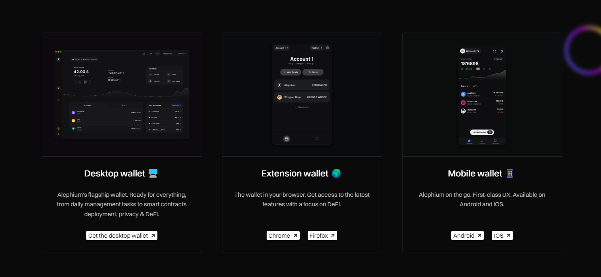

**2. Gas funds / Transactional costs**

If you are bridging from Ethereum to Alephium (and for the “redeem” step if you’re bridging the other way around) you’ll need to pay some gas fees (and it can get quite expensive at times).

Alephium’s gas fees are very low. And if you are bridging from Ethereum to Alephium, as a celebratory gesture a faucet has been implemented dishing out a single ALPH for every transaction in this direction (read more about this [here](/news/post/the-alephium-bridge-a787d90b2e4a)).

**3. A new address on “Group 0”**

In order to bridge any tokens you will need to use an already existing or generate a brand new address on group 0. Why?

Alephium currently requires your address to be on the same group or shard as the dApp you are interacting with (and the bridge is a dApp). The core team is working on making it more dynamic in the future, but in the meantime, create a new address in your wallet and create it on group 0 if you want to interact with dApps on the Alephium Ecosystem.

We’ll go through both directions in this tutorial:

Ethereum to Alephium first, and then Alephium to Ethereum!

### **1 — Bridging USDT from Ethereum to Alephium**

The first step is to head on over to [https://bridge.alephium.org/](https://bridge.alephium.org/).

Open the “Tokens” tab and make sure you pick “Ethereum” as your source chain and “Alephium” as your target chain!

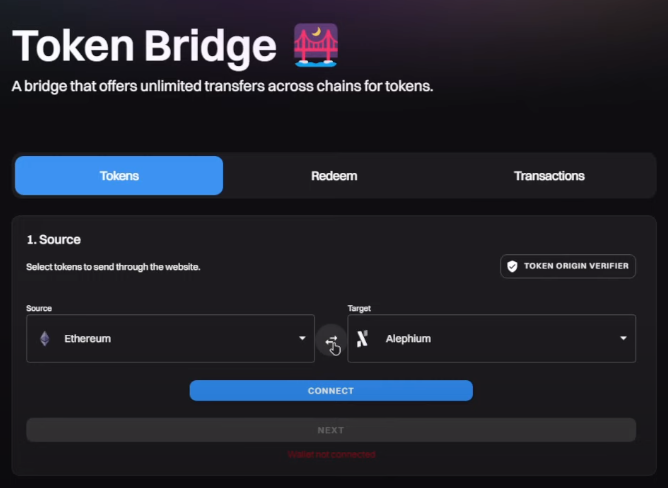

Proceed to pick and connect the wallet you will use as the “Ethereum” source.

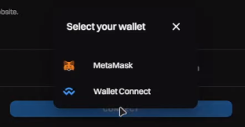

Once you are done, press the “Select a Token” button and pick the tokens you wish to bridge over!

In our case, this is going to be USDT.

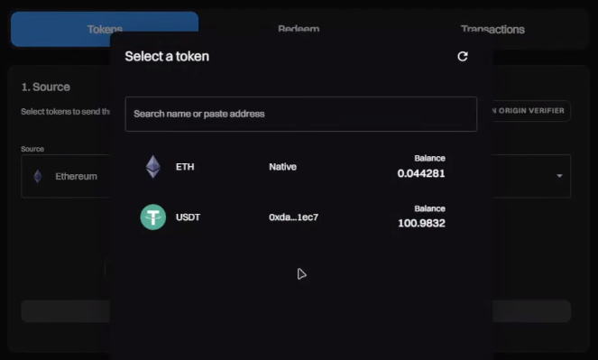

Fill in the amount you wish to bridge, and press the “next” button.

With the next step, you will need to connect your “Alephium” wallet of choice.

For our case that is going to be the mobile wallet.

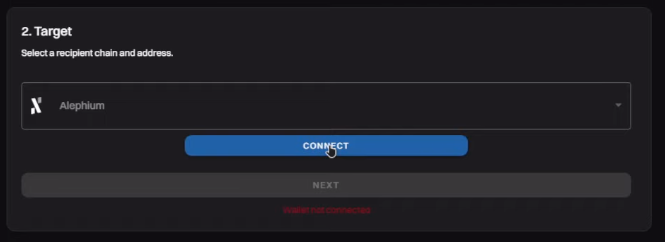

In order to connect the mobile wallet, please pick the “Wallet Connect” option from the pop-up menu on screen.

_The process shouldn’t be any more different than with any of the other two options._

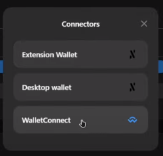

**A QRCode will pop up on your screen.** We are now going to move over to the mobile wallet, where we will be using the “Scan a QRCode” option by tapping on the Scanner button in the up-right corner of the Alephium mobile wallet.

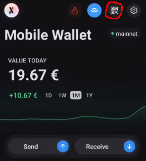

Upon scanning the QR Code and accepting the connection, your mobile wallet should be tethered to the bridge dApp!

Returning to the bridge webpage, you can verify that the correct address is connected and verify the amounts and information on screen, once everything seems correct. (if your token doesn’t appear, verify that you connected with an address on group 0!)

We will proceed forward by pressing the “Next” button.

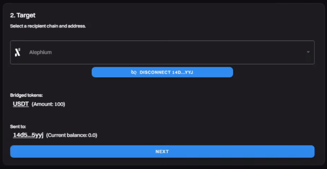

We are almost there! Now it’s time to approve the spending limit of our tokens from the Ethereum side of the bridge.

A pop-up should appear if you are using Metamask where you can approve the spending limit.

> _This action involves a gas fee_

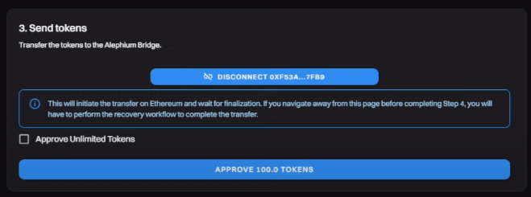

We are sooo close! Once the approval is complete, we are diving into the final stages of bridging.

Press “Transfer” when ready and verify all information on the screen before confirming.

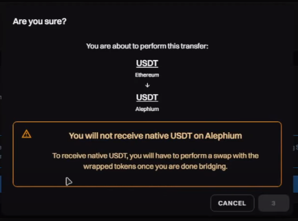

Confirm the transaction through your wallet of choice, in our case metamask.

> _This action involves a gas fee_

And we are done! Once the transaction reaches finality on the Ethereum side, which usually takes around 15 to 30 minutes, you should see the WUSDT in your Alephium wallet!

If, for some reason, you close the page or tab away from it. You can always recover your transaction using the txid available to you on screen.

Using this txid you can recover your transaction through the “Redeem” tab, make sure you select the correct source chain you are bridging from.

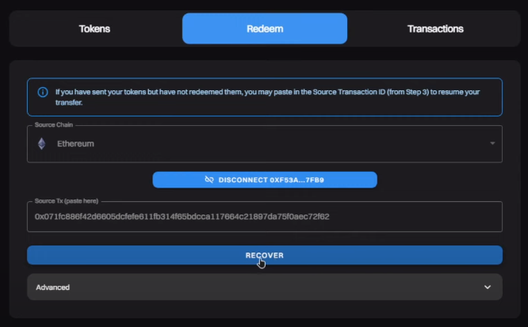

**And, that’s it!** Your WUSDT is now available on Alephium!

Now , let’s do the reverse!

### **2 — We will now bridge some native ALPH over to the ETH blockchain!**

Just like before, the first step is to head over to [https://bridge.alephium.org/](https://bridge.alephium.org/) but this time we will pick Alephium as our source chain and Ethereum as our target chain.

Unlike last time we will now use the browser extension to perform a bridge!

Feel free to use any of the other wallets, as the process works with all of them.

**When choosing the wallet for connection , pick the “Extension Wallet”**

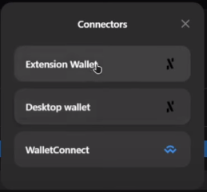

Once you are done, please press the “Select a Token” button and pick the token you wish to bridge over! This time we are going for ALPH.

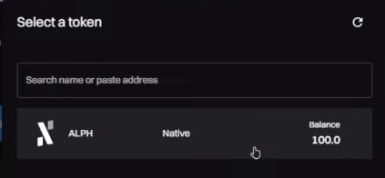

Fill out the amount you wish to bridge and press “Next” when ready!

For the next step, you are going to connect your Metamask or any Wallet Connect-compatible wallet to perform this bridge.

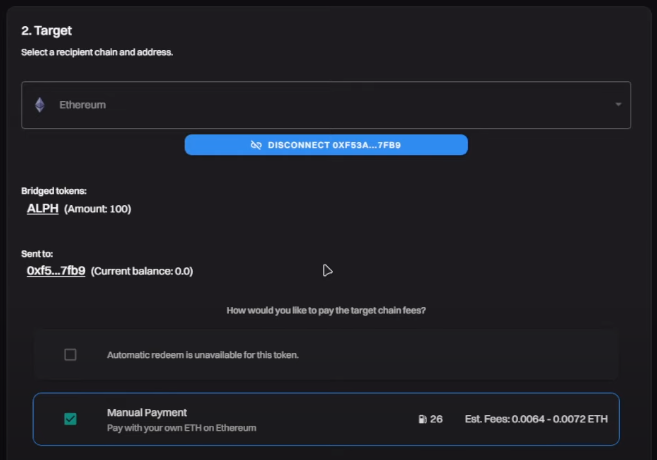

Once you have verified and confirmed the information on screen, pay close attention to the gas fee available to you, and when you’re ready, press next.

We find ourselves where we were before! It is time to send our native ALPH to get escorted over to the Ethereum blockchain. When you’re ready, press “Transfer” and a pop-up will appear.

Once you have confirmed all is correct, proceed to confirm and sign the transaction through your Extension Wallet.

We are almost there! Now we need to wait until our transaction reaches at least 205 confirmations **and at least 55 minutes** on the Alephium side of the bridge.

Keep in mind that if your wallet locks itself, you can always recover the transaction using the txid presented to you!

_You can even track your confirmations by clicking on the “View on Explorer” button. Or simply recover your txid._

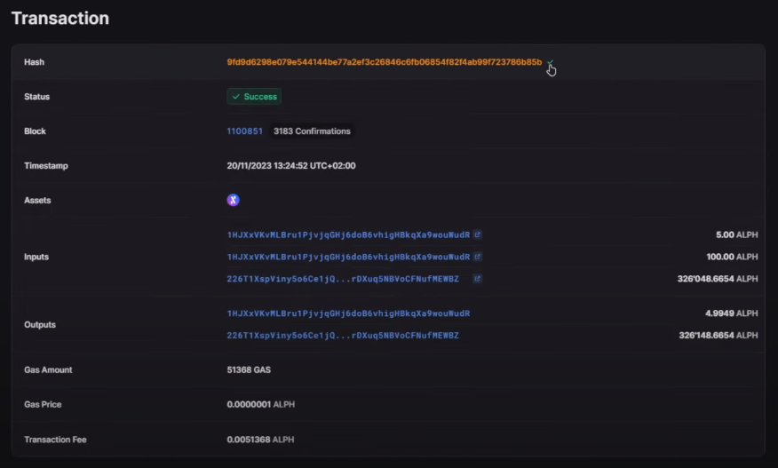

So, you’ve waited for all the required conditions to be met. Now what? Easy! Head over to the redeem page on the bridge website, make sure that Alephium is set as your source chain and paste the txid of your transaction in the empty field to recover your transaction.

Once you are ready, press the Recover button!

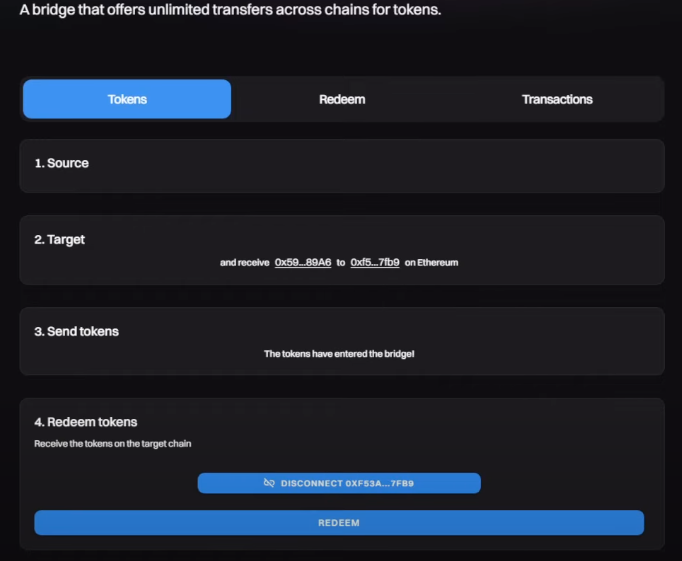

And Boom! We are so back! Connect your Ethereum wallet in our case Metamask and press Redeem!

A pop-up will appear where you will need to confirm the transaction which involves a gas fee on Ethereum.

Once the transaction is confirmed, your tokens should appear in your Metamask wallet.

**If, for some reason, they do not, don’t panic. You can import the Alephium ERC-20 token using the contract address provided to you right here below!**

> WALPH Contract Address : 0x590F820444fA3638e022776752c5eEF34E2F89A6

We hope this tutorial was of use to you, for more information consider referring to the official medium article detailing all contracts and addresses right [here](/news/post/verification-of-bridge-contracts-tokens-token-lists-76e5c237bf52)

If you bridged some ERC-20 tokens and you don’t know what to do? Here is a list of things you can try out:

[Experience the first alephium DEX](https://www.ayin.app/)  
[Snatch some NFTs from Deadrare](https://deadrare.io/)  
Try your luck over at walph.io

---

As always, let us know on [Twitter](https://twitter.com/alephium), [Discord](/discord), [Telegram](https://t.me/alephiumgroup) or [Reddit](https://www.reddit.com/r/Alephium/) if you have any questions!
