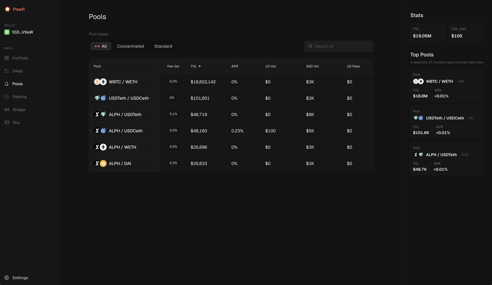
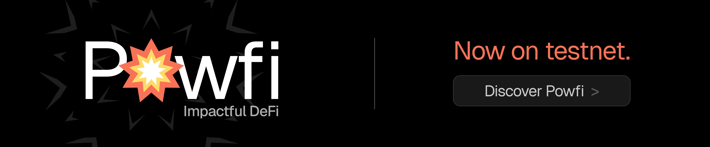

With much excitement, we can now reveal that Powfi, our Core dApp, has begun public testnet.

Powfi represents Alephium’s most significant technical and economic advancement since its mainnet debut in 2021. The launch initiates Phase Two of our project roadmap, titled “Aligned Economics”. This strategic addition elevates Alephium from high performance L1 infrastructure into a self sustaining and fee-generating economic ecosystem.

## 
Powfi as a Technical Showcase

Powfi will serve as our protocol-owned benchmark, designed to showcase the full capabilities of Alephium’s sharded Proof-of-Less-Work technology. At its center is a Concentrated Liquidity Market Maker (CLMM) Decentralized Exchange (DEX), though there is far more than meets the eye.

Rather than following a path of rapid prototyping or releasing unfinished products, our core developers have spent several months ensuring every component is battle tested before any public exposure. 

This internal refinement period also included the implementation of fully functional exchange contracts and core staking protocols. These were written in RALPH, our purpose-built programming language which was designed specifically for writing ultra-secure smart contracts.

## Powfi DEX: Alephium’s Deflationary Liquidity Layer

Successful L1 and L2 ecosystems tend to converge around a flagship liquidity venue. A chain’s primary DEX therefore becomes the center of trading activity, fee generation, and capital formation. When this liquidity layer is closely aligned with the chain itself, economic value flows back to the native asset, a form of vertical integration already proven across the industry.

Powfi introduces this model to Alephium through its own CLMM DEX. As trading activity grows, the protocol captures transaction fees and routes them directly into the network’s economic loop*: 

50% of captured fees are used to buy back and permanently burn ALPH

50% is distributed to ALPH stakers

Fully open source and supported by developer SDKs, Powfi is designed as composable infrastructure rather than a closed application. Other dApps can integrate directly with its liquidity, pricing, and routing layers, allowing the entire ecosystem to benefit from deeper liquidity and shared economic alignment.

\*figures and weighting are subject to change before mainnet release.

## Powfi Staking: Alephium’s Unifying Economic Layer.

One of the structural weaknesses observed across the broader crypto landscape is fragmentation. Applications can generate massive transaction volume and substantial fees, yet very little of that value flows back to the base layer coin and its long term holders. In many ecosystems, activity at the application layer benefits isolated protocols while the underlying chain captures minimal direct economic upside.

Phase Two addresses this issue directly.

Our composable staking layer is designed to act as the economic anchor of the ecosystem. Rather than allowing value to remain siloed within individual applications, a portion of revenues generated across the ecosystem can be routed back into the staking layer. This creates a unified loop where network usage strengthens the base asset.

Powfi’s DEX is the first contributor to this model, but it is only one piece of a broader design. As additional community dApps join this initiative (more on this later), they will have the ability to allocate a percentage of their revenue to the staking layer. The objective is simple: sustainable, ecosystem-wide yield.

Finally, this model is powered by xALPH, the wrapped form of ALPH, which acts as a universal locking layer for the Alephium Ecosystem. While the Powfi DEX uses xALPH for staking, any dApp can leverage it as a shared economic passport for governance, incentives, or DeFi integrations.

## Battle-Testing the Backend Logic & Smart Contract Stability

Powfi’s testnet period will primarily focus on auditing the backend logic and smart contract stability. You, as a user and tester, can get involved and start hunting for bugs. We will reward those who find them with $ALPH, with all submissions and contributions made via Discord.

Powfi: <https://powfi.alephium.org>
Discord discussions: <https://discord.com/channels/747741246667227157/1471500764470972486> 
Report bugs here: <https://discord.com/channels/747741246667227157/1471503694162952367>

Please note that the team has explained that Powfi’s premium user interface and experience are being reserved for the full mainnet release. This approach allows the developers to prioritize security and functionality during the initial testing phase.

## Final Words on This Milestone

The move to Phase Two represents a maturation of the network where technical superiority meets a robust economic design. This has been our priority during the last incredible sprint. In the future, as the ecosystem expands, the Aligned Economics model will play a central role in driving long term value and utility for all participants. 

The community is encouraged to join the testnet and provide feedback as the network prepares for its next era of growth. 

For further information and regular updates, users should monitor our [X Account](www.x.com/alephium), [Telegram](t.me/alephiumgroup), and [Discord channels](https://discord.com/channels/747741246667227157/1471500764470972486).
