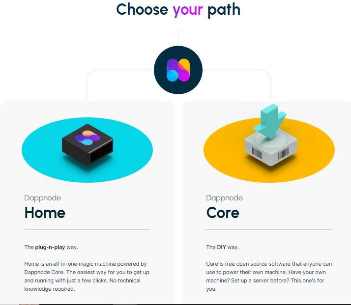
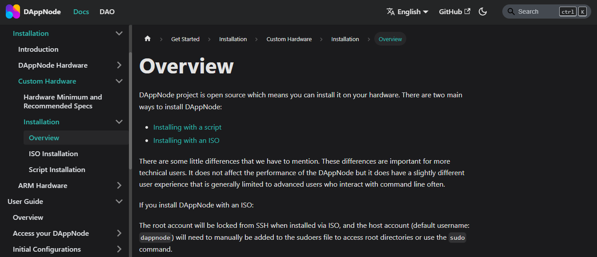
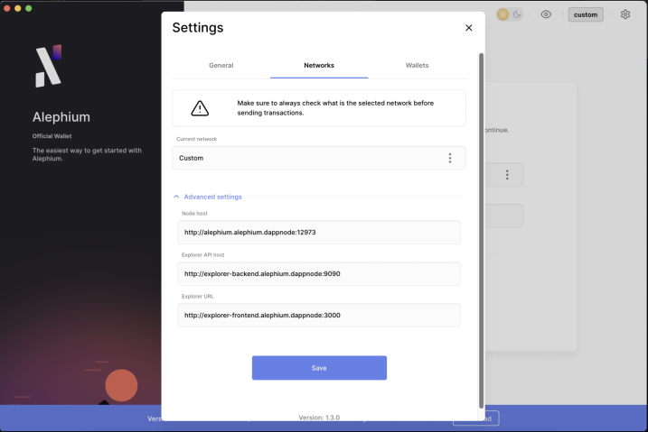

We are really proud of Alephium’s addition as a part of <a href="https://www.dappnode.io/" >Dappnode</a>’s package offering! We share Dappnode’s commitment to a decentralized future and believe tools like this are key to making it happen.

Here’s a quick dive into what Dappnode is, what they built with Alephium, how to set up your node, and a small Q&A from the Tech Talk we had with them.

### What is Dappnode

Dappnode is building open-source software to make decentralized infrastructure easier for everybody.

It was born in 2017 to address a political censorship issue in Catalunya. During a referendum, the <a href="https://www.independent.co.uk/news/world/europe/catalan-independence-referendum-spain-websites-blocked-spanish-constitution-votes-a7971751.html" >central government demanded</a> that the ISP (internet service provider) block access to political opponents’ websites. That ignited a fiery spark & strong motivation to provide software and hardware to ease access to decentralized infrastructure for non-technical people.

They have two product offerings: <a href="https://docs.dappnode.io/" >Open source software</a> for you to run a node on your machine and <a href="https://www.dappnode.io/collections/frontpage" >plug-and-play hardware</a> that allows you to do that with only a few clicks.

### What did they build with Alephium (and how to set up your node)

Alephium is now part of their dApp Store, and the Alephium package includes:

- An Alephium Node
- A Local Chain Explorer
- DMS (Dappnode Monitoring Service): A dashboard about your node, with all relevant metrics

To install the package and start to run your Alephium node, there are two paths, the Dappnode Home, and the Dappnode Core.

For the Dappnode Home, all it takes is to select the package at their store and install it. Remember to enable the local chain explorer if you want to run it on your device (note: It will bite a good chunk of your drive space)

Going through the Dappnode Core path, you will have to download the Dappnode software to your machine. Follow the steps laid down by their <a href="https://docs.dappnode.io/get-started/installation/custom-hardware/installation/overview" >documentation</a>. Everything is well explained, and you can ask for help on their <a href="https://discord.com/invite/c28an8dA5k" >Discord</a>.

After the node is up and running you can connect your Alephium Desktop Wallet to it, and send your transactions directly from your node. By the way, our upcoming mobile wallet & browser extension will also be connectable! <a href="https://medium.com/@alephium/ttxoo-2-the-road-to-self-custody-cfea4ae89444" >You can now easily move forward on the “Road to self-custody”!</a>

### Tech Talk and AMA

We also had a Tech Talk with Dappnode, where <a href="https://medium.com/@pol.lanski"  rel="noopener noreferrer">Pol Lanski</a> (thank you for being with us Lanski!) provided a walkthrough with detailed information about the Dappnode dashboard.

That was an interesting conversation about decentralization, technical stuff, and some hidden gems inside Dappnode software! We highly recommend you check the recording below:

`video: https://www.youtube.com/watch?v=wzobAlPR11s`
