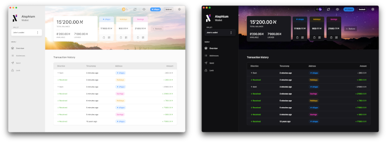
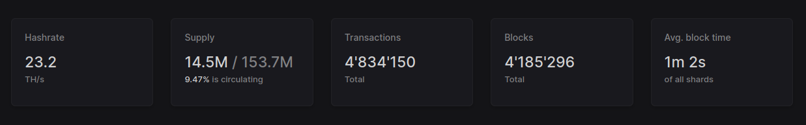

#### The first half of 2022 was a vigorous but exciting, fun and rewarding period for Alephium in terms of milestones and growth. Here’s a look back at some of the highlights, what they meant for us, for the community and what we learned.

---

### Technology

#### dApp Tutorial

Boubacar who was an intern at Alephium produced and open-sourced a <a href="https://github.com/alephium/voting-tutorial" >comprehensive guide to building a dApp on Alephium</a> with the guidance of Thomas. dApps being an imperative part of a successful blockchain ecosystem, this tutorial, including the resulting code, laid an important first step on the road towards integration and adoption of Alephium. For the first time, building dApps on Alephium became accessible to anyone with a development background.

Stay tuned for the upcoming release of the new version of our dApp dev tools!

#### New full-node version

<a href="https://github.com/alephium/alephium/releases" >The full-node saw a major upgrade to version</a> <a href="https://github.com/alephium/alephium/releases/tag/v1.3.2" >v1.3.2</a> There has been many incremental changes released with bug fixing patches that were always backward compatible. But this version was special because it enabled new features for smart contract development.

#### New desktop-wallet version

With the full-node came a revamped and <a href="https://github.com/alephium/desktop-wallet/releases/tag/v1.2.0" >improved v1.2.0 of the desktop wallet.</a>

A new section for advanced management was introduced, effectively allowing miners to derive one address for each of the 4 groups. The possibility to consolidate (merge) all your UTXOs into one and sweep your funds from one address to another, a feature highly anticipated by the community has also been introduced. We’ve added the creation of multiple alternative addresses and ability to label them for a better overview and organization of funds into categories. An offline mode was introduced, allowing the user to create a wallet without connecting to the Internet.

Last but not least, the looks of it got an overhaul, with subtle animations and improved user experience! <a href="https://github.com/alephium/desktop-wallet/releases/latest" >Have a look at it for yourself</a> if you haven’t already!

<figure id="dbfe" class="graf graf--figure graf-after--p">

<figcaption>Desktop wallet in light and dark mode</figcaption>
</figure>

#### New explorer

We were very keen on adding metrics to the <a href="https://explorer.alephium.org/#/blocks" >explorer.</a> You can now find hashrate, supply, total transactions, total blocks and average block time live on our explorer page. We also added an indicator to display the number of confirmations of a transaction. Thanks to heavy work on the back-end, the performance improved on pages with large amounts of transactions and the explorer got a lot quicker!

<figure id="0200" class="graf graf--figure graf-after--p">

<figcaption>Statistics shown in the explorer</figcaption>
</figure>

#### JS-SDK

We have deprecated alephium-js in favor of the new <a href="https://github.com/alephium/js-sdk/" >@alephium/sdk package</a>:

We learned from our mistakes when introducing breaking changes in a minor version of alephium-js without clarifying it to our dev users and without using a `0.X.X` package version. We created a new package (`0.X.X`) and a clear message in the `README` that breaking changes will from now be introduced in **minor** versions and that users of the package should lock the version of the package in their projects. We will make sure to announce all breaking changes in the release notes, please make sure to read them!

To protect our dev users from accidentally installing an SDK that pretends to be ours, we decided to introduce the `@alephium` scope. Now, you can be sure that all `npm` packages with the `@alephium/` prefix are developed by the core team.

The SDK is now compatible with browser and React Native environments, in addition to Node.js.

---

### Business & Operations Update

#### Listing on Gate.IO

During the second week of 2022, <a href="https://medium.com/@alephium/gate-io-first-to-list-alephium-alph-a7e5fe56cd45" >Alephium got listed on Gate.IO.</a> This was a major milestone for the project. For the first time, the community was able to <a href="https://www.gate.io/trade/ALPH_USDT" >buy and sell ALPH</a> on an exchange. We took great pride in it, as getting listed first on a top-10 exchange is hard! It opened the floodgates to a new crowd of retail investors and miners, who grew our communications channels significantly and from which we learned a lot! We had anticipated this and <a href="https://medium.com/@alephium/welcome-to-alephium-alph-48dfb72aa458" >created accessible material</a> to welcome new members of the community and help them get oriented within the project.

#### Strategic Partnership

In mid-april, we officialised a <a href="https://medium.com/@alephium/alephium-partners-with-cetacean-capital-83cf2fbea8a1" >partnership with Cetacean Capital</a>. Its unique mix of diverse skills and long time in crypto, completely peer-to-peer organization and exceptionally entrepreneurial mindset makes it a very special partner. The long-term commitment it’s taking with Alephium will allow the project to leverage Cetacean’s heavy marketing chops and its institutional credibility.

There are more partners to come and we are looking forward to revealing the next one during Q2.

---

### Marketing / Project awareness

After the initial listing, our Twitter followers tripled (to almost 6k) and both Telegram and Discord doubled. Lots of new people joined the project and it became even more fun to hang out in our Discord. We saw a huge surge in the mining community and the hashrate of the network skyrocketed way beyond our expectations reaching as much as 46TH.

#### Naming contest

In the 5th week, we queried the community through <a href="https://medium.com/@alephium/alephium-naming-competition-c1b736797461" >a naming contest.</a> There were many parts of the project that needed naming and it was clear for everyone involved that these names had to be sourced from the community.

The smallest denomination, or the Satoshi equivalent of ALPH became the SET, Alephium’s custom Virtual Machine became ALPHRED, and Alephium’s smart contract programming language got baptized RALPH.

#### Gate.IO AMA

We held our <a href="https://medium.com/@alephium/gate-io-ama-with-alephium-67b50d179d72" >first external AMA within the Gate.io channels.</a> It was, to say the least, an interesting and high-intensity experience!

<figure id="b557" class="graf graf--figure graf--iframe graf-after--p">
<h1 id="not-acceptable">406 Not Acceptable</h1>

nginx

</figure>

#### Team interview series

During the 10th week, we started publishing a series covering the individuals behind the project: the team. We felt it was important to let the community get to know us better as we value transparency. We divided the article into 3 episodes: <a href="https://medium.com/@alephium/core-team-interview-series-episode-1-3472f8295af6" >Front-end devs</a>, <a href="https://medium.com/@alephium/core-team-interview-series-episode-2-bec6e6908d2f" >operations and communication team</a> and finally <a href="https://medium.com/@alephium/core-team-interview-series-episode-3-64b6dacc1459" >back-end devs</a>.

#### Paris Blockchain Week Summit

By the end of Q1, we attended <a href="https://pbwsummit.com/" >PBWS</a> where our very own <a href="https://twitter.com/MaudSim0n" >Maud</a> presented Alephium to an enthusiastic audience of blockchain heads. It was a great opportunity to meet some of you in person.

#### Rewards!

Some of you have produced amazingly detailed tutorials on how to mine Alephium, how to join mining pools or how to triple mine with T-rex (!) Some of you are always present in our channels providing a gentle, guiding hand to new members, directing them to the right resources, or helping us answer questions. To all of you contributing on our GitHub, we salute you, for you are the heroes giving purpose to our work. And let’s not forget all the mining pools and thriving _Buidlers_ making up our ecosystem. You know who you are and we thank you!

---

### In futurospect

The road ahead is long, but the journey is rewarding. We have many exciting things planned for the rest of 2022.

#### Core Platform

- Improve the robustness, efficiency and dev-experience of the full node
- Improve documentation of the core infrastructure
- Improve the Alephium SDK with more features
- Improve the robustness and efficiency of the explorer back-end
- Include chain statistics and information on the explorer
- Bridge development, testing, and launch
- Leman Network Upgrade for cross-chain interoperability
- dApp support in the desktop wallet
- DEX development, testing, and launch
- Mobile wallet
- Hardware wallet integration

#### Ecosystem

- Website revamp
- Build-up community engagement & marketing initiatives (hackathon, AMAs, community competitions, campaigns, etc)
- Key industry events (PBWS, CVC, EthCC and others)
- DEX listing (after the deployment of the bridge)
- Additional CEX listing
- 3rd party dApps (NFT, DEX, stablecoin) on Alephium

We’re thrilled to share this journey with you and we are always open to your feedback and suggestions. If you haven’t already, come join the discussion on our <a href="https://twitter.com/alephium" >Twitter</a>, <a href="https://discord.gg/JErgRBfRSB" >Discord server</a>, our <a href="https://t.me/alephiumgroup" >Telegram group</a> or the <a href="https://www.reddit.com/r/Alephium/" >Subreddit</a>. We can’t wait to meet you!

<a href="https://www.youtube.com/watch?v=VQQA3GRx_es" ><strong>Let the spring ring in!</strong></a>
