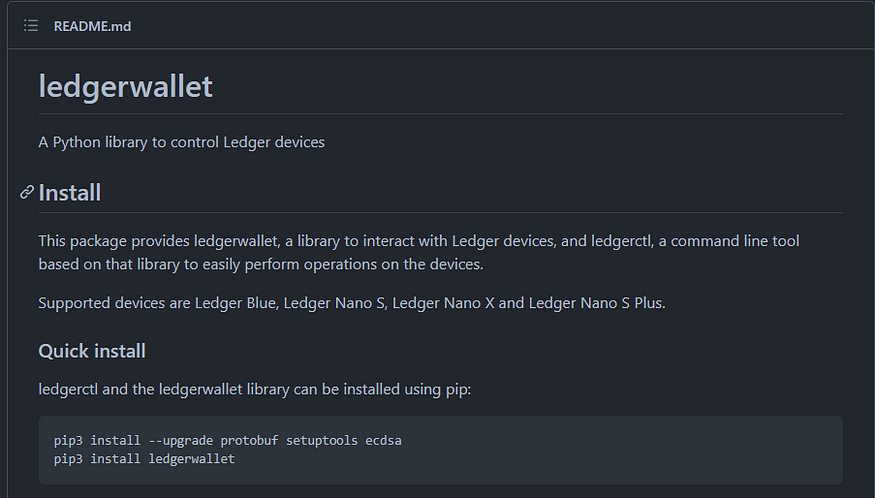
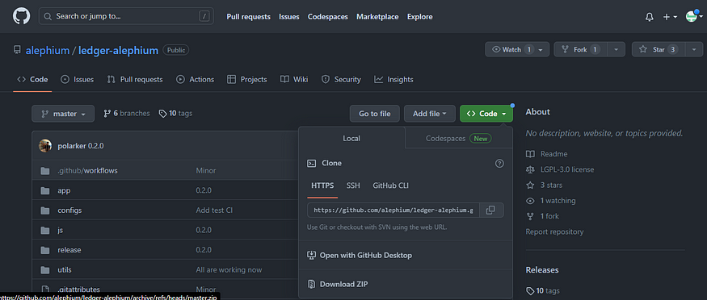
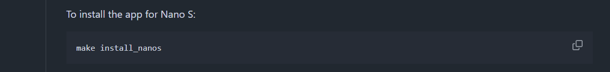
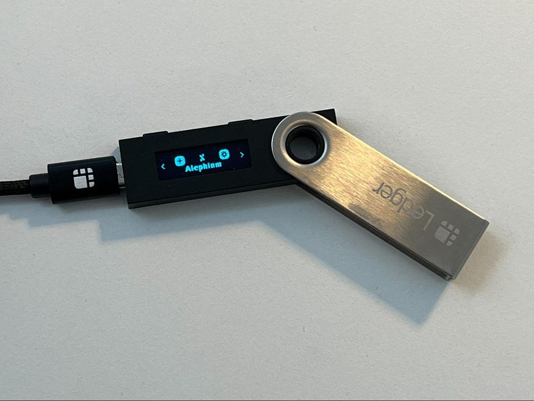

#### How to install the Alephium App in your Ledger Nano S

**_🚨 This tutorial is exclusively for the Nano S._** _If you have a Ledger version that is NOT the Nano S, (S+, X, Flex or Stax) you must use the Ledger Live to download the Alephium app, please follow the (much easier) instructions_ [here.](https://docs.alephium.org/wallet/ledger/)

**_🚨We encourage you to migrate to a more recent device, as Ledger is not actively supporting anything related to the Nano S anymore!_**

⚠️ _Important information: This sideloading method requires downloading other software on your computer and has several manual technical steps. Proceed only if you are sure that you understand how to perform this operation!_

#### Installation instructions for Ledger Nano S

**1–Download the latest release from:** [Chrome](https://chrome.google.com/webstore/detail/alephium-extension-wallet/gdokollfhmnbfckbobkdbakhilldkhcj) **/**[Firefox](https://addons.mozilla.org/en-US/firefox/addon/alephiumextensionwallet/)

**2 — Install the necessary software (if you already have PIP & Python installed, jump to step 3)**

You will need Python and PIP installed on your computer to get the Alephium App on your Ledger:

- Python ([how to for Windows](https://www.simplilearn.com/tutorials/python-tutorial/python-installation-on-windows#:~:text=To%20download%20Python%2C%20you%20need,then%20select%20the%20Windows%20option.), [how to for Mac](https://docs.python.org/3/using/mac.html), [how to for Linux](https://docs.python-guide.org/starting/install3/linux/))
- PIP ([how to for Windows](https://www.dataquest.io/blog/install-pip-windows/), [how to for Mac](https://www.groovypost.com/howto/install-pip-on-a-mac/), [how to for Linux](https://docs.python-guide.org/starting/install3/linux/))

**3 — Install the Ledger Python Library**

We are going to use the Ledger Python Library (you can find it [here](https://github.com/LedgerHQ/ledgerctl#quick-install)). It is necessary because you are going to install a custom App onto your Ledger Device.

To install the Ledger Python Library open a terminal window and type the following:

> **_pip3 install — — upgrade protobuf setuptools ecdsa  
> pip3 install ledgerwallet_**

This will make all upgrades and install the Ledger Wallet Library needed for the next step.

**4 — Download the Alephium Ledger App to your computer**

Go to the following GitHub repository: [https://github.com/alephium/ledger-alephium](https://github.com/alephium/ledger-alephium/tree/master/release) and download it.

_🚨To download the repository, click on the “Code” green button and choose “Download Zip.”_

Download and unzip it in a folder you have easy access to and all read/write permissions.

**5 — Install the Alephium App on your Ledger Device**

Your Ledger now needs to be connected to your computer and unlocked.

Go to the GitHub repository ([https://github.com/alephium/ledger-alephium/tree/master](https://github.com/alephium/ledger-alephium/tree/master)) and scroll down to find the command that applies to your Ledger version:

With this information, go to the console terminal and run the command to install the Alephium App:

🚨 _Important information: You need to run the command inside the folder you downloaded the files from GitHub._

After running this command, you must validate the Alephium App installation on your Ledger Device. Go through all approvals and add your PIN to validate the installation.

When successful, the Alephium icon will appear on your device.

Now, you are ready to use your Ledger to sign transactions on Alephium! **🎉**

**6 — Use your Ledger with the Extension Wallet**

Go to the browser where you installed the browser extension wallet, and open it.

🚨 _The Ledger app only works with the latest version of the extension wallet for now. If you don’t have it, you can install it from_ [here](https://chrome.google.com/webstore/detail/alephium-extension-wallet/gdokollfhmnbfckbobkdbakhilldkhcj/related)_._

Create a new address in your extension wallet: Click on the current address name, and then in the “+” icon. That will lead you to Ledger Connection page:

- Plug in your Ledger and unlocked it;
- Open the Alephium App (make sure you validated all steps!)
- Select your Ledger device from the list;
- Finish the configuration.

**If you want to see in more details on how to send transactions, use dapps or do more complex tasks, you’ll find everything in the ledger docs** [here](https://docs.alephium.org/wallet/ledger/#view-account-balance) **&** [here](https://support.ledger.com/article/Alephium-ALPH)**.**

If you have questions or suggestions, please come to Alephium’s [Discord](/discord), [Telegram](https://t.me/alephiumgroup), or reach out on [Twitter](https://twitter.com/alephium)!
