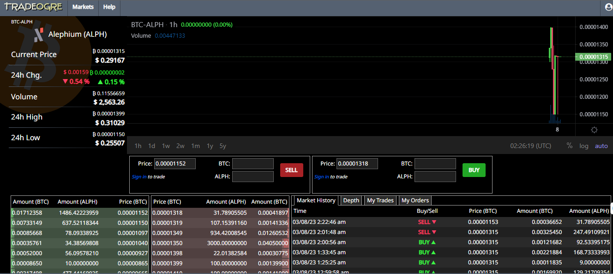
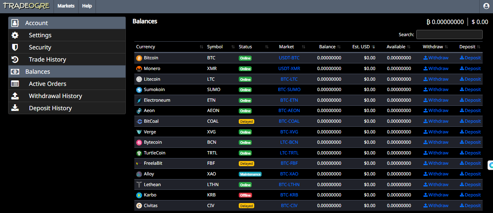

#### A Collective Effort by the Community

Alephium, the first operational sharded L1 blockchain scaling and enhancing PoW & UTXO concepts, has been listed on its second exchange: [Tradeogre.com](https://tradeogre.com/exchange/BTC-ALPH)! This is a significant milestone for Alephium, made possible due to its community push to get Alephium’s native token ALPH listed on a new exchange.

### “Wen new listing”

The Alephium community decided to reach out to TradeOgre and, working together, successfully got Alephium listed, and it can now be traded with the ALPH/BTC pair. This exciting development will undoubtedly make Alephium more accessible to a larger group of people and improve the token's liquidity.

Tradeogre is a cryptocurrency exchange that prides itself on being open to everyone, regardless of location. With minimal withdrawal fees and a 0.2% trading fee on all fulfilled orders, Tradeogre is committed to making cryptocurrency trading accessible to all.

The listing on Tradeogre is a big step towards greater circulation of ALPH, as it will expand the token’s reach to a wider geographical audience. Miners, hodlers, and traders who couldn’t trade ALPH on Gate.io due to geo-located restrictions will be particularly pleased to find out that they can now easily access and trade ALPH.

### Listing and Trading Details

The trading pair is ALPH/BTC, the market is already live and you can access it [here](https://tradeogre.com/exchange/BTC-ALPH)

To be able to trade on Tradeogre, you must register using an email, and it is a good security practice to set up 2-factor authentication. You can register [here](https://tradeogre.com/account/signin). After that, go to the “Balances” section to be able to make your deposit.

Choose the currency you want to send and click on “Deposit”. This will open a new page with the address you should send the amount to. Double-check it when preparing your transaction! After your funds arrive at the exchange, you can start trading.

> The listing on Tradeogre is a significant achievement for the Alephium community. It reflects the community’s collective effort and the growing interest in the tech. With increased liquidity and accessibility, new users will find it easier to onboard into the project.

---

If you need assistance, you are welcome to reach out to the community channels on [Discord](/discord), [Telegram](https://t.me/alephiumgroup). And follow [@alephium on Twitter](https://twitter.com/alephium) to stay up-to-date.
