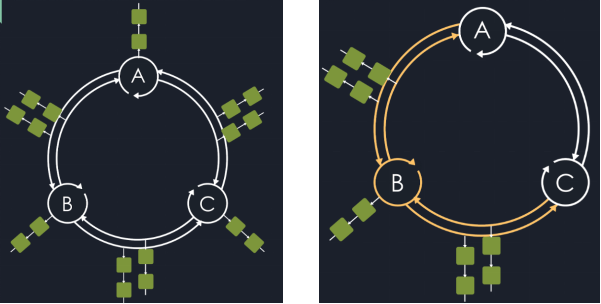

When assessing the seemingly countless blockchain platforms appearing in recent years, neither users nor critics fail to emphasize scalability. Recently, with the development of sharding technology, real improvements are being made in the area of blockchain scalability. One project, in particular, has built a powerful new technology with the potential to vastly improve the scalability of public chains. [Alephium](http://pr.report/Lr8w4Saq), the brainchild project of Cheng Wang, aims to scale blockchains to handle tens of thousands of transactions per second (10,000+ TPS) in an open, permissionless network. Its core algorithm, called BlockFlow, combines sharding technology with DAG (Directed Acyclic Graph) and utilizes a scalable UTXO (Unspent Transaction Output) model to resolve the inefficiency of sharding performance during cross-shard transactions. By breaking down smart contracts into token protocols and data protocols, Alephium allows developers to build dApps that support high concurrency scenarios while maintaining the Turing-complete functionalities of smart contracts.

**How does Alephium differ from existing sharding projects?**

Alephium is simple, efficient, secure, and pragmatic. However, the most significant feature of Alephium is its native support for cross-shard transactions which provides a user experience similar to single-chain platforms. Alephium’s core BlockFlow algorithm follows the same minimal network assumptions as Bitcoin — an open and asynchronous network. As a permissionless and decentralized platform, everyone can contribute to Alephium’s consensus and safety.

**Methods of Sharding**

In a single-chain structure, the hash of each block is stored in the block header of the next block. This allows the transactions of the entire network to be squeezed into a single transaction list. However, forcing the total ordering of transactions ultimately reduces the overall system throughput and increases latency.

Alephium hopes to address these issues of scalability through their BlockFlow algorithm by combining sharding and DAG, which reduces the transaction load of each node significantly. In the above example with three address groups, there are nine shards in total. With BlockFlow, nodes belonging to address group B only need to download transactions from five of the nine shards. This greatly improves the scalability of the platform.

Many sharding projects support cross-shard transactions today but usually rely on methods that negatively affect the throughput of the system. The Alephium project uses its two-layer sharding model to improve cross-shard transactions so as to improve the performance of the general system. The first layer of sharding is for transaction addresses, and the second layer of sharding is for transactions based on the first-layer sharding results of their input addresses and output addresses (see the figure above). The UTXO for each cross-shard transaction in Alephium sits at the address of the received shard, which reduces the usual two steps required for cross-shard transactions to only one. With the immutability and atomicity of UTXO, it is easier to prevent malicious spending in parallel.

**Fork choice rule:** One of the biggest challenges surrounding sharding algorithms is reaching consensus across all shards while some shards have temporary forks. This is often referred to as the fork choice rule. Alephium’s BlockFlow consensus uses a DAG data structure to resolve fork dependencies in the network.
