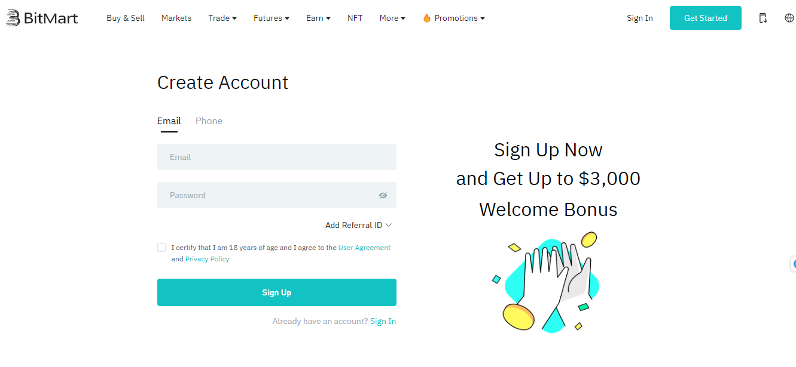
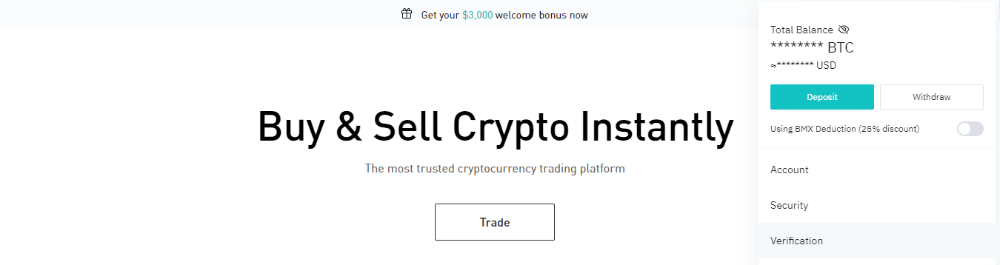
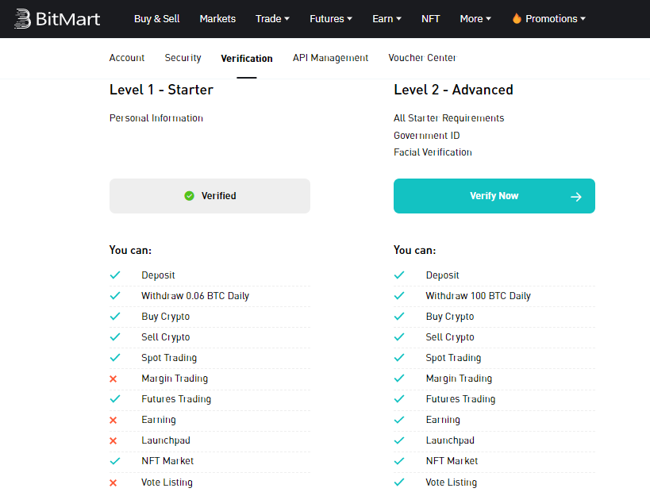

Trading starts on April 17th, 17:00 CEST

Following the successful deployment of the [Leman Network Upgrade](/news/post/the-leman-network-upgrade-is-live-f52c89b7dd6a), Alephium is thrilled to announce that its native token, ALPH, will be listed at [Bitmart](https://www.bitmart.com/) on April 17th, 17:00 CEST. Currently at \#22 in the Coinmarketcap ranking, with over USD 700 million in trading volume, Bitmart is a leading digital asset trading platform that provides a secure, reliable, and user-friendly trading experience to a global audience, including US citizens/residents.

Bitmart platform offers a wide range of cryptocurrencies for trading, and this listing is a massive milestone for Alephium as it expands its reach to a wider user-base and marks a significant step forward for the project. You can open your account at Bitmart here: [https://www.bitmart.com/register](https://www.bitmart.com/register).

### Listing Details:

**Trading Pair:** ALPH/USDT

**Trading start date/time:** Monday, April 17th, 17:00 CEST

**Deposits start date/time**: Saturday, April 15th, 17:00 CEST.

**Withdrawal start date/time:** Tuesday, April 18th, 17:00 CEST.

To celebrate the listing on Bitmart, Alephium has planned various activities such as trading competitions, giveaways, and more to reward the community’s support and encourage participation in the ALPH market.

### How to access Bitmart and open your account

When clicking on the “Get Started” button on the Bitmart homepage, you will be redirected to the registration page. Choose your preferred method and verify your phone number/e-mail address.

After a successful login, you can access the verification section using the top right menu (by clicking on your username) and start the process.

There are two verification levels; choose the one that better fits your needs and provide the information required. Level 1 has automatic approval.

---

If you have questions or want to know more, please come to Alephium’s [Discord](/discord), [Telegram](https://t.me/alephiumgroup), or reach out on [Twitter](https://twitter.com/alephium)!
