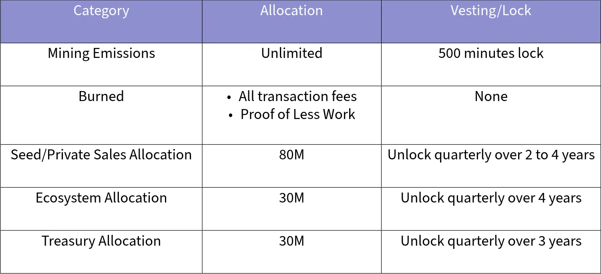
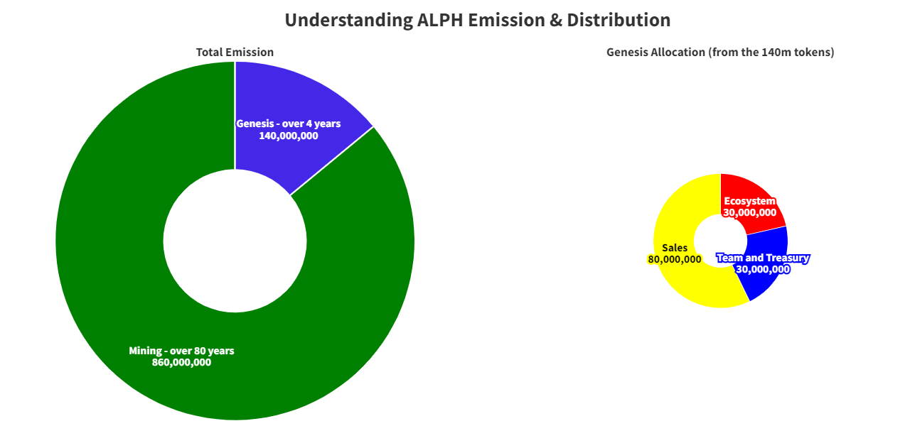
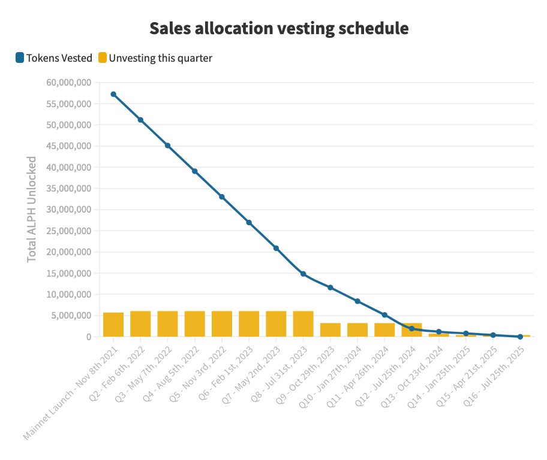
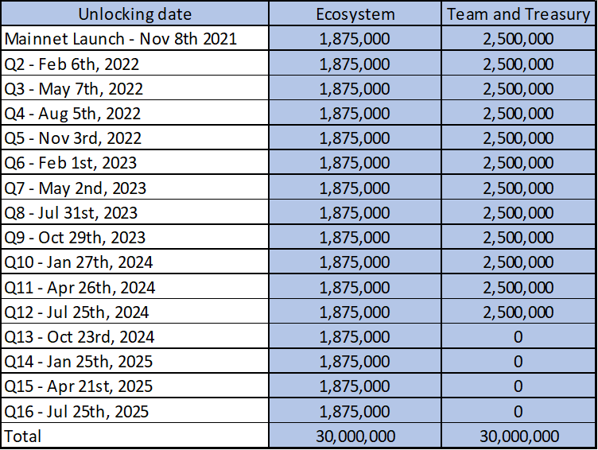
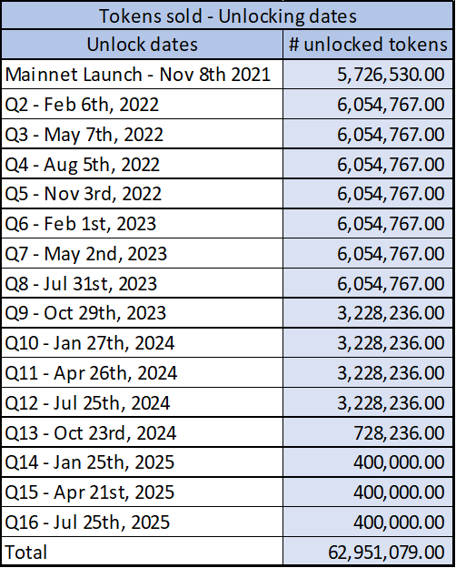
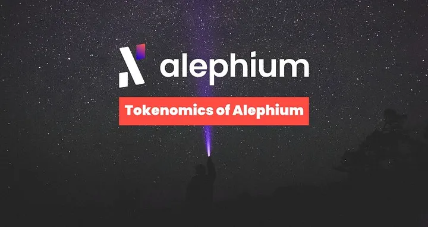
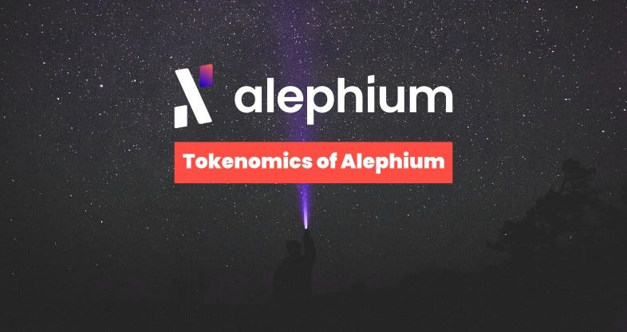
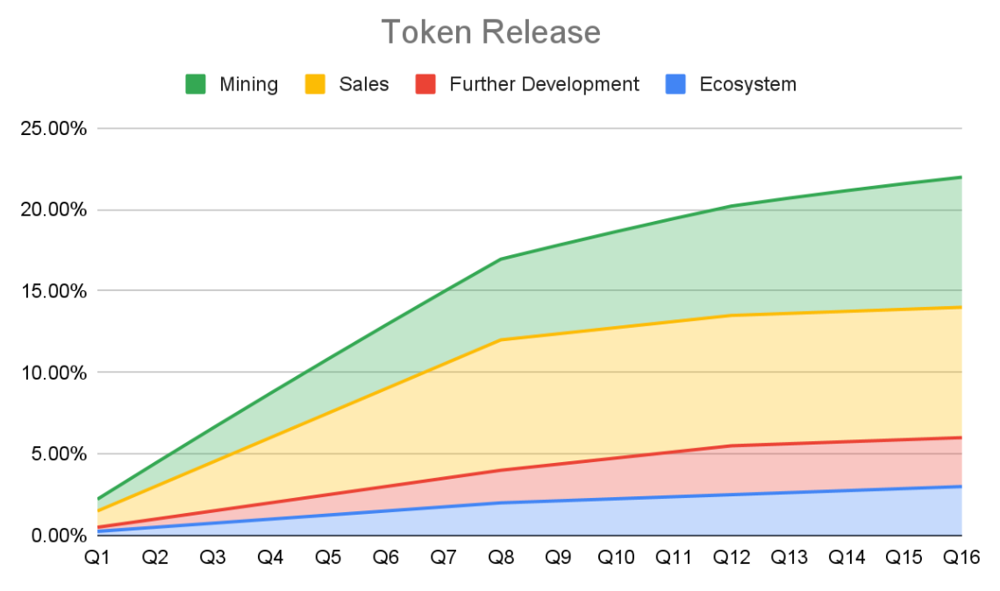

*Updated: The tokenomics were published on Oct 5, 2021. This article was updated in July 2025 to reflect the introduction of Alephium’s sustainable tail emission model, which will be implemented with the Danube network upgrade.*

### Introducing ALPH

Alephium is delivering the Web3 you were promised, scalability, smart contracts, and real decentralization, without the tradeoffs. Built as a true Proof-of-Work Layer 1 blockchain, Alephium combines the energy efficiency of its novel Proof-of-Less-Work consensus with the scalability of native sharding and the security of a UTXO-based smart contract platform.

At the heart of the network is the native coin ALPH which plays a critical role in securing and operating the blockchain. It is earned by miners who process and finalize blocks, contributing directly to the network’s decentralization and overall security. Mining is a core mechanism of Alephium: it’s how transactions are validated, ordered, and permanently recorded across the chain. Beyond incentivizing miners, ALPH is also used to defend the network from spam and DDoS attacks.

This article outlines how ALPH is issued, distributed, and used to support a secure, decentralized, and scalable Web3 ecosystem, one that’s built to last.

### Tokenomics TL;DR

Since the Danube upgrade, ALPH emissions are no longer capped and the supply is unlimited.

### Mining Emissions

As Alephium uses [Proof of (Less) Work](/news/post/tech-talk-1-the-ultimate-guide-to-proof-of-less-work-the-universe-and-everything-ba70644ab301), issuing ALPH over time as block rewards to the miners who secure the network.

There is no halving on Alephium, the block reward is adjusted dynamically depending on the network hashrate and timestamp.

You will find the full details & calculations of the mining rewards and emission schedule in [this article.](https://medium.com/@alephium/alephium-block-rewards-72d9fb9fde33)

The core emission schedule works like this: the block reward is bound by two curves based on hashrate and timestamp. At a given time and for a given hashrate, the reward per block equals the minimum between the time-based and hashrate-based rewards.

>  Block Reward = min(time-based reward, hashrate-based reward)

When this article was last updated, the average block reward was 0.1902 ALPH, resulting in approximately 32’867 ALPH mined daily (you can check the calculation [here](https://docs.alephium.org/frequently-asked-questions#how-many-coins-are-mined-per-day)).

#### Deflationary forces

While inflationary, thanks to mining, Alephium also has deflationary forces:

* 100% of the transaction fees are burned. (Before the Leman Network Upgrade in March 2023, only 50% of the transaction fees were burned).
* [Alephium’s Proof of Less Work](/news/post/tech-talk-1-the-ultimate-guide-to-proof-of-less-work-the-universe-and-everything-ba70644ab301) will require coin burning when it’ll be triggered to internalize part of the mining cost through the upfront burning of ALPH.

### Genesis Allocation & Vesting Schedule

At Genesis, 140 millions ALPH were minted for Ecosystem, Sales, Team, and Treasury allocations, and vest over time.

The genesis ALPH are allocated as follows:

* **80M** for past and upcoming  **sales** , subject to on-chain lock upon sales with varying vesting periods.
* **30M** for **ecosystem development**, vesting over 4 years in quarterly unlocks.
* **30M** for **treasury and team**, vesting over 3 years in quarterly unlocks.

*Please note that according to CoinmarketCap’s official methodology, Ecosystem and Team wallets are to be excluded from the circulating supply (whether the tokens are locked or not). Therefore, these ALPH will only be counted as circulating after they leave the original wallet and not after they unlock.*

### Sales allocation vesting

Three sales events were held for ALPH: seed sale,[ pre-sale](https://medium.com/@alephium/alephium-closes-3-6m-pre-sale-from-80-contributors-to-expand-sharded-utxo-blockchain-platform-84f80492e28d), and[ private sale](https://medium.com/@alephium/alephium-partners-with-cetacean-capital-83cf2fbea8a1). A total of 62,951,077 ALPH were sold and locked for periods varying between 2 to 4 years. The unlock schedule is detailed below.

The remaining 17,048,943 ALPH will be used to secure funds to ensure the long-term development and sustainability of the project. This will be done over the medium to long term, in a variety of ways, from direct sales, liquidity provisioning and OTC deals, optimizing for minimal impact on the markets while improving the liquidity, distribution & circulation of ALPH.

### Ecosystem and Treasury allocation vesting

The ALPH allocated to the **Ecosystem** and for the **Treasury** follows this unlock schedule:

## FAQ

**Where can I see the top Alephium wallets?**

You can check the[ Alephium Rich List](https://richlist.alephium.world/) to see the addresses with the most substantial balances.The [Explorer](https://explorer.alephium.org/) is your go-to for checking the balance of a specific wallet.

**Is Alephium deflationary?**

While Alephium has several deflationary forces, the [emissions of ALPH](https://medium.com/@alephium/alephium-block-rewards-72d9fb9fde33) still exceed them as of today.

**What is the difference between Circulating Supply, Total Supply and Maximum Supply?**

The definitions we are using for these terms come [from coinmarketcap](https://support.coinmarketcap.com/hc/en-us/articles/360043396252-Supply-Circulating-Total-Max-). We have to comply with their definitions if we want to be correctly represented there:

*Circulating Supply:* Circulating Supply is the best approximation of the number of assets circulating in the market and the general public’s hands. Are not part of the Circulating Supply ALPH that is locked (via smart contracts or legal contracts), allocated to the team or private sale participants, or in Ecosystem/Bounty/Marketing initiatives**.**

*Total Supply:* This is the number of ALPH in existence today. Basically, the sum of the initial supply (minted at genesis block = 140M ALPH) plus the ALPH mined until today, minus the ALPH burned (by transaction fees burned for example).

*Maximum Supply:* Since the Danube upgrade, ALPH emissions are no longer capped and the supply is unlimited.

**Why did we lift the supply cap on ALPH emissions?**

This cap was removed to eliminate the subsidy cliff that would have forced miners to rely entirely on transaction fees after 80 years, and to ensure Alephium’s security budget remains predictable and sustainable in the long term.

Importantly, the original emission schedule is preserved for the first 81 years, so this change doesn’t impact short or medium term supply. Removing the cap also makes the tokenomics more intuitive for newcomers, following a model similar to Monero and Ethereum, where emissions continue gradually to support network security.

If you have extra questions, you are welcome to reach out on our [Discord](http://alephium.org/discord) or in the [Alephium Telegram channel](https://t.me/alephiumgroup). Don’t forget to follow [@alephium on Twitter](https://twitter.com/alephium) to stay up-to-date.

- - -

## Previous version of the document — June, 2025

### Introducing ALPH

The Alephium token’s official ticker symbol is [ALPH](https://coinmarketcap.com/currencies/alephium/). It contributes to the blockchain’s decentralization and overall security by incentivizing miners to process blocks on the Alephium blockchain.

Mining is a core mechanism of the Alephium blockchain: it is the mechanism by which transaction records are added and verified across the network. The token also secures the Alephium network against DDoS and spam attacks via transaction fees payable in ALPH.

### Tokenomics

The theoretical maximum of ALPH is set at 1 billion. \
Most ALPH (86% of the max supply or 860 million ALPH) will be mined over ~82 years (starting at mainnet launch in 2021).

The remaining 140 million ALPH (14% of the max supply) were minted with the genesis block for the Ecosystem, Sales, Team & Treasury allocations (and vest over time, see Genesis Allocation & Vesting Schedule section below).

Total emission and Genesis Allocation

### Mining Emissions

As Alephium uses [Proof of (Less) Work](/news/post/tech-talk-1-the-ultimate-guide-to-proof-of-less-work-the-universe-and-everything-ba70644ab301), 860 million ALPH will be mined and distributed to the miners who secure the network as block rewards. There is no halving on Alephium, the block reward is adjusted dynamically depending on the network hashrate and timestamp.

You will find the full details & calculations of the mining rewards in [this article](/news/post/alephium-block-rewards-72d9fb9fde33).

The core emission schedule works like this: the block reward is bound by two curves based on hashrate and timestamp. At a given time and for a given hashrate, the reward per block equals the minimum between the time-based and hashrate-based rewards.

> Block Reward = min(time-based reward, hashrate-based reward)

When this article was last updated, the average block reward was 2.43 ALPH, resulting in approximately 50’554 ALPH mined daily (you can check the calculation [here](https://docs.alephium.org/frequently-asked-questions#how-many-coins-are-mined-per-day)).

#### Deflationary forces

While inflationary, thanks to mining, Alephium also has deflationary forces:

* 100% of the transaction fees are burned. (Before the Leman Network Upgrade in March 2023, only 50% of the transaction fees were burned).
* [Alephium’s Proof of Less Work](/news/post/tech-talk-1-the-ultimate-guide-to-proof-of-less-work-the-universe-and-everything-ba70644ab301) will require coin burning when it’ll be triggered to internalize part of the mining cost through the upfront burning of ALPH.

### Genesis Allocation & Vesting Schedule

The genesis ALPH are allocated as follows:

* **80M** (8%) for past and upcoming **sales**, subject to on-chain lock upon sales with varying vesting periods.
* **30M** (3%) for **ecosystem development**, vesting over 4 years in quarterly unlocks.
* **30M** (3%) for **treasury and team**, vesting over 3 years in quarterly unlocks.

*Please note that according to CoinmarketCap’s official methodology, Ecosystem and Team wallets are to be excluded from the circulating supply (whether the tokens are locked or not). Therefore, these ALPH will only be counted as circulating after they leave the original wallet and not after they unlock.*

#### Sales allocation vesting

Three sales events were held for ALPH: seed sale, [pre-sale](/news/post/alephium-closes-3-6m-pre-sale-from-80-contributors-to-expand-sharded-utxo-blockchain-platform-84f80492e28d), and [private sale](/news/post/alephium-partners-with-cetacean-capital-83cf2fbea8a1). A total of 62,951,077 ALPH were sold and locked for periods varying between 2 to 4 years. The unlock schedule is detailed below.

The remaining 17,048,943 ALPH will be used to secure funds to ensure the long-term development and sustainability of the project. This will be done over the medium to long term, in a variety of ways, from direct sales, liquidity provisioning and OTC deals, optimizing for minimal impact on the markets while improving the liquidity, distribution & circulation of ALPH.

#### Ecosystem and Treasury allocation vesting

The ALPH allocated to the **Ecosystem** and for the **Treasury** follows this unlock schedule:

### FAQ

**Where can I see the top Alephium wallets?**

You can check the [Alephium Rich List](https://alph-richlist.vercel.app/) to see the addresses with the most substantial balances. Find more [stats](https://status.notrustverify.ch/d/MggjRL1Vz/on-chain-stats?orgId=1) here & tools [here](https://github.com/alephium/awesome-alephium). The Explorer is your go-to for checking the balance of a specific wallet.

**Is Alephium deflationary?**

While Alephium has several deflationary forces, the [emissions of ALPH](/news/post/alephium-block-rewards-72d9fb9fde33) still exceed them as of today.

**What is the difference between Circulating Supply, Total Supply and Maximum Supply?**

The definitions we are using for these terms come [from coinmarketcap](https://support.coinmarketcap.com/hc/en-us/articles/360043396252-Supply-Circulating-Total-Max-). We have to comply with their definitions if we want to be correctly represented there:

*Circulating Supply:* Circulating Supply is the best approximation of the number of assets circulating in the market and the general public’s hands. Are not part of the Circulating Supply ALPH that is locked (via smart contracts or legal contracts), allocated to the team or private sale participants, or in Ecosystem/Bounty/Marketing initiatives**.**

*Total Supply:* This is the number of ALPH in existence today. Basically, the sum of the initial supply (minted at genesis block = 140M ALPH) plus the ALPH mined until today, minus the ALPH burned (by transaction fees burned for example).

*Maximum Supply:* The theoretical maximum of ALPH that can exist, it is set at 1 billion. However, it will never be reached due to the various deflationary mechanisms of Alphium.

If you have extra questions, you are welcome to reach out on our [Discord](/discord) or in the [Alephium Telegram channel](https://t.me/alephiumgroup). Don’t forget to follow [@alephium on Twitter](https://twitter.com/alephium) to stay up-to-date.

- - -

## Previous version of the document — September, 2023

### Alephium Tokenomics

*Updated: The tokenomics were published on Oct 5, 2021. To address many questions we regularly get, we have updated this article in September of 2023.*

### The best of many worlds

Alephium is the first operational sharded blockchain bringing scalability, ETH-inspired secure smart contracts, and energy efficiency to Bitcoin’s proven core technologies (UTXO and Proof-Of-Work) while ensuring better performance. Alephium also focuses on usability and accessibility making it the perfect blockchain to support decentralized applications and open protocols.

Alephium is built on the BlockFlow and PoLW algorithms. BlockFLow delivers efficient and practical stateful UTXO sharding. [PoLW uses a clever combination of physical work and token economics](/news/post/tech-talk-1-the-ultimate-guide-to-proof-of-less-work-the-universe-and-everything-ba70644ab301) to dynamically adjust the work required to mine new blocks, ensuring a reduced energy footprint compared to classic Nakamoto PoW mining.

As in many other blockchain networks, the token mechanism of Alephium is crucial for its operation.

### Introducing ALPH

The Alephium token recently adopted its official ticker symbol [ALPH](https://coinmarketcap.com/currencies/alephium/). It contributes to the blockchain’s decentralization and overall security by incentivizing miners to process blocks on the Alephium blockchain.

Mining is a core mechanism of the Alephium blockchain: it is the mechanism by which transaction records are added and verified across the network. The token also secures the Alephium network against DDoS and spam attacks via transaction fees payable in ALPH tokens.

As Alephium uses Proof of (Less) Work, staking isn’t supported natively on Alephium. However, in the future, staking or liquidity pools could be offered by third-party decentralized applications or protocols built on top of Alephium.

### Token Supply & Allocation

At Mainnet Launch, an initial supply 140M tokens (14% of the HardCap) was minted with the genesis block. Most of which are vesting over years (see below).

The remaining supply of ALPH (86% or 860 million ALPH) tokens will be [mined](/news/post/alephium-block-rewards-72d9fb9fde33) over the next ~82 years (from 2021). The theoretical hardcap is 1 billion ALPH but it will never be reached due to deflationary forces like transaction fee burning (see below in the FAQ).

The genesis tokens are allocated as follows:

* **80M** (8%) for past and upcoming **sales**, subject to on-chain lock with vesting periods varying from 2 to 4 years, unlocked quarterly (see below for details).
* **30M** (3%) for community and **ecosystem development**, vesting over four years in quarterly unlocks.
* **30M** (3%) allocated to **team and treasury**. These tokens will be locked for three years and unlocked quarterly.

### Tokens vesting global view

Of the 140M tokens mined at genesis, almost all of them are vesting over 2 to 4 years. Here’s the global unlock/vesting tokens graph, outlining how the initial unlocks are happening over the 3 different pockets of tokens:

You’ll notice the graph doesn’t reach 140M tokens, that’s because not all of the sales-allocated tokens have been sold yet.

### Sales token vesting

Three sales events were held for ALPH tokens: seed sale, [pre-sale](/news/post/alephium-closes-3-6m-pre-sale-from-80-contributors-to-expand-sharded-utxo-blockchain-platform-84f80492e28d), and [private sale](/news/post/alephium-partners-with-cetacean-capital-83cf2fbea8a1). A total of 62,951,077 ALPH tokens were sold (and locked), leaving 17,048,943 for future sales (and unlocked).

The distribution schedule is detailed here:

And here’s what it looks like over time:

<figure id="0d9f" class="graf graf--figure graf--iframe graf-after--p">

</figure>

### Token FAQ

**Why are tokens mined locked for 500 minutes?**

The 500-minute lock is designed to prevent re-org attacks, much like Bitcoin’s ~1000 minute lock for mined rewards.

**How many coins are mined per day?**

To know how many coins are mined per day, you can use the formula below. As the block reward change dynamically with each block, the formula will only give you an approximation.

3600 seconds / 64 seconds (Alephium block time) == 56.25 blocks per hour, per shard.\
56.25 x 16 shards == 900 blocks total per hour.\
900 x 24 hours == 21600 blocks per day.\
21600 x ALPH reward per block ~= number of ALPH mined per day.

At the time this entry was last updated the average block reward was: 2.87 ALPH which results in approximately 61'992 ALPH mined per day.

**Where can I see the richest wallets?**

You can check the [Alephium Rich List](https://alph-richlist.vercel.app/) or [Alph Top](https://alph-top.web.app/) to see the addresses with the most substantial balances. Find more [stats](https://status.notrustverify.ch/d/MggjRL1Vz/on-chain-stats?orgId=1) here & tools [here](https://github.com/alephium/awesome-alephium). To check the balance of a specific wallet, the [Explorer](https://explorer.alephium.org/) is your go-to.

**Is Alephium deflationary?**

Not as of today. Tokens are awarded to miners, according to the rules defined [here](/news/post/alephium-block-rewards-72d9fb9fde33).

But there are deflationary forces at play too:

* 100% of the transaction fees are burned. The implementation of the recently improved [DAA](https://github.com/alephium/alephium/blob/master/docs/proposals/lemanDAA.md) has increased that from 50% to 100%.
* Each smart contract needs the storage of 1 ALPH as contract storage rent. While not technically burning tokens (because these are retrievable), this potentially reduces available tokens from circulation.
* When triggered, [Alephium’s Proof of Less Work](/news/post/tech-talk-1-the-ultimate-guide-to-proof-of-less-work-the-universe-and-everything-ba70644ab301) will internalize part of the mining cost through the upfront burning of ALPH.

**What is the difference between Circulating supply, Total supply and Maximum Supply?**

The definitions we are using for these terms come [from coinmarketcap](https://support.coinmarketcap.com/hc/en-us/articles/360043396252-Supply-Circulating-Total-Max-). We have to comply with their definitions if we want to be correctly represented there:

*Circulating Supply:* Circulating Supply is the best approximation of the number of assets circulating in the market and the general public’s hands. Are not part of the Circulating Supply assets that are locked (via smart contracts or legal contracts), allocated to the team or private investors, or in Ecosystem/Bounty/Marketing initiatives**.**

*Total Supply:* This is the sum of the initial supply (minted at genesis block = 140M ALPH) plus the tokens mined until today, minus the tokens burned (by transaction fees burned for example).

*Maximum Supply:* The theoretical maximum of ALPH tokens, set at 1 billion. It will never be reached as transaction fees are burnt and as PoLW activates, more tokens will be burnt, too.

- - -

## Previous version of the document — Oct 5, 2021

### Tokenomics of Alephium

### The best of many worlds

Alephium is the first operational sharded blockchain bringing scalability, ETH-inspired secure smart contracts, and energy efficiency to Bitcoin’s proven core technologies (UTXO and Proof-Of-Work) while ensuring better performance. Alephium also focuses on usability and accessibility making it the perfect blockchain to support decentralized applications and open protocols.

Alephium is built on the BlockFlow and PoLW algorithms. BlockFLow delivers efficient and practical stateful UTXO sharding. PoLW uses a clever combination of physical work and token economics to dynamically adjust the work required to mine new blocks, ensuring a reduced energy footprint compared to classic Nakamoto PoW mining.

As in many other blockchain networks, the token mechanism of Alephium is crucial for its operation.

### Introducing ALPH

The Alephium token recently [adopted its official ticker symbol ALPH.](/news/post/introducing-alph-8381dbd9f88d) It contributes to the blockchain’s decentralization and overall security by incentivizing miners to process blocks on the Alephium blockchain.

Mining is a core mechanism of the Alephium blockchain: it is the mechanism by which transaction records are added and verified across the network. The token also secures the Alephium network against DDoS and spam attacks via transaction fees payable in ALPH tokens.

As Alephium uses Proof of (Less) Work, staking isn’t supported natively on Alephium. However, in the future, staking or liquidity pools could be offered by third-party decentralized applications or protocols built on top of Alephium.

### Token Supply

The token supply on Alephium is limited to 1 billion (HardCap). At Mainnet Launch, an initial supply of tokens will be mined with the genesis block. The initial supply is 140M tokens (14% of the HardCap). The remaining supply of ALPH tokens will be mined over **the next ~82 years** (from 2021).

The initial supply of tokens will be allocated over time as follows:

* 80M tokens (8%) will be allocated for past and future sales. Tokens sold will be subject to on-chain lock with vesting periods varying from 2 to 4 years, released quarterly.
* 30M tokens (3%) will be allocated for community and ecosystem development. These tokens will be locked for 4 years, and be vested 10M, 10M, 5M, 5M each year in quarters accordingly.
* 30M tokens (3%) will be allocated to reward the team and support future developments of Alephium. These tokens will be locked for three years and be vested 10M, 10M, and 10M each year in quarters accordingly.

The rest of the token supply (86% or 860'000'000 ALPH) [will be mined](/news/post/alephium-block-rewards-72d9fb9fde33) over the next **~82 years** (from 2021) to ensure transaction processing and smart contract execution on the Alephium blockchain.\
**After being mined, ALPH is locked for 500 minutes.**

There are several deflationary forces in Alephium’s tokenomics, including:

* 100% of the transaction fees are burned with each block.
* When triggered, [Alephium’s Proof of Less Work](/news/post/tech-talk-1-the-ultimate-guide-to-proof-of-less-work-the-universe-and-everything-ba70644ab301) internalizes part of the mining cost through the upfront burning of ALPH.

This graph represents the estimated high-level overview of the token release schedule of Alephium for the 4 years after the mainnet launch. Please note that: 1. The Sales component might be lower than depicted. Indeed, any remaining, unsold token will be burnt, resulting in a smaller release supply. 2. In practice, the mining reward depends on block time and hashrate. As a result, depending on the effective hashrate, it is possible that fewer tokens will be mined over the 4 years following the mainnet launch.
