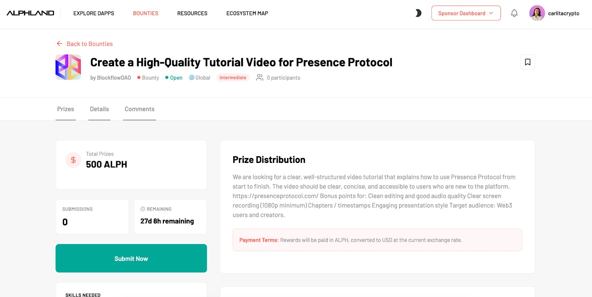
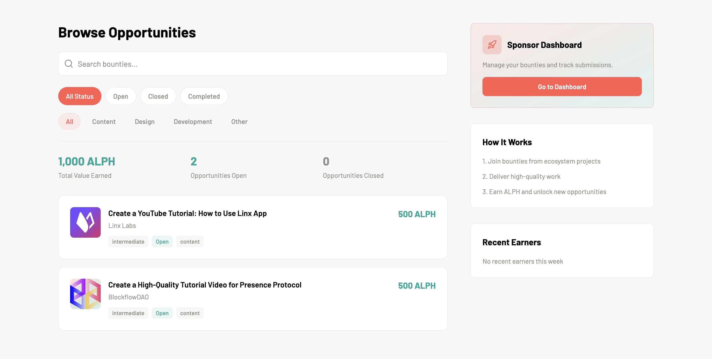
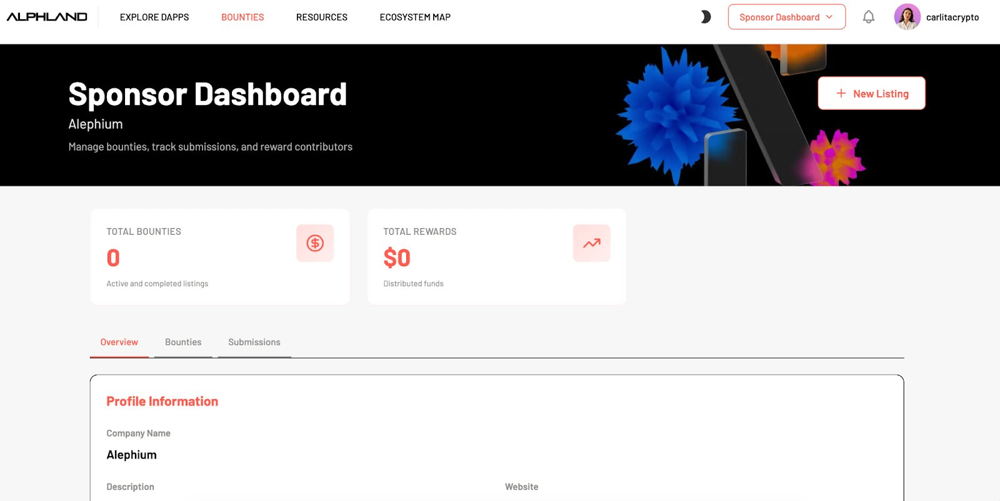
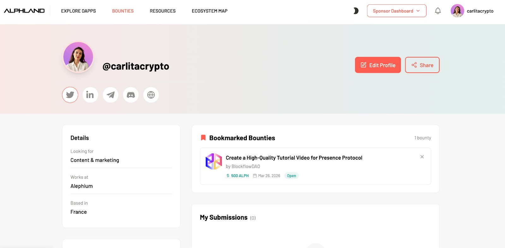
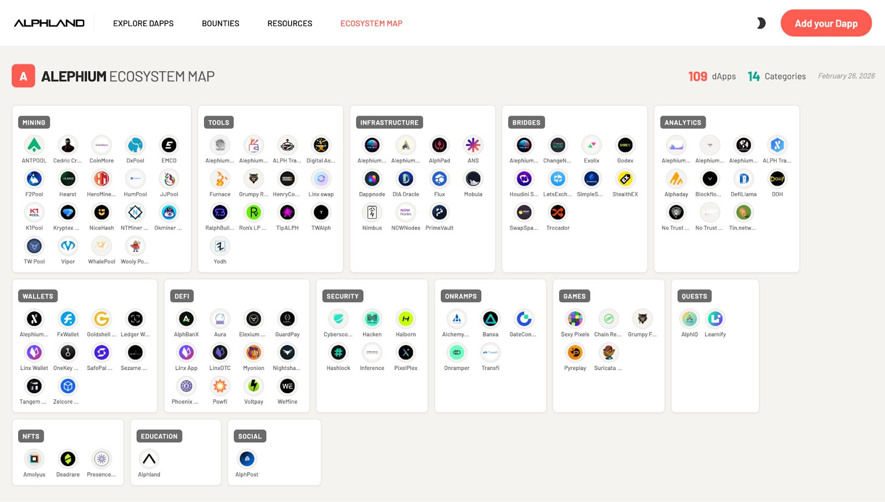

*We are delighted to announce that [Alphland](https://ecosystem.alephium.org) has evolved from a simple dApp explorer into a structured ecosystem hub.*

- - -

## What's New?

We’ve recently taken [Alphland](https://ecosystem.alephium.org) in-house, adding:

* dApp discovery
* User profiles
* Sponsor profiles
* Bounty system
* Resources hub
* Ecosystem map

Previously a visibility platform, it can now serve as Alephium’s engagement and coordination layer.

## Listings Have Changed

Static listings have become multi-layered product architecture.

* Highlight & Curation (featured projects, visibility logic)
* Discovery (filtered & categorized dApp explorer)
* Opportunity (bounties & submissions)
* Profiles (user, project, sponsor)

These layers drive more **strategic value**.

*Example of a bounty on Alphland*

## Visual Upgrades

Next up, UX stabilization & friction reduction.

* Navigation clarity
* Filter logic improvements
* Consistent profile creation flows
* Clearer bounty visibility
* Better hierarchy of information

These upgrades took us from a prototype feel, to a structured ecosystem tool.

## The Incentive Layer

Then, we introduced the Incentive Layer.

* The bounty system forces a major shift:
* Projects can attract contributors
* Contributors can engage directly with opportunities
* Sponsors can support initiatives visibly

The outcome is Alephium’s **organic contribution marketplace**.

*Browse and filter to find bounty opportunities*

## Ecosystem Coordination Layer

Strategically, Alphland also becomes an ecosystem coordination layer:

* Builder acquisition funnel
* Contributor engagement engine
* Visibility hub for ecosystem projects
* Discovery interface for newcomers

Visibility, incentives, and identity unite under one roof.

*Explore Sponsors*

## Transparency = Credibility

This restructuring of Alphland makes the ecosystem more legible:

* Who is building
* Who is contributing
* What opportunities exist
* Which projects are active

These changes reduce fragmentation and improve clarity.

*Profile Example from our Head of Ecosystem, Carla*

## Critical Ecosystem Component

With this re-launch, Alphland has transitioned from a visibility tool into a structural ecosystem component.

The platform now:

* Organizes ecosystem actors
* Enables contribution
* Supports activation
* Reduces ecosystem friction

Give it a try: [https://ecosystem.alephium.org ](https://ecosystem.alephium.org)

(Note, this is a new URL for Alphland, although [Alph.land](alph.land) still works too!)

*The current Alephium ecosystem*

- - -

P.S. Credit is due to our builders, Yuanying L. , Carla Masini , Baby Alephium and the original creator of Alphland, @fugashu_codes.

This is only the start. There’s more to come.

**Your feedback is important, please keep it coming!**
