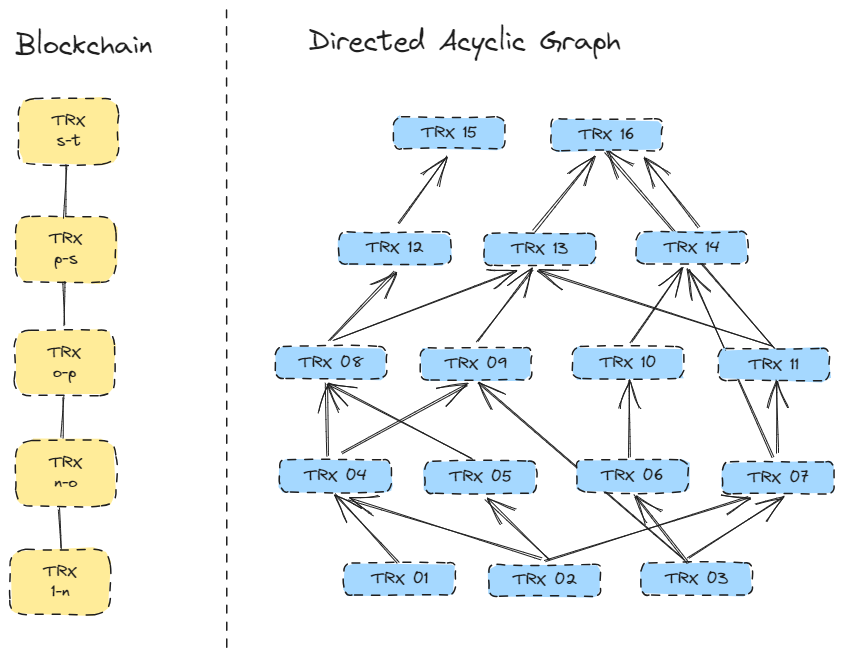
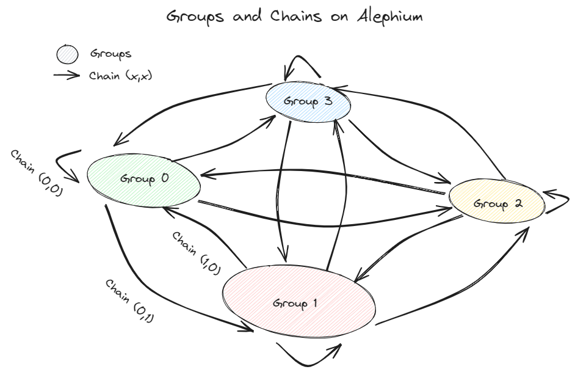
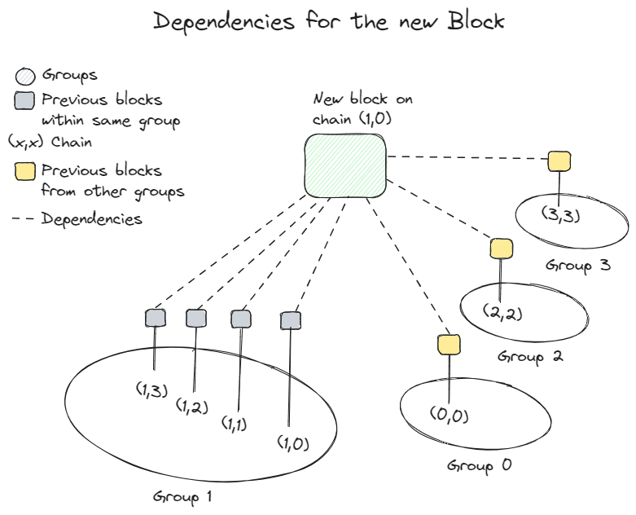
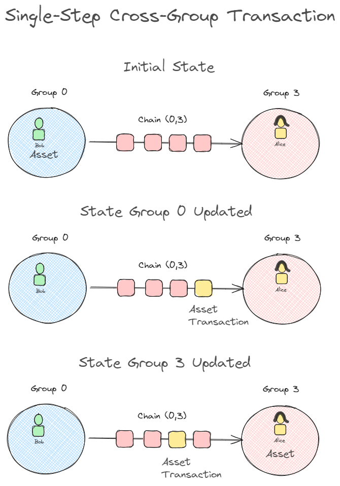

*This is the fourth of a series of technical innovations brought by Alephium. Find the previous ones* [here](/news/post/tech-talk-1-the-ultimate-guide-to-proof-of-less-work-the-universe-and-everything-ba70644ab301) *(PolW),* [here](https://medium.com/p/8de3b0f76749) *(sUTXO), and* [here](/news/post/meet-alphred-a-virtual-machine-like-no-others-85ce86540025) *(Alphred VM). This article will dive into the concepts of sharding and the inner workings of Blockflow to explain how it enhances the performance of the Alephium blockchain.*

***TL;DR — Alephium is a sharded blockchain: its state is divided into groups, and the transactions are processed in parallel by several blockchains to increase throughput. Its sharding algorithm is called*** [Blockflow](https://github.com/alephium/white-paper)***, and allows for huge UX improvements with single-step cross-group transactions. It also manages the relationship between blocks in all chains, allowing high transactions-per-second numbers while maintaining ledger integrity.***

### **Sharding in a Blockchain Context**

[Sharding](/news/post/sharding-d50968b8b229) is a database management technique that involves breaking down larger datasets into smaller, more manageable pieces. When dealing with large databases, it becomes impractical to handle all the data on a single machine or in a single table. Sharding enables the database to be distributed across multiple machines by creating multiple smaller tables, allowing parallelizing tasks to improve throughput.

It’s the same in a blockchain context: sharding increases throughput by parallelizing transactions. This comes at the cost of added complexity because it becomes harder to maintain a secure and consistent ledger. Every sharded blockchain addresses these tradeoffs in different ways:

[Polkadot](https://polkadot.network/), a multi-chain platform developed by the Web3 Foundation, introduces a sharding mechanism known as “parachains.” [Parachains](https://polkadot.network/blog/polkadot-v1-0-sharding-and-economic-security) are individual chains that run in parallel, interconnected through a central relay chain called the “Polkadot Relay Chain.”

[Zilliqa](https://www.zilliqa.com/) implements sharding differently. It uses network-level sharding to scale the blockchain by splitting transactions into smaller blocks. However, it does not support state sharding, the global state of the blockchain has to be shared by all shards, which limits its scalability.

[Kadena](https://kadena.io/) performs sharding by introducing [“chainweb,” a braided blockchain structure](https://www.youtube.com/watch?v=hYvXxFbsN6I) which consists of multiple interconnected chains that collaborate to form a single network.

Alephium takes a unique approach to shard the blockchain: it involves using a DAG and a sharding algorithm called Blockflow. This is beneficial as it does not rely on a coordination chain (e.g. beacon chain), there is no loss of security for individual shards, and it enables single-step cross-group transactions (more on later).

### **How does Blockflow work?**

Blockflow, Alephium’s sharding algorithm, aims to enhance blockchain scalability and efficiency by dividing the network’s transactions into manageable parallel chains or “shards”, while maintaining high security and effective communication between them for seamless transaction processing. It’s the rulebook for maintaining the “block flow” and blockchain correctness.

Blockflow is built on the unique combination of Alephium’s UTXO and PoW and leverages a two-dimensional DAG data structure. It delivers lightweight and efficient sharding that completely eliminates the need for cross-chain transactions & the complexities that come with it.

Blockflow introduces two levels of partitioning/sharding:

### Group-Level Sharding:

Addresses are organized into distinct groups, with the mainnet currently comprising four groups (0, 1, 2, 3), scalable to 32 groups.

### Transaction-Level Sharding:

Transactions are partitioned in specific blockchains, defined by the transaction’s origin and destination group. If there are G groups on the network, there are G*G chains. As a result, the mainnet currently has 16 chains and can scale to 1024.

Whether the user transacts between addresses in the same group or across groups, transactions are seamlessly handled in a single step by dedicated blockchains, sharing identical characteristics and secured by Alephium’s innovative Proof of Less Work (PoLW) mechanism.

This approach contrasts with traditional sharding methods in account-based chains, where cross-chain transactions are necessary and result in significant degradation of the user experience and increased complexities and security considerations.

> *A* [Directed Acyclic Graph](https://en.wikipedia.org/wiki/Directed_acyclic_graph) *is a data structure that can conceptually represent a series of activities and their interrelationships. Comprised of nodes interconnected by directed edges, it ensures the orderly treatment of sequences of transactions, prevents double-spending of coins, and safeguards against network rejections. It’s like a safety check to maintain fair and secure transactions or a transaction family tree.*

### **Diving deeper into the dependencies**

The complexity here is understanding how these blocks are connected to previous blocks to maintain a coherent set of dependencies, ensuring blockchain correctness. For this, a little bit of context:

> The shards of other sharded blockchains are called groups on Alephium. These groups are a logical division of the blockchain’s state and all the addresses created on it. The groups keep records of the state of all chains connected to them, including assets, contract states and contract logic. This is the first level of sharding.

Each blockchain is responsible for processing transactions from one group to another group. We use the notation (*“from”,”to”*). Although that seems difficult to understand, you need to visualize that every chain originates from a group and that in every group, there’s a chain connecting to the other groups besides the one that is internal to that group. This is the second level of sharding.

So as of today, you get (each (x,x) is a chain):

> Group 0 is: **(0,0)** — (0,1) — (0,2) — (0,3)\
> Group 1 is: **(1,1)** — (1,0) — (1,2) — (1,3)\
> Group 2 is **(2,2)** — (2,0) — (2,1) — (2,3)\
> Group 3 is **(3,3)** — (3,0) — (3,1) — (3,2)

Every chain in parentheses manages a different unidirectional transaction flow: (0,1) processes all transactions from group 0 to group 1, and (1,0) manages the transactions in the opposite direction from group 1 to group 0.

(0,0) manages the internal transaction flow of group 0, (1,1) manages the internal transactions in group 1, etc… These are the intragroup chains.

So every chains either an **inter**group (0,1) or an **intra**group (1,1) chain. This is important because when blocks are mined, they are connected through dependencies to every chain within the same group and one chain (the intragroup chain) from each other group.

To give you an example for a block mined on chain (1,0), there are 7 dependencies:

Four dependencies from each other chain inside the group, so (1,0) — (1,1) — (1,2) — (1,3).\
Three dependencies from each other group (the intragroup chains): (0,0) — (2,2) — (3,3).

These dependencies are placed in the new block’s header, naturally embedding them into the block structure. And this happens for each of the new blocks mined on the 16 chains: thanks to the DAG matrix, they are all connected to each other group, maintaining ledger integrity while increasing throughput.

### Single-step cross-group transactions

This allows something unique: **asset transfers between groups in one step!** Note that there is no need of asset transfers between chains due to Alephium’s unique 2-dimensional sharding structure.

An illustration:

Bob has an address in group 0. He wants to send $ALPH to Alice, who has her address in group 3. He creates the transaction on [the superb desktop wallet](https://github.com/alephium/desktop-wallet/releases/latest/), enters Alice’s address, and presses “send”. What happens?

This transaction is included in a block on chain(0,3), which is the chain connecting groups 0 and 3 in this direction. This triggers a balance change on Bob’s address and [updates Group 0’s state.](https://twitter.com/alephium/status/1599808960038461447)

A new block in any of the 4 chains on Group 3 will check the dependencies with all other groups and observe that a new block in Group 0 has been committed, transferring assets from Group 0 to Group 3. The local state of Group 3 will be updated to reflect that Alice’s address in Group 3 has received assets from Group 0, which are now available for utilization.

This is essentially how the cross-group single-step transaction is done: as a new block on the destination Group verifies dependencies from all other groups and ensures there is no double spending, it collects the information about the asset transfer and updates the destination group’s state.

**This allows a transaction to be done in a single step, instead of multiple verifications in the source and destination chains, as in many other blockchains.**

### In conclusion…

As a sharded blockchain, Alephium can increase its throughput by adding more shards. Currently, it stands on 800 [transactions per second](/news/post/transactions-per-second-tps-f13217a49e39) (and it can reach 20,000 TPS with 1024 chains). And Blockflow is the core Alephium technology enabling such a scalable blockchain. Incidentally, BlockFlow was the first name of Alephium!

By leveraging the consensus rules within the DAG-based structure, BlockFlow ensures the correctness and security of transactions across all groups. This sets it apart from traditional sharding algorithms as it offers a more efficient and a better Developer and User Experience due to single step cross-group transactions.

If you have questions on this topic, please come to Alephium’s [Discord](https://discord.gg/XsGpZ5VDTM), [Telegram](https://t.me/alephiumgroup), or reach out on [Twitter](https://twitter.com/alephium)!
