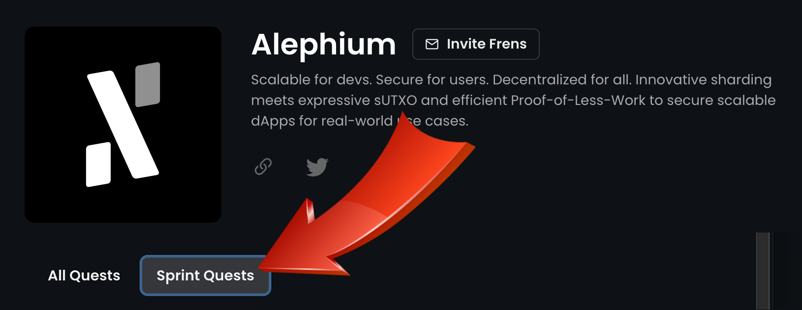

_Spread the word about the bridge & share 3’000 \$ALPH in prize!_

_The bridge has launched two weeks ago, there’s been more than_ [400 transfers since](https://explorer.bridge.alephium.org/)_, it has more than_ [1.2M in TVL](https://defillama.com/protocol/alephium-bridge) _and wrapped \$ALPH has more than 500_ [holders](https://etherscan.io/token/0x590f820444fa3638e022776752c5eef34e2f89a6) _on ethereum!_

Alephium’s core contributors have released a lot of content on the bridge, from the [main article explaining the way it works](/news/post/the-alephium-bridge-a787d90b2e4a), to multiple threads on topics such as [the faucet](https://x.com/alephium/status/1726556042425995760?s=20), the different ways to use it, [which tokens](https://twitter.com/alephium/status/1725164466868801848) can be easily bridged, the [explorer](https://x.com/alephium/status/1729149731761537296?s=20) or a [tutorial](https://x.com/alephium/status/1727704331389194330?s=20) on how to use it.

Our partners from the [ecosystem](https://twitter.com/alephium/status/1725439073052168293), the BlockFlow Alliance DAO, [Ayin](https://www.ayin.app/), [Deadrare](https://deadrare.io/) and [Walph](https://walph.io/) have all created great content too. But that’s not all, the community has & other influencers too!

To reward that activity, and to offer additional spread to that great content, the Blockflow DAO has joined Alephium to setup an incentivized [Zealy](https://zealy.io/) quest sprint!

The [Blockflow DAO](/news/post/welcome-blockflow-alliance-dao-cd74a949f98b) ambitions to _“be the voice of the_ [@alephium](https://twitter.com/alephium) _community and contribute to the growth of its ecosystem.”._ They have taken a number of fantastic initiatives from writing great content to advocating for \$ALPH relentlessly, participating in AMAs, etc… You can find them on [Discord](https://discord.com/channels/747741246667227157/1156214551939919962), and [Twitter](https://twitter.com/Blockflow_DAO). They are an independent and valued partner for the Alephium core-team, and it’s just the beginning!

## How does the sprint work?

You need an account on Zealy.io & to be part of Alephium’s community there. Then you get XP by accomplishing quests. Some are one-shots, others can be done either daily or weekly to get more!

Some are automatically validated, others need to be manually checked, please be patient as we carry along.

You’ll find a dedicated sprint leaderboard, where you can track your progress.

## Where do I start?

1 — Go to Alephium’s Zealy Bridge sprint — [this is the first quest](https://zealy.io/c/alephium/questboard/b675511f-0bb8-4d67-a9e4-a4e2cf51f306)  
2 — Go to “Sprint quests” **(Please make sure you are doing the Sprint’s quests!)**   
3 — Here you go!

## How long does it last?

The Zealy sprint will last from November 29th at 3PM CET and will end on december 17th at 3PM CET.

We’ll announce the winners soon after.

## What’s the prize?

At the end of the period, we’ll take the leaderboard of sprint participants and reward the top 30 participants by XP (in the Sprint’s leaderboard):

> Top 10 will share 2000 \$ALPH  
> Next 20 will share 1000 \$ALPH

Half of the prize is contributed by Alephium, the other half by the Blockflow DAO.

## Any other condition?

If you win you’ll have to sign a reward agreement, so we need your email (which is why this is what we’re [asking](https://zealy.io/c/alephium/questboard/3f43c69e-c980-43c5-9bdc-9c9afbe28e0d) in the first part of the sprint). If you want to claim your reward, you’ll have to comply with the rules listed [here](https://github.com/alephium/community/blob/master/RewardProgramRules.md).

We reserve the right to disqualify participants when we feel they have cheated, or otherwise flouted the rules. Please do not cheat, let’s keep this fun and enjoyable!

If you have any questions, do not hesitate to contact us in the dedicated zealy channel on our Discord.
