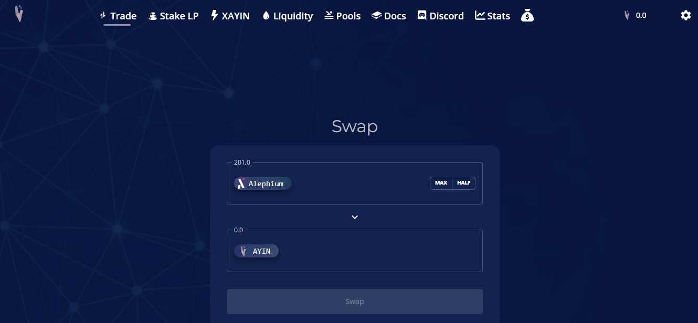
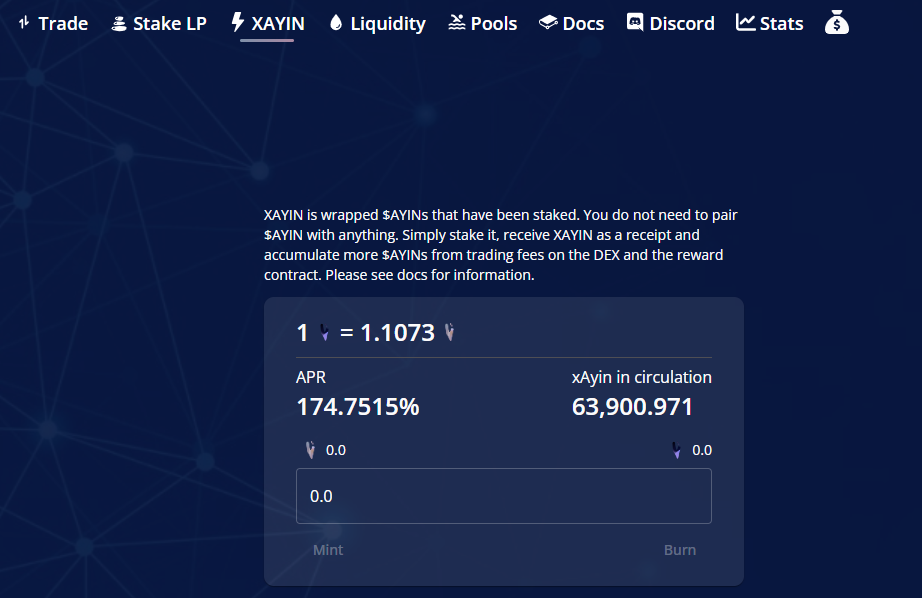

_Our ecosystem thrives with developers building amazing stuff on top of Alephium (services, dApps, etc…) that deliver a unique experience and provide real utility for the users. In the Builders Highlight series, these builders will share more about their projects, thoughts, and insights on why building on Alephium! You can find_ <a href="https://medium.com/@alephium/builders-highlight-sezame-wallet-ddb4aeb61881" ><em>#1 here</em></a> _and_ <a href="https://medium.com/@alephium/builders-highlight-alphpaca-nfts-99c69775f04c" ><em>#2 here</em></a>_._

This episode is about <a href="http://ayin.app" >Ayin</a>, the first DEX available on Alephium Mainnet. We thank <a href="https://medium.com/@alephium/community-highlight-11-dr-jekyll-165ab9a51880" >Dr Jekyll</a> and 0dd431c8 for the nice interview!

### **Tell us a little bit about your project. What is it, what does it do, and how does it interact with the Alephium blockchain?**

Our project is a <a href="https://www.ayin.app/" >DEX</a>. It allows users to trade anything people list as a pair on it, and also the tokens we approve if they are on Alephium L1.

Our DEX interacts through multiple smart contracts, and the user can earn yield as a Liquidity Provider, be a staker, a sale participant or a trader.

You can seamlessly swap between token pairs and use the Utility Token, \$AYIN, to interact with different features in the app!

<a href="https://github.com/0dd431c8/ayin-swap" >GitHub</a>

### What motivated you to develop on Alephium, and what sets it apart from other blockchain platforms?

Reading anything the team puts out, like the <a href="https://github.com/alephium/white-paper" >whitepaper</a>, is enough for me.

I like the <a href="https://medium.com/@alephium/an-introduction-to-blockflow-alephiums-sharding-algorithm-bbbf318c3402" >novel approach of sharding</a> that is fully implemented already and not just promised \*\*cough ETH\*\*.

There is no “pick a chain” when doing tx, and you can seamlessly use the tech whether you are a PhD in astrophysics or Jim from down the road who just heard about Bitcoin.

As I have always said, I like to be early on things when building before a chain is crowded or there is little support/ a lot of rivalry going on, and also for tight-knit communities.

Alephium has it all. [New novel tech](/),</a> a great team, a [great community](/discord), and not yet crowded or full of scams.

The team has been instrumental in allowing us to understand <a href="https://docs.alephium.org/ralph/getting-started" >Ralph</a> and build properly and giving us direct access to all of them in all facets of development from SC dev to marketing, which is more than probably any core L1 team can say for themselves on any chain. Big ups to them!

### What tech stack did you use in your project?

<a href="https://react.dev/" >React</a>+<a href="https://redux.js.org/" >redux</a> combo for the front end.

### **What did you consider when choosing the right tech stack for your project?**

We’ve decided to go with React because the Alph team is focused on supporting React first, so we chose it to deliver as quickly as possible.

We plan to switch to Solid.js + Effector soon after we are on top of everything and if it still seems like something that would benefit us.

### **What features are you most proud of?**

It is xAYIN, the staked version of AYIN.

“0dd” wrote that one from scratch, and it’s basically a wrapped \$AYIN that accumulates more AYINs from the trading fees on the dex as well as additional tokens from the reward contract. So single staking, in other words, but with a real fee element. Utility!

### Could you tell us about some of the challenges you faced while building, and how you overcame them?

Honestly, nearly everything was broken/red when we started testing as well as on my end trying to figure out the tokenomics with no idea of the demand in the Alephium ecosystem. The latter is an ongoing problem.

There is a lot of quiet whales around, but then I don’t want to overshoot it and have high inflation rates with not a lot of demand. The way money is raised so quickly for certain initiatives gives me hope though I do wish people were more active as I do know there is a lot of parked money/whales/people, in general, ready to pour into Alephium defi, you can’t necessarily gauge that as a product manager / tokenomics designer who isn’t integrated into the community yet.

Overcoming this has been simply listening to the community who said the sale was too small, as was planned liquidity, so the cap has been removed, sticking with the tokenomics as they were originally designed without reducing or trying to play small.

On the testing front, the challenges were overcome by direct access to the team. Cheng and Co., as I like to call them 😂 have been extremely helpful, not just auditing but helping 0dd understand how things work in Ralph.

I am hoping once the team is less swamped, that thorough update to the documentation will be done, as well as people learning from how AYIN is written when it is open-sourced, as it can be confusing trying to write code in Ralph with no idea why the tests are All red.

To anyone who wants to build, I suggest reaching out to Cheng. You will get tailored 1on1 help not just from him but the whole team, including things unrelated to dev work.

### What has been the most rewarding part of developing your project, and why?

Watching it come together, as always. It’s a relief once it becomes clear that this will actually launch. The most rewarding part has been after launch, though. Watching ayin be successful, in many ways other than just speculation, has been a great experience.

The other biggest reward has been the support of the community, everyone seems very excited and happy that something has come to Alephium, which is cool! We couldn’t have anticipated the response tbh!

We have so much support and that’s just the people that are participating, it has become obvious to us that there is many people in the “shadows” ready to support Alephium dapps, including the mythical “silent whales” and other builders who are interested in the chain.

Very happy with what we have accomplished and are continuing to work on!

### What do you think are some of the future potential use cases of Alephium that could be explored?

I am honestly not entirely across everything myself and am still learning about some of the mechanisms of Alephium as it’s big brain stuff. I’d be excited to see anything.

I’m not an NFT maxi, really, but would be cool to see a marketplace come, lending/borrowing, and some sort of GameFi stuff, even if it’s super simple.

I want to see what novel approaches devs can take within these things as well as it’s always impossible to tell what some smart mind will come up with in a new environment to push their goals for a protocol through the parameters of a certain chain and the way it runs.

### Lastly, what advice would you give to someone looking to build on Alephium, based on your experience?

Absolutely reach out to the core team. Get involved in the discord dev channels and community channels. Most of all don’t be scared by new language/environment/non-evm. _“0dd”_ picked it up very quickly after the Lehman upgrade and with the team explaining things that weren’t obvious in dm. Most of all, go for it and good Luck!

_Thanks, 0dd431c8 and drjekyll5376, for your answers! Alephium is thrilled to have such talent builders in the community! You can find the AYIN DEX_ <a href="https://www.ayin.app/" ><em>here</em></a>_!_

---

_Disclaimer: While Alephium is happy to support a growing developer community, it would like to clarify that it does not endorse, audit, or review any software presented in this series and encourages all users to make informed decisions and take personal responsibility for their actions._

Have you built something or have a nice idea and want to request a grant or reward? You can access the <a href="https://github.com/alephium/community/blob/master/Grant%26RewardProgram.md" >Alephium Community Grants &amp; Reward Program page</a> for more info!

If you need help or have extra questions, you are welcome to reach out in the \# 🎨dev-dapp channel on [Discord](/discord), or in the Alephium <a href="https://t.me/alephiumgroup" >Telegram</a> channel. Don’t forget to follow <a href="https://twitter.com/alephium" >@alephium on Twitter</a> to stay up-to-date.
