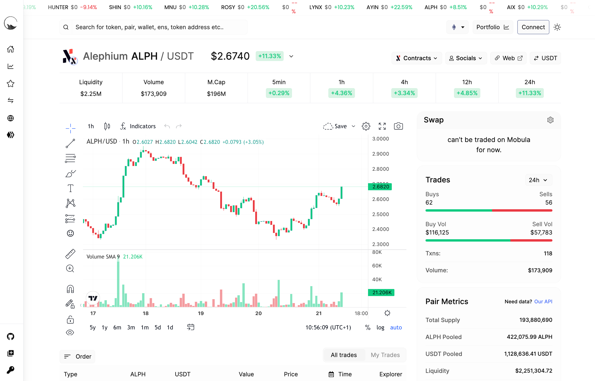

_Our ecosystem thrives with developers building amazing projects on top of Alephium, delivering a unique experience and providing real utility for users. In the Builders Highlight series, they share more about their projects, thoughts, and insights on why building on Alephium. You can find_ [#1 here](/news/post/builders-highlights-1-sezame-wallet-ddb4aeb61881)_,_ [#2 here](/news/post/builders-highlights-2-alphpaca-nfts-99c69775f04c), [#3 here](/news/post/builders-highlight-3-ayin-6be4a6bd4ec2), [#4 here](/news/post/builders-highlight-4-no-trust-verify-9ea495ca826f), [#5 here](/news/post/builders-highlight-5-deadrare-d5ff90d6161e), [#6 here](/news/post/builders-highlight-6-what-the-duck-0aedc602ecfd), [#7 here](/news/post/builders-highlight-7-alphpad-bbd4f4a34fd5), _and_ [#8 here](/news/post/builders-highlight-8-ngu-money-f8bf05e36e99)_!_

This episode is about Mobula, a multichain DeFi Dashboard that integrated Alephium and our ecosystem? Here, they share some insights into their way of thinking, their relationship with Alephiumm and their plans for the future.

#### Where are you based?

We are based in France, more specifically in Toulouse, the city of aeronautics and space.

#### What is it you do? (as a job, as a hobby, or in general!)

I generally dedicate my days and nights to building and leading Mobula, learning more about blockchain technology, and improving my coding skills.

#### How did “[Mobula.io](http://mobula.io/)” come to be?

Mobula was established in the last quarter of 2022 after noticing discrepancies between the asset values listed by CMC and CG and their actual values on the blockchains. To share real values on our app, we developed specialized tools and accumulated extensive know-how for data collection. As other projects and companies expressed interest in this data, we decided to offer it through our APIs.

#### How long did it take you & what motivated you to do it?

It still consumes significant time as Mobula has much room for improvement. We’re continuously developing solutions to provide access to various blockchain data types. My motivation is driven by the absence of a company offering developers direct access to data from multiple blockchains.

#### Where does the name come from?

I was seeking a cool, sea-inspired name due to my passion for the ocean and whales. While watching a documentary, I found “Mobula”. Mobula refers to the mobula ray, a species similar to the manta ray.

#### What is Mobula’s target audience?

Mobula targets all developers and companies requiring API solutions to access any blockchain data.

#### How do you choose which chains to integrate?

Our goal is to integrate all existing blockchains without selective preference, remaining open to collaboration with any blockchain.

#### How did you encounter Alephium?

A close friend introduced me to the project, suggesting it would be beneficial to develop a data infrastructure for Alephium.

#### Is there something specific that caught your interest?

What caught my interest was Alephium’s transaction capacity per second, making it exceptionally fast. Moreover, it achieves this in an environmentally friendly manner.

#### How did you find the interaction with the community & the ecosystem so far?

The Alephium community is very welcoming, and it’s gratifying that members appreciate our work.

#### How has the integration process been?

The integration process was remarkably smooth. We managed to integrate the core protocol within just two days, followed by a few days dedicated to indexing. It was an impressively efficient and seamless process.

#### How did you find the devX on Alephium?

We’ve found the development experience on Alephium engaging and have provided ample feedback to the team. The core protocol design intrigues us with its fascinating aspects.

#### Was the community helpful?

The community was very supportive, and their reports helped us quickly identify and address areas for improvement.

#### What upcoming features/chains on your project are you the most excited about?

We’re eager to finalize the portfolio tracking!

#### What’s your roadmap? Do you have future plans regarding Alephium?

Yes, our roadmap includes deeper integration with the Alephium ecosystem, focusing on improving product connectivity and adding data dashboards and tracking features.

#### What’s your view on the ecosystem growth and evolution of the past few months?

Alephium’s recent boom allows entities like Mobula to focus on developing solutions for its products, which is quite exciting.

#### What are you looking forward to the most in Alephium?

Data warehousing will likely encourage more teams to engage with Alephium, offering them a clear insight into the chain’s functionality.

#### Where can we stay in touch with your project & with you? (Twitter, Reddit, Discord etc.)

You’ll be welcome to join our:

Discord: [https://discord.gg/JVT7xKm3AD](https://discord.gg/JVT7xKm3AD)

Twitter: [https://x.com/Mobulaio](https://x.com/Mobulaio)

Telegram: [https://t.me/MobulaFi](https://t.me/MobulaFi)

#### Anything else you’d want to add?

Mobula is looking to recruit three to five developers. If you would like to join the team or suggest developers who could add value to Mobula, please contact Sacha at [contact@mobulalabs.org](mailto:contact@mobulalabs.org) or [https://t.me/NBMSacha](https://t.me/NBMSacha).

Thank you, Mobula team, for your answers! Alephium is thrilled to have such ambitious builders in the community! You can find the Mobula official site [here](http://mobula.io), and we wish Mobula fruitful ventures ahead!

---

_Disclaimer: While Alephium is happy to support a growing developer community, it would like to clarify that it does not endorse, audit, or review any software presented in this series and encourages all users to make informed decisions and take personal responsibility for their actions._

Have you built something or have a nice idea and want to request a grant or reward? You can access the [Alephium Community Grants &amp; Reward Program page](https://github.com/alephium/community/blob/master/Grant%26RewardProgram.md) for more info!

If you need help or have extra questions, you are welcome to reach out in the \# 🎨dev-dapp channel on [Discord](/discord), or in the Alephium [Telegram](https://t.me/alephiumgroup) channel. Don’t forget to follow [@alephium on Twitter](https://twitter.com/alephium) to stay up-to-date.
