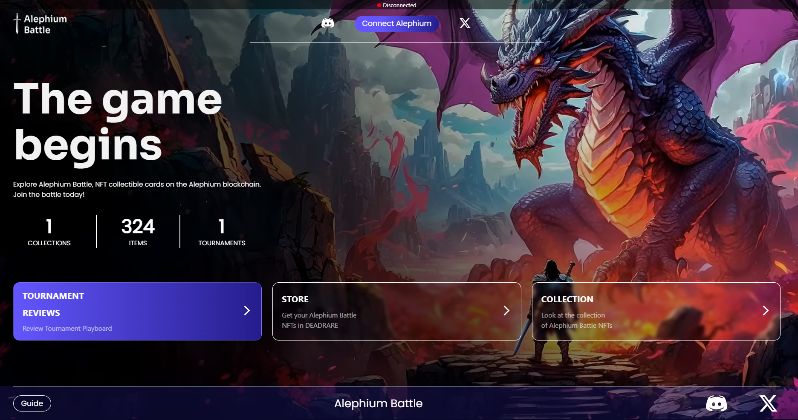
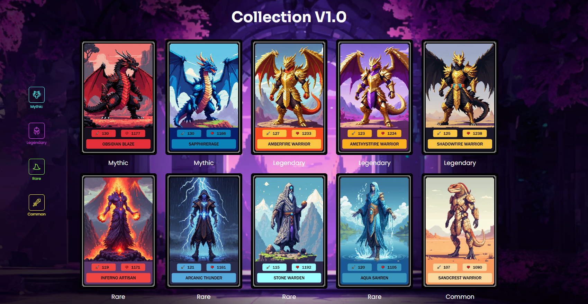
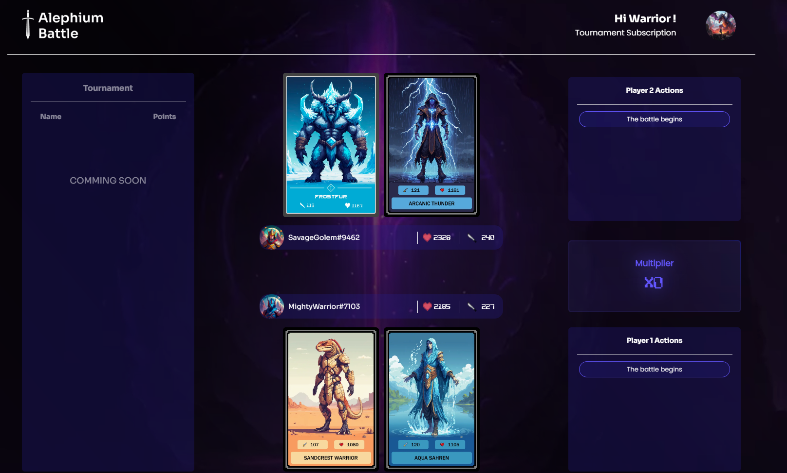

_This interview was conducted around the Athens Builders Meetup, which took place at the end of June 2024. If you’re just discovering Alephium’s ecosystem, it’s a great way to learn about all the main projects!_

Here, development team members Lorenzo and Eduardo discuss their backgrounds in tech and crypto, their passion for gaming, and the inspiration behind their project, <a href="https://alephium-battle.vercel.app/" >Alephium Battle</a>. They share insights on the game’s development, the success of their first tournament, and their plans for future updates.

If you prefer reading, find the full (slightly edited) transcript below.

`video: https://www.youtube.com/watch?v=ULxQ5oputqs`

#### Can you introduce yourself?

**Lorenzo:** I’m Lorenzo, a software developer with about five to six years of experience in web development, animation, and design. Recently, my team and I have been exploring the blockchain ecosystem, trying to expand our knowledge and do some interesting work in this space.

**Eduardo:** Sure! I’m Eduardo, and I’m from Argentina. In our team, I’m the “crypto guy.” I started out in Ethereum mining and got really interested in smart contracts along the way.

#### What’s your background in tech?

**Lorenzo:** My background is mainly in web development, animation, and design. I’ve worked in these fields for a few years now. Lately, though, I’ve been really interested in blockchain, so my team and I decided to dive into that and see how we can contribute.

**Eduardo:** I got into crypto around 2018, right before COVID hit. I started with Ethereum, mostly focusing on mining and learning about smart contracts. When Ethereum began moving towards proof of stake, I discovered Alephium, and I was really impressed by how quickly they were developing their smart contracts.

#### Are you a gamer?

**Lorenzo:** Absolutely. I play a lot of games — League of Legends, Counter-Strike, Fortnite, and card games like Trio Pokémon. Gaming has always been a big part of my life.

**Eduardo:** Yeah, I’m into gaming too. I play a variety of games, including Marvel Snap and Hearthstone. I find it really interesting how games combine strategy and fun, which is something we’re trying to incorporate into our own project.

#### What inspired you to create Alephium Battle?

**Lorenzo:** The idea for Alephium Battle didn’t come from just one game. We took elements from several games we love. For example, the rune system in League of Legends really influenced how we designed the strategic parts of our game. We wanted to create something that blends the best features from different sources into a unique card game experience.

#### Can you tell us what Alephium Battle is?

**Eduardo:** Alephium Battle is a card game where you build your deck, and then it plays automatically during battles. It’s all about strategy — planning your deck and seeing how it performs in the game. It’s a pre-battle strategy game that really focuses on how well you prepare.

#### How did you come up with the idea for the game?

**Lorenzo:** We didn’t follow a single inspiration. Instead, we drew from various games. For instance, we were inspired by the rune system in League of Legends, which adds a strategic layer to the gameplay. We’re taking bits and pieces from different games and creating something new and exciting with Alephium Battle.

#### How did the first tournament for Alephium Battle go?

**Eduardo:** The first tournament was great! We had 27 participants, which was a solid turnout for an early-stage game. The feedback was really positive, especially about the UI and animations. The finals and semi-finals were particularly fun, and it was awesome to see the community so engaged.

#### What are your next steps in developing the game?

**Lorenzo:** Our next step is to add attachments to characters, which will allow for ability and stat upgrades — kind of like the rune system in League of Legends. We’re starting with basic gameplay and then planning to enhance it over time, especially based on the feedback we get from the community.

#### How was your experience at the Athens meetup?

**Eduardo:** The Athens meetup was fantastic. Initially, it felt a bit strange because I only knew most people from Discord, but once I got there, the vibe was incredible. Everyone was really nice, and it was cool to finally meet the team and other community members in person. Travelling all the way there was definitely worth it.

#### What are your future plans for the game?

**Lorenzo:** We plan to keep improving Alephium Battle by releasing new features each month. Our goal is to keep the community engaged and to constantly gather feedback so we can make the game even better. We’re excited about the future and can’t wait to see how the game evolves with the community’s input.

---

**Links:**  
Website: <a href="https://alephium-battle.vercel.app/"  rel="nofollow noopener">https://alephium-battle.vercel.app/</a>  
Twitter: <a href="https://twitter.com/AlephiumBattle"  rel="nofollow noopener">https://twitter.com/AlephiumBattle</a>  
Discord: <a href="https://discord.gg/YGW9BJZYmB"  rel="nofollow noopener">https://discord.gg/YGW9BJZYmB</a>

---

For any questions or feedback, reach out to us on [Discord](/discord) or <a href="https://t.me/alephiumgroup" >Telegram</a>, and follow <a href="https://x.com/alephium" >@alephium on Twitter</a> for the latest updates!
