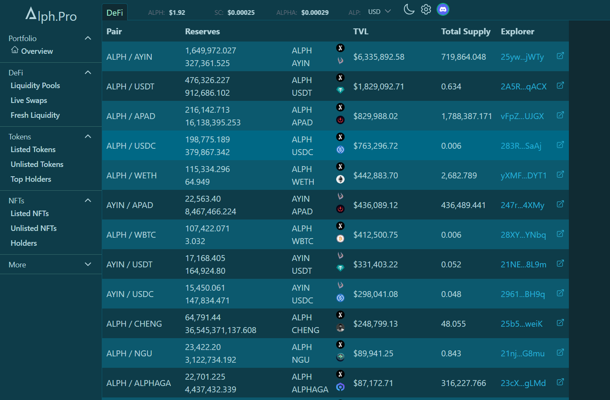
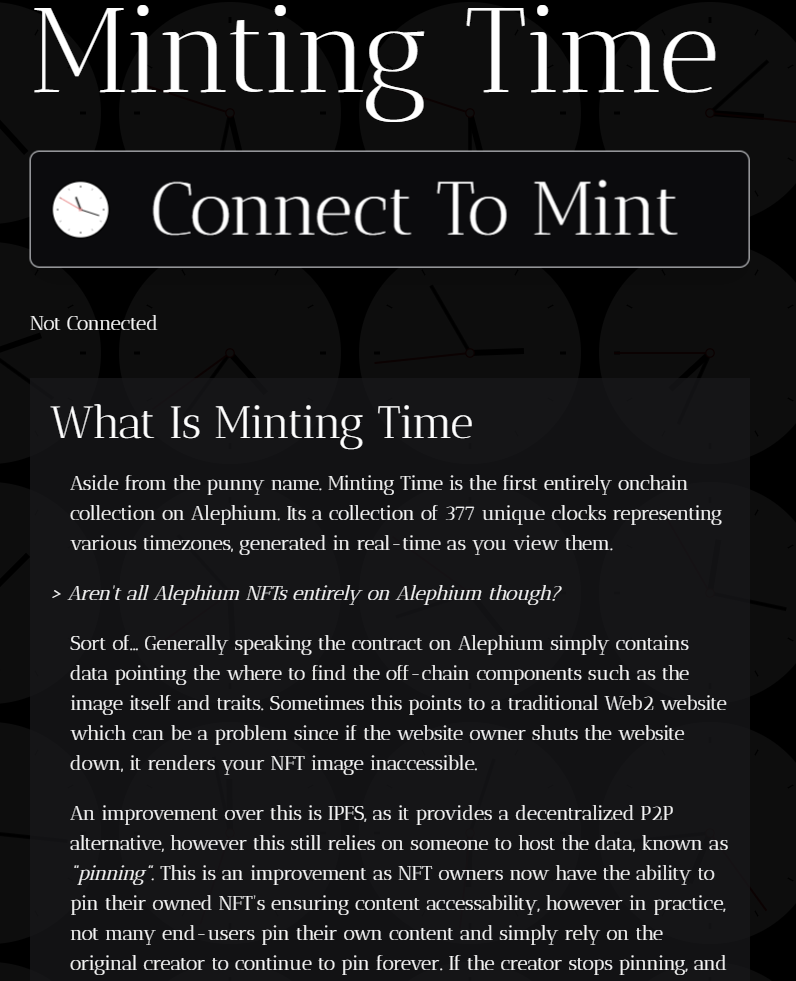

_This interview was conducted around the Athens Builders Meetup, which took place at the end of June 2024. If you’re just discovering Alephium’s ecosystem, it’s a great way to learn about all the main projects!_

Here, [Reed](https://x.com/0x_reed) shares his crypto journey, the experiments around NFTs and news about his projects deployed on Alephium. Here’s the full video interview. Find the full (slightly edited) transcript below if you prefer reading.

`video: https://www.youtube.com/watch?v=qcaY14_y7wI`

#### Hey Reed! It’s a pleasure to meet you in person finally!

I believe we’ve been interacting since I joined Alephium in November. And then I heard rumours about the bridge. It hadn’t been released yet, so I started off slow, exploring the place, and slowly began building more and more here.

#### Where did you come from? What’s your background?

Yeah, I’ve been following crypto for a long time. I think I first started playing with bitcoin around 2010. I was mining on my laptop, but never took it too seriously. I was always into the technical side and playing with it. Back then, I wasn’t even a developer yet, so I was just exploring and learning.

Later, I became a full-stack web developer, and then I re-found crypto after gaining some web development experience. Around 2020, I started becoming a crypto developer. I found the Fantom network, started on Ethereum, of course, but spent quite a bit of time there, building. I built a portfolio management dashboard, and it went quite well. Then, some friends who had started [Ayin](http://ayin.app) invited me to check out Alephium.

#### I didn’t know that! So you came in with a splash during the Hackaton, with [Alph.pro](http://alph.pro), right?

Yeah, that was the main piece. I realized my vision had different parts, so I modularized them into individual projects.

A Discord bot handles token prices and tipping, which is non-custodial. It integrates with your Alph wallet using WalletConnect behind the scenes. The indexer is easy to self-host and scans the node in the explorer. It has a plugin system, so you can write new plugins with about 50 to 100 lines of code to integrate new DEXs.

#### But actually, that wasn’t the first thing we knew you for. The first thing was [Shades of DeFi](https://deadrare.io/collection/shades-of-defi).

Yeah, that was my first project and collection. It inspired me to keep building on Alephium. Shades of DeFi was 32 items, just colour squares. I got the colours by taking common, iconic functions from EVM smart contracts and converting their hex values to colours. That’s where the Shades of DeFi colours came from.

#### I thought there was some kind of poetic value to the collection. And it came at the beginning of DeadRare. I saw it was the 9th collection on their dashboard. Then, there was the [snack vending machine during the hackathon](https://snacks.alph.pro/).

Oh, yeah. We were having open office calls, and a few of us joked about the lack of snacks. My friend [Rabtai](https://x.com/rabTAI) did the contract side, and I did the front end.

#### Is it still active?

Yeah, there are still some snacks available. I’ve tried to corner the market on beers.

#### So, you’re from Canada, right? And Rabtai too?

I’m not sure where Rabtai is from. We met on Discord while working on the Fantom network. After I settled, I hooked him up with Alephium.

#### So, you were working on a game after the ducks and the vending machine?

Yes, originally, What the Duck was just an NFT series, similar to Shades of DeFi. Then, people on Discord suggested turning it into a game. It’s called Quack Attack. You can log in as your duck, waddle around, and see everyone else. I’m remaking it with a more scalable architecture using Godot as the game engine.

#### So, you also released another NFT collection called [Minting Time](http://mintingti.me). It has the SVG on-chain and is animated.

Yes, Minting Time came from my work on Quack Attack and What the Duck. I’m researching dynamic on-chain NFTs. My goal with Quack Attack is to have a gamified, customizable system where you can collect items and equip them. Minting Time was a proof of concept for how I envision the game working.

#### But the main piece of your work is Alph.pro, correct?

Yes, Alph.pro and Quack Attack are my main projects. Alph.pro is more serious; people use it and find it valuable. Quack Attack is just for fun. We also released the BREAD token with Quack Attack. As I add more features, BREAD will be the platform's main game token.

#### For Alph.pro, you’ve started making people pay to use it, right?

Yes, I launched a subscription service. Most features are still free, but the paid version is five ALPH a month. You can prepay for up to six months. Eventually, I’ll turn the subscription into an NFT that you can trade.

#### Will you make the vending machine open-source?

It is already open source as part of the hackathon. All tokens are tradable on DeadRare automatically. You just need to sign up and register.

#### What can we expect in the next few weeks?

There will be Alph.pro updates and bug fixes. I need to re-index some plugins to get the data right. Aside from that, I’ll keep working on What the Duck and try to release something stable this year.

#### What has changed since you started building here?

When I first arrived, there weren’t many developers. We had a few projects like Ayin and DeadRare. But now there are collections every day, the community has grown, the documentation has improved, and the developer channel on Discord is lively. It feels very collaborative.

#### Did you enjoy the meetup?

It was awesome. I got to meet a lot of Discord usernames in person. There were lots of interesting talks, and it was really well done. It gave me a lot to think about.

#### Anything to add?

No, just glad to be here. Looking forward to the next one.

---
Links:

**Alph.pro**  
Website: [https://alph.pro/](https://alph.pro/)  
Twitter: [https://x.com/Alphdotpro](https://x.com/Alphdotpro)  
Discord: [https://discord.gg/pfcR8EQZjb](https://discord.gg/pfcR8EQZjb)

**What the Duck**  
Website: [https://theducklounge.com](https://theducklounge.com)  
Twitter: [https://x.com/alph_ducks](https://x.com/alph_ducks)

**Mintingti.me**  
Website: [https://mintingti.me/](https://mintingti.me/)  
Twitter: [https://x.com/0x_reed](https://x.com/0x_reed)

---

Reed was a speaker at the Athens Builders Meetup!

`video: https://www.youtube.com/watch?v=_eIxfM-O09Q`

You can also find all the talks of the Athens Builders Meetup [here](/news/post/all-the-athens-meetup-presentations-f419195640ce?source=user_profile---------0----------------------------).

---

For any questions or feedback, reach out to us on [Discord](/discord) or [Telegram](https://t.me/alephiumgroup), and follow [@alephium on Twitter](https://x.com/alephium) for the latest updates!
