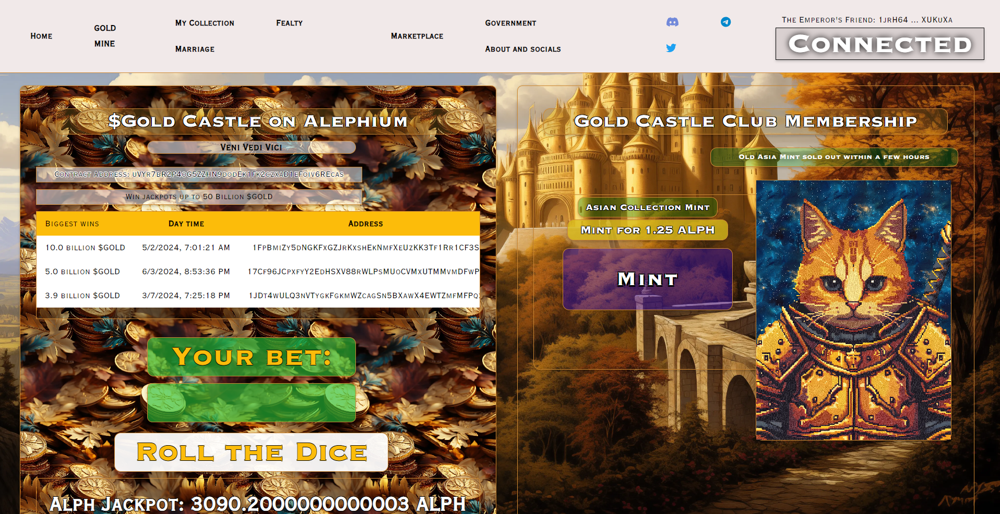
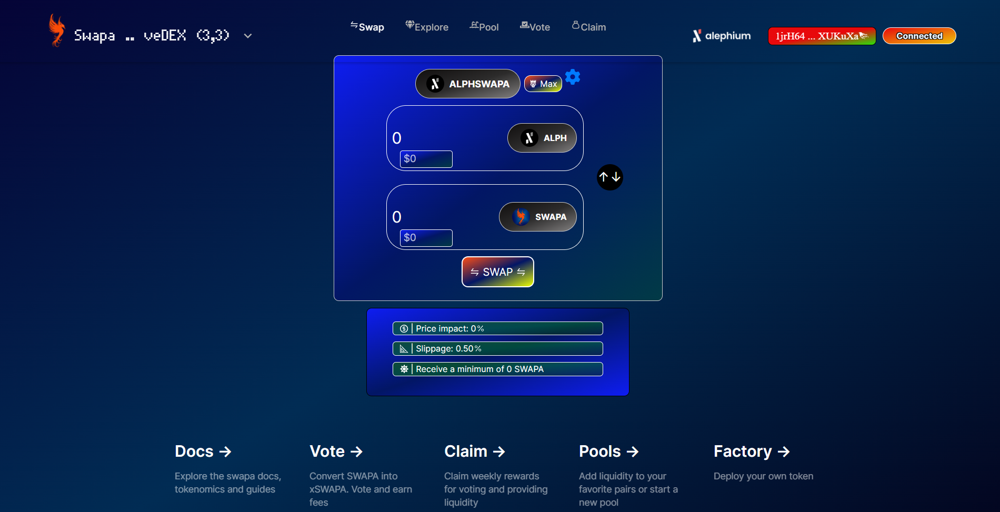

_This interview was conducted around the Athens Builders Meetup, which took place at the end of June 2024. If you’re just discovering Alephium’s ecosystem, it’s a great way to learn about all the main projects!_

Here, Esse shared his crypto journey, his excitement about Swapa, and the next steps for GoldCastleClub. Find the full (slightly edited) transcript below if you prefer reading.

`video: https://www.youtube.com/watch?v=NLVdO093DiA`

#### Can you tell us how you came to crypto and landed at Alephium?

I’ve been in crypto for a few years, initially as a regular user. I started with meme tokens and Bitcoin. At the end of last year, I wanted to build a game, which became Gold Castle Club. I first tried Solana, but had compatibility issues. Then I found Alephium, and everything went smoothly. The core devs on Discord were very helpful.

#### Did you learn how to code in the process?

Yes, I knew a little, but I learned a lot quickly with Gold Castle Club. <a href="https://docs.alephium.org/ralph" >Ralph</a>, the Alephium language is very good for beginners.

#### You started one ambitious project and then a second one, Swapa. How are you handling both?

I work for 14 hours a day. I think it’s good to live in extremes: work intensely for a month, then take a week or two off. It’s a lifestyle.

#### Can you tell us more about Gold Castle Club?

In Gold Castle Club, game elements are NFTs that interact with each other. You can combine NFTs to form stronger entities, like kingdoms, and battle each other to earn gold tokens.

#### How did you choose addresses for the airdrop?

I airdropped it to all addresses that have held or had held Ayin tokens since January.

#### What about the Dex project, Swapa?

Someone in the Discord suggested a “ve” DEX on Alephium, like Pancake Swap. I thought it was a good idea. After gaining experience with Gold Castle, I wanted a serious project for people who want to earn on Alephium.

#### Why “ve” (vote escrowed)?

“Ve” allows the distribution of emissions based on those who have a stake in the DEX. People who lock their Swapa can vote for pools, and liquidity providers can claim rewards without staking.

#### How do you see coexisting with other DEXs?

I don’t see Deadrare’s DEX (<a href="https://candyswap.gg/" >Candyswap</a>) as a competitor because it’s an order book DEX, and we’ll work in synergy. People will provide liquidity where they can get rewards, so tokenomics is crucial.

#### Will you incentivize token holders to vote for specific pools?

Yes, people can add bribes to any pool to incentivize voting. Swapa will add bribes to important pools initially.

#### When will it be out?

Hopefully, it will be within weeks. (Note: It is already <a href="https://x.com/alphswaps/status/1817568165242847704" >live on testnet</a>). We’re also contacting hongchao for contract audits.

#### Is there anything you need that you haven’t found yet? How can we support builders better?

Everything has been great so far. Some documentation needs to be more detailed, but getting answers from the community and core devs has been fantastic. The interactions in the [Discord dev channel](/discord) have been very helpful.

---

#### Links:

**Gold Castle Club  
**Website: <a href="https://goldcastle.club/"  rel="nofollow noopener noopener">https://goldcastle.club/</a>  
Twitter: <a href="https://x.com/GoldCastleClub"  rel="nofollow noopener noopener">https://x.com/GoldCastleClub</a>  
Telegram: <a href="https://t.me/goldcastleclub"  rel="nofollow noopener noopener">https://t.me/goldcastleclub</a>  
Discord: <a href="https://discord.gg/dtemyQ8wce"  rel="nofollow noopener noopener">https://discord.gg/dtemyQ8wce</a>

**Swapa**  
Website: <a href="https://swapa.exchange/"  rel="nofollow noopener noopener">https://swapa.exchange/</a>  
Twitter: <a href="https://x.com/alphswaps"  rel="nofollow noopener noopener">https://x.com/alphswaps</a>  
Telegram: <a href="https://t.co/hTmllPb8CU"  rel="noopener noreferrer nofollow noopener noopener">https://t.me/swapadex</a>  
Discord: <a href="https://t.co/S3cCZXWfwP"  rel="noopener noreferrer nofollow noopener noopener">discord.gg/6zEezaNyND</a>

---

For any questions or feedback, reach out to us on [Discord](/discord) or <a href="https://t.me/alephiumgroup"  rel="noopener ugc nofollow noopener noopener noopener noopener">Telegram</a>, and follow <a href="https://x.com/alephium"  rel="noopener ugc nofollow noopener noopener noopener noopener">@alephium on Twitter</a> for the latest updates!
