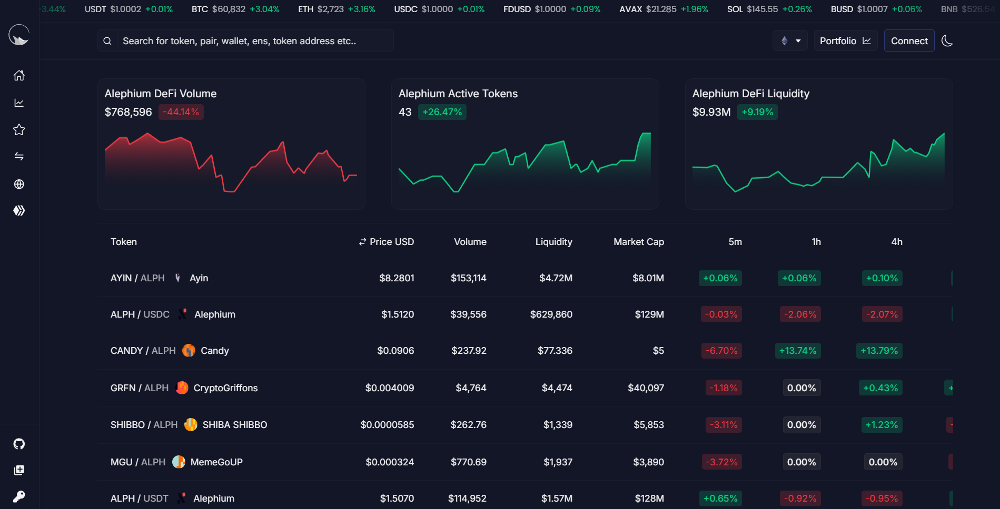
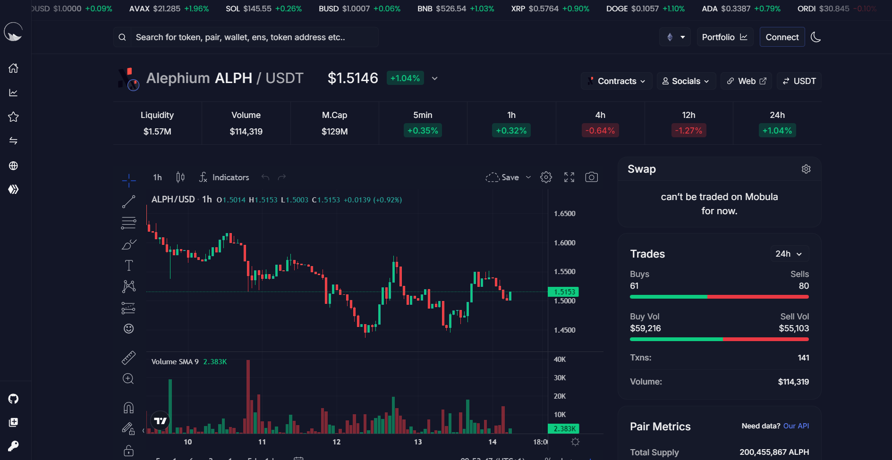

_This interview was conducted around the Athens Builders Meetup, which took place at the end of June 2024. If you’re just discovering Alephium’s ecosystem, it’s a great way to learn about all the main projects!_

Here, we have a conversation with Teo & Sacha & about <a href="http://mobula.io" >Mobula</a>, a data product that integrates various chains, including Alephium. Find the full (slightly edited) transcript below if you prefer reading!

`video: https://www.youtube.com/watch?v=JkHRwwAn-II`

#### Hi, I’m really happy to have you guys from Mobula. You’ve integrated Alephium into your data product. Your product is similar to Coingecko but covers many more chains. So, welcome!

Thanks for having us.

#### Can you tell us a little bit about yourselves and your journey in crypto? What’s Mobula, and where do you come from?

We’ve been in crypto for a while now. We started on the tech side. I got into it by working on freelance projects during the last bull market. People would hire me to build Telegram bots for fetching crypto prices. That’s how I learned to fetch crypto prices from DeFi, which led me to blockchain technology. I also started investing.

We launched our first product back then, Stay Safu. It’s a token security scanner that gives you a security score when you input an ERC-20 token.

Now, two years later, we are building Mobula, which is essentially a full-stack data infrastructure. We provide real-time APIs for market data, as you mentioned, wallet data, and an indexing framework for app developers. We also offer a data warehouse where you can write SQL queries to get information on the chain state and build dashboards.

Our vision is to bring great data tools to non-EVM chains, similar to what Dune and The Graph offer for EVM chains. We want to design a product that is chain-agnostic so we can apply these great tools to as many chains as possible.

#### That sounds cool. Can you tell us a bit about the company?

The company is two years old now. We raised a \$1 million seed round last year. Currently, we have seven people on our team, all engineers, and we are actively hiring.

Our customer base includes multiple oracles like Chainlink and Supra, as well as 200 enterprises using us in production now.

#### So you work with a few hundred companies?

We have a few hundred companies using our API.

#### That’s awesome. Do you work with all the big oracles?

Not all the big ones. For example, we don’t work with Pyth yet. But hopefully, that will change soon. We do have Chainlink and Supra as partners, and we hope to partner with other major oracles soon.

#### So, I’m going to ask you a question that combines two topics. I know the answer, but I still want to ask: how did you find out about Alephium?

Actually, one of the leading investors in our round, Sam from Cetacean Capital, who is also an investor in Alephium, made the connection between us. It was a clear fit because Alephium didn’t have any data infrastructure at the time, which is where we could add value and maximize our output. It was a great opportunity for both parties.

#### When we talked before, you mentioned that Alephium was the first non-EVM chain you integrated. Was it challenging?

Actually, not too much. The JSON RPC APIs are quite similar to those of EVM chains. There is great consistency, and it’s not as different as other chains like Solana or stateless chains. It was a super interesting exercise, definitely challenging but not too difficult.

#### Now you’re integrating other non-EVM chains. What’s your take on the different chains and their tooling and languages?

Having integrated several non-EVM chains, I think Alephium stands out for its unique features. Alephium’s use of Proof of Work and sharding are notable differentiators. While sharding isn’t commonly implemented, it provides a real competitive edge. Many new ecosystems are quite similar, often forks of each other. Alephium’s uniqueness offers a significant advantage in the market.

#### So, what’s your goal for the next three years? Where do you see Mobula in two years?

Our goal is to replace current data infrastructure solutions like Dune with an open-source alternative that is available on more chains. We aim to offer comprehensive data warehousing and real-time APIs. The vision is to create a product that is competitive and open, allowing any ecosystem to build on it and gain market share by being the first to move in new ecosystems while providing industry-leading coverage.

I really believe that we are moving towards a world with 1,000 or even 1 million chains. Modular solutions and open access will be essential, and we aim to provide that.

#### We’ve always believed in a multi-chain world, so we think you’re helping to make sense of it. Last question: you’ve been here for a day and a half and met many builders working on Alephium. What are your thoughts on this burgeoning ecosystem?

I was quite surprised by the quality of the people here. It’s very tech-focused, with a strong emphasis on building great products and delivering value. This level of focus and talent is quite rare in the blockchain space. It feels very genuine and intentional, and the technical expertise is impressive. My view of the Alephium ecosystem has improved significantly.

#### That’s great to hear. So, will you come back next year?

Of course, if we’re invited.😉

#### Thank you!

---

#### Links

Twitter — <a href="https://x.com/Mobulaio"  rel="nofollow noopener noopener">https://x.com/Mobulaio</a>  
Website — <a href="https://mobula.io/" >https://mobula.io/</a>   
Discord — <a href="https://discord.com/invite/2a8hqNzkzN" >https://discord.com/invite/2a8hqNzkzN</a>   
Telegram — <a href="https://t.me/MobulaFi" >https://t.me/MobulaFi</a>

---

Mobula’s founder gave a fantastic talk in our first Athens Builders Meetup!

`video: https://www.youtube.com/watch?v=YdPTqEx8sZQ`

You can also find all the talks of the Athens Builders Meetup <a href="/news/post/all-the-athens-meetup-presentations-f419195640ce?source=user_profile---------0----------------------------" >here</a>.

---

For any questions or feedback, reach out to us on [Discord](/discord) or <a href="https://t.me/alephiumgroup" >Telegram</a>, and follow <a href="https://x.com/alephium" >@alephium on Twitter</a> for the latest updates!
