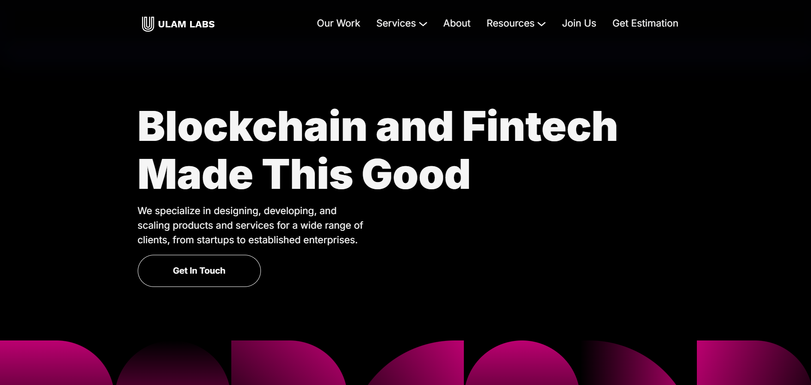
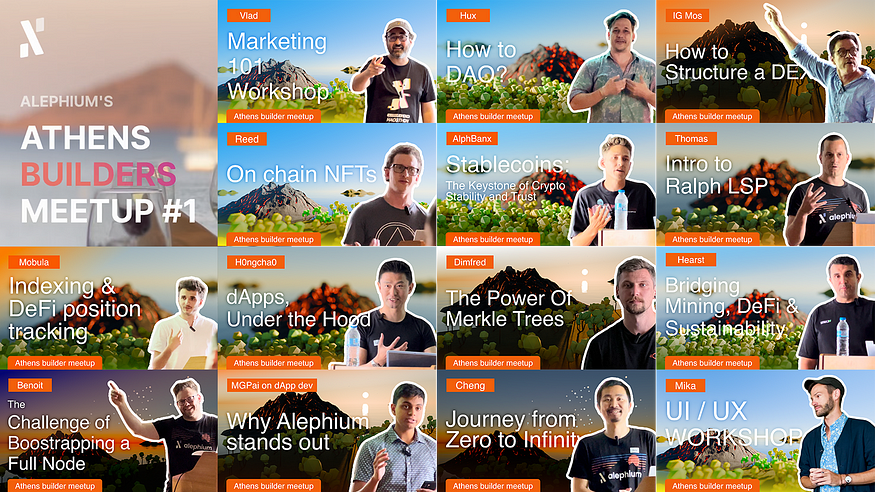

_This interview was conducted around the Athens Builders Meetup, which took place at the end of June 2024. If you’re just discovering Alephium’s ecosystem, it’s a great way to learn about all the main projects!_

Here, we have a conversation with with Lukasz about [Ulam Labs](https://ulam.io/), a company devoted to full-cycle software development, focusing on fintech and which started offering an auditing service to Alephium projects. Find the full (slightly edited) transcript below if you prefer reading.

`video: https://www.youtube.com/watch?v=F2iH-M23CHE`

#### Hi, Lukasz. How are you? It’s good to have you with us for the interview.

Nice to meet you again.

#### We didn’t have time to interview everyone at the Builders meetup, so now we’re catching up with the projects we missed. Can you tell us a bit about yourself? What’s your background, what do you do, and what is your crypto journey? How did you first get into crypto?

I’m now a big blockchain enthusiast, but it wasn’t always this way. In 2017, I got really into blockchain. I started with Ethereum because it was the first place where you could do smart contracts. That was very exciting to me. I got into programming on the blockchain by hacking into it. There was an interesting game called [Capture the Ether](https://capturetheether.com/). You’d get these smart contracts and have to hack them. It was awesome. You had to steal the ETH inside the smart contract. The puzzles were crazy, and it got me into cybersecurity. Now I’ve been working on smart contracts at Ulam Labs for the past three years.

#### Did you already have a background in computer science, or did you just start geeking out and hacking?

Hacking was my own hobby, but I studied computer science at university. So, a bit of both.

#### Perfect, a strong basis. So, you got into crypto, Ethereum, hacking. How did you get to Alephium?

It’s been a journey, but here we are. It wasn’t that long ago. At our company, we’ve been looking into different interesting projects like Casper and AlephZero. We did some hackathons with them. We were looking into smaller, interesting projects. Alephium was one of those innovative ones we came across. Now, after seeing all the builders in Greece, I’m even more excited about Alephium.

#### That’s cool. We got even more excited after seeing people in real life. You also told me you have been building DEXs. Can you elaborate on that?

Sure. My second project at Ulam Labs was an exchange built on Algorand called Pact. It’s still operating today with zero hacks and 20 million TVL. We did a full proper exchange with statistics, farming, everything. We added concentrated liquidity, like the stable swap version. I think it’s the best cryptocurrency exchange on Algorand. It’s a niche blockchain, but we’ve made some innovations. We helped the foundation build additional opcodes into their AVM, get on Ledger, and worked a lot with the foundation itself.

#### Interesting. So, you built it for someone else, or you built and operated it?

We built it for our client, the [Pact exchange](https://www.pact.fi/).

#### Ulam Labs is the company built around you. Do you have co-founders and other people in the company?

Yes. In our company, we mostly build software and do audits. Those are our main two things.

#### So, you’ve always been about auditing while building? How did you go from hacking to auditing? In a way, it makes sense, right?

Yes, it does. But I feel I’m much more of a builder. I like designing creative algorithms and creating architecture for new systems. Then, I audit them. My track record has been clean, with no hacks on my smart contracts, so I’m happy to have this background in security as well.

It would be an interesting exercise to have puzzle smart contracts on Alephium with a prize. I could talk about that with the DAO.

#### I think that would be very cool. Maybe we could get a lot of people interested. I like it. Would you be okay with me talking about this idea to the BlockFlow DAO?

Yes, of course! I would love to see this idea come to life.

#### Great! You’ve announced that you were auditing projects on Alephium a couple of months ago. Can you tell us how many projects you’ve audited or will be auditing since then?

I can’t tell you that, but we’ve had one very big project audited.

#### That was public, right?

Yes, that was Ayin, the first DEX on Alephium.

#### How do you view your relationship with clients when auditing? Auditing in the crypto space has always been complicated, like with CertiK. Do you see your responsibility over time, like you audit once and then keep looking at stuff, or how do you work?

I did a presentation at the European Blockchain Convention about the perfect strategy for keeping your smart contract safe. With audits, the idea is to have a well-thought-out smart contract with built-in invariance and documentation. If your software is well-built, it makes sense to audit it. Some companies like CertiK do automated audits, but we look at the code, make different assumptions, find edge cases, and work as human auditors. We don’t do automated auditing, and I think this is much better. We’ve found a lot of high or critical vulnerabilities over the past few years, even in big projects on Solana. People need to be aware that audits are necessary.

#### In audits, do you focus on the technical aspects or also on economic attacks?

It depends. Some economic attacks require well-researched papers to identify. We focus mostly on the technical aspect, but are aware of obvious or well-documented economic attacks. For example, recent papers on oracle manipulation swaps have revealed things that weren’t obvious and required thorough research.

#### I was thinking about the Kyberswap attack with manipulation of liquidity in a tight range. Do you look at things like this? For you as an auditor, is there a difference between auditing a DEX and a gaming protocol?

From a technical side, the software category doesn’t matter. Some categories are more vulnerable to different kinds of attacks. The more complex your app, the more attack surface there is. The more documentation you have, the easier it is to ensure everything works as it should. The code quality and type play smaller roles. Whether it’s a gambling platform or something simple, it needs to be checked.

#### What about the language? In the case of Alephium, it’s Ralph, a language Alephium introduced. You’ve had experience with a wide range of languages, so what do you think about Ralph? How does it optimize security and help developers make fewer mistakes?

In the past, I’ve seen many programming languages like MOVE and those on Algorand, and of course, Ethereum with the EVM and Solidity. I’m very happy with [Ralph](https://docs.alephium.org/ralph/) because it’s an evolution, not a complete revolution. It’s the next step with asset management and UTXOs. It does its job well without making development unnecessarily hard. Some languages limit you for safety, leading to workarounds that make things worse.

#### There’s a cartoon from XKCD showing the whole stack held by one tiny speck. It’s good to hear that Alephium’s design is pragmatic, allowing people to do things without reinventing the wheel.

The stateful UTXO model offers interesting security ideas. For example, you control your own assets, so ERC 20 tokens being hacked isn’t an issue. Tokens are in people’s wallets. There is no reentrancy, which is amazing. There are no flash loans, which is a bit sad, but from a security standpoint, it’s great.

#### It’s a design choice, right?

Yes, exactly.

#### You said you’re a builder. Do you plan on building something?

It’s a bit of a secret right now, but I’ll be building something on Alephium starting today. I can’t say what it is yet.

#### That’s exciting to hear. People are building a lot of stuff now, and that’s great. What was your impression of the first builders’ meetup in Athens?

The people there were amazing. [Meeting different builders](/news/post/all-the-athens-meetup-presentations-f419195640ce) in person gave a completely different feeling. Seeing the faces behind the projects gave a different vibe than just using the app or chatting on Discord.

#### It was special for us too. Can I ask you a last question? Your username on Discord is Carlos Matos. Can you say what inspired that choice?

Carlos Matos had the greatest energy. Since then, no one has matched this energy. When I had to change my Discord handle, I saw that Carlos Matos wasn’t taken, so I wanted it.

#### That’s very good thinking. My username is common, so I have to deal with multiple numbers. I commend you for that choice. Is there anything else you want to add? Are there any surprise items on your roadmap that you haven’t discussed?

If you need audits, I know a great place to find them. I’m really looking forward to the project I’m working on right now. It will be very exciting for everyone on Alephium.

#### Now you’re teasing hard. Can you at least tell us the timing? Is it end of the year or sooner?

It’s sooner. 😉

#### Nice. We’ll be looking forward to it!

---

#### Links

Twitter — [https://x.com/ulamlabs](https://x.com/ulamlabs)  
Website — [https://ulam.io/](https://ulam.io/)

---

For any questions or feedback, reach out to us on [Discord](/discord) or [Telegram](https://t.me/alephiumgroup), and follow [@alephium on Twitter](https://x.com/alephium) for the latest updates!
