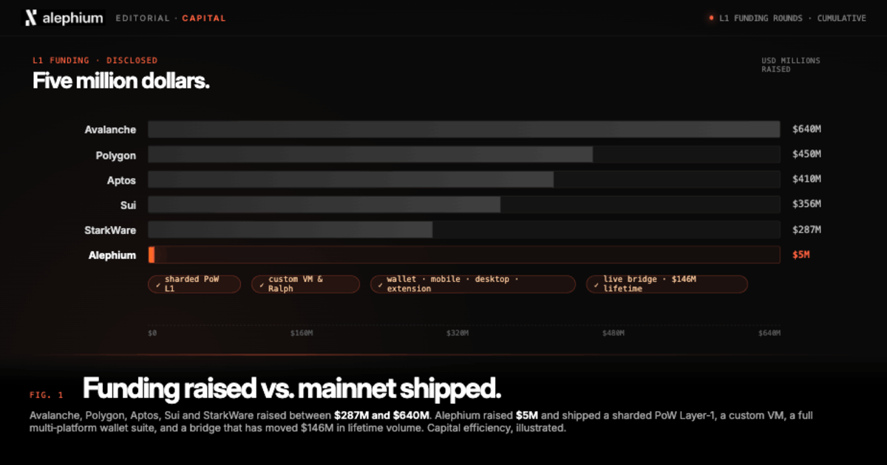
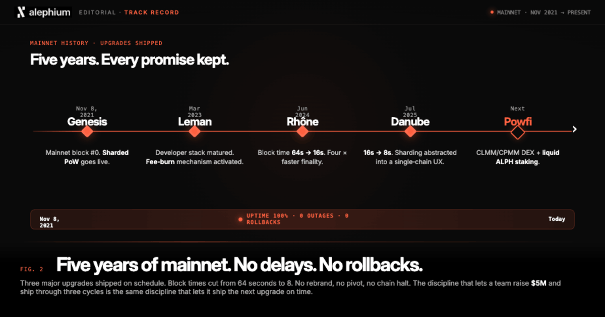
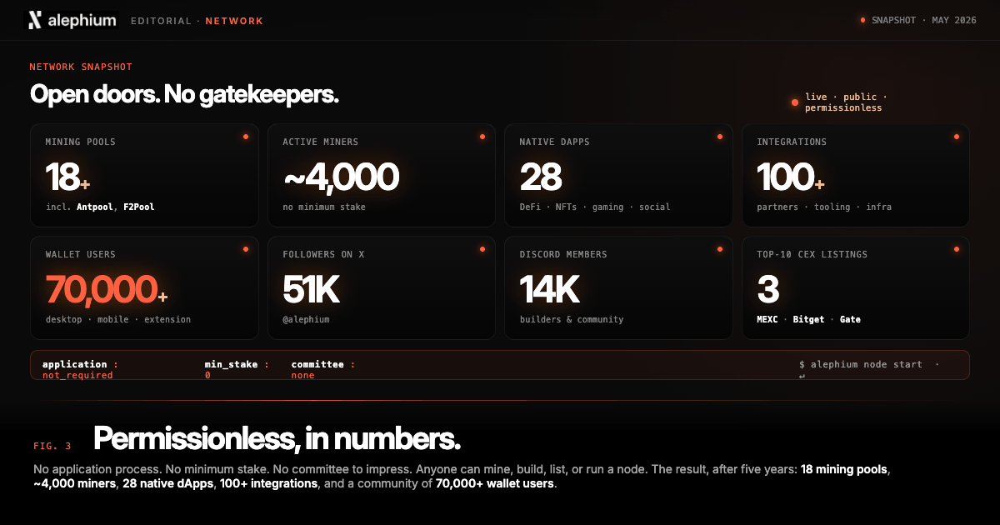

**Column by Pepper, Head of Marketing & Growth**

*Views are that of the writer and may not reflect the official stance of Alephium.*

- - -

* Five million dollars. 
* Five years. 
* Zero outages. 
* No hedge fund money.
* No validator cartels.
* No permission required. 

**These Alephium facts represent what it looks like when a blockchain and its team actually believes what it builds.** 

Satoshi Nakamoto did not write the Bitcoin whitepaper for hedge funds (quite the opposite, really). He wrote it in October 2008, weeks after Lehman Brothers collapsed and the global financial system revealed just how much contempt it had for the people it was supposed to serve. 

Bitcoin’s whitepaper was a response to this moral failure, and it led to a system that nobody could control, nobody could shut down, and nobody needed permission to use. It was not a business plan, as some still believe.

That founding conviction, at some point, has a way of getting diluted. Somewhere between the venture rounds and the validator incentive programmes and the governance forums (where the loudest voices happen to be the biggest whales), the original argument started to sound quaint. 

Crypto “grew up”, put on a suit, and learned to talk to institutions.

**Alephium did not do that.** 

This is a column about what happens when a team builds as if the whitepaper still means something (it means everything).

## What Five Million Dollars Actually Builds

The figures are worth sitting with for a moment. Avalanche raised over $640 million. Polygon raised $450 million. Aptos raised $410 million. Sui raised $356 million. StarkWare raised $287 million…

**Alephium raised $5 million**, and with it, shipped a sharded proof-of-work Layer 1 with a custom virtual machine, a full wallet suite across mobile, desktop, and browser extension, and a live bridge that has processed over $146 million in lifetime volume.

My comparison is not about embarrassing well-funded competitors. I’m much more interested in what the funding model reveals. 

When you have raised hundreds of millions, you are accountable to the people who gave you that money, and those people have a timeline, a return expectation, and a risk profile that shapes every decision you make.

When you have raised $5 million and you are building because you genuinely believe in what you are building, the decisions look different. Maybe they are leaner, likely more deliberate, and certainly less willing to ship the wrong thing because the runway demands it.

Capital efficiency is all the evidence you need to prove a set of robust priorities.

## Five Years. Every Promise Kept.

Alephium's mainnet went live on November 8, 2021 and it has not gone down since. Not for a block or a single minute.

In the time since block genesis, the team has shipped three major upgrades:

1. The Leman upgrade in March 2023 matured the developer stack and activated the protocol's fee burn mechanism. 
2. The Rhône upgrade in June 2024 dropped block times from 64 seconds to 16. 
3. The Danube upgrade in July 2025 halved them again to 8 seconds and abstracted sharding into a single-chain experience that no longer requires a technical manual to navigate.

Every release shipped on schedule, with no delays, no rollbacks, no pivots, and no rebrand. 

This is the result of a team that has always known its building objectives, principles and purpose, and did not jump ship when the market moved in a different direction (mainly towards EVM chains). 

They’ve ignored the bandwagons, fads, hype cycles, quarterly trends, and whatever else crypto and Web3 threw at them. I’m convinced that this kind of discipline only comes from years of rock solid conviction and consistency.

Soon, Alephium will ship [Powfi](http://powfi.alephium.org), a CLMM/CPMM DEX, along with liquid $ALPH staking. This will be the latest, and perhaps most highly anticipated release from the core development team.

## Security Is Not a Service You Buy

As I talked about in the first episode of [Alephium Aware](https://x.com/alephium/status/2052010497378292050), close to a billion dollars was lost to exploits in the first four months of 2026. Reentrancy attacks, unlimited token approvals, bridge failures, oracle manipulation. These same weaknesses have been turning up in the same postmortems, year after year, with the same promises (often in a poxy little X post) that next time will be different.

I’m telling you now, next time will not be different, because the architecture will not have changed. We know these are not edge cases or unpredictable failures, but the logical consequences of building on a foundation that was never designed to be safe. An audit can find a bug, but it cannot fix a design.

### The sUTXO Solution

Alephium's Stateful UTXO model approaches this differently. Reentrancy is impossible by design because assets are consumed and recreated atomically, with no re-entry point. Unlimited token approvals are structurally impossible because the Asset Permission System scopes approvals at the function level only. Flash loans are economically impractical because complex operations require sequential transactions. MEV-aware architecture makes intra-block price manipulation economically unfavourable.

**Security is in the language, not the audit**, which matters enormously when AI scanners can read every line of code instantly and chain small weaknesses into large exploits at a speed no human auditor can match. A structurally unsafe stack is now a systematically exploitable one, and the window for getting away with "we'll audit it" is closing fast.

## Open Doors. No Gatekeepers.

Anyone can run an Alephium node. There is no application process, no minimum stake, and no committee to impress. The network has over 18 active mining pools, including Antpool and F2Pool, approximately 4,000 active miners, and 28 native dApps live on mainnet across DeFi, NFTs, gaming, and social, with over 100 total integrations and partners. The community sits at over 70,000 wallet users, with 51,000 on X, and nearly 14,000 on Discord. We are listed on MEXC, Bitget, and Gate, three of the world’s 10 biggest CEXs. 

Is Alephium a sleeping giant? *I think so.*

By the way, none of this required a gated validator set or institutional permission. None of it happened because a foundation decided who was allowed to participate.

I’m convinced that this matters as a philosophical property. You cannot build permissionless finance on infrastructure that requires permission to use, right? The industry has spent years pretending otherwise while gradually centralising the things that were supposed to be decentralised. 

* Governance captured by early investors. 
* Validator sets controlled by a handful of entities.
* Nodes that require resources most people simply don’t have.

Proof-of-Work, run honestly, resists all that. It is not elegant and it is not fashionable, but it delivers something that Proof-of-Stake architectures have consistently struggled to deliver at scale, which is a network where no small group of people holds the ability to turn it off.

Satoshi understood this. The choice of proof-of-work was not arbitrary. It was the mechanism that made the whole thing mean something, and it’s still fundamental to Alephium and our mission.

## The Rails Are Laid

The cypherpunk values embedded in the Bitcoin whitepaper are far from nostalgic. They are the spec, a system open to everyone, owned by no one, secure by design, and built by people who would rather ship the right thing slowly than ship the wrong thing fast (btw, thanks to those who patiently read this article all the way through).

I recently said that all of the pieces required for the future of DeFi exist here on this change - some viewers picked up on that, and it remains true.

Alephium is one of the few projects still building to that spec, with five years of evidence to show it. The only thing that is missing is a bigger wave of cypherpunks who still care about the original premise and want to go back to building ethically and permissionlessly.

Anyhow, the rails are laid and the doors are open. Come and use them.
