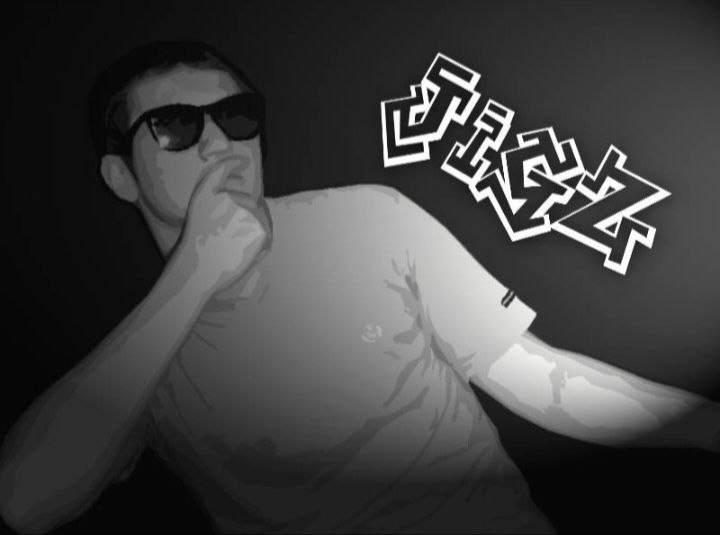

#### Once in a while, the spotlight is put on one active member of the Alephium community. This is an opportunity to showcase community members’ contributions to the ecosystem, what drives them, and what they are passionate about! More episodes: <a href="https://medium.com/@alephium/community-highlight-wilhelm-k%C3%A4llstr%C3%B6m-aka-oracleuggla-81d3938c5692" >#1 here</a>, <a href="https://medium.com/@alephium/community-highlight-cgi-bin-c102cc106f19" >#2 here</a>, <a href="https://medium.com/@alephium/community-highlight-3-digdug-48a7ec868504" >#3 here</a>, <a href="https://medium.com/@alephium/community-highlight-4-montail-e24fd88882a0" >#4 here</a>, and <a href="https://medium.com/@alephium/community-highlight-5-txn-71c4fd76ffe8" >#5 here.</a>

**In this edition, we introduce you to Waldi, also known as Zkit/beats, a humble community member that has made himself a name in the community through some serious promotion work. Many peers might have him to thank for even hearing about the project in the first place. His Twitter threads, translation work, and thoughtful feedback in the channels have helped set a constructive tone and brought the golden linen of the project to the attention of many newcomers.**

#### What can we call you, and where should we picture you?

I’m from Germany, and you can call me Waldi, but I´m also known as Zkit/beats on <a href="https://twitter.com/zkitbeats/" >Twitter</a> or Telegram.

#### Tell us about yourself/your persona.

I am in my early 30s. Until a few years back, I made <a href="https://www.youtube.com/watch?v=5C3OZROCxTM" >hip-hop beats</a>, hence my artist name. But I like any kind of music, as long as it sounds good. Otherwise, I lead a normal life, have a full-time job, and like to go to the soccer stadium when I have time.

<figure id="ee9d" class="graf graf--figure graf-after--p">

<figcaption>1. FC Kaiserslautern fans in a crowded stadium</figcaption>
</figure>

#### How did you find out about Alephium?

It was during the <a href="https://coinmarketcap.com/alexandria/article/ethereum-s-merge-to-happen-in-august-says-core-dev" >merge period in august 2022</a>. I was looking for <a href="https://docs.alephium.org/glossary/#proof-of-less-work-or-polw" >proof of work coins.</a> The important things to me are that the project has potential, that the community isn’t too big, and that it’s not overhyped. I like [small helpful communities](/discord) with some contributors enriching the project. It didn’t take long for the research on Alephium to convince me. In addition, I had a good feeling: it felt right, and if you look at the last 6 months, good progress has been made in terms of <a href="https://twitter.com/alephium/status/1608102725333417985" >development</a> and <a href="https://medium.com/@alephium/one-year-of-community-contributions-b3142b243e3e" >community growth.</a>

#### What excites you about Alephium?

I’m excited about the team spirit, the honesty, and the detailed work of the team. Be it the <a href="https://medium.com/@alephium/the-front-end-leman-upgrade-948a98a3e2d" >Frontend-work</a>, the <a href="https://medium.com/@alephium/an-introduction-to-the-stateful-utxo-model-8de3b0f76749" >educating articles</a>, or just by following technical discussions. For a non-developer like me, it is sometimes difficult to understand everything, but in the end, I read about it, try to understand, and learn more about Blockchains and Alephium.

#### What excites you about the future of Alephium?

After 3 years of research, <a href="https://medium.com/@alephium/one-year-of-mainnet-b7ed5d3024ee" >1 year of mainnet</a>, and the <a href="https://medium.com/@alephium/announcing-the-leman-network-upgrade-c01a81e65f0e" >Leman Upgrade</a>, it will be interesting to follow the next step. How will it be accepted in the crypto world? I would like to hear the opinions of devs and what they say about Alephiums tech. Like <a href="https://medium.com/@alephium/an-introduction-to-the-stateful-utxo-model-8de3b0f76749" >stateful UTXO,</a> <a href="https://medium.com/@alephium/meet-alphred-a-virtual-machine-like-no-others-85ce86540025" >Alphred</a>, sharding, <a href="https://docs.alephium.org/ralph/getting-started" >Ralph,</a> <a href="https://docs.alephium.org/dapps/getting-started" >smart contracts,</a> <a href="https://medium.com/@alephium/tech-talk-1-proof-of-less-work-ama-3d5afbf78c71" >proof of less work</a>, and how is the dev experience to build smart contracts and dApps on Alephium? I look forward to seeing how the ecosystem will grow and how big it will be in the next 3 years!

#### How do you contribute to the Alephium ecosystem?

I <a href="https://medium.com/@waldialephium/das-leman-upgrade-2-293b62c7ee39" >translate articles into German,</a> every now and then I write about Alephium on <a href="https://twitter.com/zkitbeats/status/1618584240488329225" >Twitter</a> and otherwise I try to help others when I can.

#### You seem to have a burning passion for music; how do you think blockchain tech could/will impact the streaming industry?

Of course, music labels take too much of the cake. Their deals are like enslavement, stipulating what you can do or with whom you can make music, and so on… On the other hand, music labels do a lot of work in the background. So an artist will always need someone to organize logistics for concerts and marketing and then has to trust them. Of course, there are good approaches with NFTs, but when I see <a href="https://www.youtube.com/watch?v=RjrA-slMoZ4" >Snoop Dog with Eminem as Bored Apes</a> in a video, I can’t take it seriously. It’s about artists and not about making people richer behind cryptocurrencies. I’ve always been a fan of underground rap. What a job these people have done without being rewarded to this day! How much music have they made available for free on youtube without ever being paid for it? For the small artists, I hope blockchain technology will enable them to earn some money to finance themselves. But you also have to be more than just a musician these days. In my opinion, there is still a long way to go.

<figure id="bd22" class="graf graf--figure graf-after--p">

<figcaption>Artist portrait of Zkit/Beats</figcaption>
</figure>

#### This concludes \#6 of the community highlights. Thank you Waldi for all the good-vibes, groovy music and for helping Alephium peers better understand the project

#### You can <a href="https://twitter.com/zkitbeats/" >follow Zkit/beats on Twitter</a>

---

We’ll be back with another episode of the community highlights in March 2023! **Meanwhile you can follow** [Alephium](/) **on** <a href="https://github.com/alephium/" ><strong>Github</strong></a>**,** <a href="https://twitter.com/alephium" ><strong>Twitter</strong></a>**. Join the conversation on [Discord](/discord)**, <a href="https://t.me/alephiumgroup" ><strong>Telegram</strong></a> **or** <a href="https://www.reddit.com/r/alephium" ><strong>Reddit</strong></a>**.**
