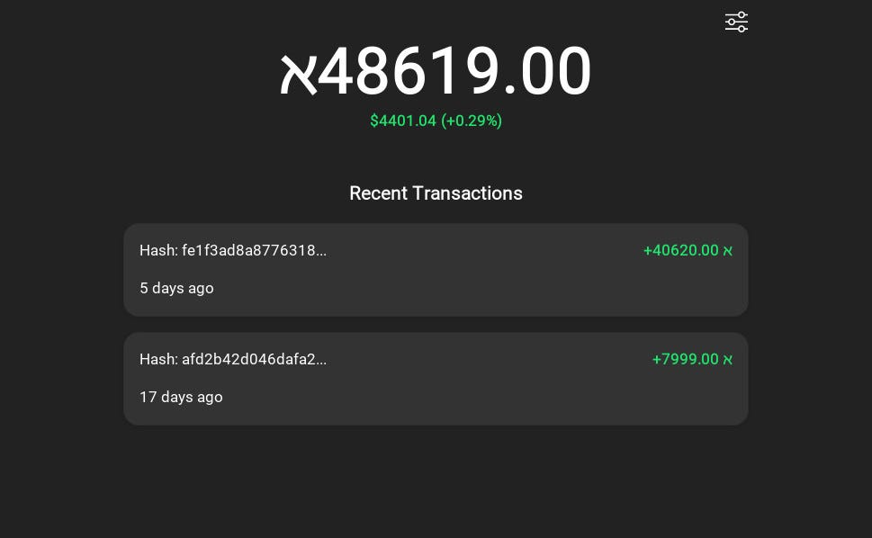
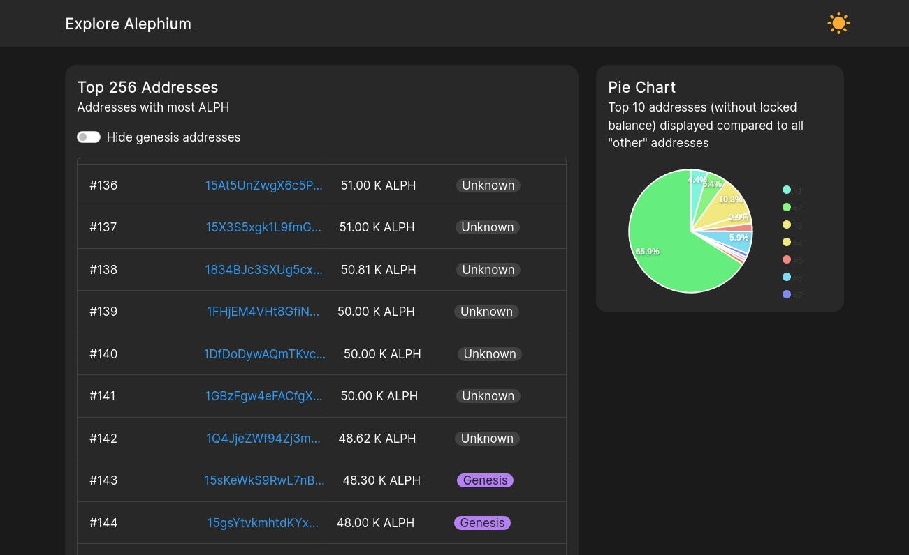

Alephium takes an organic approach to community building. We believe actions speak louder than words and that we rally people together around the quality of those actions. We’ve been incredibly fortunate to attract a diverse, and self-driven community. More episodes: [#2 here](/news/post/community-highlight-2-cgi-bin-c102cc106f19), [#3here](/news/post/community-highlight-3-digdug-48a7ec868504), [#4 here,](/news/post/community-highlight-4-montail-e24fd88882a0) [#5 here](/news/post/community-highlight-5-txn-71c4fd76ffe8) and [#6 here](/news/post/community-highlight-6-waldi-zkit-beats-37af1f6df3b8).

This series of highlights aims at showcasing this community by putting the spotlight on one actively contributing member at a time. This is an opportunity for us to put into the light contributions from the community along with the things they are passionate about and what drives them.

## What can we call you and where should we picture you?

Hi, you can call me Oracleuggla or preferably by my full name, Wilhelm Källström. Currently living in Falun, a small city in Sweden.

## Tell us about yourself/your persona.

I’m a 19 years old fellow from Sweden that has loved programming ever since I was a little kid. The thing that excites me the most about programming is the satisfaction when you solve a problem and develop tools that help others.

In my spare time I like to hang out with friends, listen to music, and develop front-end apps using React.JS. Recently I’ve also looked into developing dApps and learning more about Blockchain programming.

## How did you find out about Alephium?

I found out about Alephium while watching a youtube video made by [Sebs FinTech](https://www.youtube.com/c/SebsFinTechChannel) Channel about [Alephium dual mining with Ethereum](https://www.youtube.com/watch?v=-bFY1SvMqxc). The next thing I know is that I’m mining Alephium:)

## What excites you about Alephium?

The thing that excites me the most about Alephium must be the scalability and sharding, the proof of less work algorithm, and last but not least, the stateful UTXO model. Currently, I think of Alephium as a nice combination between Ethereum and Solana.

## How do you contribute to the Alephium ecosystem?

I’ve always wanted to contribute to some crypto ecosystem and Alephium was the way to go. From 2021–2022 I’ve built 2 web apps for the community. The first one is a portfolio tracker called [AlphVue](https://github.com/WilhelmKallstrom/alphvue) that you add to your home screen on your smartphone. The “app” displays your current ALPH balance, the value in Fiat, and the most recent transactions. By using this web app you can securely monitor your ALPH portfolio without having your private keys on your mobile device.

[https://wilhelmkallstrom.github.io/alphvue/](https://wilhelmkallstrom.github.io/alphvue/)

The second thing I’ve built is a Web App called [AlphTop](https://github.com/WilhelmKallstrom/alph-top) which is a site that shows the top 256 addresses with the most ALPH on the network. The known addresses are labeled with a category such as Genesis or Gate.io. There’s also a pie chart that displays the top 10 addresses without a locked balance. Last but not least you can hide all genesis addresses and only display the ´normal´ ones.

[https://alph-top.web.app/](https://alph-top.web.app/)

## What makes you excited about the future of Alephium?

The future of Alephium is looking bright, the technology is there and I think Alephium will be an Ethereum competitor like other Smart Contract Blockchains. I think the thing that’s holding it back is the exchanges, when Alephium gets listed on some big exchanges more developers will build dApps on the network and more people will use the Blockchain.

> Follow Wilhelm on [GitHub](https://github.com/wilhelmkallstrom) and [Twitter](https://twitter.com/03wilhelm)

## How do you see adoption of blockchain happening in your generation?

The adoption of Blockchain in my generation is growing day by day, nowadays I hear more and more people in my generation talk about Blockchains and Cryptocurrencies. A big majority of people my age own crypto, trade crypto, and buy NFTs. I think the younger generations are more open and positive about Blockchain adoption than the older generations, maybe because the majority of us understand the tech and benefits more.

---

**This concludes the first edition of this series. Thank you Wilhelm for your time and efforts! Find episode** [#2 here](/news/post/community-highlight-2-cgi-bin-c102cc106f19)**,** [#3 here](/news/post/community-highlight-3-digdug-48a7ec868504) **and** [#4 here](/news/post/community-highlight-4-montail-e24fd88882a0). **Meanwhile do not hesitate to tell us on** [Discord](https://discord.gg/JErgRBfRSB) **who’d you want to know more about!**
