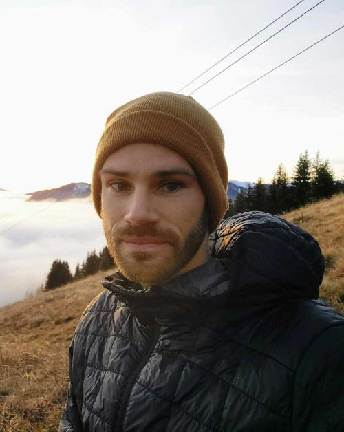
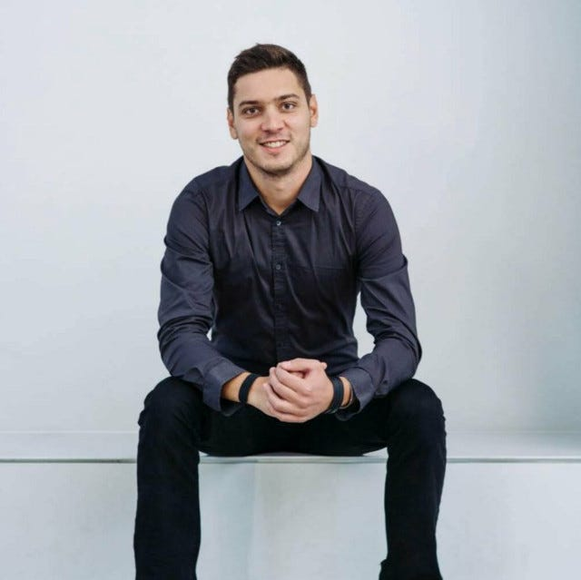
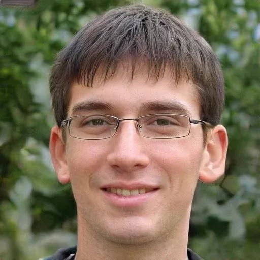

#### Presenting the humans building the Front-end

**This article was updated:** <a href="https://medium.com/@alephium/alephium-contributors-f35eeaeaf0a0"  rel="nofollow">https://medium.com/@alephium/alephium-contributors-f35eeaeaf0a0</a>

For its team, Alephium is privileging agility and efficiency over hyper-growth. We do not stay at a human size because we think it is more efficient, but because Alephium strives to be a decentralised, community driven project. This means the project in itself is much larger than a team can ever be. Communication, trust, openness and transparency is paramount in such a set-up.

In fact, we haven’t communicated much about ourselves so far because we think _who we are_ is less relevant than _what we deliver_. To nevertheless shed some light on who we are and what we do, we decided to share a little about ourselves with the community through a small series of interviews.

**We start off the series with a focus on the Front-end team. It’s our pleasure to introduce you to Mika, Ilias & Lee!**

---

### Mika

<figure id="d0e9" class="graf graf--figure graf-after--h3">

<figcaption>Mika</figcaption>
</figure>

#### **How should we call you and where are you located?**

You can call me Mika. Located in Lausanne.

#### **What/where did you study ?**

Born and raised in France, just next to Geneva, I was quick to realise that we should all do something to try and save our planet. So I went on and studied environmental sciences in EPFL, Lausanne. I got my engineer’s degree, then directly joined a startup called Bestmile, to build a platform to manage fleet of autonomous electric vehicles. Yep, I love being a multidisciplinary person. In 2016, I entered the realm of crypto at Lykke, motivated by the idea of using this tech to break the old finance and make it more open, sustainable and fair. Alephium is a natural next step in this journey.

#### **Do you have funny, sporty, geeky or cranky hobbies?**

Yes! A bit of everything really. Running, biking, geeking, designing and drawing thing, creating stuff, enjoying life and nature. Try to live for a purpose that is bigger than my little self.

#### **Got links?**

<a href="https://www.linkedin.com/in/mika%C3%ABl-vaivre-05526337" >https://www.linkedin.com/in/mika%C3%ABl-vaivre-05526337</a>

#### **How/when did you come across crypto?**

Around 2015–2016 I believe? I discovered a crypto called Solarcoin, built to encourage the global energy transition by incentivising solar production. I bought some on Lykke — then went on and work for the exchange as a Head of Product ;)

> Turned out that working as a team was effortless, as we managed to build awesome things quickly. So here I am today, continuing to grow with the project and looking forward to contribute to the great things to come!

#### **How did you come across Alephium and what attracted you to the project?**

I knew Cheng when we were both working at Bestmile. He came to me at the very beginning of the project, asking me if I could craft Alephium’s visual identity and produce some communication and fundraising materials. I was happy to accept :) Turned out that working as a team was effortless, as we managed to build awesome things quickly. So here I am today, continuing to grow with the project and looking forward to contribute to the great things to come!

#### **What are you doing at Alephium?**

I’m the front-end product guy! (chief of product, for those who care about titles)

#### **What is it you care the most for in our creation?**

Efficiency, robustness and accessibility.

---

### Ilias

<figure id="af69" class="graf graf--figure graf-after--h3">

<figcaption>Ilias</figcaption>
</figure>

#### **How should we call you and where are you located?**

Call me Ilias. You can find me in Zurich, Switzerland, or online under the aliases nop33/eyettea or my DJ alias, Fetamin!

#### **What/where did you study ? What are your past notable experiences?**

My innocent 18-year-old self decided to study Computer Science at the Aristotle University of Thessaloniki, Greece. It turned out to be a good move. My journey led me to CERN in Geneva, Switzerland, where I had the privilege to work amongst the world’s most renowned physicists and scientists.

#### **Do you have funny, sporty, geeky or cranky hobbies?**

I love messing around with knobs. Particularly, knobs that control some sort of sound output. I spend endless hours sorting and categorizing my music on my laptop so that I can grab any given opportunity to perform a DJ set with confidence! Besides my love for electronic music lately, I’ve started a geeky journey on nutrition and exercise. I’m eating the same freaking salad bowl for lunch every day, something that drives my flatmates crazy. Also, in case that was not clear already, I live on feta. Sometimes, I code apps to solve my problems.

#### **Got links?**

<a href="https://www.linkedin.com/in/iliastrichopoulos/" >https://www.linkedin.com/in/iliastrichopoulos/</a>   
<a href="https://iliascreates.com" >https://iliascreates.com</a>  
<a href="https://twitter.com/_nop33" >https://twitter.com/\_nop33</a>  
<a href="https://github.com/nop33" >https://github.com/nop33</a>  
<a href="https://soundcloud.com/imfetamin" >https://soundcloud.com/imfetamin</a>

#### **How/when did you come across crypto?**

I don’t remember the exact year, but I first heard of Bitcoin while I was still studying (if only I’d have been smart enough to mine some back then…) so that must have been somewhere between 2009–2013. I think it was around 2011. Then around 2013, I remember that there was an online scientific project that if you’d donate your CPU they would reward you with XRP. I donated some CPU for a few months and got some coins worth in total something like \$30. Then, I proceeded to completely forget about them for about 4 years. 2017 and a good friend of mine gets hired in a crypto company which reminded me of some coins somewhere in my subconsciousness. After an evening of scrapping old email backups, I found them, traded them for BTC and ETH, and that’s how it basically started :) I, later on, got hired by the same crypto company.

#### **How did you come across Alephium and what attracted you to the project?**

Networking! A colleague and good friend from my previous crypto-related job told me about Alephium in the spring of 2021, I joined the Telegram group, Cheng asked me if I am a developer, and the rest is history. At first, I worked as a freelancer during the summer of 2021, building a brand new website for the project. During those months I fell in love with the collaboration with the rest of the team and I think they liked me too because they offered me a more permanent position at Alephium. Contributing to building an open, censorship-resistant, border-less blockchain with awesome people sounded much more fun than maintaining servers did. So I quit my job and joined this amazing team.

#### **What are you doing at Alephium? What is your title (if you have one, what would it be, if you don’t)? What are you good at?**

I am a frontend engineer and my responsibility is to create beautiful, performant, and secure user interfaces and developer kits that allow users and developers to interact with the Alephium blockchain. I am good at listening to the things that are not being said, transforming designs into pixel-perfect UIs, and choosing the right emoji reactions. My colleagues have attributed to me the title of CMO (Chief Markdown Officer) because I showed them how to use footnotes in markdown.

> I want to dedicate my technical and human skills towards improving the experience people have when interacting with blockchains so that their true benefits can shine.

#### **What is it you care the most for in our creation?**

I believe that blockchain technology has a lot to offer and that it’s here to stay. Apart from the technological challenges that some of the smartest people in the space are currently keeping themselves busy with, one of the clunkiest things at the moment is user experience. I want to dedicate my technical and human skills towards improving the experience people have when interacting with blockchains so that their true benefits can shine. Part of Alephium’s mission is to make this technology more accessible and usable than it is today. A for Adoption. A for Alephium. 🚀

---

### Lee

<figure id="7732" class="graf graf--figure graf-after--h3">

<figcaption>Lee</figcaption>
</figure>

#### **How should we call you?**

Just call me Lee.

#### **What/where did you study ?**

I’ve worked in the cryptocurrency industry for 5 years. I’ve worked in software development for 8. I didn’t go to any Ivy league or notable schools so it doesn’t matter, but I did complete college and a CS degree in university.

#### **Do you have funny, sporty, geeky or cranky hobbies?**

I’m currently heavily invested in “code CAD” in my hobby life. It’s a new paradigm for creating 3D models, it’s super fun and amazing.

#### **How/when did you come across crypto?**

I came across cryptocurrency back around 2013 when Bitcoin was worth \$100-ish. I started playing with it in 2015.

#### **How did you come across Alephium and what attracted you to the project?**

I was presented with the opportunity and I took it because Alephium is an attractive project to me. In particular I like how it improves a working model in a conceptually simple way.

#### **What are you doing at Alephium?**

I’m a full stack developer in the truest sense of the meaning: from assembly to TypeScript, backend to frontend.

> (…) my utmost important points when it comes to Alephium: developer safety and documentation.

#### **What is it you care the most for in our creation?**

These are my utmost important points when it comes to Alephium: developer safety and documentation.

---

#### This concludes the first chapter of three in this series. In the next publication we’ll get acquainted with the people responsible for <a href="https://medium.com/@alephium/core-team-interview-series-episode-2-bec6e6908d2f" >operations, marketing and communication,</a> followed by <a href="https://medium.com/@alephium/core-team-interview-series-episode-3-64b6dacc1459" >the folks building the Node.</a>
