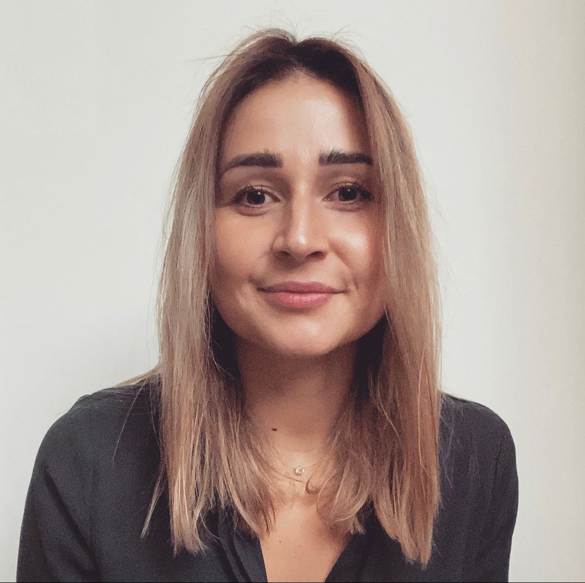
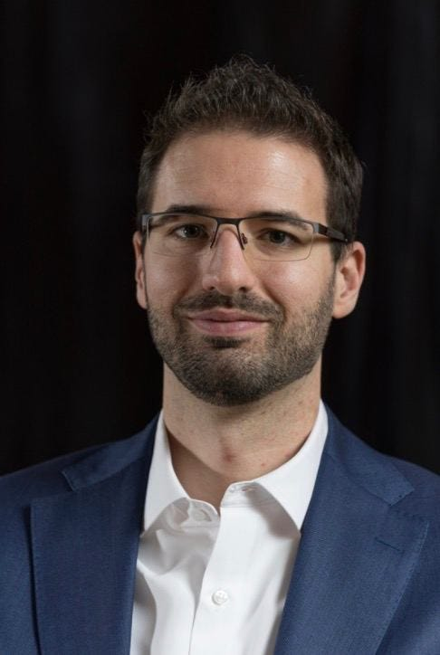
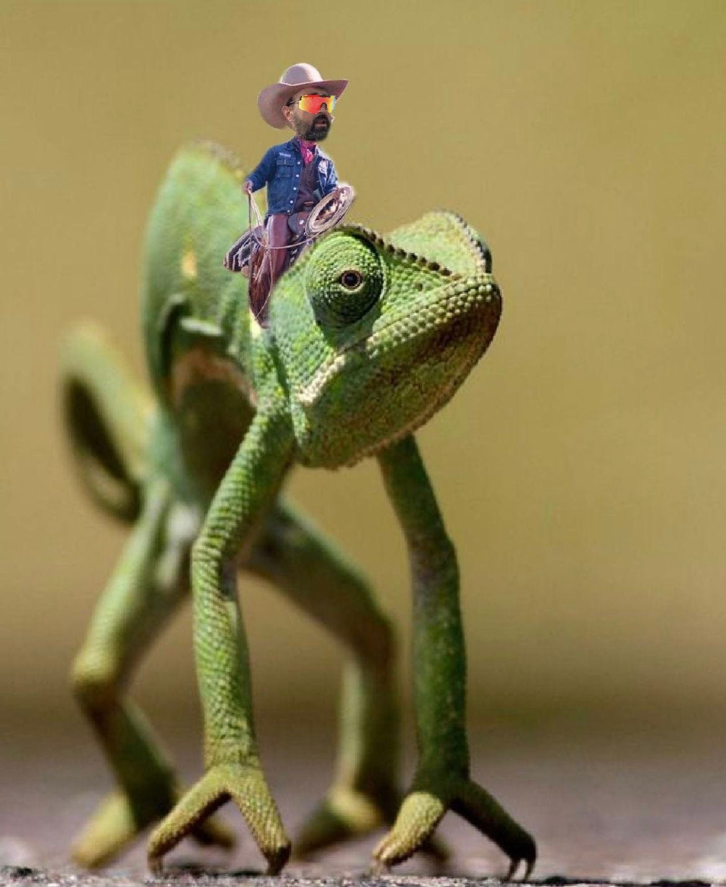
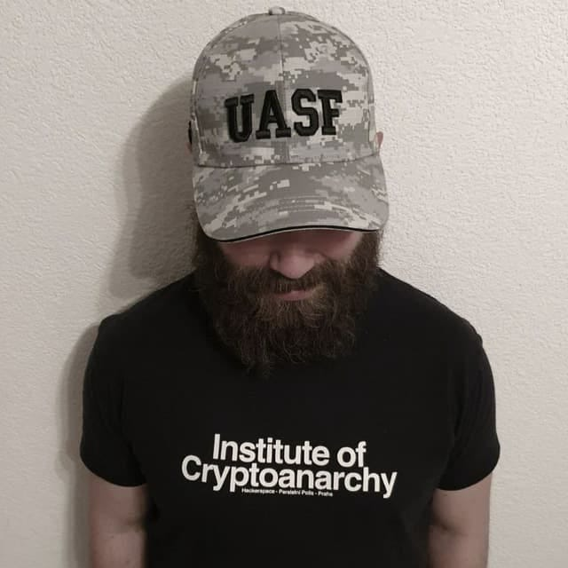
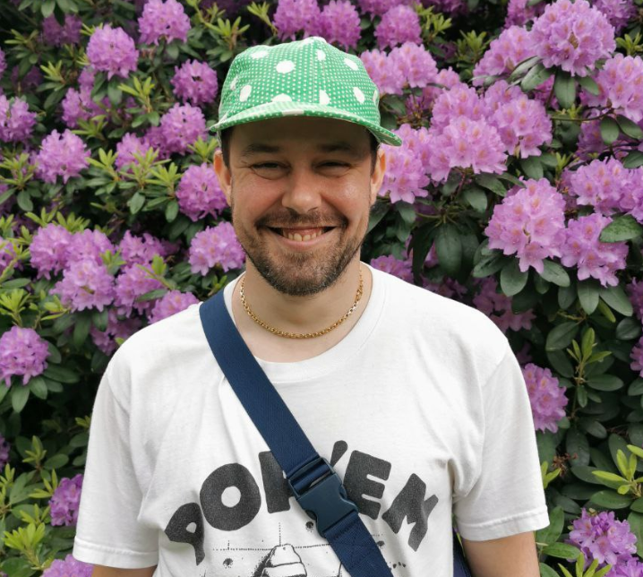

Presenting the humans behind operations, marketing and community.

**This article was updated:** [https://medium.com/@alephium/alephium-core-contributors-f35eeaeaf0a0](/news/post/alephium-core-contributors-f35eeaeaf0a0)

_For its team, Alephium is privileging agility and efficiency over hyper-growth. We do not stay at a human size because we think it is more efficient, but because Alephium strives to be a decentralized, community driven project. This means the project in itself is much larger than a team can ever be. Communication, trust, openness and transparency is paramount in such a set-up._

_To shed some light on who we are and what we do, we decided to share a little about ourselves with the community through a small series of interviews._

[Read the 1st part here](/news/post/core-team-interview-series-episode-1-3472f8295af6)

There’s always the need for structured operations and communications in innovation! These crucial aspects allow us to create a solid ground for Alephium to consistently deliver outstanding tech. From development to marketing, we build meticulously and steadily, rain or shine, FOMO or [JOMO](https://slangit.com/meaning/jomo), for the long run!

**5 individuals are tasked with this and we are happy to introduce you to Maud, Philipp, Vlad, Polto and Set!**

---

### Maud

#### How should we call you and where are you located?

My name is Maud and I’m based in Zürich, Switzerland.

#### What/where did you study ?

I studied Chemical Engineering at EPFL and Economics at the University of Lausanne. After that, I started working for one of Switzerland most successful start-ups called Bestmile where I met many of my current Alephium teammates! Before Alephium, I was working at Lykke, a Swiss crypto exchange.

#### Do you have funny, sporty, geeky or cranky hobbies?

Not many people know this but I used to do ski competitions when I was younger, until I broke my knee.

#### Got links?

[https://www.linkedin.com/in/maud-simon-01073394/](https://www.linkedin.com/in/maud-simon-01073394/)

#### How/when did you come across crypto?

I first dived into crypto in December 2017 when I was hired at Lykke. I started helping around in the community in order to familiarize myself with the blockchain world before my official start date. December 2017 was a crazy time for crypto and it ended up being a really valuable crash course!

#### How did you come across Alephium and what attracted you to the project?

I worked with many of my Alephium teammates in my first job at Bestmile. When I left Lykke, I knew I wanted to stay in the blockchain space and I reached out to the team to see what Alephium was up to. The stars aligned, Alephium was in need of someone with my experience and I joined in June 2021.

With Alephium, I was looking forward to diving into a more technical and core side of the blockchain space. I was also excited to work again with incredibly talented people.

I’m really bullish about Alephium. Combining all our innovations, we’re offering a very much-needed, new DeFi paradigm.

#### What are you doing at Alephium?

I’m currently Chief of Staff. What it concretely means at Alephium is that I oversee everything non-development-related. I personally focus on the operational and admin sides and work with a (fantastic) team on Marketing & Comm. Fortunately, I’m really good at multitasking ;)

> Blockchain will transform our society in many ways. I want to actively contribute to this change.

#### What is it you care the most for in our creation?

Blockchain will transform our society in many ways. I want to actively contribute to this change. Specifically, beyond the technological innovations, I am passionate about how the blockchain space has already challenged the way individuals traditionally work together. Blockchain bring together diverse and complementary talents, distributed around the world, working asynchronously towards a common goal.

---

### Philipp

#### How should we call you and where are you located?

Call me Philipp and I’m located in the German speaking part of Switzerland

#### What/where did you study ? What are your past notable experiences?

I graduated at the Lucerne University of Applied Sciences and Arts with a Master of Science in Banking and Finance degree. I established an integral finance and controlling function that supports the company to plan and achieve short and long-term financial and strategic goals at another company in the blockchain space with its own business development and exchange business units.

#### Do you have funny, sporty, geeky or cranky hobbies?

During my free time you can find me on my bike exploring enduro trails in the mountains. Some might say I take too many risks during those rides, but life is too short to not take some risks. ;-) If I’m not on my bike you can find me playing indoor or beach-volleyball.

#### Got links?

[https://www.linkedin.com/in/philipp-richner-2b0b82a5/](https://www.linkedin.com/in/philipp-richner-2b0b82a5/)

#### How/when did you come across crypto?

As every great journey mine started over a beer with a friend in 2016 where he first told me about blockchain and crypto. Some beers and days later I was invested and since 2017 I’m working in the space.

#### How did you come across Alephium and what attracted you to the project?

I participated in the pre-sale and followed the project since then. Maud introduced me at a later stage to the team when there was a need for a finance person.

#### What are you doing at Alephium?

As CFO I’m responsible for all finance related topics at Alephium.

> I’d say overall the most important point for me is to see Alephium achieve its goals and create a healthy ecosystem.

#### What is it you care the most for in our creation?

I’d say overall the most important point for me is to see Alephium achieve its goals and create a healthy ecosystem. I see my contribution to this by ensuring to diligently run my department so that people can focus on their core tasks and build the ecosystem.

---

### Vlad

#### How should we call you and where are you located?

Call me Vlad, I’m located in the French-speaking region of Switzerland!

#### What/where did you study ? What are your past notable experiences?

I’ve studied communications and marketing in Paris, worked in old school & digital advertising agencies, created and ran my own consulting firm specialized in online influence and social media advertising.

#### Do you have funny, sporty, geeky or cranky hobbies?

I read everything.

> When I saw a bunch of misfits and engineers trying to solve their philosophical issues by building a decentralized decision mechanism (bitcoin), I knew I had to dive deep into that experiment.

#### How/when did you come across crypto?

I’ve been preoccupied about the way we take political decisions together in democracies for a while. When I saw a bunch of misfits and engineers trying to solve their philosophical issues by building a decentralized decision mechanism (bitcoin), I knew I had to dive deep into that experiment. There I met an incredible community, fascinating thinkers, tinkerers and builders and found a purpose in contributing to the future of our consensus-building machinery.

#### How did you come across Alephium and what attracted you to the project?

A dear friend introduced me to Alephium and its people during long and talkative walks around the Leman lake, and boozy bitcoin meet-ups in the alps. I loved the technical vision and the strong team built around it!

#### What are you doing at Alephium? What is your title (if you have one, what would it be, if you don’t)? What are you good at?

I’m helping to shape the communications and marketing of Alephium. The goal is to allow devs and amateurs to discover and understand our tech and its potential whether it’s via simple memes or complicated tech explainers, IRL or online.

#### What is it you care the most for in our creation?

I like the unbending tech ambition to bring the absolute best of crypto in all aspects and I like the proximity of the team to the community.

---

### Polto

#### How should we call you and where are you located?

I am known as Polto, I am located in between Geneva and Neuchâtel, Switzerland.

#### What/where did you study ?

I went to school and college between Moscow and Geneva, started EPFL in Lausanne, but quickly abandoned my bachelor in computer science because I was not that good in math and was already trying myself in Free Software related business. More recently (2017–2018) I attended the MSc in Blockchain and Digital Currency from the university of Nicosia. Since 1999 I have worked on many Free Software and Open Hardware projects, mainly on image and 3D processing.

#### Do you have funny, sporty, geeky or cranky hobbies?

I am a very happy person, my hobbies are my job. I try hard to align what I do for living with my personal interests. Beside work, I like to learn about tech. I do a lot of more general (not work related) geeking & hacking. I also practice traditional karate-do and hold a 4th Dan degree.

#### Got links?

[https://twitter.com/_polto_](https://twitter.com/_polto_) (I am not very active on twitter)

[https://www.linkedin.com/in/polto/](https://www.linkedin.com/in/polto/)

#### How/when did you come across crypto?

I heard very early about Bitcoin because I was interested in applied cryptography, but I totally dismissed it. I was “forced” to test it by a friend, but I really did not like it. User experience was bad and being a Free Software guy I got scared by the idea of “digital scarcity”. In July 2012 we wanted to accept payments in bitcoin during the RMLL conference in Geneva, but the alternative implementation in Ruby from my friend did not work and it did not happen. I forgot about Bitcoin for 2 more years. I got back via Ethereum in 2014, first by following the development. I was very enthusiastic about the generic smart contracting platform, about the “code is law” lie and the move to PoS. I started to get into “crypto” and to learn more about it. I followed the Ethereum development very closely, The DAO debacle and the fork that followed. Later as I was learning more about the ecosystem I became more and more a Bitcoin maximalist. In 2017 I started the MSc in Bitcoin and digital currencies from the university of Nicosia and worked at Bity (the first Swiss licensed crypto broker). Later I created my own company to provide self-custodial solutions for Bitcoin — Hodling SA.

> I asked Cheng if it was “yet another shitcoin” with a lot of buzzwords or if they really intend to innovate in all of those areas… His answer was amazing

#### How did you come across Alephium and what attracted you to the project?

I met Cheng back in 2019 at some random crypto conference. Almost everything there was miss-use of “blockchain tech”. I stopped at Alephium’s booth and started by reading all the buzzwords — 10K TPS, Sharding, UTXO model, energy efficiency… I asked Cheng if it was “yet another shitcoin” with a lot of buzzwords or if they really intend to innovate in all of those areas. His answer was amazing, first we were very aligned on the bullshit part of most buzzwords, but more surprising was his technical take on those topics, on the different tradeoffs. What he described was looking as an elegant, efficient and “easy” to implement solution. But to be really honest I did not understand much. I was working at Bity back then and told Cheng that as soon as Alephium was ready, Bity will be able to help with some aspects of the private pre-sale. We stayed in touch and met many times over the next two years to exchange on different topics. I made some introductions, got more confidence in the tech, and seeing the traction by March 2021 I “officially” joined as advisor to help with the private pre-sale and the related regulatory aspects. After the mainnet launch we intensified our collaboration. I am now working for the Alephium project ~1 day per week.

#### What are you doing at Alephium?

I am mostly connecting people, helping to find the best partners, working on the strategy, legal & regtech aspects. If I should have a title it would be NBO — No Bullshit Officer

#### What is it you care the most for in our creation?

No bullshit!

---

### Set

#### How should we call you and where are you located?

My name is Set but you can call me Setto. I live on the southern side of Stockholm, up north in Sweden.

#### What/where did you study ? What are your past notable experiences?

I am an eternal student of Streetsoul University. But I was schooled in Switzerland where I aimed for a path in Graphic Design. Throughout the 00s up until this day I have been oscillating through many different professional careers, ranging from being Resident DJ to Product Specialist, via Web Developer and Recording artist. I’ve lived in many places throughout Europe and today I am a polyglot.

#### Do you have funny, sporty, geeky or cranky hobbies?

I spend a notable amount of my time searching for new music or making music. This passion has led me to initiate a federated platform to help musicians striving for data-sovereignty, called Basspistol. Typically, during my free time you will find me fiddling with a synthesizer, hanging with my Fiancé and my dog or editing a config file for a funky FOSS web service.

#### Got links?

Dial [https://set.hallstrom.ch](https://set.hallstrom.ch) for doxxing and [https://v.basspistol.org/c/tosettosetto/](https://v.basspistol.org/c/tosettosetto/) for music.

#### How/when did you come across crypto?

Back during the [Occupy Wall Street](https://en.wikipedia.org/wiki/Occupy_Wall_Street) social-media infused phenomenon, I got acquainted with the [P2P Foundation.](https://p2pfoundation.net/) At the time I was lurking there for it’s qualities as a hive-mind for economic reform. There i read about these “bit coins” around 2011, but couldn’t really wrap my head around the concept. A couple years later, through close friends in the tech-scene, it became clear to me that Bitcoin is here to stay and blockchain technology will become an important part of human society’s future infrastructure.

> There is so much noise in the “crypto-project” space. What attracted me was just that: here comes an open source blockchain project making music instead of noise!

#### How did you come across Alephium and what attracted you to the project?

My dear friend Polto pitched me for my experience with open source communities and creative communication. There is so much noise in the “crypto-project” space. What attracted me was just that: here comes an open source blockchain project making music instead of noise! It has a good concept with a creative team. The vision is realistic, there is a sincere ambition to grow organically upon the Bitcoin and Ethereum giant’s shoulders. And the tokenomics are solid.

#### What are you doing at Alephium? What is your title (if you have one, what would it be, if you don’t)? What are you good at?

My traditional title is “Community Lead”. But a decentralized community doesn’t really need a lead. My role is more about _Authorship_ and less about _Authority_. My tasks vary from copywriting, to multi-media production, via moderation and data-polling. I am good at formulating other people’s imagination: listening and empathizing. Basically your humble Chief Optimistic Community Cyber-spider, at your service. At times I am CMO (Chief Music Officer), but it is a title that many revendicate and my team-mates have excellent music taste.🎶

#### What is it you care the most for in our creation?

The team and the community, laying sound foundations for a healthy and thriving evolution of our economic infrastructures. So far it has been beautiful to watch it unfold.

---

**This concludes the second chapter of three in this series. In the next publication we’ll** [get acquainted with the Node-developers.](/news/post/core-team-interview-series-episode-3-64b6dacc1459)
