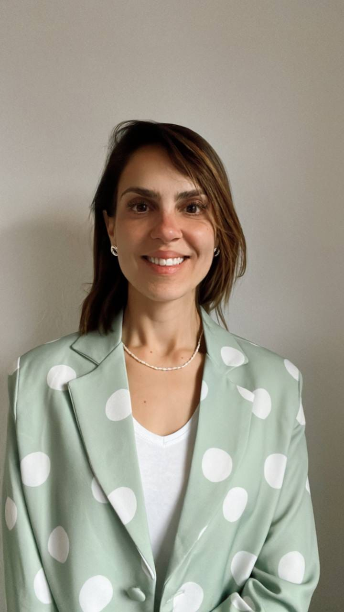
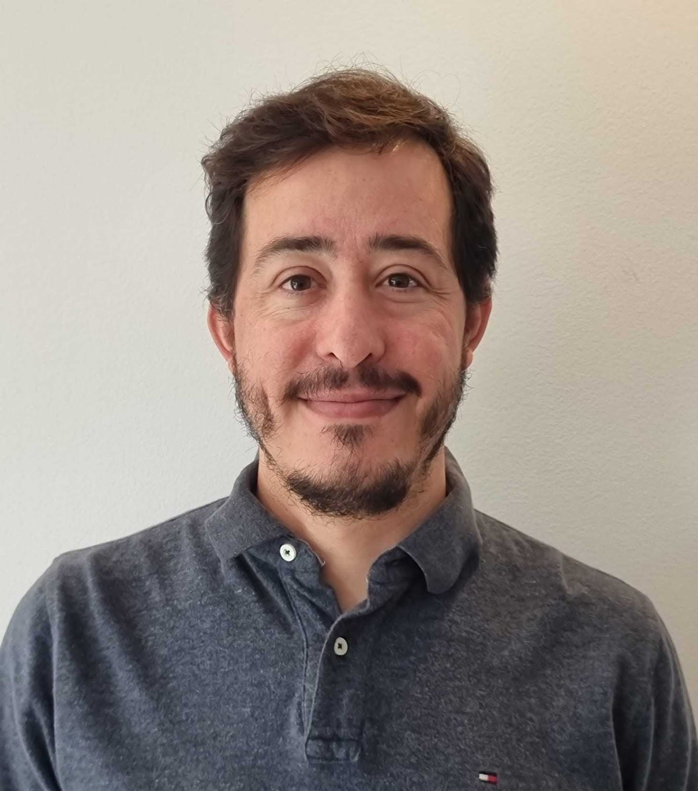

[This article was updated](/news/post/alephium-core-contributors-f35eeaeaf0a0)

_For its team, Alephium is privileging agility and efficiency over hyper-growth. The project does stay at a human size not because it is more efficient, but because Alephium strives to be a decentralized, community-driven project. This means the project in itself is much larger than a team can ever be. Communication, trust, openness, and transparency are paramount in such a setup._

_To shed some light on who we are and what we do, we decided to share a little about ourselves with the community through a small series of interviews. Read the_ [1st](/news/post/core-team-interview-series-episode-1-3472f8295af6)_,_ [2nd](/news/post/core-team-interview-series-episode-2-bec6e6908d2f)_, and_ [3rd part](/news/post/core-team-interview-series-episode-3-64b6dacc1459)_._

---

Since our last core team article was published in March’22, 3 new members have joined the core team. **It’s a great pleasure to introduce you to Marina, Thiago, and Zhiming.**

### Marina

### 1 — What should we call you and where are you located?

My name is Marina and I am based in Zurich, Switzerland

### 2 — What/where did you study? What are your past notable experiences?

I have a BA in Arts and English and an MA in Marketing. I am fortunate to have lived in 6 different places (Brazil, the USA, Canada, Ireland, Italy, and Switzerland) and studied different topics in all of them.

### 3 — Do you have funny, sporty, geeky or cranky hobbies?

I love playing tag rugby and deep inside I am a nerd. I love board games, comic books, costumes, films, TV shows, the lots.

### 4 — Got links? Got a profile picture we should use?

You’ll find me on [LinkedIn](https://www.linkedin.com/in/marina-miranda-de-mattos-667945130/) and on [Twitter](https://twitter.com/MarinadeMattos2).

### 5 — How/when did you come across crypto?

Like many people, I learned about crypto in 2017 when a broker tried to sell me some Bitcoins. I realized that there had to be a better way to be part of it all and started looking into it for myself. I found the entire space quite exciting and decided I would love to work with it. It was then in 2018 that I joined [Lykke](https://lykke.com/), a Cryptoexchange established in 2016, as the Head of Customer Success and expanded my knowledge in various areas. Lykke is

### 6 — How did you come across Alephium and what attracted you to the project?

I worked with Maud and Mika at Lykke and she’s the one who introduced me to Alephium, its concepts, and its team. I was very impressed with the passion the team members demonstrated for the tech and their work and realized I would love to be part of it.

### 7 — What are you doing at Alephium? What is your title (if you have one, what would it be, if you don’t)? What are you good at?

I am part of the marketing team and I am focusing on helping the ecosystem grow so more devs. People and projects learn about the innovations Alephium brings and we get to work with like-minded teams and identify synergies.

### 8 — What is it you care the most for with Alephium?

I think Blockchain has the power to change people’s lives and I would like to contribute to this change. The industry is only young and a lot of focus has been put on the tech and what it can do, now that it has been fully accepted it is time to transform.

### Thiago

### 1 — What should we call you, and where are you located?

My name is [Thiago Freitas](https://twitter.com/jameskbh), and I’m currently living in Lisbon, Portugal

### 2 — What/where did you study? What are your past notable experiences?

I’m a Mechanical Engineer with a specialization in Biz. Adm and Lean Manufacturing. My day job was to find a way to save thousands of dollars by making people work faster.😅

I also had a side gig as a translator. I’ve already translated over 30 published books.

### 3 — Do you have funny, sporty, geeky, or cranky hobbies?

I have a cabinet full of indie board games and a collection of soccer club scarves.

### 5 — How/when did you come across crypto?

In 2015 I was working in the IT department, and a colleague sent me the Bitcoin white paper. From that moment on, I got hooked.

### 6 — How did you come across Alephium, and what attracted you to the project?

I saw a job posting about content creation (something that I love to do). I started to get deeper into the tech. The idea of combining the UTXO model and smart contracts is one that I found intriguing, and the explanation for it was amazing. I’m thrilled to be here to see that happening live.

### 7 — What are you doing at Alephium? What is your title (if you have one, what would it be, if you don’t)? What are you good at?

I’m helping to raise awareness by writing content for our blog, Twitter account, and other social media outlets. So let’s spread the word!

### 8 — What is it you care the most for with Alephium?

It has awesome tech, and the core team goes the extra mile to make the interaction with it (wallet, explorer, etc) easy to understand (and looks beautiful as well). Alephium is in that sweet spot, ready to deliver a great product, and I want to help the community fully comprehend it.

### Zhiming

### 1 — What should we call you and where are you located?

I’m currently located in Hangzhou, China, and you can call me Zhiming.

### 2 — What/where did you study ? What are your past notable experiences?

During the university period, my major was computer science, and after graduation, I started working in the software development industry.

### 3 — Do you have funny, sporty, geeky or cranky hobbies?

My main interest is to play table-tennis with family or friends, which is considered a national sport in China. However, I have always had a wish to take my family to travel all over China by car, which may require enough time and energy.

### 4 — Got links? Got a profile picture we should use?

You can find some of my work on [GitHub](https://github.com/suyanlong).

### 5 — How/when did you come across crypto?

I came into contact with crypto in 2016, through friends, and I immediately started to learn more about it.

### 6 — How did you come across Alephium and what attracted you to the project?

On GitHub, I discovered the Alephium project while learning about blockchain related technologies and the Scala language.

### 7 — What are you doing at Alephium?

I’m currently working on the [ralph-vscode](https://github.com/alephium/ralph-vscode) plugin in Alephium.

### 8 — What is it you care the most for with Alephium?

What I care the most about is that the community members can understand the Alephium project more easily.

---

**This concludes the fourth chapter in this series. There’s no doubt that more episodes will be needed as the project progresses and grows. Stay tuned!**

**_You can follow Alephium on_** [Github](https://github.com/alephium/)**_,_** [Twitter](https://twitter.com/alephium)**_. Join the conversation on_** [Discord](/discord)**_,_** [Telegram](https://t.me/alephiumgroup) **_or_** [Reddit](https://www.reddit.com/r/alephium)**_._**
