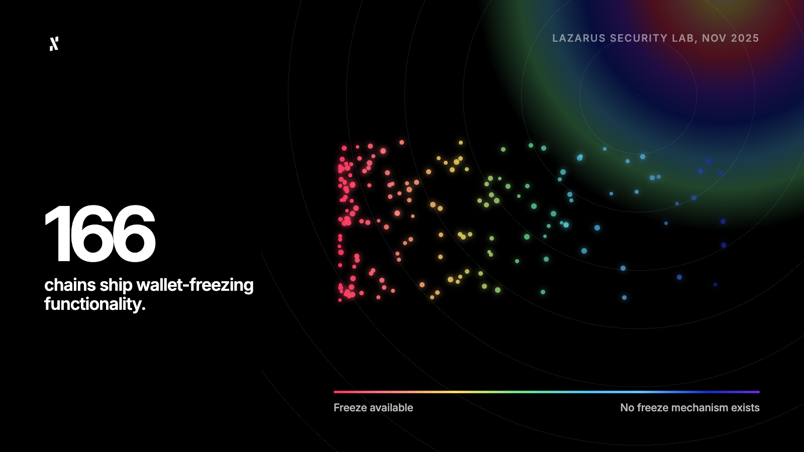
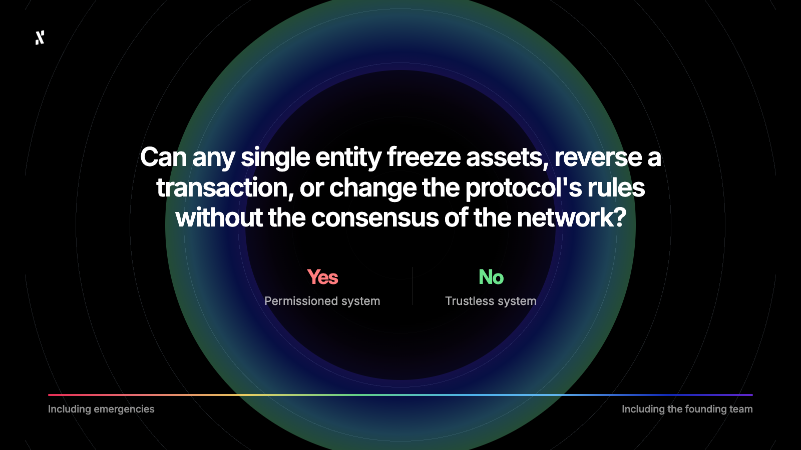
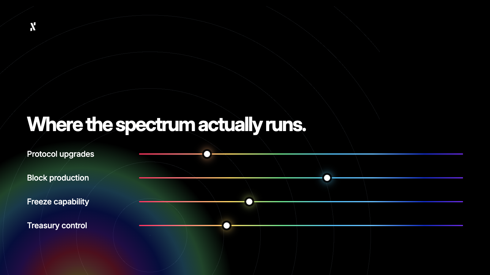

**By Pepper, Head of Marketing at Alephium**

*The views shared in this article are those of the author and may not represent the official position or views of Alephium.*

- - -

Last November, ByBit’s Lazarus Security Lab published research that found 166 blockchains contain wallet-freezing functionality. This was a huge revelation at the time, but I think a lot of people overlooked its importance.

These are 166 blockchains that describe themselves, in one way or another, as decentralised. If they have the built-in technical capacity to freeze a user’s assets, then they are not decentralised. It’s that simple. Or, is it?

Take Sui as an example. It was able to publicly freeze funds following a hack, defending its decision as an act to protect users. However, to do this, someone had to make a difficult decision, and someone (perhaps the same person or group) had to have the keys to execute it. At least, that’s what a lot of people thought at the time. 

Here’s what actually happened. The freezing of approximately $162 million in stolen hacker funds following the May 2025 Cetus Protocol hack was executed directly by the Sui validator community using validator-level configuration files and the network's built-in Deny List mechanism.

The act was neither fully centralised nor fully decentralised, and that brings me to the point of this article. Decentralisation is a spectrum. This is something that I have only recently accepted into my own crypto belief system, and by the end of this article, you’ll understand why the answer to whether something is decentralised cannot be as simple as **yes/no**.

## The Cypherpunk Perspective

I don’t think cypherpunks would be surprised about Sui and the 165 other blockchains with wallet freezing functionalities and kill-switches. The goal of the cypherpunks, as I wrote about in [my last column](https://alephium.org/news/post/do-cypherpunks-still-dream-bigger-than-stablecoins/), was to achieve guarantees from physics and maths, not from laws, promises, authority, or good intentions. They understand that before any of these chains existed, the word decentralised would eventually become little more than a marketing term. They knew that the truth to decentralisation would lie somewhere deep inside the architecture.

Back in January of this year, I wrote about [permissioned L1s](https://alephium.org/news/post/why-permissioned-l1s-destroy-the-core-value-of-defi-composability/) and the kill-switch problem. Now, I don’t think every chain that claims decentralisation is lying, but that most chains exist somewhere on a spectrum of decentralisation that is incredibly difficult to qualify or quantify. I’ll speak a little in this article about where I’d draw certain lines, but it is subjective.

## The Word Has Done a Lot of Work It Has Not Earned

Decentralised has come to mean, in practice, "does not have a single obvious CEO." That is not what the word means, and it is not what the cypherpunks meant by it. Alephium, for example, has Cheng and Maud, and yet it remains highly decentralised.

Let me give you some examples of things I believe exist on this spectrum of decentralisation.

* If a chain has a small set of validator nodes (single or double figures), then it is **less decentralised** with one that has thousands.
* If a chain has a foundation multisig with upgrade keys, it is **less decentralised** than one that does not have them.
* A chain that has a legal entity registered in a specific jurisdiction may be deemed **slightly more centralised** than one that has no such status.
* When a chain has a sequencer controlled by a single company, it is **not decentralised**.
* If a chain has an emergency security council that can vote on certain actions to take place in response to an exploit, it can still be **decentralised**, depending on the structure of the governance. If, however, they can reverse or freeze transactions at will, this is **not decentralised**.

All of these things form part of the standard architecture of most L1 and L2 networks in operation today. The number of validator nodes, their upgrade keys, where they’re registered, and much more, are things every blockchain must factor into their claims of decentralisation. How they decide and what they share will impact whether the claims are accurate, however, that accuracy varies at the marketing layer and the infrastructure layer. The marketer may say yes, while the dev shakes their head in disagreement. 

## The Cypherpunk Test Is Simpler Than It Sounds

Eric Hughes wrote that privacy requires systems where transactions reveal only what is necessary. Extend that principle to decentralisation and the test becomes just as simple… 

If the answer is yes under any circumstances, including emergencies, the chain is a permissioned system. It may be a well-designed and trustworthy permissioned system, but I wouldn’t say it’s fully decentralised, at least not in the sense that the cypherpunk tradition intended. Users who treat a permissioned system as such are extending trust they may not have examined.

The cypherpunk position is not that permissioned systems are evil, but that users deserve to know which kind of system they are using.

## Where the Spectrum Actually Runs

I imagine the spectrum running from fully permissioned at one end to genuinely trustless at the other end. The dimensions that matter are roughly these:

* Who controls protocol upgrades?
* How distributed is block production?
* Can individual transactions or addresses be frozen?
* Who controls the treasury or development fund?

At the permissioned end you find chains with foundation multisigs, validator sets small enough to coordinate over a Zoom call, sequencers that can be paused, and legal structures that create “accountability” (which is just another word for a point of control).

Further along the spectrum, you’ll find chains where block production is distributed but governance is still concentrated, where the validator set is quite large but the top ten participants hold a disproportionate share of stake. With these chains, trust is distributed enough that coordination is harder, but not completely impossible.

At the other end you find Proof of Work chains with no upgrade keys over the core protocol, block production distributed across thousands of independent miners with no minimum entry requirement, and no technical mechanism by which any party can freeze a wallet or reverse a confirmed transaction.

Now you're probably wondering, "Where does Alephium sit in this?". Well, everything is public, but I can tell you that we do not have upgrade keys, instead we propose node software and node operators decide whether they want to run it or not, and anyone can propose new node software. We also have a lot of miners, though giving an exact number is difficult. Finally, to freeze a wallet or reverse a transaction, you would need to do a complete hard fork of Alephium, and that's not something we can do. Only node operators can do this.

## What Pressure Reveals

The most honest test of where a chain sits on the spectrum I’ve described is not the whitepaper, but what happens when things go wrong. As we know, Sui froze funds when it had the ability to. Another example is Ethereum's Merge, which required coordinated validator action on a global scale, which it achieved, proving coordination capacity is both a strength and a signal. 

What I’m getting at is that every emergency response in this industry reveals the control structure that the normal operation conceals.

Alephium's bridge was exploited this year. The team's response was to burn the unbacked tokens on-chain in a fully transparent and verifiable process ([read here](https://alephium.org/news/post/how-the-attackers-walph-was-burned/)). The blockchain itself never stopped, no assets were frozen, and no transactions were reversed at the protocol level. The attack surface was at the application layer, not the base layer, and the base layer continued to function exactly as designed.

The distinction between an application vulnerability and a protocol-level intervention is the one that matters most to me on the decentralisation spectrum.

## The Conversation the Industry is Avoiding

What Bybit revealed, and what I often suspect, is that most chains are further toward the centralised end of this spectrum than their communications suggest. That is not scandalous, but it is a reality of blockchain engineering, because truly decentralised systems are much harder to build, slower to upgrade, and less responsive to user-protection arguments when there’s a crisis.

The cypherpunks understood the trade-off and made their position clear: Guarantees from mathematics do not bend in emergencies, which is what makes them “guarantees”.

I’m going to end this column by stating the obvious when I say that the industry does not need every chain to be maximally decentralised. What it does need is users to understand where each chain actually sits, so that the trust they extend is conscious and known (rather than assumed). 

P.S. Perhaps one day, we’ll see this transparency happen. As it stands, I’m not sure the [Nakamoto Coefficient](https://alephium.org/news/post/the-nakamoto-coefficient-a-horoscope-metric-for-blockchains/) is really the best way to measure decentralisation, but it is one method that a lot of people lean into.
