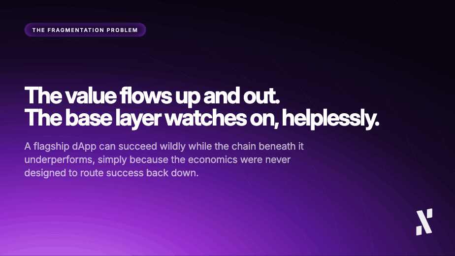
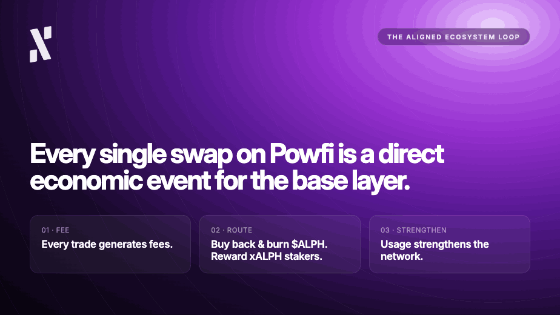

*By Pepper, Head of Marketing at Alephium*

*The views expressed in this column are solely those of the author, and may not reflect the official stance of Alephium.*

- - -

[Polymarket](http://www.polymarket.com) had a remarkable year in 2025, and its growth has continued well into 2026. 

The prediction market reached approximately $3bn in revenues this year (over $1bn on Polymarket alone), and is expected to reach $10bn by 2030. Since it has already established itself as one of Web3's most useful and interesting creations, I’d say those estimates are pretty conservative. Liquidity is deep, user numbers keep growing, and prediction markets touch a much wider audience than just crypto. The proof is in the pudding, with prediction volumes surging during the 2026 FIFA World Cup.

Polygon's [$POL](https://coinmarketcap.com/currencies/polygon-ecosystem-token/) token (recently renamed from $MATIC), during the same period, unfortunately went the other way.

I want to be extremely careful here, because I am absolutely not throwing stones at a team that has built some of the industry’s most admirable infrastructure. What I’m simply doing is making a structural observation about fragmentation that the DeFi industry has been curiously reluctant to examine. My question is, how can a flagship dApp on a major Layer-1 network succeed so wildly while the token of the underlying chain fails to reflect it? 

These two outcomes are far from contradictory. As I’ll explain in this article, current Layer-1 architecture often leads to this awkward and fragmented conclusion.

## The Fragmentation Problem Has a Name

I have spent almost nine years in this industry, and in that time I’ve watched the same pattern repeat across multiple cycles. It’s now so consistent and repetitive that it has stopped feeling coincidental.

Here’s my take on what keeps happening:

1. A Layer-1 blockchain attracts developer talent, builds an ecosystem of applications, and generates genuine usage.
2. The L1 then watches the value of that activity leave through the top of the funnel, enriching application-layer tokens and liquidity providers without strengthening the base layer.

The technical term for this is fragmentation. It leads to a native coin or token that does not benefit from the network it was supposed to underpin, and as you know from our communications about Powfi, this is something that we believe we have a solution to.

Think about what this kind of fragmentation means for long-term holders:

* You believe in a chain. 
* You hold its coin through difficult periods. 
* Talented teams build useful products on top of it.
* Real volume and revenue are generated.
* Your position still underperforms (because the economic model was never designed to route that success back downward). 
* The value flows up and out. 
* The base layer watches on helplessly.

This is not a Polygon-specific failure. Actually, far from it. It’s just the example I’ve chosen for this column. As far as I’ve researched, it primarily plagues Layer-2 ecosystems built on Layer-1 chains like Ethereum, Solana, and BNB Chain.

Using a platform like Polymarket requires users to hold the platform’s token (usually equity or native fee-earning). dApps, however, rely on a hybrid off-chain matching and on-chain settlement architecture, meaning they offload execution to the underlying chain (like Polygon) but mandate that users transact in stablecoins like USDC to minimise market risk. This means that application tokens often end up being used for governance or speculation, with little to no fundamental tie to the underlying blockchain’s blockspace revenue.

As they say, those who cannot remember the past are condemned (or doomed) to repeat it. Fortunately, Alephium developers are acutely aware of this issue, and have designed Powfi in such a way to tackle it.

## Why the Industry Has Not Fixed It

The reason this pattern persists is not about incompetence at all. Most of the teams building Layer-1 networks are technically brilliant with superior development skills. The reason is more to do with sequencing.

Put yourself in the shoes of an L1 builder. When you are racing to attract developers and capture ecosystem share, you prioritise composability, tooling, and grants. That makes economic alignment between the application layer and the protocol level a second-order problem. Basically, you’ll solve it later, except that later often never comes. 

By the time the ecosystem is mature enough to revisit the economics, the structural decisions have already been made. Application tokens have their own communities, their own incentive structures, and their own reasons not to route value back to the base layer. And so, the window for alignment closes, with builders convinced that it doesn’t really matter as long as their TVL keeps climbing.

I watched this happen across multiple ecosystems during my time in this industry. It made me increasingly convinced that the chains worth building on in the long run are the ones that go to greater lengths to engineer the alignment. Some do this from the start in their architecture and some as a kind of retrofit or governance proposal. 

*We are doing it with Powfi.*

## What Alephium Built Instead

As we’ve shared on social media and on [this news page](https://alephium.org/news/post/from-scalable-infrastructure-to-aligned-economics/), the “**Aligned Ecosystem Loop**” is at the core of what Powfi will do, and I want to reiterate it plainly because this name risks making it sound more complicated than it is. In reality, I think it’s quite simple:

1. Every trade on Powfi will generate fees. 
2. Those fees do not stay at the application layer. 
3. A percentage is used to buy back and permanently burn $ALPH. 
4. Another percentage is distributed to xALPH stakers. 
5. Every single swap becomes a direct economic event for the base layer. 
6. Therefore, usage does not just enrich the dApp, but strengthens the network.

The mechanics are elegant, but I think it’s the principle that matters more. It means that Powfi winning and $ALPH winning are not parallel tracks, but the same track. If they both win, the network, its participants, dApp builders, and their users, all win. That is what we mean by delivering an “Aligned Ecosystem Loop” through on-chain mechanics.

## Conviction Under Pressure

I have been at Alephium almost a year now, plenty of time to see how the team resist real pressure to rush, cut corners, or prioritise short-term liquidity incentives over sustainable economics (or pivot to AI, as many projects have decided to do). The patient, publicly documented development process before mainnet has been a deliberate choice, even if shipping sooner might have been a more popular decision.

For me, it’s quite clear that a flywheel that is not engineered correctly does not spin as it should. It is incredibly difficult to retrofit alignment into a model that was designed without it, but not impossible if done well and with heaps of logic. The sequencing and architecture are both critical. The decisions made at the start are vital to what becomes of a chain, but it’s never too late to find innovative ways to drive better economic alignment through updated architecture.

Polymarket's success is impressive and I respect what they have built, but the fact that it has not compounded meaningfully for $MATIC/$POL holders is a shame for its builders and holders. It is not, however, a reflection of bad intentions on anyone's part, it’s just the reality of structural decisions made early, baked in, and now extraordinarily difficult to reverse.

## The Pattern Is Everywhere

The Polymarket and Polygon dynamic is far from an edge case, but persists as the dominant pattern in DeFi right now, playing out across dozens of ecosystems. Most Layer-1 networks are running that same model and hoping the economics will eventually sort themselves out.

Take [Pump.Fun](https://pump.fun/) as another example that basically extracts absolute liquidity. The memecoin launcher processes massive daily transaction volumes, generating millions in fee revenue. However, because Solana fees are just fractions of a cent, very little $SOL gets burnt. That means the millions in platform revenue go to the platform’s creators, effectively draining liquidity out of the Solana ecosystem instead of locking it into $SOL.

Another example, this time on BNB Chain, is the popular DEX [PancakeSwap](https://pancakeswap.finance/). This platform also generates massive trading fees, however, because it uses $CAKE for its economic engine (yield farming rewards, lottery tickets, governance, etc), a trader only needs a tiny amount of $BNB to pay for gas. As a result, all substantial ecosystem value loops speculatively back into $CAKE.

Think of any game built on any chain. It never uses that chain’s token for in-game transactions, but just uses it as a database to log assets. The developers create their own token and isolate the in-game economy, meaning the thousands of micro-transactions for battling, crafting, or trading items, offer zero economic benefit to $BNB.

## Fragmentation Can Still Be Solved

Some will find ways to address it, others won’t. Those chains that built alignment into their architecture from the very beginning boast a structural advantage that is not yet fully understood. I believe that as ecosystems mature and the misaligned models run into their natural ceilings, this difference will become harder to ignore.

The market data makes its case eventually… *it always does.*
