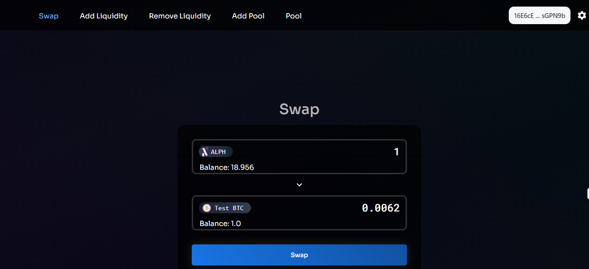

#### Proof-of-Concept to showcase dApps building on Alephium

Alephium is excited to announce the release of a DEX prototype!

You can access it here:  🔗[https://github.com/alephium/alephium-dex/tree/master/contracts](https://github.com/alephium/alephium-dex/tree/master/contracts)

While this prototype is not meant to be a production-ready project, it is an excellent sample of what can be built on Alephium.

The core devs have written and tested the contracts extensively to ensure their reliability and efficiency. The community should find them easy to fork and use as a starting point for their own projects.

To showcase and test the prototype, a very simple UI is available. You can access it here: [https://alephium.github.io/alephium-dex](https://alephium.github.io/alephium-dex)

_Please note that the UI is provided for testing convenience purposes but isn’t meant as a demonstration of the intended user experience of production-ready applications on Alephium. When building the prototype, the focus_ **_was exclusively on the contracts and ensuring a reliable base_** _for people to build on._

---

### How to interact with the DEX via the UI

To connect with the DEX on Testnet, you need first to install the Alephium browser extension wallet:

#### **Download the extension wallet**

🔵 [Google Chrome store.](https://chrome.google.com/webstore/detail/alephium-extension-wallet/gdokollfhmnbfckbobkdbakhilldkhcj)

🟠 [Firefox Store.](https://addons.mozilla.org/en-US/firefox/addon/alephiumextensionwallet/)

More details [about the extension wallet](/news/post/alephium-launches-browser-extension-wallet-706dfeda98f5).

#### Creating an address in group 0

Once the extension wallet is installed, connect to the Testnet (you can change the network you’re connected to on the top right of the extension).

Once on the Testnet, make sure to create or use a wallet with an address in group 0 to be able to connect to the DEX.

#### Connecting to the DEX

Go to [https://alephium.github.io/alephium-dex](https://alephium.github.io/alephium-dex) click on “Connect Alephium,” and choose “Extension Wallet” from the options on the pop-up.

After connecting, the first page is the “Swap” page, where you can select the cryptocurrencies you want to exchange.

#### Requesting test \$ALPH

Don’t have \$ALPH in your wallet? You can request some right from the wallet! Click “Add funds” on the main page and then “Request \$ALPH”. You will receive 12 Testnet \$ALPH in a few minutes.

Now you have everything you need to make your first transaction on the Alephium DEX! Use your \$ALPH to buy Test BTC, and then try the other sections of the DEX or transfer it to a different address!

---

Alephium believes that the future of decentralized finance lies in community-driven development, and it is committed to providing the tools and resources necessary to enable this growth. And this DEX prototype is seen as one of these resources, which aims to inspire the community to build innovative and impactful projects on Alephium.

Thank you for your continued support! Alephium looks forward to seeing what the community will create with this prototype.

If you need assistance, you are welcome to reach out in the community channels on [Discord](/discord), [Telegram](https://t.me/alephiumgroup). And follow [@alephium on Twitte](https://twitter.com/alephium)r to stay up-to-date.
