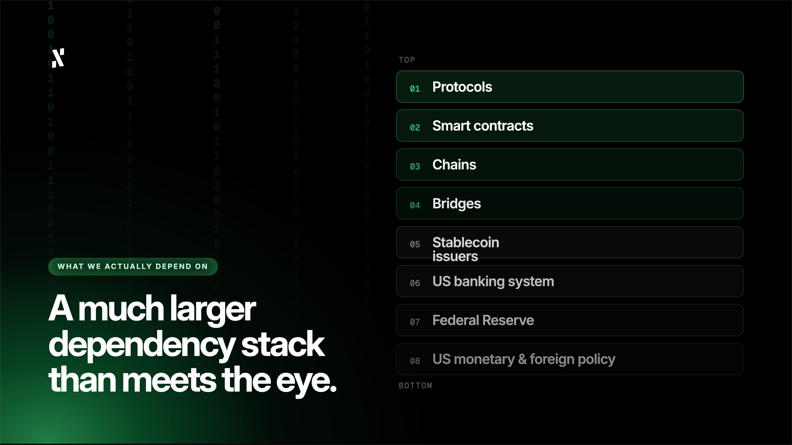

**Column by Pepper, Head of Marketing at Alephium**

*The views shared belong to the author alone and may not represent the official views or position of Alephium.*

- - -

I use stablecoins, a lot. I hold them and spend them via crypto card, and I have done for years. I likely won’t stop any time soon. I also watched on with awe as the Linx protocol [posted](https://x.com/linx_labs/status/2051201188386013381) 91% USDT utilsation rates, becoming arguably Alephium’s standout dApp in the process. This is all possible because stablecoins work.

Back when I first got into crypto at the tail end of 2017, they were growing in popularity as a way to onboard new DeFi users who wanted to continue to think and trade in fiat terms. It led to reduced volatility for liquidity providers, and quickly enabled a generation of financial products that probably wouldn’t have worked (or flourished) with native assets alone. 

I tell you these things because I don’t want you to think this article is a criticism of stablecoins. It is more of a question about whether stablecoins are aligned with the original cypherpunk vision for the crypto industry. In [Eric Hughes](https://cdn.nakamotoinstitute.org/docs/cypherpunk-manifesto.txt) “*A Cypherpunk’s Manifesto*”, published in 1993, he was not envisioning a faster payment rail for central governments, TradFi, or the Federal Reserve. As for Satoshi, he built Bitcoin as a technological response to the financial crisis and the institutions which caused it (the same institutions that underpin the dollar). Neither of them mentioned stables.

If you’ve been following the wider crypto industry, you have probably noticed that DeFi has become a stablecoin-first ecosystem, rather than an infra-led one. My feeling is that this was not what Hughes and Satoshi had in mind. So, the question I want to ask, and will try to answer in this article, is whether this is the destination for crypto, or whether it’s just a stopping point along the way. 

## What the Cypherpunks Intended to Build

From what I understand, the cypherpunk movement was anti-surveillance, anti-centralisation, and anti-system, or at least anti-any system where a single entity could monitor or freeze transactions. Therefore, it was never an anti-money movement. The cypherpunks wanted guarantees from physics and maths, instead of laws or institutions (which had proven corrupt or unreliable).

One of the core beliefs was that privacy and secrecy are not the same thing. Privacy is the power to selectively reveal yourself to the world. The difference between anonymous and pseudonymous might be one of the best examples of this. That’s why the cypherpunks, like Satoshi, had no qualms building a financial system where every transaction is visible. 

Bitcoin was designed to be peer-to-peer, with no trusted third parties, all settled by cryptography rather than some centralised authority. No part of this ever considered trying to make dollars move faster, but rather to make the dollar’s intermediaries completely unnecessary. 

## Stablecoins’ Unfortunate Inheritance

Let me start with USDC, issued by Circle (a US-regulated company). It can be (and has been at times) blacklisted at the wallet level. Most of its reserves are spread between US banks and Treasury instruments. USDT is in the same boat, and like USDC, it has faced years of questions about the composition of its reserves. Both, ultimately, are backed not just by dollar reserves, but by issuer trust, the regulatory environments they operate in, and the reliability of the dollar itself. 

With all of those points considered, a DeFi industry primarily denominated in dollar-backed stablecoins has a much larger dependency stack than meets the eye. Here’s what I think that stack looks like right now (see image below).

Is it decentralised? No. Is it permissionless? Not entirely. It’s fast though, which is obviously very valuable. However, I think the cypherpunk idealists were trying to build a freer system, not a faster one. I’m not sure they’d have envisioned this outcome, and I don’t know how they’d feel about it. I am left with questions.

## My Honest Question

I don’t want this to tip into an ideological purity debate, as I don’t think that’s very useful to anyone, especially not you, reader. So let’s stick to what we know, such as the fact that most people in the world transact in currencies pegged to nation states. That’s the “normal” way of doing things, since holding volatile native assets as the primary medium of exchange is unrealistic. I don’t think it’s even necessary for the cypherpunk vision to succeed.

Cypherpunks write code, and “code” doesn’t specify which tools people should use. It’s more realistic to assume that cypherpunks care more about what options exist and how accessible they are. That’s likely why so many cypherpunks are involved in open-source development. It’s also why I don’t think many cypherpunks would have a huge objection to stablecoins (although they may have a preference for algorithmic ones, which have so far been a failure).

Stablecoins become contentious when you ask if the infrastructure being built gives people a genuine or practical choice about participating in crypto outside of the dollar’s orbit. What I mean to say is, are we building a system where the choice exists in theory, but the architecture has been optimised so thoroughly and obviously around stablecoins that native assets become second-class assets? That’s what I suspect is happening right now.

## The Architecture Speaks Volumes

You might be wondering how this is relevant to Alephium. The answer is that the base layer **always** matters. In some of my columns you’ll notice that I continue pointing towards the importance of a native asset with real economic weight. 

On a PoW chain with a productive native asset, where staking rewards come from swap fees (rather than inflation), and where holding the coin is actual participation in the economic output of the network, you find something that stablecoins are lacking. You find a financial instrument that does not inherit the dollar’s dependencies. That doesn’t mean it’s better than the dollar, but that it exists outside of the dollar’s system entirely, in a world of its own.

Of course, stablecoins are part of the Alephium ecosystem, and are used on several dApps. That’s great, because there are options. Even the aligned ecosystem loop that we are working towards does not exclude or impact stablecoins. But, when I talk about $ALPH becoming a staking asset on Powfi, earning real fees from protocol activity, I see it being much more aligned with the cypherpunk vision. That’s because it becomes an alternative that works, that anyone can access, and whose guarantees are based in math and code.

## The Work Is Far From Finished

Cypherpunks didn’t want to destroy the dollar, its users, or force the world to transact in volatile assets. Quite the opposite really, it was an intention to ensure that cryptographic alternatives existed, functioned reliably, and remained accessible to all. 

Without the dollar, there is no need for a dollar alternative. Without the traditional financial system, there’s no need for a decentralised financial system. Stablecoins are a kind of bridge between these two worlds, neither TradFi or DeFi exclusively, yet I believe their existence is pivotal. However, I don’t think the architectural work in DeFi will be finished until users are presented with a credible native economic layer that gives them real choices.

Financial sovereignty cannot be achieved unless there is the existence of something better, and that is why questions like these, and articles like this, must be asked. As I see it, stablecoins are part of the journey, but absolutely not the final destination. I hope you will agree, but I’d love to hear your thoughts on X.
