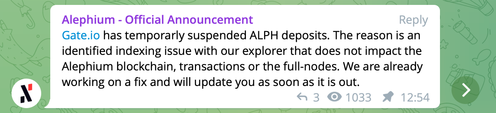

**What happened — Timeline of events?  
**At 11:58 CET on January 18th, 2022, user @Kanto explained on discord that he could not deposit funds on Gate.io « due to technical maintenance ».

At 12:27 CET, our core-dev acknowledged the problem, and explained we were in contact with Gate.io to solve the issue.

At 12:54 CET, an official announcement was made in the Telegram channel (and replicated on Discord) to provide information for the wider community :

At 20:06 CET, another announcement was made to explain that the fix was deployed and ready on Alephium's side.

Less than 24h after the discovery of the issue, deposits were confirmed to work again.

**What went wrong?  
**The issue was caused by a bug on the full node when updating the height index for orphaned blocks. There was a high load on both community pools last week, which caused abnormally high orphan block rate and triggered this bug.

Our explorer backend's indexing relies on this full node indexing, some of the orphan blocks were not marked correctly and this caused an issue for Gate.

**Severity?  
**Not critical : this index is only used for application endpoints. Funds remained safe during the whole incident, and the issue did not impact the Alephium blockchain, transactions or full-nodes.

**Solution?  
**The potential issue was identified previously, it was known that it had a very low probability of occuring (~35 / 1'500'000) that the update would not keep the orphaned blocks in the right order.

That allowed the team to quickly work on a fix, test it and deploy it. You can find it [here](https://github.com/alephium/alephium/pull/502).

Gate.io whose teams are on a very different timezone then had to pick it up on their side and reopen deposits. This was tested at 10:50 CET on January 19th and was working then.
