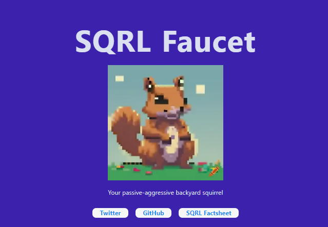

_After two weeks of intense coding, debugging, building & good vibes, teams or individuals have submitted their projects. While the jury is judging & because it doesn’t stop with the end of the hackathon, here’s a recap of all projects, with all the information & links to follow them as they keep evolving over the next few weeks & months!_

From Alephium’s core-contributor’s perspective, it’s been an incredible experience to imagine & organize that hackathon. But the event itself has been nothing short of absolutely fantastic.

We’ve felt our partners' warm and unwavering support, and we thank them for this. Bitmain, the Blockflow Alliance DAO, Cetacean Capital & Dappnode have contributed significantly to the pool prize.

The energy on all our channels has been intense & has electrified all of us, the builders and the ecosystem!

The Hackathon \#1 — Pioneers was a 14-day sprint during which developers gathered to hack and build on Alephium. They were allowed to apply across 3 main tracks or 2 types of bounties: existing or self-defined. More than 105 individuals applied from 21+ countries and divided themselves into 26 projects who valably submitted.

### Projects Submissions

Here’s the list of all submissions, with links to PoCs, dApps or tools when available. Some hackathon participants presented their projects in our third open-office, right after the hackathon closing, watch them [here](https://www.youtube.com/watch?v=2J-mwe9TN5s):

`video: https://www.youtube.com/watch?v=2J-mwe9TN5s`

#### LinxOTC — Main Track — dApps

**LinxOTC** is a platform for P2P trading and lending on  Alephium. Linx Labs, a well-known contributor to Kadena’s ecosystem, is adding p2p lending specifically during the hackathon, an Oracle free solution where people can lend and borrow from eachother.

**Links:** [Twitter](https://twitter.com/linx_labs) [Discord](https://t.co/KpsiZDSDfc) [Telegram](https://t.co/spY3IH1sRY) [Video Presentation](https://www.youtube.com/watch?v=2J-mwe9TN5s&amp;t=1168s)

#### Invariant DEX (CLAMM) — Main Track — dApps

**Invariant DEX** is a permissionless AMM DEX featuring a concentrated liquidity mechanism. The team has focused on prioritizing smart contract development and testing the programming capabilities of Alephium VM along with the Ralph programming language.

**Links:** [Website](https://invariant.app/swap) [Twitter](https://twitter.com/invariant_labs) [Github](https://t.co/PCUvmh1Zsv)

#### Phoenix Finance — Main Track — dApps

**Phoenix Finance** is implementing the hodl protocol, smart contracts and UI, on Alephium. Already live on Ergo, the Hodl protocol incentivizes locking ALPH in smart contracts for the longest period of time, increasing the TVL of the chain. It follows the mathematically proven principles presented in this [research paper](https://eprint.iacr.org/2023/1029).

**Links:** [Website](https://phoenixfi.app/) [Twitter](https://twitter.com/PhoenixErgo)

#### Donera — Main Track — dApps

**Donera** is a crowdfunding app like GoFundMe. The MVP includes creating a fund, donating ALPH to it, finalising and browsing active funds, and viewing and donating to an individual fund. The first funds exist already!

**Links:** [Twitter](https://twitter.com/Ross_Weir) [Github](https://github.com/ross-weir/Donera)

#### Alph.pro DeFi Dashboard — Main Track — dApps

**Defi Dashboard by AlphPro** is your one-stop shop for tracking a wide range of data on current users' holdings of tokens and NFTs, finding out about new token releases, new NFT collections, and much more.

**Links:** [Website](https://alph.pro) [Twitter](https://twitter.com/AlphdotPro) [Github](https://github.com/not-reed/alph.pro-defi-dashboard) [Video Presentation](https://www.youtube.com/watch?v=2J-mwe9TN5s&amp;t=1726s)

#### MereProof — Main Track — dApps

**MereProof (of existence)** computes a Merkle root for a set of files and stores its hash on Alephium for proof of existence.

A “proof file” has to be generated for each file in the Merkle tree to associate its hash with the metadata needed to verify that the file belongs to the tree. Then, the existence of each file at the time of the blockchain transaction can be validated using its associated proof.

**Links:** [Github](https://github.com/luxigo/mereproof/tree/hackathon)

#### NGU Land — Main Track — dApps

**Number Go Up** is launching a Richlist on [https://ngu.land/](https://ngu.land/). It is specifically geared towards coins built on top of Alephium. This is a beta release, so numbers from other coins than NGU may not be 100% accurate at this time.

**Links:** [Twitter](https://twitter.com/numbergoup_ngu) [Discord](https://t.co/vEzBhSIxiH) [Website](https://www.ngu.land/)

#### Chronoswap — Main Track — dApps

**ChronoSwap** is implementing a decentralized exchange (DEX) that enables seamless token trading and later cross-chain bridging. It allows users to participate in their protocol’s growth through staking actively.

Links: [Github](https://github.com/ChronoSwap-DEX/Hackaton-ChronoSwap) [Video Presentation](https://www.youtube.com/watch?v=2J-mwe9TN5s&amp;t=765s)

#### Alph Dabbler — Main Track — dApps

**Alph Dabbler** is a basic borrowing/lending app on Alephium using Aave’s interest rate curves.

Links: [Docs](https://docs.google.com/spreadsheets/d/1xC4cUNHIoYC6XPAUy10tURnotdBdq0yaXgG21oBHFbU/edit?usp=sharing) [Twitter](https://twitter.com/intrepid_crypto) [Video Presentation](https://www.youtube.com/watch?v=2J-mwe9TN5s&amp;t=2141s)

#### Squirrel / SQRL — Main Track — dApps

**Squirrel** is a faucet contract/website for the SQRL token.

**Links:** [Github](https://github.com/AdamCooke00/squirrelalph)

#### Alph.pro Indexer — Main Track — Tooling

**Alph.pro Indexer** started as a simple backend for a specific dashboard, however it has grown into an extensible plugin system where adding new ‘indexers’ for specific purposes (i.e. tracking ayin pool reserves) is quite easy. This info is exposed through a powerful rest API with swagger documentation with info about nfts, tokens, users and more

**Links:** [Twitter](https://twitter.com/AIphPro) [Video Presentation](https://www.youtube.com/watch?v=2J-mwe9TN5s&amp;t=1726s)

#### DEXTools/DEXScreener — Main Track — Tooling

**Rakku** is building a DEXTool-like platform with advanced token price charts. Its initial featureset includes tracking every transaction done for each liquidity pool and showing LIVE prices of tokens of the Alephium ecosystem. Rakku is running its Alephium full nodes on Flux.

**Links:** [Twitter](https://twitter.com/RakkuBetAleph) [Video Presentation](https://www.youtube.com/watch?v=2J-mwe9TN5s&amp;t=116s)

#### DISCORD TIPPER BOT — Main Track — Tooling

**Description:** Discord bot for tipping users on Discord channels

**Links:** [Discord](https://discord.gg/ngu)

#### 3DVisualizer & Stats dashboard — Main Track — Tooling

The **Alephium Blockflow Visualizer and Stats Dashboard** is a comprehensive suite of tools designed to enhance the understanding and accessibility of the Alephium blockchain. The project introduces a real-time 3D visualizer application that demonstrates Alephium’s sharding algorithm, Blockflow, along with a WebSocket stream that broadcasts newly minted blocks to developers as they occur. Additionally, they have developed a Proof of Concept application that displays static statistics of the Alephium blockchain, and a Python library that facilitates interaction with the Alephium Full Node API and Alephium Explorer API. All components of the project are open-sourced to encourage community engagement and development.

**Links:** [Website](https://visualizer.alph.land/) [Github](https://github.com/CodeBaristas/alephium-visualizer-frontend) [Twitter](https://twitter.com/fugashu_codes)

#### ABIExtractor — Main Track — Tooling

**ABI Extractor** is a Python tool on the Alephium Blockchain, designed to extract ABI JSONs and smart contract addresses from dApp JavaScript files. The tool automates the process of scanning dApp JavaScript code for embedded ABI JSONs, testing smart contracts using the identified ABI JSONs, and exporting the ABI JSONs.

**Links:** [Github](https://github.com/SkullElf/ABIExtractor-Alephium) [Twitter](https://twitter.com/BobbetBot)

#### ABI2API — Main Track — Tooling

**ABI2API-Alephium** is a Python library for “converting” smart contract ABI (Application Binary Interface) on the Alephium blockchain into a RESTful API. It allows developers to expose the functionality of a smart contract through a simple API interface, making it easier to interact with Smart Contracts.

**Links:** [Github](https://github.com/SkullElf/ABI2API-Alephium) [Twitter](https://twitter.com/BobbetBot)

#### AirBrain AI — Main Track — Tooling

**AirBrain A**I works on the creation of an on-chain GPT-powered Decentralized Generative AI Agents.

Link: [Github](https://github.com/georgesmith9914/airbrain-builder-python-backend)

#### Starfish Identity — Main Track — Interoperability

**Starfish Identity** uses a DID Registry to manage public keys for off-chain authentication, message verification and web3 profiles.

**Links:** [Website](https://starfish-f3983.web.app/) [Video Presentation](https://www.youtube.com/watch?v=2J-mwe9TN5s&amp;t=2780s)

#### Sezame Oracle — Main Track — Interoperability

**Sezame Oracle** worked on building the first oracle on Alephium network providing real-time web 2.0 and cross-chain data feeds. Bridging gaps between blockchains and the real world. Unlocking limitless potential for decentralized applications on ALPH.

Links: [Github](https://github.com/maze2-org/alephium-oracle-hackathon) [Video Presentation](https://www.youtube.com/watch?v=2J-mwe9TN5s&amp;t=2323s)

#### Merkle tree proof for allowlist — Bounties

Merkle trees are essential in blockchain and dApp development, they facilitate implementations where the entire set of data can’t be stored on chain and a solution is needed to verify a set of data exists and is valid without having the entire dataset for verification purpose.

The implementation is inspired by [OpenZeppelin ETH](https://github.com/OpenZeppelin/openzeppelin-contracts/blob/master/contracts/utils/cryptography/MerkleProof.sol) library, in an attempt to provide a standardized reliable implementation of merkle proofs on Alephium

**Links:** [Github](https://github.com/krk0d3r/alephium-merkle-proofs) [Twitter](https://twitter.com/krk0d3r)

#### TipAlph— Bounties

**TipALPH** was built by No Trust Verify. It is a tipping bot for Telegram, similar to LightningTipBot for Alephium.

**Links:** [Twitter](https://twitter.com/notrustverif) [Telegram](https://t.me/TipALPHBot) [Video Presentation](https://www.youtube.com/watch?v=2J-mwe9TN5s&amp;t=394s)

#### Alph.pro Discord Bot — Bounties

**Alph.pro Discord Bot** is a bot aiming to be a ‘one stop shop’ for discord helpers to provide token prices and details, LP info, and more. Try it out in [What The Duck discord](https://discord.gg/pfcR8EQZjb).

**Links:** [Twitter](https://twitter.com/AlphdotPro) [Video Presentation](https://www.youtube.com/watch?v=2J-mwe9TN5s&amp;t=3205s)

#### Noodz — Track — Bounties

**Description:** Noodz’s mission is to support the growth of the Alephium community through memes and open-source code. For the hackathon, they have worked on 4 contracts: Airdrop Contract, Initial Coin Offering (ICO) contract, Coin Flip Contract, Pinko Contract. They have since completed their ICO and released their first token builder app.

**Links:** [Twitter](https://twitter.com/NoodlesAlph) [Telegram](https://t.me/NoodlesToken)

#### Alph.pro Vending Machine — Track — Bounties

**Description:** Fun NFT office snack dispenser for your next online office meeting. Buy any amount of each food offered as long as they are still available. As of writing, beer & popcorn & pizza are sold out!

**Links:** [Website](https://snacks.alph.pro/) [Twitter](https://x.com/AIphPro) [Video Presentation](https://www.youtube.com/watch?v=2J-mwe9TN5s&amp;t=1607s)

#### Simple DAO — Track — Bounties

**Simple DAO** is a repository that allows an organization or community to easily configure and deploy a DAO and its users to publish proposals, motions, and votes. Governance rules can also be applied (quorum, majority, vote duration, etc.).

[Gitlab](https://gitlab.fbo.network/alephium/daokit)

#### Use Toll — Track — Bounties

Use Toll is a proxy which sets a toll in ALPH to monetize a website. The user can pay for hourly, monthly access or other different configurations.

**Links:** [Gitlab](https://gitlab.com/usetoll/gateway) [Website](https://usetoll.com/)

### Next steps

The hackathon has been a humbling and exciting experience. Many of the builders are actually using what they built during those two weeks to produce more polished products. The jury is now reviewing every submission (as are the partners) and will soon announce the winners.

That was just the first hackathon in the Alephium Ecosystem. More will follow. In the meantime, if you’re building something and need a grant, access the [Alephium Community Grants &amp; Reward Program page](https://github.com/alephium/community/blob/master/Grant%26RewardProgram.md)!

If you are an aspiring builder, start [here](https://twitter.com/alephium/status/1752028946399654269)! If you have questions, ping us on [Discord](/discord) in any of the devs channels. You can also reach us on [Telegram](https://t.me/alephiumgroup) & follow [@alephium on Twitter](https://twitter.com/alephium) to stay up-to-date.
