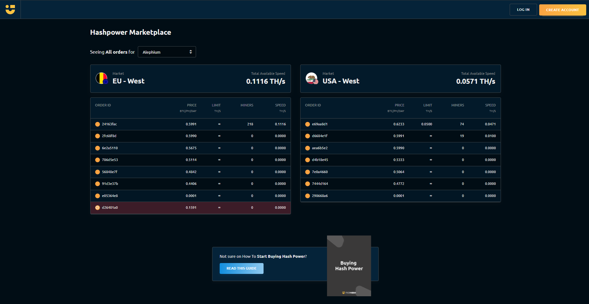
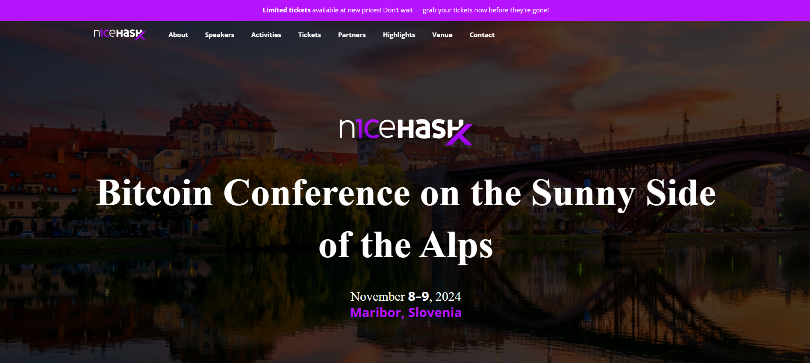

_The blockchain hashrate is directly correlated with network security. As a Proof-of-work blockchain, Alephium relies on active ecosystem actors to sustain and improve Alephium’s reliability. This series is about them, and we are starting it with Nicehash!_

#### Can you tell us a bit about Nicehash? When was it founded? By whom? Where? And why? Can you tell us a bit about its history?

<a href="https://www.nicehash.com/" >NiceHash</a> was founded in 2014 by two university students in Slovenia, and we are the world’s leading hashrate marketplace, with an open platform for buying and selling computing power for mining cryptocurrency. We were founded in response to many of the cloud mining scams in the early days of mining, as an open, transparent alternative to those sites.

We are actually celebrating 10 years of our company this year! As a Bitcoin-focused platform, we provide a complete ecosystem of mining, software, hashrate and payment solutions, with the goal of accelerating cryptocurrency adoption worldwide.

#### Seeing that in the recent cycles, PoW seems to be losing steam, can you elaborate on why you keep believing in proof of work? Do you intend to keep it as your main business? How do you see the PoW space evolve over time and in the near future?

Proof of Work is not losing steam in my opinion, quite the opposite. It’s true that many new crypto projects opt for something different, but the Proof of Work projects are the ones that are still here and going strong. Bitcoin has proved that PoW works, and it’s on track to become the biggest change to the financial world ever, with the ETFs backing it. This is because you cannot replace the work done with anything else, it turns energy and time into money. With other systems like Proof of Stake, it is the same as the current banking system, money makes money. Proof of Work proves there is an alternative.

#### How does a company that primarily operates in mining see the rise of POS protocols? Have you seen a significant impact on the space? Is it a market segment you are considering?

We actually see the core of mining remaining on Proof of Work. Projects like Ethereum, which moved away from it, have gradually stagnated. Granted, they offer a lot of possibilities with side chains and multiple layers for developers, but at the end of the day, the biggest coin is still Proof of Work, and that is not going to change. We are not interested in Proof of Stake as we support the miners; PoS goes against the original ethos of cryptocurrencies.

#### Can you share with us how you first discovered Alephium? How do you see the community of Alephium miners? What made you guys decide to add Alephium to your platform?

I remember hearing about Alephium in 2021 when GPU miners knew the merge was coming for Ethereum and were already starting to look for alternatives and Alephium was one that was talked about.

I admire the Alephium community, as they truly support each other and advocate for the project. We wanted to onboard Alephium as soon as possible, but with the nature of our open hashrate market we are conscious of making sure there is enough network hashrate, to avoid centralization. We are happy to now <a href="https://www.nicehash.com/my/marketplace/ALEPHIUM" >have it available</a>.

#### With your current multi-cycle mining experience, what’s your outlook for this one? How would you advise people to stay updated with mining trends and evolutions of the market? Can you give an example of how a recent trend affected a mining decision?

This cycle is very interesting as the whole cryptocurrency market now has a different image for the general public, in part due to institutional investment in ETFs, etc. This made the BTC halving quite different from previous ones, and it impacted the rest of the mining, too. To stay updated, I would say follow the biggest miners on X/Twitter (and NiceHash, of course!) and the big crypto conferences. These are the places where you hear the news first. In regards to a recent trend, I think Kaspa influenced a lot of miners recently as they were recently adopted by giants like Marathon, so that really says something about the tenacity and potential for mining.

#### Recently, the first ASICs arrived at Alephium. This leads to a sharp increase in hashrate. Where do you see GPU mining in the next few years? What do you think about ASICS coming on Alephium?

ASICs coming to Alephium is very interesting, I think as long as the code allows for other miners to still participate then this is a big advantage for security, since it increases the hashrate, and also incentivizes bigger miners to get involved like we saw with Kaspa recently. I think it will benefit Alephium a lot, although we always hope that GPU miners will still be able to participate profitably in any project since it opens it up to more people. There will always be some GPU mineable projects around, but with the money people can get from renting out to AI now it might not be as important in the future.

#### Anything else you’d like to share with the community?

We’d love to invite everyone to our <a href="http://www.nicehashx.com" >Conference</a> this November to learn all about cryptocurrency and how you can use it in your business or e-commerce. We'd also like to celebrate 10 years of NiceHash! We would love to see the Alephium crowd there!

_Twitter & other socials links:_ <a href="http://www.nicehash.com/links" ><em>www.nicehash.com/links</em></a>

_Website:_ <a href="http://www.nicehash.com" ><em>www.nicehash.com</em></a>

---

That is the end of this interview! If you are interested or have extra questions, you are welcome to reach out on our [Discord](/discord), or in the <a href="https://t.me/alephiumgroup" >Alephium Telegram channel</a>. Don’t forget to follow <a href="https://twitter.com/alephium" >@alephium on Twitter</a> to stay up-to-date.
