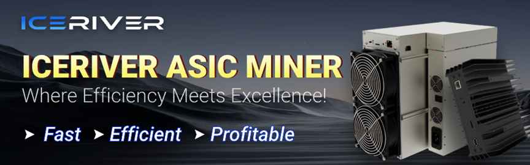
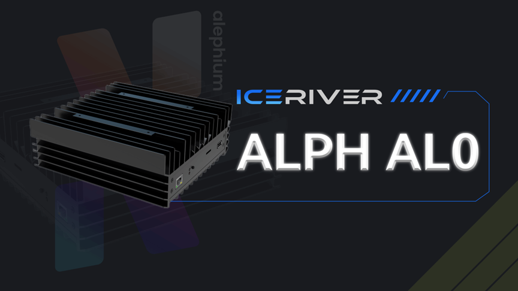

_The blockchain hashrate is directly correlated with network security. As a Proof-of-work blockchain, Alephium relies on active ecosystem actors to sustain and improve Alephium’s reliability. This series is about them, and after_ [Nicehash](/news/post/hashrate-series-1-nicehash-ee0936adf899), [Goldshell](/news/post/hashrate-series-2-goldshell-93cc51a86640)_, and_ [CryptoHall 24](/news/post/hashrate-series-3-cryptohall-24-7ad1533701f4)_, please welcome ICERIVER._

> Can you introduce yourself and share the story of Iceriver? When was it founded & where? It’s relatively more recent than most ASIC manufacturers. How has been your journey so far?

**ICERIVER**: The story of [ICERIVER](http://iceriver.io) began with a passion for crypto mining technology and a keen insight into market demands. Our company was founded in 2019 and is headquartered in Hong Kong. As a relatively new ASIC manufacturer, we are dedicated to providing cryptocurrency miners with efficient and stable mining solutions, while upholding our vision that “Crypto mining should be accessible to everyone.” Through innovative hardware solutions, we aim to enhance the performance and efficiency of mining machines, while lowering the barriers to mining, enabling more people to participate and truly realizing the decentralization of blockchain.

With the launch of our first miner, we quickly gained recognition in the market. Our products have been widely praised by miners for their superior performance and cost-effectiveness, helping us establish a strong market reputation. Since then, we have continuously optimized our products and services to meet the diverse needs of different markets and customers.

The future of ICERIVER is filled with opportunities and challenges. We look forward to continuing to drive industry progress and providing miners and investors with more value and opportunities.

> It’s a tough market in ASICs manufacturing! How do you differentiate yourself in such a competitive market?

**ICERIVER**: In the highly competitive ASIC manufacturing market, we focus on research and development to ensure our mining machines excel in performance, stability, and energy efficiency. Our products are among the most cost-effective on the market, which is a major attraction for customers. Additionally, we have launched different models to meet the needs of miners in various scenarios. By offering a diverse range of product options, miners can choose the most suitable machines based on their specific situations. We closely monitor market trends and customer feedback, continually adjusting our product strategies and improving designs. Our flexible market strategy allows us to quickly adapt to industry changes and seize new opportunities.

We also place great emphasis on ecological collaboration with projects, promoting technological development and ecosystem building in these networks. Through close cooperation with core teams and the community, we have enhanced our products’ market recognition and technical compatibility.

> It seems you have a line of products specifically designed for home miners. Most ASICs are usually conceived for bigger, more professional operations. Can you tell us more about why you are targeting the home miner market?

**ICERIVER**: Our vision is to make crypto mining more widespread and accessible. By designing dedicated mining machines for home miners, we aim to lower the entry barriers, allowing more individuals to participate in cryptocurrency mining. We have noticed that as cryptocurrencies become more popular, an increasing number of individuals are interested in mining. However, traditional ASIC miners are often large, power-hungry, and noisy, making them unsuitable for home environments. Therefore, we have introduced miners specifically designed for home environments, featuring compactness, quiet operation, and low power consumption.

Beyond traditional mining farms and professional miners, we see great potential in the home miner market. Home miners typically need equipment that is both efficient and non-intrusive to their daily lives. Thus, our home mining equipment is designed with an emphasis on quiet operation, low power consumption, and ease of use, ensuring users can mine comfortably and safely at home.

Home miners are often active members of the cryptocurrency community, participating not only in mining but also in the promotion and support of various blockchain projects. By providing specialized equipment for home miners, we aim to further promote the growth of these communities and enhance users’ sense of identity with cryptocurrencies.

We believe that with the involvement of individual users, the entire cryptocurrency ecosystem will become more diverse and robust.

> What major trends are you currently observing in the global hashrate market, and how is Iceriver adapting its strategy to align with these trends? With the ongoing debate between PoW (Proof of Work) and PoS (Proof of Stake), what are Iceriver’s thoughts on the future of PoW networks?

**ICERIVER**: Firstly, there is the concentration and specialization of hashrate. As mining difficulty increases and the industry matures, hashrate is gradually concentrating in large mining farms and among specialized miners. This means that the demands for mining machine performance and efficiency are higher. ICERIVER helps miners maintain an edge in this competitive environment by developing efficient and energy-saving ASIC miners. We are dedicated to improving the hashrate to power consumption ratio, allowing miners to operate more efficiently and reduce mining costs.

Secondly, there’s the demand for environmental protection and energy efficiency. As global attention to environmental issues and energy efficiency grows, miners and investors increasingly focus on equipment's energy efficiency. ICERIVER actively responds to this trend by developing low-power, high-performance miners to meet market demand for energy-efficient devices. Our product designs focus on improving performance and reducing energy consumption and carbon footprints, promoting sustainable mining practices.

Lastly, there is the rise of home miners and individual users. While large mining farms dominate global hash power, we also see growing market demand from individual and home miners. To cater to this trend, ICERIVER has developed compact mining machines suitable for home environments. These devices are designed to be compact, easy to operate, and low in power consumption, making it easier for individual users to participate in mining.

Despite the significant attention that PoS has received in some blockchain projects, we continue to believe in the long-term value of PoW networks. PoW networks offer unparalleled security and decentralization, maintaining a crucial position in the cryptocurrency ecosystem. ICERIVER will continue to support PoW networks and optimize our mining machines to ensure miners can achieve the best possible returns from these networks.

> Energy efficiency is becoming increasingly critical in the mining industry. How is ICERIVER addressing the demand for more energy-efficient mining solutions?

**ICERIVER**: When designing our miners, energy efficiency is one of our core considerations. ICERIVER’s miners utilize advanced chip technology and optimized circuit design to maximize hashrate output while minimizing energy consumption. This approach not only helps miners reduce electricity costs but also decreases environmental impact.

Looking ahead, we plan to develop immersion cooling and liquid-cooled miners. These technologies can significantly enhance cooling efficiency and reduce the energy consumption associated with traditional air cooling methods. Through these innovative cooling solutions, our goal is to further improve the energy efficiency of our miners, providing miners with more energy-saving and environmentally friendly mining solutions.

> Recently, you’ve begun supplying ASICs for Alephium. How did you first discover Alephium, and what drew your attention to it?

**ICERIVER**: Our initial discovery of Alephium came through in-depth research into the market and emerging projects. Alephium attracted our attention as an innovative PoW project due to its efficient Blake3 hashing algorithm, unique sharding architecture, and smart contract capabilities, which make it stand out among other PoW projects. These technological advantages give Alephium significant potential not only to enhance blockchain scalability and security but also to provide more economic incentives for miners and developers.

> As we delved deeper into understanding Alephium, we were further impressed by the team’s dedication and technical prowess. The Alephium team is focused on research and development, striving to create a highly efficient and secure blockchain platform, which aligns closely with our pursuit of excellent performance.

**ICERIVER**: Additionally, Alephium has a highly active and supportive community, further reinforcing our commitment to the project. The community plays a critical role in driving project development, innovation, and ecosystem construction, which we highly value. Therefore, based on these factors, we decided to develop dedicated ASIC miners for Alephium to support the growth of its ecosystem.

> What was the process like in deciding to develop an ASIC for Alephium? What factors do you consider when evaluating a PoW chain to determine if it’s worth the investment?

**ICERIVER**: In deciding to develop ASIC miners for Alephium, we followed a rigorous evaluation process. First, we focused on the project’s technological innovations. Alephium’s use of the Blake3 hashing algorithm and unique sharding architecture sparked our interest. These technologies not only enhance the network’s security and scalability but also demonstrate the project’s long-term development potential.

Secondly, we assessed the capability and dedication of the project team. The Alephium team’s dedication to research and development and their commitment to technological innovation instilled confidence in the project. Moreover, the activity and support of the community were important factors in our consideration. A strong community can drive continuous project development and provide solid support for miners and developers.

Considering all these factors, we believe Alephium is a PoW blockchain worthy of investment and ASIC miner development. Therefore, we decided to allocate resources to design and produce high-performance ASIC miners to support the growth of its ecosystem.

> Can you describe & give us more details about the ICERIVER [ALPH AL0](https://www.iceriver.io/product/iceriver-alph-al0/)?

**ICERIVER**: ICERIVER ALPH AL0 is an ASIC miner specifically designed for the Alephium network, aimed at providing home miners with a high-performance, low-energy solution. The ALPH AL0 is designed with the home environment in mind, operating with extremely low noise levels that almost do not disrupt daily life. This makes it an ideal choice for home miners who need not worry about noise interference.

The miner features a compact design, making it easy to place in a home setting. It can easily fit in small spaces without occupying much room. The installation process of the ALPH AL0 is very straightforward, allowing even novice miners to set it up with ease. We have optimized the user interface to enable users to start mining quickly without the need for complex technical support.

In addition to its excellent hash rate, the ALPH AL0 is highly energy-efficient, meaning it doesn’t place a significant load on household electricity resources, helping home miners reduce electricity costs. The design intent of the ALPH AL0 miner is to enable more home miners to easily enter the cryptocurrency mining space and enjoy a premium mining experience that is both quiet and low on energy consumption.

> At some point, Proof of less work is going to kick in and it will have an influence on the hashrate market of Alephium. What’s your expectation for it?

**ICERIVER**: With the gradual implementation of PoLW, the network will dynamically adjust hash power based on demand, meaning that hash power may no longer grow linearly but rather be optimized according to the actual needs of the network. This will allow miners to allocate resources more efficiently and maintain network security while reducing energy consumption.

PoLW will help optimize miner reward distribution, reducing unnecessary energy consumption. This will enhance miners’ profit margins, especially in scenarios where costs like electricity are high, making Alephium mining a more sustainable option.

As PoLW is applied, Alephium’s hash power market may experience a more balanced competitive environment. Small-scale and home miners will be able to compete more effectively under this mechanism, participating in network maintenance and mining without solely relying on large-scale hash power investment.

Overall, we are optimistic about the future of PoLW, believing it will drive the Alephium network towards more efficient and sustainable development. We will continue to monitor the practical impact of this mechanism and adjust our products and strategies in response to market changes.

> Alephium is one of the few Proof of Work chain with a completely functional smart contract/dapps ecosystem. That allows for different economic incentives & dynamics than what we’re used to in other POW ecosystems, as miners can directly reinvest their rewards in an ecosystem built on top of the chain. How do you see that altering the mining market?

**ICERIVER**: The fully functional smart contracts and dApps ecosystem of Alephium introduces new economic incentives and dynamics to the PoW ecosystem. In traditional PoW ecosystems, miners primarily earn income from mining rewards. However, in Alephium’s ecosystem, miners can directly reinvest their mining rewards into smart contracts and dApps, providing additional economic benefits through this reinvestment mechanism. This approach transforms mining from simply earning rewards into participating in broader economic activities, enhancing miner engagement and involvement.

By reinvesting rewards into the ecosystem, miners become more invested in the long-term development and health of the network. This investment behavior promotes more ecosystem building and application development, thereby strengthening network stability and security. Miners’ reinvestment actions will support the development of more dApps and smart contracts, leading to more innovations and application scenarios. As the ecosystem expands, Alephium is likely to attract more developers and users, driving the growth of the entire ecosystem.

When considering reinvestment, miners will pay more attention to the long-term development prospects of the network and ecosystem. This focus may influence miners to consider network technological development and application prospects when choosing mining strategies and making investment decisions, thereby impacting the landscape and competitive strategies of the mining market.

Overall, Alephium’s smart contracts and dApps ecosystem will bring more innovative opportunities and economic incentives to the PoW mining market, fostering close collaboration between miners, developers, and users, further promoting the healthy development of the network and the prosperity of the ecosystem.

> Technically, did you encounter any unique challenges with our hashing algorithm, Blake3? Is Alephium the first chain for which you’ve created a miner using this algorithm, or have there been others?

**ICERIVER**: Blake3 is an efficient hashing algorithm, but implementing it in ASIC miners requires extensive optimization to ensure that the miners can maintain high performance while minimizing energy consumption. We have devoted significant research and development efforts to chip design and algorithm implementation to achieve optimal performance. Compared to traditional hashing algorithms like SHA-256, Blake3 has different computational characteristics. This requires us to consider specific hardware optimizations in the miner design to efficiently handle the computational tasks associated with Blake3.

Alephium represents our first ASIC product based on the Blake3 algorithm. This process has been an important technical challenge for us but also provided valuable experience and opportunities. Our implementation of Blake3 has not only enhanced our technical prowess in this field but also laid a solid foundation for similar projects in the future.

> Anything else you’d like to share with the community?

**ICERIVER**: ICERIVER is committed to staying at the forefront of mining technology and product design. We will continue to focus on technological advancements, driving industry innovation, and providing users with more efficient and reliable mining solutions. We highly value interactions with partners, developers, and the community. Through close collaboration, we can better understand market demands and user feedback, which helps us optimize our products and services. We are dedicated to offering mining products suited for various users, from home miners to large-scale mining farms, meeting diverse needs.

We encourage users to share their experiences and suggestions with us to help continuously improve and enhance our products. We are optimistic about the future and will continue exploring and supporting more innovative blockchain projects and technologies. Our goal is to advance the entire cryptocurrency industry and create more value for miners and users.

Thank you for the support and attention from the community. We look forward to growing and progressing together with everyone. If you have any questions or suggestions, please feel free to contact us at any time.

Twitter & other socials links: [https://x.com/IceRiverMiner](https://x.com/IceRiverMiner)  
Website: [www.iceriver.io](http://www.iceriver.io)

---

That is the end of this interview! If you are interested or have extra questions, you are welcome to reach out on our [Discord](/discord), or in the [Alephium Telegram channel](https://t.me/alephiumgroup). Don’t forget to follow [@alephium on Twitter](https://twitter.com/alephium) to stay up-to-date.
