<a href="https://medium.com/@alephium/alephium-continues-its-engagement-for-decentralization-and-partners-with-the-cloud-based-f9c5baebe5b2" >Alephium’s partnership</a> with <a href="https://medium.com/u/1c37e86f5d23" class="markup--user markup--p-user"  data-anchor-type="2" data-user-id="1c37e86f5d23" data-action-value="1c37e86f5d23" data-action="show-user-card" data-action-type="hover">Flux Official</a> to support Alephium’s full node running on a web3 cloud infrastructure is another step towards demonstrating decentralization as a core value. Find here a detailed walkthrough on how to set up a node with Flux.

### Flux — The Web3 Cloud

The Flux Cloud is a decentralized cloud computing system based on thousands of single servers worldwide. Each server provides computational resources and is rewarded with 50% of the <a href="https://runonflux.io/flux-nodes.html" >total block reward</a>.

There are plenty of advantages to using Flux instead of traditional Web2 infrastructure providers:

- All applications are redundant and have automatic failovers in case of outages.
- The Flux Cloud is agnostic to code language as it uses Docker Hub containers as the on-ramp.
- The Flux Cloud automatically keeps applications up to date with the respective container.
- The Flux Cloud offers uncompetitive pricing.

**Let's proceed with the guide on deploying your own Alephium Node via the Flux Marketplace!**

### Alephium node on Flux — a tutorial

Before following the tutorial, you will need to install the <a href="https://zelcore.io/" >zelcore wallet</a>, and own some FLUX (<a href="https://runonflux.io/buy-flux.html" >find how here</a>).

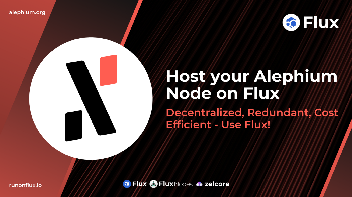

1.  First head over to <a href="https://home.runonflux.io/" >https://home.runonflux.io/</a>
2.  Once there, log in using your ZelID. It is an instance of the <a href="https://zelcore.io/" >Zelcore Wallet</a>.

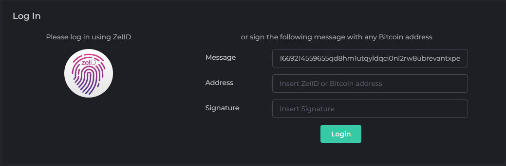

3\. Now that you are authenticated, head to the <a href="https://home.runonflux.io/apps/marketplace" >Flux Marketplace</a> and look for the **Alephium Node** Application. You will see something very similar to this:

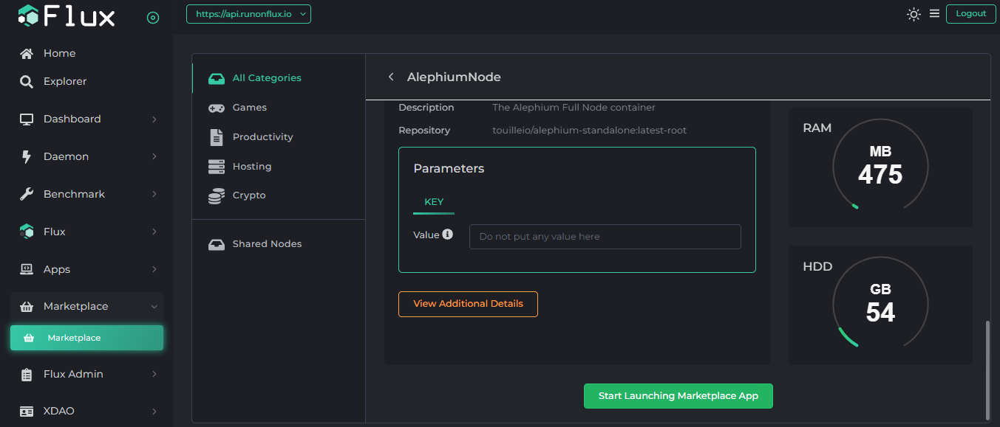

4\. Do not put any other Parameters and Click on the Start Marketplace App. The next screen will be like this:

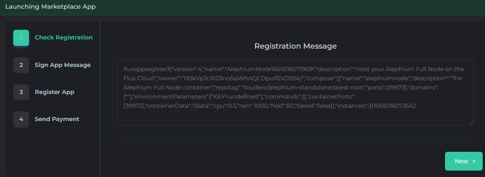

5\. You can click next or copy the **Registration Message** if you are signing the message manually from your ZelID App and then click next

6\. Here, you can click the fingerprint button to sign the request for the Application or manually paste the signed message on your ZelID from the previous step

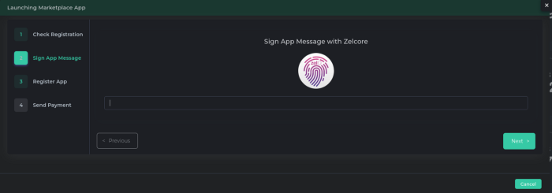

7\. The next screen will show the monthly cost for your Application. Click on Register Flux App

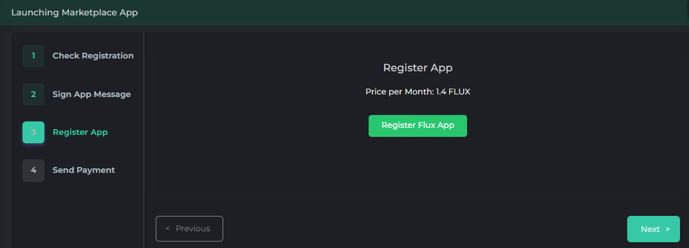

8\. You are provided with some payment info in FLUX. Payment is done through the FLUX blockchain in FLUX coins.

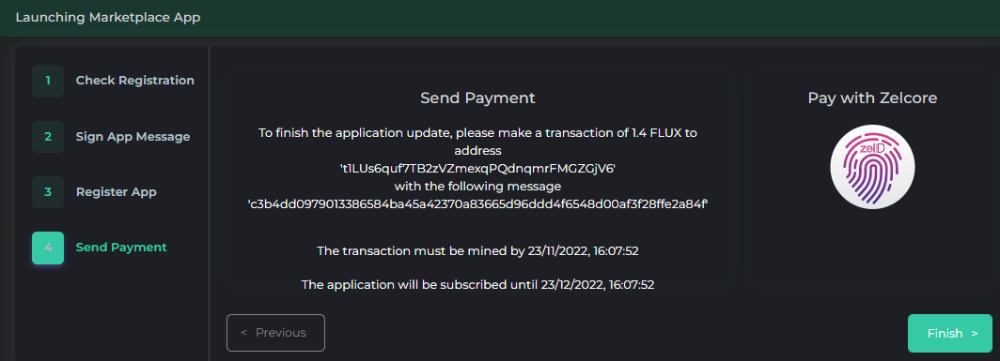

9\. Select “Pay with Zelcore” to make the payment for the app.

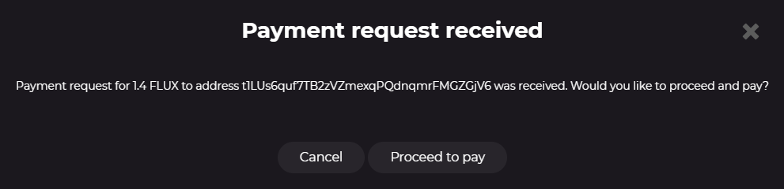

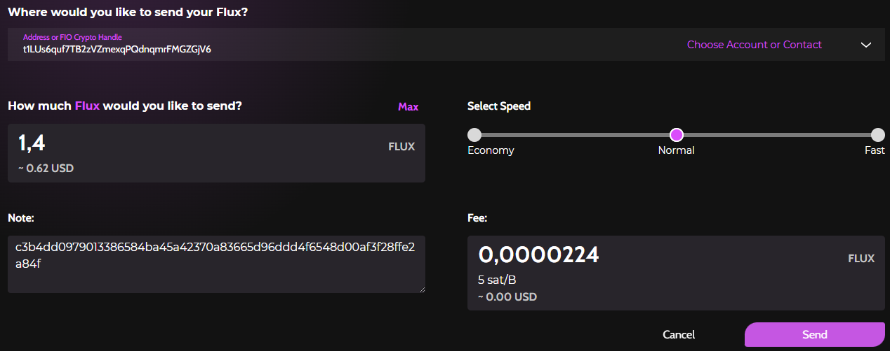

10\. You are done! Now you just have to wait for your Alephium Node to be spawned on an available node.

---

### Monitoring of your instances

When logged in via your ZelID, you can head over to <a href="https://home.runonflux.io/apps/globalapps" >https://home.runonflux.io/apps/globalapps</a> and to the “My Apps” Tab. Here you can manage and visit the Alephium Node deployments you have done so far.

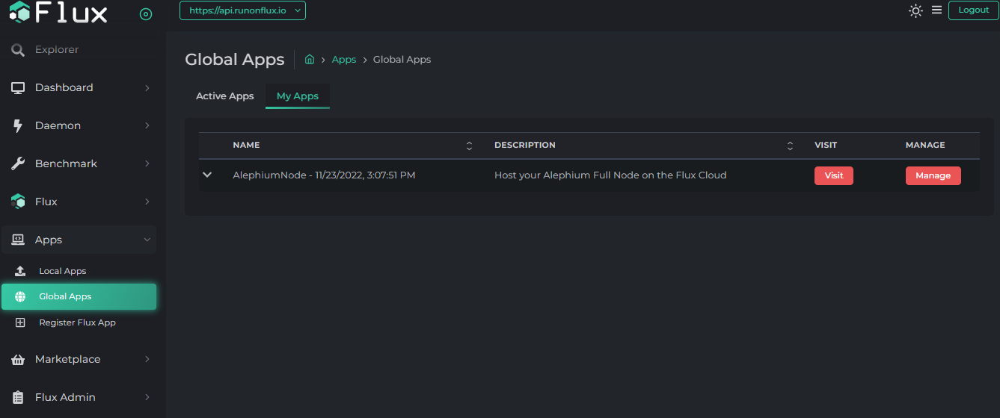

Click on the arrow pointing down to see your application specifications and the IPs running it.

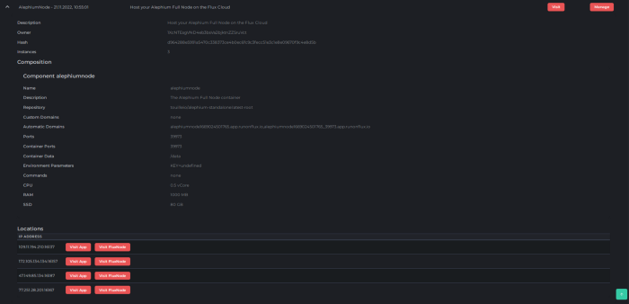

**With Flux Cloud your Alephium Node is redundant! That means it is always running on a minimum of three instances simultaneously. You can check the Logs of the individual IPs to see the Node syncing properly.**

1.  Visit one IP by clicking on “Visit FluxNode”
2.  Log in with your ZelID
3.  Navigate to “Apps”, “Local Apps”, “My Local Apps”
4.  Click “Manage”, “Manage App”, “Log File”

**Remember, your Alephium Node is only subscribed for 22,000 Flux blocks which are ~ 44,000 minutes, so around one month. You will need to renew the payment monthly, so your Node does not get kicked off the network.**

1.  Visit <a href="https://home.runonflux.io/" >https://home.runonflux.io/</a> and log in with your ZelID
2.  Navigate to “Apps”, “Global Apps”, “My Apps”
3.  Click “Manage”, “Manage App”, “Update Specifications”
4.  Leave all the variables like they are, Click “Compute Update Message”
5.  Sign the Message with the ZelID App and click “Update Flux App” after
6.  Click on“Pay with Zelcore” to make the Flux Payment
7.  Voilà! Your Node has been renewed for 22,000 blocks

**Have Fun supporting the Alephium Blockchain with decentralized infrastructure!**

_If you have more questions on the topic, please come to Alephium’s_ <a href="https://discord.gg/JErgRBfRSB" ><em>Discord</em></a>_,_ <a href="https://t.me/alephiumgroup" ><em>Telegram</em></a>_, or reach out on_ <a href="https://twitter.com/alephium" ><em>Twitter</em></a>_!_
