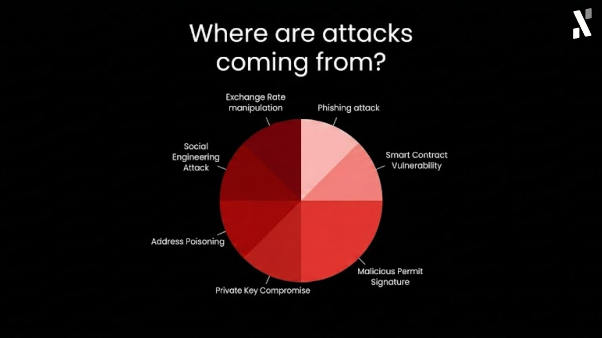
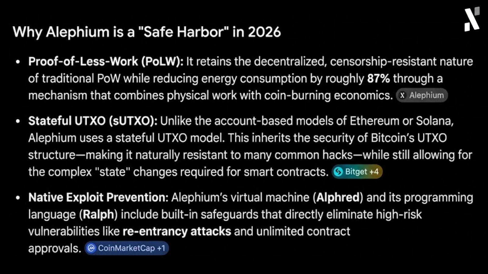
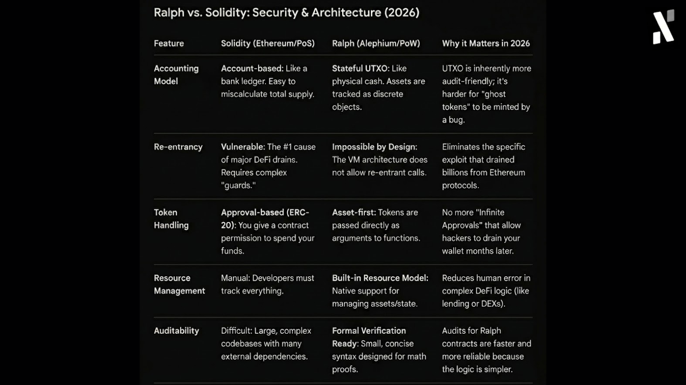
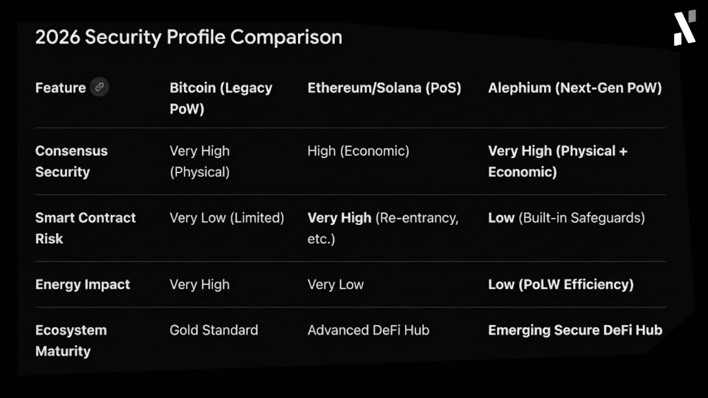

**Op-Ed By Pepper, Head of Marketing & Growth at Alephium**

*Note: The views and opinions expressed in this column are those of the author and may not reflect the official stance of Alephium.*

- - -

After eight and a half years working in Web3, I’ve seen it all. Hype cycles rise and spin up incredible levels of hope and “only up” narratives, only to deflate sometime later into a period of consolidation, along with a series of other issues, most notably the crumbling of security standards.

In the first quarter of 2026, we saw that play out again. Web3 projects lost over $450m across dozens of incidents, with hackers and their social engineering plots still proving successful. At the start of Q2, KelpDAO became the newest “biggest victim of the year”, with $292m in losses. 

Looking at these numbers, I maintain my strong personal conviction that **Proof-of-Work is a fundamentally better base layer for DeFi than Proof-of-Stake.** It is inherently more secure.

## The Threat Landscape Has Changed

A few years ago, Web3 security was all about poorly written smart contracts. That’s why bridges were seen as easy targets, and small blockchains and protocols fell victim to organised cybercriminals. Today though, DeFi-specific smart contract exploits have actually dropped by 89% year-over-year. This should be encouraging, but it really just tells us that the most expensive failures are not happening at the code layer anymore. It is the operational and infrastructure vulnerabilities that whet the appetite of bad actors.

We are witnessing a pretty terrifying rise in social engineering and key management attacks. The best and most recent data I could find ([1](https://sherlock.xyz/post/the-sherlock-web3-security-report-q1-2026-every-major-hack-exploit-and-trends), [2](https://coinmarketcap.com/academy/article/web3-lost-dollar4645m-to-hacks-in-q1-2026-reports-hacken), [3](https://patrickalphac.medium.com/the-drift-protocol-hack-is-the-scariest-hack-in-2026-025359b87b5a)) suggested that phishing and social engineering combined caused over $306m in damages in the first 3 months of 2026. The biggest victim was Drift Protocol, which was the victim of a six-month long social engineering campaign led by North Korean-linked cyberattackers. Instead of attacking the cryptography of the chain itself, they compromised multiple multisig signers, bypassing traditional security entirely.

As I mentioned on the last episode of Alephium Assemble, I met some of the Drift team in South Korea at ETHSeoul and Buidl Asia 2025. They are top devs and good people, and unfortunately it’s the good people aspect that led to this exploit. Their trusting nature opened a backdoor that they never considered possible.

I’ve seen critics call this battle a “shadow contagion”, essentially a pattern where an exploit at one large protocol creates a cascading bad debt across interconnected platforms. Think about FTX, Bybit, Ronin, and so many others. Hundreds of millions lost in a moment, creating a wild domino effect of damages where real people suffer.

Another example is [Resolv](https://resolv.xyz/) [Labs](https://resolv.xyz/), which was the victim of an AWS cloud key compromise that saw a hacker mint 80 million unauthorised $USR tokens. The compromise inflicted systemic bad debt across multiple downstream lending protocols.

Since writing the first draft of this article, I’ve seen even more hacks take place, like KelpDAO and Volo Protocol. Such is the rate of attacks, there’s likely to be another exploit between writing this sentence and publishing this thought piece.

At what point do we wake up and realize DeFi is under attack, retail is leaving (if they haven't left already), and unless we build on stronger foundations, they might not come back?

## Make DeFi Safe Again

As one security researcher ([Patrick Collins](https://patrickalphac.medium.com/the-drift-protocol-hack-is-the-scariest-hack-in-2026-025359b87b5a)) I read recently noted regarding the Drift hack, "the default path must be the secure one". Well, I couldn't agree more. If users and developers are forced to rely on complex off-chain key management to prevent catastrophic systemic collapse, the baseline architecture is flawed. 

This is exactly why Alephium is one of the most securely designed chains in the world. Our core dev team engineered Alephium on the stateful UTXO (sUTXO) model. That means unlike account-based EVM models where a single compromised element can drain a shared ledger, our sUTXO architecture treats assets as secure, isolated physical entities. 

In short, we combine the strict, unyielding accounting methods of Bitcoin with the programmability required for modern DeFi. We’ve fixed the baseline architecture so that even if the front door is rattled, the vault holds firm. Now, we just need more builders and DeFi users to see, understand, and acknowledge this (all while fighting against so much industry-wide FUD).

## Solving Economic Fragmentation with Powfi

Security is only half of the puzzle. The other half is economic sustainability, and historically the most successful dApps, those generating immense value, see that value trapped at the application layer. Their success offers little benefit to the base-layer network or its long-term participants. That’s a missed opportunity (just look at Polymarket vs Polygon in 2025 and 2026).

Alephium’s core dev team has offered a solution in the form of Powfi, which allows us to activate “Phase Two: Aligned Economics”. Basically, they’ve used our own ultra-secure programming language (Ralph) to build a protocol-owned liquidity engine (DEX + $ALPH staking). The idea combines a CLMM DEX with CPMM pools. The combination of all these pieces of tech is an ultra-secure and aligned ecosystem loop that ends the system of fragmented value capture.

This will be the start of a new era for $ALPH holders. I’m delighted for the community, you’ve been incredibly patient and this build has been done with you in mind. That’s why transaction fees are split between $ALPH buybacks and burns and offering “staking” rewards to $ALPH stakers. Your conviction contributes to the network’s long-term health, so we hope that liquid staking via xALPH, giving you asset productivity and ongoing DeFi participation, will be a massive upgrade.

## Building for Generations

Even though I only joined Alephium last year, I’ve been told countless times just how dedicated the core dev team is to building superior tech. BlockFlow sharding is one example of this, and how it offers 20k+ TPS on PoW while maintaining a single-chain user experience (avoiding L2s etc). 

Now, Powfi will be definitive proof that a superior technical foundation is perfect for supporting real-world Defi applications. And unless there are some unforeseen hiccups, it’ll do it in a way that’s fast, secure, and economically sustainable. 

So, in an industry that I love, one plagued by compromises, I believe that Alephium can act as a DeFi fortress and sanctuary. That’s the “no compromises” offer we’ve made. It’s the “Web3 you were promised” statement that we firmly believe in. It’s a space away from nation-state hackers and the shadow contagion.

So, yes, delivering DeFi on PoW is immediately necessary to restore trust and alignment to Web3, and that’s a hill I’ll die on.
