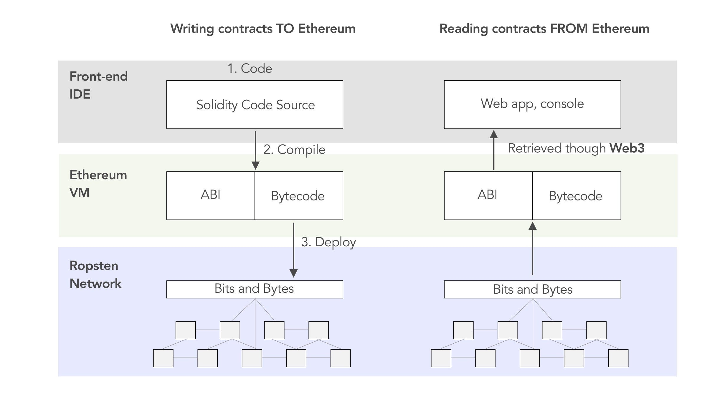
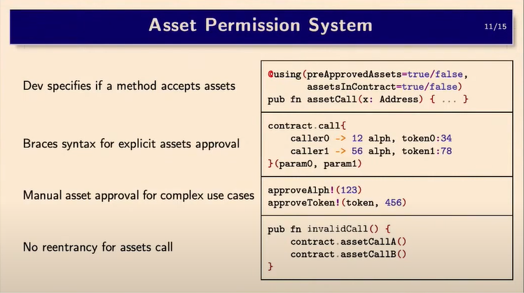

_This is the third of a series of technical innovations brought by Alephium. Find the previous ones_ <a href="https://medium.com/@alephium/tech-talk-1-the-ultimate-guide-to-proof-of-less-work-the-universe-and-everything-ba70644ab301" ><em>here</em></a> _(PolW) and_ <a href="https://medium.com/p/8de3b0f76749" ><em>here</em></a> _(sUTXO). Here we examine what a virtual machine is, what function it fills in blockchains and what distinguishes Alephium’s VM (called Alphred) from others._

### _What is a VM?_

A virtual machine (VM) is a software program that emulates the functionality of a physical computer. There are multiple kinds of virtual machines and virtualization systems: some allow people to play games on a platform it was not meant to be played on, and some to <a href="https://www.parallels.com/" >run a windows</a> OS on a <a href="https://www.vmware.com/" >Mac</a> or Linux computer. Some are built to run programs in a decentralized manner on multiple machines.

Another useful feature of the VM is that it lives somewhere in a simulated place, not affecting the underlying infrastructure if things go wrong. If a virtual machine crashes, there’s no need to restart the physical computer, just the virtual machine.

### _Virtual machines and the blockchain world_

Bitcoin has, by design a <a href="https://en.bitcoin.it/wiki/Script" >very crude and limited virtual machine</a>. Its very basic programmability and lack of Turing completeness still allow bitcoin to be efficient at what it does: maintaining a functional unified ledger of addresses and balances across thousands of nodes. But that’s it, “money” doesn’t have much to execute, there’s (almost) no possibility of smart contracts as is, which is why most of the dApps action happens elsewhere, and no information from the outside world can enter the network. This enables a lean design, a secure network, but of limited functionality: it’s a distributed ledger.

But what if you want to perform more complicated computations in the same decentralized way that Bitcoin operates? That’s the question Vitalik Buterin answered when he conceived of what he called at the time the «world computer». He created a Virtual Machine operated as a single entity maintained by thousands of physical, connected nodes running an Ethereum client. This VM has the ability to compile complex instructions from smart contracts, and all the changes created by these instructions are recorded on the blockchain, accessible to everyone: it’s a state machine.

The example shown above is the <a href="https://ethereum.org/en/developers/docs/evm/" >Ethereum Virtual Machine</a> (EVM), the first big virtual machine in the blockchain industry to see major adoption. Developers can write smart contracts in a high-level, human-readable language called Solidity. When a transaction uses this code, the compiler translates the result instructions into bytecode (which is the low-level machine-readable code). The EVM then executes the bytecode, and nodes broadcast the changes (transactions and blocks) to all the other nodes.

### _Many blockchains, many VMs_

When other blockchain projects emerged after Ethereum, they had two options: either develop their own virtual machine (VM) to suit their requirements or adopt the Ethereum Virtual Machine (EVM) to facilitate running the same smart contracts as Ethereum. <a href="https://fantom.foundation/" >Fantom</a> and <a href="https://www.avax.network/" >Avalanche</a> chose the latter and are <a href="https://medium.com/eligma-blog/what-are-evm-compatible-blockchains-64f91c97038e" >EVM-compatible</a>, while <a href="https://wiki.polkadot.network/docs/learn-wasm" >Polkadot</a>, <a href="https://docs.solana.com/developing/on-chain-programs/overview" >Solana</a>, and <a href="https://v1.cosmos.network/intro" >Cosmos</a> decided to build their own VMs.

Polkadot and Cosmos opted to use WebAssembly (<a href="https://blog.devgenius.io/webassembly-wasm-in-blockchain-f651a8ac767b" >Wasm</a>). This allowed them to support a wider range of programming languages (e.g. Rust, Golang, and C++), making it easier for more developers already familiar with these languages to work on smart contract development and expand their ecosystem.

Solana, on the other hand, opted for the <a href="https://llvm.org/" >LLVM compiler infrastructure</a> and its variation of the <a href="https://en.wikipedia.org/wiki/Berkeley_Packet_Filter" >Berkeley Packet Filter</a> (BPF) bytecode. Solana currently supports Rust and C/C++ as programming languages. Solana’s choice is related to its ability to run native instructions without needing a pre-compilation (the translation from the high-level code to the low-level code). It does the compilation “just in time” at the same moment the code is executed.

There are many other different VMs, such as NeoVM, AVM, RSK, FUEL… and you can find a more extensive comparison between the available VMs <a href="https://www.radixdlt.com/post/comparing-virtual-machines-message-only-vs-asset-oriented" >here</a>.

The choice of a VM and the corresponding toolset (programming Language, compiler, etc…) depends on what a blockchain is trying to accomplish.

### _Alephium’s tooling: Alphred & Ralph_

Alephium’s stateful UTXO combines UTXO & account model and has <a href="https://medium.com/@alephium/an-introduction-to-the-stateful-utxo-model-8de3b0f76749" >smart contract capabilities</a>. It needs a VM to execute the smart contract’s instructions in a totally different runtime environment than other blockchains with enhanced security and performance features.

This imposed the decision to create a new VM, specifically designed to take advantage of sUTXO’s strengths. Like Alephium’s full nodes, the VM <a href="https://twitter.com/alephium/status/1592536671177699328" >is written in Scala for enhanced security</a> and named **Alphred**.

Similarly to the EVM with Solidity, Alphred has a <a href="https://en.wikipedia.org/wiki/Domain-specific_language" >domain-specific language</a> called **Ralph**. <a href="https://docs.alephium.org/ralph/getting-started" >Ralph</a> was built specifically for Alephium’s blockchain to be extremely expressive and easy to use. It has been specially tailored to be secure by design because it leverages the built-in features of the VM. This is beyond the point of this article, and we’ll dive into Ralph specifically in a later post.

The combination of Ralph (the language) and Alphred (the VM) has a lot of benefits, of which a few are outlined here:

#### _Better UX, DevX & Security when moving assets_

An asset permission system controls access to and interaction with specific assets on the blockchain. For example, it would give a framework on what a smart contract a user is interacting with can access in the user’s account: a specific NFT, all NFTs, a specific amount of tokens, etc…

In Ethereum, when a user wants to transact anything other than ETH, he is greeted with multiple confusing approvals on top of the actual transaction. Alphred removes that complexity and makes it very straightforward for a user because the permission is defined at the function level, standardizing all interactions. This helps prevent human errors or design flaws like <a href="https://coinmarketcap.com/alexandria/glossary/infinite-approval" >asking the users to approve infinite token spending.</a>

#### _MEV-aware design_

A basic mechanism of MEV (Miner Extractable Value) is to find arbitrage opportunities and try to extract value from block production. The “MEV searchers” are able to do it because they can speculate on transaction ordering by digging into mempools. One of the incentives to try it is because this process can be (almost) risk-free: if the proposed transaction does not execute, there is no financial loss except for gas fee.

On Alephium, as each transaction follows the Input/Output paradigm, a complex MEV operation would require multiple sequential transactions. This would make the operation more prone to competition, as other users could counter-run any of the transactions. As a result: more competition on MEV, more risks for MEV searchers, and therefore, higher costs. Compared to the EVM, MEV searchers cannot create complicated arbitrage operations in a single transaction. They can only do the same thing as normal users. This makes the protocol more resilient against MEV.

#### _Flash loan resistant_

A flash loan bundles successive transactions inside one block with conditional execution. It requires interacting with several smart contracts in the same transaction to take a loan, use it in a dApp and repay it. If the repayment doesn’t happen, then none of the transactions happened. This works well in the account model blockchains.

Alephium is UTXO-based, meaning the Input/Output paradigm dictates that output only can be used after the transaction is broadcasted to the network. Therefore, a loan can’t be instantly repaid in the same transaction. This makes <a href="https://coinmarketcap.com/alexandria/glossary/flash-loan" >flash loans</a> impossible by default.

#### _More secure by design_

It is hard to write secure smart contracts on most blockchains, in part because their programming languages and VMs give developers “too much freedom”. When they write code and rely on external sources (like <a href="https://docs.openzeppelin.com/contracts/2.x/api/math" >libraries</a>) to perform verifications, there is too much room for error, and bugs may happen, often critical.

Alphred comes equipped with many checks and built-in controls that, while preserving great expressiveness and ease of use for developers, also help them avoid many of the common mistakes & bugs. Here are some examples:

The <a href="https://www.pcmag.com/encyclopedia/term/arithmetic-overflow" >arithmetic overflow</a> check is useful to prevent the execution of a transaction when a memory overflow occurs. It allows the problem to be caught before the execution, saving time and resources.

It has an <a href="https://youtu.be/VVYH9rBJAdA" >Asset Permission System</a> built to provide <a href="https://docs.alephium.org/ralph/asset-permission-system" >extra verification</a> to determine that the token transactions are submitted according to the smart contract rules.

Alphred <a href="https://docs.oracle.com/javase/tutorial/essential/exceptions/advantages.html" >returns an exception</a> when something is wrong, providing a better explanation to the developer about the error that occurred during the execution of the transaction.

The built-in <a href="https://en.wikipedia.org/wiki/Type_system" >type system</a> can verify the type of the functions and variables by itself, making the code less error-prone. These protections help to prevent the deployment of faulty smart contracts, letting the developer focus on other things.

#### Lightweight/customizable contract events

Whenever someone uses a smart contract, it emits <a href="https://techblog.geekyants.com/an-introduction-to-events-in-solidity" >contract events</a>, which are very useful for devs & services to monitor on-chain activity. For example, if an analyst wants to understand how a DEX is used or which pools are the most popular, he can check the contract events of swaps or failed swaps, etc… On most EVM chains, those contract events are automatically generated and stored on-chain for all smart contracts forever.

In Alphred, the contract events are possible, activated by default, and can be disabled: they are entirely configurable and optional. If someone is only interested in the events emitted by a particular DEX, they can just listen to those. This should lead to more responsible, targeted use and less useless data stored because a more lightweight chain is better for node operators & decentralization.

#### Bytecode with improved readability

When a developer writes a smart contract, he does it in a high-level, human-readable language like Solidity, or in our case, Ralph. When a user interacts with a smart contract, it is executed by a compiler which will interpret the human-readable code (written by the developer) into <a href="https://www.techtarget.com/whatis/definition/bytecode" >bytecode</a> that the VM will run. Bytecode is usually hard to read, which makes checking it a clumsy and time-consuming task.

Alphred/Ralph bytecode was built with human readability in mind, rendering it easier to analyze/verify without extra software. This is helpful when performing unit tests and verifying an instruction’s return value because it makes it more efficient to verify the code & detect bugs early.

### _In conclusion (TL;DR)…_

A Virtual Machine executes smart contract code and updates the blockchain state. Each blockchain implements a VM design targeted at achieving specific goals.

In the case of Alephium, the combination of Alphred (the VM) and Ralph (the programming language) leads to increased security through built-in controls and checks, exceptional performance, and unique features (such as flash loan resistance) thanks to the UTXO design.

This was only a short introduction to the main features of Alphred. A coming and detailed article, plus some Twitter threads, will shed more light on Alphred in the coming weeks.

If you have questions on this topic, please come to Alephium’s <a href="https://discord.gg/JErgRBfRSB" >Discord</a>, <a href="https://t.me/alephiumgroup" >Telegram</a>, or reach out on <a href="https://twitter.com/alephium" >Twitter</a>!
