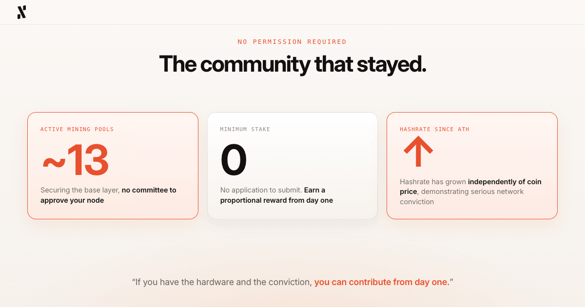
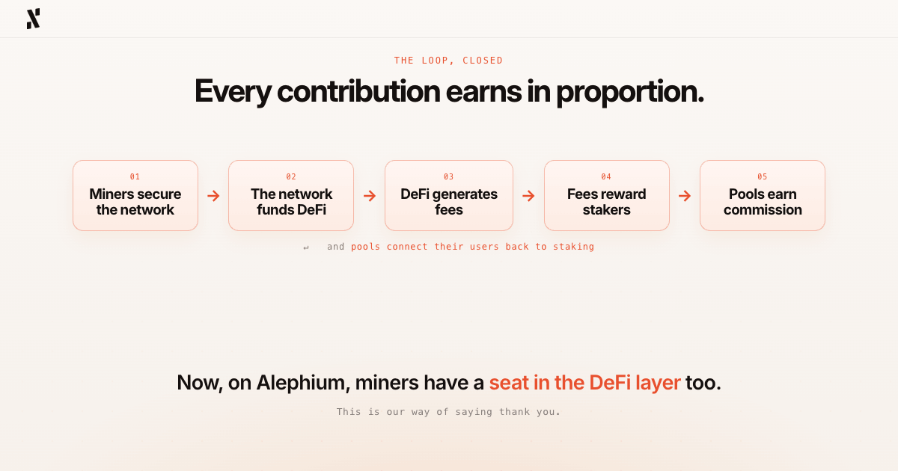

**Article by Pepper, Head of Marketing**

*The views shared in this article belong to the author and may not represent the official position of Alephium.*

- - -

There is a moment, somewhere between a bull market’s tremendous peak and a bear market’s harrowing floor, where a particular type of person makes a decision that requires incredible conviction. They decide not to sell and not to pivot.

The crypto miner looks at their electricity bill, checks the price of the block reward, runs the numbers, and keeps the rigs running (whether currently profitable or not). There’s no vesting schedule to wait out and no foundation grant covering the overhead. There is just the cost of the work, paid upfront, every single month, before a single token changes hands. It takes courage and honesty to continue doing this, and we applaud it.

### Mining is Far From Over

The broader industry has spent the better part of three years being told this model is “*obsolete*”. The media wants us to think that Proof of Work is wasteful and Proof of Stake is the future (I’d argue that the opposite is true). When Ethereum completed the Merge in 2022, switching its consensus mechanism from Proof of Work to Proof of Stake, it was covered as a kind of “*moral upgrade*”, and people around the world cheered. Energy consumption figures were cited, but hardly explained, and so the narrative gained weight.

The miners were written out of the story with surprisingly little ceremony or thanks, especially considering how much of that story they had built. They deserved their flowers, not their farewells.

Perhaps what was lost in the retelling of [The Merge](https://ethereum.org/roadmap/merge/) is what miners actually represent, arguably the most economically honest participation model in the entire crypto ecosystem. This piece is about why I believe that matters, why they are critical, which networks really “get it“, and what **Alephium has now built specifically with miners in mind**.

## Security Is Not a Promise, But a Price

When someone asks how secure a Proof of Work network is, there is a pretty clean answer. Attacking it costs real money in the real world, via hardware, energy, logistics, and time. All of those costs accrue before a single block is compromised, with no guarantee of profit and significant risk of loss, which is why it is so incredibly effective.

Proof of Stake security is real too, but it operates within the system it is protecting. Economic finality, slashing conditions, and validator penalties are all meaningful mechanisms, of course. They are also self-referential in a way that PoW security never is. When the foundation of the security model is the protocol's own token, that assumption is the first thing tested in a crisis. 

## The Yield Nobody Earned

Not all staking rewards are created equal either. When a Proof of Stake validator earns yield on tokens received through a team allocation, an ecosystem grant, or a seed round (at fractions of the market price), the APY figure looks healthy from the outside. For that reason, the cost basis is almost never part of the announcement.

But mining has no equivalent arrangement. **There are no insider terms for hashrate**. Miners compete with their local electricity prices (or via clean energy generation), buy hardware at the same market rates (in most cases), and earn rewards proportional to their contribution alone (unless they are part of a fortunate mining pool). Therefore, the economics are completely transparent. It would be hard for them to be anything other than transparent. 

For miners, the work precedes the reward, and this is what skin in the game looks like. Of course, PoS requires participants to commit resources before earning rewards, but in a much different way. Stakers can usually unstake and move elsewhere (unless forced to lock for a certain duration), but for miners, the commitment is much deeper (except when blockchains share the same hashing algorithm, in which case switching is easy).

## 13 Pools, With No Permission Required.

Alephium currently operates across around \~13 active mining pools, and its hashrate grew and stabilized without correlation to coin price. The network is more secure today than during the previous bull run, and that is no coincidence. It is a pretty clear indicator of a mining community that stayed, grew, and kept building with conviction. It also reflects Alephium’s logical transition in early 2024 from GPU (\~2GH) mining to ASIC mining (>~400GH).

There is no minimum stake required to participate. There’s no application to submit and no committee to approve your node. If you have the hardware and the conviction, you can contribute to network security and earn a proportional reward from day one.

PoS systems are exclusive, as you need to buy tokens to participate, which can be problematic for some users due to KYC requirements. With PoW, the network is inclusive, because you can join without anyone selling you coins or tokens. You can also choose to remain hidden, right up until you mine the first block.

On the energy question, Alephium has a specific answer, in the form of Proof of Less Work (PoLW). This is a protocol-level mechanism designed to activate once the network reaches 1 exahash per second of hashrate. At that threshold, PoLW begins reducing the energy required to mine each block, without compromising the security model. We are not there yet, but the mechanism is already built. When hashrate grows to meet it, PoLW will fundamentally change how PoW energy consumption is understood at scale.

I think the criticism of PoW energy consumption was never entirely wrong or unfounded, especially as Bitcoin mining uses the power equivalent to entire nations. However, Alephium built a solution, and managed to remove ourselves from that contentious debate, rather than removing ourselves from the model.

It’s worth mentioning, too, that PoW chains often get some unfair criticism. Many nations and their power companies use PoW to buffer the powerlines and make use of excess energy. Also, since miners are incentivized to find the cheapest energy source, many have moved on to clean energy sources, like solar, hydro, and wind power, to support their mining operations.

## The People Who Stayed

There is one more thing I want to say to Alephium’s miners, and to some it may matter more than the economics.

When the market collapsed and the narrative moved on, many kept running their rigs. Some were spec mining, running at a loss in the present tense, betting on the network's future value. They could have bought ALPH directly for less. Instead they invested in machines, in infrastructure, in the long-term case for the network. That shows us a high level of belief, and we applaud it.

That quality of conviction cannot be manufactured by a token allocation. Networks that retain their miners through the hardest conditions are the ones with the most honest foundations in the industry. Kudos to every miner who kept the lights on through the dark.

Even more impressively, our hashrate has **grown since ALPH’s ATH coin price.** Our network is more secure than ever as a result.

## What the Network Built in Return

We noticed this incredible conviction, and soon we will be able to respond with something gratifying.

Powfi, Alephium’s upcoming DEX and liquid staking platform, has already upgraded its codebase to support direct integrations with the ALPH Staking Layer through a referral-based framework. Mining pools are among the first partners in discussion, and the design will reflect that.

The traditional path for individual users or miners will be straightforward. They’ll hold ALPH, connect their wallet to Powfi, stake, and earn rewards. The new partner path will open something more significant for pools (and their high-conviction miners)...

A mining pool will be able to offer ALPH staking directly to its users. The yield will be identical to staking natively on Powfi. The staking will be attributed on-chain to the pool via a referral tag, all done transparently and verifiably, and the pool will earn a healthy commission.

I must point out, this was not bolted on as an afterthought. It was designed this way, with miners and mining pools in mind. The pools that secure the base layer will soon connect directly to the DeFi infrastructure built on top of it, offer their users a staking product, and earn from the ecosystem they helped build.

This is our way of saying thank you.

## The Loop, Closed

We believe that this is what genuine ecosystem alignment looks like in practice. Miners secure the network, the network funds DeFi, DeFi generates fees, fees reward stakers, pools connect their users to staking and earn commission in return, and every participant who contributes earns in proportion to that contribution. It’s a great loop.

The mining reward mechanism is meritocratic by design, as there are no preferential terms for hashrate, no yield on tokens that cost nothing to acquire, and no governance votes that can redistribute what miners earned through real expenditure. That is the honest foundation this ecosystem is built on.

I’m sure the next cycle will bring new consensus arguments, efficiency claims, and chains with new promises. Some, but not all, will be worth listening or giving your attention to.

However, the networks that endure are the ones where the people who paid to be there, before they knew it would pay off, **are still at the table**. In crypto, that group has always had a name. They are the miners.

Now, on Alephium, they have a seat in the DeFi layer too.
