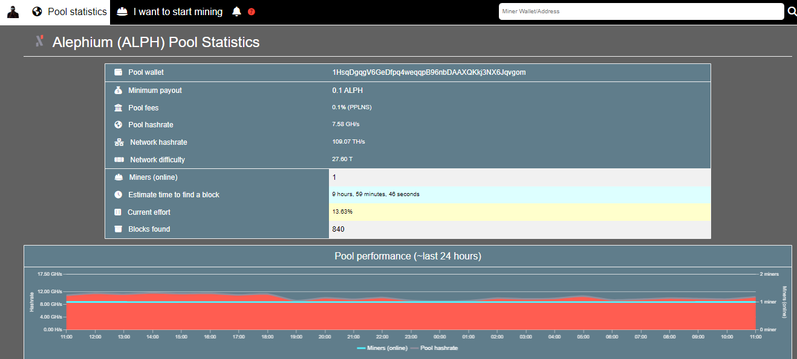

_The Alephium blockchain, like many decentralized networks, relies heavily on the contributions of miners to maintain its integrity and functionality. Recognizing the significance of these contributors, we are launching a series of articles titled “Miners’ Highlight.” By focusing on their contributions, challenges, and experiences, we aim to understand the mining process and its importance better._

_Cedric Crispin, a French miner passionate about Alephium, decentralisation and aerial photography, is starting this series!_

#### **What can we call you, and where should we picture you?**

My name is the same of my mining pool: <a href="https://alephium.cedric-crispin.com/" data-href="https://alephium.cedric-crispin.com/">Cedric CRISPIN</a>. I’m from France, more specifically, the French West Indies (Martinique).

#### **Can you tell us a bit about yourself, your passion for mining, and your background story?**

I’m currently a Python lead developer in a web agency. I graduated with a degree in computer science back in 2008. And I have been working in the IT/data-center realm since then. I actually discovered \`Bitcoin\` the year after my graduation, but sadly, I was so excited about getting my very first job, that I totally neglected it back then. I still remember how popular it was in the French IT/Cryptography scene. Everyone was sharing its white paper and discussing how disruptive it could be.

#### **When & how did you get into mining cryptocurrency?**

Before I truly got involved in mining, I had one major event in my life. In 2014, my Thai fiancee, whom I met a couple of years before, got a job opportunity in her home country, and she asked me if I would accept to follow her and live there. Of course, I said yes. For two reasons: discovering her roots in Southeast Asia and Thailand would have been an <a href="https://www.instagram.com/blackmennewstyle/" data-href="https://www.instagram.com/blackmennewstyle/">incredible playground for aerial videography/photography</a>, which is also one of my big passions (it is still to this day, despite all the unfair regulations created against “consumer class drones”).

It was only around 2017 when I experienced my very first attempt at GPU mining, but back then, we were living in a rented apartment, and the owner was nefariously known for cheating on the electricity bills.

I had the perfect opportunity to explore it when we bought our first place in 2019. Back then, I already wanted to run my own mining pools, but once again, my lack of free time was still playing against me.

I think that, like many people, I learned about GPU mining through YouTube, which is not really the best place to start because a lot of concepts about GPU mining are lacking in the YouTube mining space: node software, network decentralization, pool latency, pool reward systems (PPLNS, PROP, etc…). The focus is way too directed on the profits aspect of it and not enough on the educational and technical aspects.

#### **How long have you been mining Alephium?**

I have been mining ALPH since its launch during the human malware pandemic outbreak. I saw an interview with Cheng Wang, when he was introducing his new blockchain, and I really felt like it was an interesting project to support.

#### **What made you switch to mining Alephium?**

Obviously, it's PoW algorithm (blake3), which is very cool on GPU since it’s mostly a core-intensive algorithm.

#### **What inspired you to create your own mining pool on Alephium? What is the size of your mining operation? Where do you see it going?**

Since I started mining, I have always wanted to learn about running a pool, and since my very first experimentation, I noticed it relies on programming languages and software which are very close to my daily job, so I had no excuse not to learn except, as always, the lack of free time.

<figure id="549f" class="graf graf--figure graf-after--p">

<figcaption><a href="https://alephium.cedric-crispin.com/" class="markup--anchor markup--figure-anchor" data-href="https://alephium.cedric-crispin.com/" rel="nofollow noopener">https://alephium.cedric-crispin.com/</a></figcaption>
</figure>

But I think the main reason which pushed me to create my mining pool is the same reason which also pushed me not to use HiveOS and developed my own mining scripts while using bare bone OS like GNU/Linux Debian and Ubuntu: I always wanted as much as possible to be in control of the software I use.

So far, my humble home mining farm is composed of 4 CPU mining rigs, 6 GPU mining rigs (accumulating 36 GPUs, mostly AMD RX 6600, RX 6600 XT and RX 6700 XT. And I still have 12 spare GPUs: AMD RX 5600 XT & RX 5700 XT). I also have 1 smartphone mining rig (accumulating 12 phones). Lastly, I have 1 HDD mining rig (accumulating 26TB, mostly old HDD I already owned).

Sadly in Thailand, home owners can only have a maximum of 50A panel breaker for all their residences, so unless I can create my own company, I will not be able to have more power at home.

My pool, due to its location, is probably not suitable for everyone. It’s located in Thailand, so miners in Southeast Asia will probably always be advantaged in terms of pool latency. But I do have miners from the US and Canada, who claim that the 300ms of latency they are experiencing is not really an issue so far since they are able to find a lot of blocks.

#### **We’ve seen you’re passionate about hashrate distribution and decentralization. Can you tell us more about it?**

A good miner and a good pool operator must be able, at least, to understand how a node software works and be fully aware of its importance. They must be properly aware of all the implications behind most POW algorithms and how they fully extend to the mining hardware. I also think it is very important for them to participate in most of the communities around all the projects they are interested in because a good actor in the crypto space should always want to push the community forward when he/she goes forward.

> Decentralization is fundamental in blockchain technology. To not contribute and do our part will inexorably hurt any community and only empower bad actors, just like the beyond-broken global economic system.

I would love it if my mining pool could help decentralize the POW network hashrate on ALPH, but sadly, miners are generally not very cooperative and always prefer selecting the top pools.

#### **Anything else you’d like to share with the community?**

Decentralize the ALPH PoW network and any other network. Participate in communities you truly enjoy, especially if you have skills they can use. Chase passions and dreams instead of just money, don’t be afraid to take risks and fail, always share your true wealth: Knowledge ❤

#### **Social networks:**

<a href="https://twitter.com/Cedric_Crispin" data-href="https://twitter.com/Cedric_Crispin">https://twitter.com/Cedric_Crispin</a>

---

That is the end of this interview! If you are interested or have extra questions, you are welcome to reach out on our [Discord](/discord), or in the <a href="https://t.me/alephiumgroup" data-href="https://t.me/alephiumgroup">Alephium Telegram channel</a>. Don’t forget to follow <a href="https://twitter.com/alephium" data-href="https://twitter.com/alephium">@alephium on Twitter</a> to stay up-to-date.
