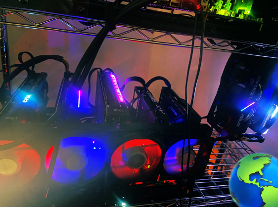

_The Alephium blockchain, like many decentralized networks, relies heavily on the contributions of miners to maintain its integrity and functionality. Recognizing the significance of these contributors, we are launching a series of articles titled “Miners’ Highlight.” By focusing on their contributions, challenges, and experiences, we aim to better understand the mining process and its importance. You can find_ [#1 here](/news/post/miners-highlight-1-cedric-crispin-c4ed456f6d10)_._

_Hiram Abiff .’., a miner passionate about Alephium, decentralisation and family!_

## What can we call you and where should we picture you?

I go by Hiram Abiff Mining or Hiram Abiff online, but my real name is Jake, you can picture me in the countryside of rural middle America - right in the middle of cornfields, railroads, my mining farm, giant printers, shirt heat presses, and a wall of GPUs/asics & computer monitors.

## Tell us a bit about yourself, your passion for mining, and your background story.

I am a family man- I love cars, computers, coffee, tea, and yes, you guessed it \#Cryptocurrency, especially Alephium. I take care of my wife, my daughter, and our 3 cats. My oldest and one of my fondest memories is from when I was about five years old- I was on my Grandfather’s ‘Gateway 2000’ machine via Windows 95, tinkering in MS/DOS writing a script for DOOM and switching 5+ floppy discs out to install one game.

I have a passion for mining because it gives me the ability to partake in a global consensus with the world in a decentralized, fair, and trustless manner, and I get extra benefits: we heat our small house with the miners during the winter; during the summer I get a free sauna. I get my name from “HIRAM ABIFF” who is a central character in an allegory presented to candidates during the third degree of Freemasonry, and also the Master Builder from King Solomon’s Temple.

## When & how did you get into mining cryptocurrency?

I learned about Bitcoin in early 2013 or 2014, I was a bit sceptical at first, but I watched it for a few years until I started my journey into crypto and mining in 2016 when some of my friends from my old high school, in Myrtle Beach South Carolina, told me they were mining Litecoin and Ethereum- also told me about this awesome concept called smart contracts and the virtual machine.

I started mining LTC/ BTC/ ETH with 1 GPU and a few old laptops and desktops as CPU miners and started day trading LTC/ BTC/ ETH/DOGE and mined for about two years until the bear market of 2018. I became upset during that time (Bear 2018) as I took a big hit in late 2017/early 2018 and sold everything but a few hundred LTC. Flash forward to 2021, I had my mind blown, and I promised never to give up on my passions for crypto and mining ever again — Here we are today at the precipice of a NEW BULL RUN! (Hopefully 🎉)

## How long have you been mining Alephium?

I have been solo mining Alephium for a little over one year, and it has been a wonderful and amazing opportunity. I met so many amazing Alephium community members during this time. It was one of the best years of my life! Recently I joined [cloudiko.io](http://cloudiko.io) with my friends, who are the pool operators and have begun inviting everyone I know to join us in our initiative to decentralize the global hashrate.

## What made you switch to mining Alephium?

Ever since I first set sight on Alephium it was like love at first sight, the tech, the team, and the best community in the entire world! I was also heavily involved in Kas and mining both KAS & ALPH. As I had heavily invested in my GPU mining infrastructure when Asics took over the Kas network, naturally, it was an easy decision on what I would start mining full-time next protocol, Alephium. I have a small farm of GPUs at around 30gh/s — 35 gh/s mining on the blake3 algorithm, smacking & stacking Alephium blocks.

## We’ve seen and heard that you make and sell some Alephium-themed merchandise. Can you tell us more about it?

My wife and I have been running a small graphic design and printing business together for the past three years (almost 4); before that, I ran a CCTV/IT/Human Resources Management business for 15 years; COVID made me start a new chapter of my life. Currently, my wife and I [make custom shirts/cups/hats/logos/sweaters/etc](https://www.etsy.com/shop/SublimationStationGB), and we are pretty good at making memes, too :) — You name it, and we can probably make it- lately, I have been focusing almost 100% of my efforts towards making Alephium swag/merch, advertising, and educating to raise awareness and share the beauty of Alephium with the world!

## You’ve also contributed to the community in other ways. Can you tell us more about that?

I am sort of a jack of all trades. I love to write & communicate my thoughts/opinions with the world via [Twitter](https://twitter.com/hiramabiffkas) or other social media platforms. I also do a lot of community outreach and answer community questions and write educational threads about mining or how to do various actions on chain with Alephium. I helped plan to do a monthly Alephium Community Space on Twitter (X) with members of the BlockFLOW alliance DAO (herein DAO\*), and other community members, and previously did an AMA with members from the core team. I also run giveaways with various entities, including but not limited to myself, the DAO, and Ayin. Recently, I started documenting some of the work I do [on YouTube](http://youtube.com/@HiramabiffALPH). I am a community mod and supporter on the AYIN discord server and the new NGU discord.

After learning Mining Pool Stats was only tracking the ALPH chain with the highest ‘blockHeight’ aka chain 0 — I thought of the idea for [alphminingstats.com](https://www.alphminingstats.com), & have been helping [Cgi/bin](https://twitter.com/cg1_bin) from the DAO and 0xreed from ALPH_Ducks (the back/front end developers) throughout the process, and have been somewhat influential in designing/ creating the website to keep track of ALL 16 Alephium shards and chains. We thought this would be a good idea to understand global metrics better and make an informed decision going forward. I do everything I can to help make the @Alephium community better and share this gem with the world.

## What caught your eye in Alephium and the community?

To be truthful, the very first thing I saw and noticed about Alephium was the technological advancement from the EVM chains of yesteryear — my mind was truly blown when I looked into the Alephium sharding algorithm BlockFlow, how it improves on the UTXO model of BTC to make it scalable and uses DAG data structure to reach consensus between different shards - the second and even more mind-blowing thing I noticed was how humble, caring, and how great the Alephium community is here. I have been a part of several crypto communities throughout the years, I have never in my life, even IRL, found a group of like-minded individuals quite like the Legendary Alephium community. I came here to make a few bucks; instead, I found a new tribe and a new home, and I decided to unpack and lay down roots here. The community has treated me with nothing but respect and with open arms!

## What are your future plans in the Alephium community?

I hope to still work with my friends Waldi, CGI-bin/, 0xreed, Sterling, et al. I hope to make many new friends in the coming days, weeks, months, and years! Right now, my plan is to HODL and DCA all the way up into the bull cycle {nfa}: also focus on producing more high-quality merch and Alephium promotional/advertising material, building/networking within the community, getting more mining pools to add \$ALPH and possibly making our own Alephium mining pool with a few community members/miners, maybe making a token on-chain to help incentivize miners to switch mining pools for further decentralisation of the global hashrate, I would like to create some dApp on Alephium maybe one day too, and looking at doing graphic design for more current/upcoming projects on chain - on Alephium the sky is the limit. I am looking for more like-minded dedicated community members who also focus on mining Alephium, to get together and try what others have done before us and/or create a group focusing on the community goals, decentralisation and everything mining Alephium.

## Anything else you’d like to share with the community?

I would like to say thank you to the Core team for the wonderful job they do and for allowing me to have this opportunity to partake in this community highlight, I would also like to thank the community for being so wonderful and accommodating and for accepting me! Cheers!

---

That is the end of this interview! If you are interested or have extra questions, you are welcome to reach out on our [Discord](/discord), or in the [Alephium Telegram channel](https://t.me/alephiumgroup). Don’t forget to follow [@alephium on Twitter](https://twitter.com/alephium) to stay up-to-date.
