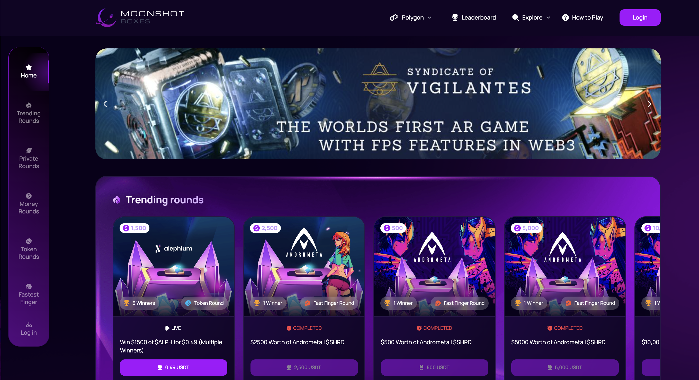
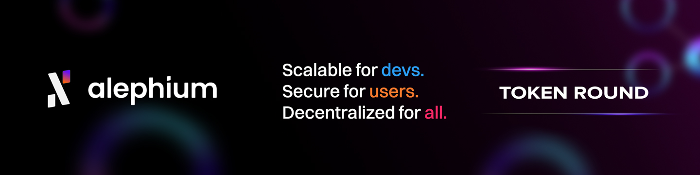

**Thought piece by Raj (@16bitApex)**

---

*I didn’t come into Web3 through the traditional path.*

Before I was helping to build companies or allocating capital, I spent years as a professional gamer, then six years as a professional gambler, before eventually becoming a co-founder of an investment fund, Cetacean Capital. Each phase taught me something different about edge, risk, incentives, and human behavior.

Gaming taught me strategy, competitive asymmetry, and how to repetitively lose to eventually learn how to win. Gambling taught me expected value, probability, psychology, and how markets misprice conviction. Web3 investing taught me something more uncomfortable, that early-stage markets aren’t nearly as meritocratic as we pretend they are.

**Moonshot Boxes** was born at the intersection of those three worlds.

## The Structural Problem No One Likes to Admit

Early-stage investment in Web3 is **still largely gated**.

Despite all the rhetoric around decentralization and permissionless access, the reality is that the best positioning in early rounds is predominantly reserved for VCs and exclusive networks. Communities (the very people who test products, evangelize narratives, and bootstrap adoption) are usually brought in last, if at all.

This creates a **structural imbalance**.

Projects rely on communities for momentum, feedback, and legitimacy, yet those same communities are often positioned as exit liquidity rather than early partners. Meanwhile, early capital frequently misaligned by short time horizons captures the majority of upside.

To me this is more than a moral argument, I see this as a **market design problem**.

## “Communities Are Not Exit Liquidity, They’re Infrastructure”

One belief has shaped everything I’ve built since.

In my experience as both a community member and an early stage investor, communities consistently create more long-term value for Web3 projects than the vast majority of early-stage capital providers. The founders of projects easily get misled by fancy VC brands that add little value to the project other than a quick injection of cash that inevitably hurts them in the long run. Capital is abundant. *Conviction is not*.

A committed community does more than speculate. It tests products, spreads narratives organically, participates in governance, and provides feedback loops that no fund memo can replicate.

The industry has designed fundraising infrastructure as if money is scarce and belief is infinite.

**It’s the opposite.**

When communities are given optimal early positioning, incentives align naturally. Users become owners. Owners become advocates. Advocates become the strongest growth engine a project can have.

*That insight is what led me to build Moonshot Boxes.*

## Rethinking Access Through Market Design

Moonshot Boxes isn’t your traditional launchpad. It was my deliberate attempt to redesign how early-stage access works, using game mechanics for incentive alignment as well as entertainment.

There are two core formats, each designed around a different participant psychology.

### Fastest Finger

Full allocations go live at random times. The first person to act secures the entire allocation.

This format rewards decisiveness, attention, and conviction. It mirrors competitive environments whether trading, gaming, or high-velocity markets where hesitation has a real cost.

### Raffle Mode

Fully on-chain raffles with low-cost entry tickets and provably random outcomes.

This format democratizes access. It allows participation regardless of capital size and supports broader inclusion. Raffles can include token allocations, NFTs, or even real-world prizes.

Both formats share the same philosophy that access should be fair, transparent, and earned through participation, not proximity.

## Solving Two Problems at the Same Time

Most fundraising tools solve for one side of the market. I **intentionally designed** Moonshot Boxes to solve for both.

**For projects, capital is only half the equation**. The harder problem is acquiring users who actually care. Moonshot Boxes delivers not just funding, but a community with direct economic alignment from day one. This materially reduces the risk of early dumping behavior and replaces it with genuine long-term engagement.

Through the network I have built up over the years running a VC, Projects are also exposed to a broader network of experienced operators, investors, and veterans in the space, people who have built, scaled, and survived multiple cycles.

**For communities**, the benefit is simple but profound: **proper early-stage positioning**. Instead of being spectators or late participants, users gain access alongside early capital, on transparent terms.

The results speak quietly but clearly. In a relatively short period of time, Moonshot Boxes has helped projects raise over $1 million in a short space of time, while simultaneously onboarding users who are invested financially and emotionally right from the start.

## Ecosystems Don’t Have a Funding Problem - They Have a Coordination Problem

Where this model becomes even more powerful is at the **ecosystem level**.

Layer 1s and Layer 2s often struggle to grow beyond a core group of builders. Grants programs exist. Funding exists. Tooling exists. Yet adoption lags.

Why?

Because **growth is more of a coordination problem than a tooling problem**.

Moonshot Boxes operates as more than a gamified launchpad. We’ve designed it to function as a more hands-on ecosystem growth tool. To do that, we embed directly within ecosystems, working closely with growth leads, grants programs, and business development teams.

Rather than just fill funding gaps, we aim to fill support gaps, whether that’s distribution, user onboarding, narrative alignment, or early community formation.

We do this because we know that ecosystem growth doesn’t come from isolated launches, but more from **sustained alignment** between projects, users, and incentives.

## A Realistic View of Cycles

*None of this exists in a vacuum.*

* **Demand for early-stage access will always exist.** 
* **Communities will always want to invest in projects they believe in.** 
* **Projects will always need capital.** 

That said, this market is not completely cycle-proof. Liquidity expands in bull markets and contracts in bear markets. Retail participation is naturally more constrained during downturns. Accepting this reality is a sign of maturity.

The next phase of Moonshot Boxes that I am designing is focused on building products and structures that remain resilient across cycles, independent from speculative excess. In my opinion, sustainable access matters much more than short-term hype.

## The Future Belongs to Alignment

The next generation of successful Web3 projects won’t be defined by who invested first.

**They’ll be defined by who believed first.**

Capital will always follow conviction, and until now, the mistake has been assuming conviction comes from boardrooms instead of communities.

If Web3 is serious about decentralization, then early-stage access needs to reflect that reality. Not as a slogan, but as infrastructure. And infrastructure, when designed correctly, compounds quietly over time. 

I’ve been in this space for over a decade, and at its peak, crypto was built by the people, for the people, and powered by the people. What followed was a slow distortion of that original promise. The industry began to resemble a snake eating its own tail, driven by the illusion that VCs inherently add disproportionate value. 

In reality, the deepest and most durable value has always come from communities: the users, builders, and believers who show up long before certainty exists. Web3 was designed to empower them, yet over time, that power was quietly abstracted away. My aim is simple - to return early-stage ownership, alignment, and influence back to the communities that were meant to have it from the beginning.

---

Raj (@16bitApex) is a former professional gamer and professional gambler turned investor. He is the co-founder of Cetacean Capital and the founder of Moonshot Boxes, where he focuses on early-stage access, community alignment, and ecosystem growth in Web3.
