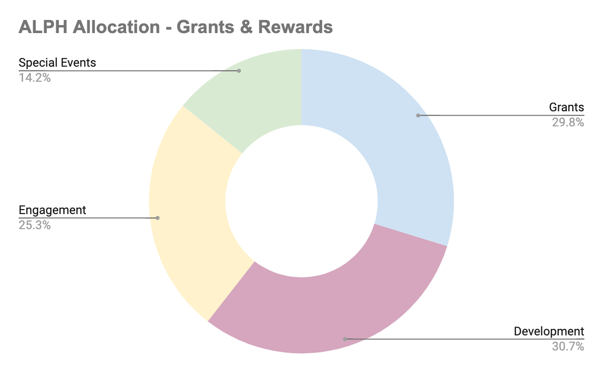
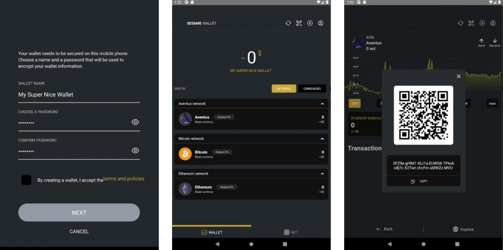
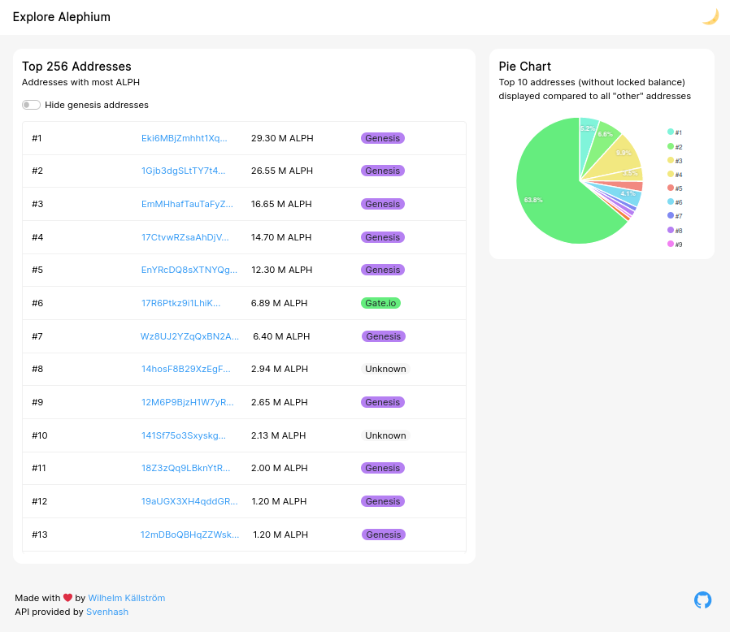
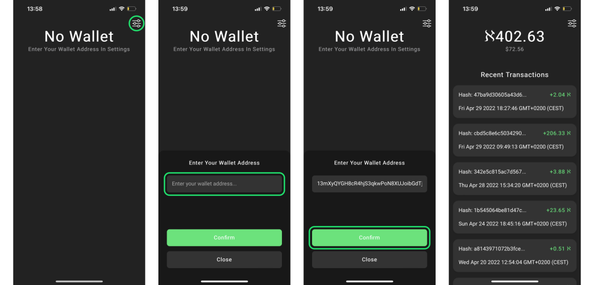

_A_ [year ago](/news/post/introducing-community-rewards-f4638bbf14bf)_, Alephium created the_ [community rewards](https://github.com/alephium/community) _and the_ [grants programs](https://github.com/alephium/community/blob/master/Grant%26RewardProgram.md) _to encourage the involvement of the community in all aspects of the project. It is still ongoing, head over to_ [GitHub and apply](https://github.com/alephium/community/blob/master/Grant%26RewardProgram.md)_!_

This is a retrospective of contributions by the Alephium community during 2022. Rewards and Grants have been distributed from the [Ecosystem Development allocation](/news/post/tokenomics-of-alephium-61d59b51029c) to deserving individuals & projects, many of which can be found in the [Awesome Alephium repository](https://github.com/alephium/awesome-alephium). As it’s impossible to mention all contributions, this is not an exhaustive list!

Alephium is immensely grateful to the community for its efforts, big and small, and this article is to be read as a testament to that strong BUIDL energy.

**Some Numbers**

A total of 386’238 ALPH have been allocated for over 265 contributions as part of Alephium’s Grants & Rewards Program.

- 118’765 ALPH have recognized Development contributions, from bug reports to full applications and services.
- 97’597 ALPH have been awarded to Community Engagement contributions, such as moderation and participation in social media channels, YouTube videos, blog articles, or translations.
- 54’876 ALPH have rewarded contributions in the Special Events category, for example, Hackathons and Contests.
- 115’000 ALPH have been distributed as part of grants**,** for larger projects contributing significantly to the ecosystem value growth.

**Fullnode and Mining**

From simple bots, to fully-featured mobile wallet apps, via mining software and helper scripts, a great multitude of tools and apps were built in 2022!

The node has been packaged for [Debian](https://projects.iabsis.com/projects/alephium-pkg/wiki/How_to_install_Alephium_with_packages), [Nix](https://github.com/chloekek/alephium-nix), and [cloud platforms running Kubernetes](https://github.com/liuhongchao/alephium-stack). 4 instances of Mining software were brought into existence: [bzMiner](https://www.bzminer.com/), [lolminer](https://lolminer.site/download/), [T-rex](https://trex-miner.com/), [SRBMiner](https://www.srbminer.com/download.html). Those offer various options to meet the needs and preferences of the mining community, each with its own trade-offs.

After the mining software came the [mining-pools](https://docs.alephium.org/mining/pool-mining-guide#currently-known-and-active-pools), building UIs, which curated communities and extended the ecosystem to a very essential part of a PoW blockchain community: the miners.

Miners have been immensely creative, some have created incredible videos, either [exploring the protocol](https://www.youtube.com/watch?v=y6m-5L8BD18), or producing [detailed tutorials on how to mine](https://www.youtube.com/watch?v=2pA2JE9sbTY), [gain in efficiency](https://www.youtube.com/watch?v=-bFY1SvMqxc), and [other advanced topics](https://www.youtube.com/watch?v=mtEkSIQzNeg).

Others have worked towards securing the network even more at the hardware level with attempts at building FPGAs and ASICs. We’re early, it’s hard and ungrateful work!

**Wallets**

While the official [Desktop Wallet](https://github.com/alephium/desktop-wallet) has been carefully packaged for [Dart](https://github.com/sahharYoucef/alephium_dart) and [Arch Linux](https://aur.archlinux.org/packages/alephium-wallet-bin/), the first community project out on the Mobile wallet market has been the [Sezame Wallet](https://sezame.app/). They built an easy-to-use cloud mining platform and a mobile wallet that were both available at the mainnet launch!

In November 2022, a new community-built mobile wallet appeared! [Sahhar Youcef](https://github.com/sahharYoucef/) released a fantastic mobile wallet for Android. It comes packed with interesting features such as multi-signature functionalities, an address book, biometric authentication, and a discrete mode. At the time of writing, it’s already been through [9 upgrade releases](https://github.com/sahharYoucef/alephium_wallet/releases/latest) and is still actively being developed (and that’s an understatement).

By the way, Alephium’s [new mobile wallet is coming very soon!](/news/post/the-front-end-leman-upgrade-948a98a3e2d)

**Bots and Utilities**

Bots. The most hated yet useful tools on the Internet. The community has built [several bots](https://github.com/alephium/awesome-alephium#bots) displaying useful information about the Alephium Network and ecosystems.

Transactions, mining stats, prices, there are all sorts of data available on bots like the Whale Watchers on [Twitter](https://twitter.com/AlephiumWW), the Alephium Insight on [Telegram](https://t.me/alephiumin), and [Discord](https://discord.gg/FWykwPPAd3), thanks to the useful [utilities](https://github.com/alephium/awesome-alephium#scripts) deployed by the developers of the community. Some of them have made their first marks in the craft by building for Alephium!

**WebApps**

A fantastic way to play with the data available on the chain is to produce WebApps. Here are 3 impressive apps which were developed in 2022:

[AlphTop](https://github.com/WilhelmKallstrom/alph-top) is made with [React](https://reactjs.org/) and shows the top 256 addresses on the Alephium Network, and was built on top of [cgi-bin’s API](https://github.com/sven-hash/alephium-stats). Benchmark yourself, or just observe the variations in top wallets!

[Alphvue](https://github.com/WilhelmKallstrom/alphvue): A Progressive Web App (PWA) for showing ALPH wallets’ balance, with a value displayed in FIAT, and recent transactions.

[Gramswap](https://gramswap.app/): A WebApp allowing users to swap ALPH for a wide variety of other digital assets.

**dApps**

While the network matures, builders are building. Even if the tooling is at an early stage, a few bold and adventurous developer teams got their hands deep in the codebase.

[XoXo](https://xoxo.art/) is one of these. It’s building an NFT platform that poetically claims to “mint emotions”. A front- and a backend are being built & tested right now.

The full spectrum of Smart Contract possibilities offered by the [Leman Upgrade](/news/post/announcing-the-leman-network-upgrade-c01a81e65f0e) will be especially useful to projects like XoXo!

[https://youtu.be/UkpsI1JenNM](https://youtu.be/UkpsI1JenNM)

**Code contributions**

Development rewards and bounties are essential to open-source projects as they incentivize public scrutiny in a transparent and participative way. They often act as a gateway for developers to start contributing to the code by helping them familiarize themselves with the protocols.

This process has benefits for the trust in the quality of the code and is an important metric. During 2022, a significant number of community-driven Issues and [Pull Requests](https://github.com/search?q=org%3Aalephium+is%3Aissue+created%3A%3E%3D2021-12-09+label%3AALPH-5%2CALPH-10%2CALPH-15%2CALPH-20%2CALPH-25%2CALPH-30%2CALPH-35%2CALPH-40%2CALPH-45%2CALPH-50%2CALPH-60%2CALPH-70%2CALPH-75%2CALPH-80%2CALPH-90%2CALPH-100%2CALPH-150%2CALPH-200%2CALPH-250%2CALPH-300%2CALPH-400%2CALPH-500%2CALPH-1000%2CALPH-1500%2CALPH-2000%2CALPH-5000) were raised, treated, and closed.

This is one of the things we will focus on in 2023 as the Leman Upgrade opens our codebase to more developers.

**Engagement & Special Events Rewards**

Contributing to an open-source software project is easier than it seems, even if you’re not into technical stuff: other tasks are just as valuable as documentation, translation, awareness, or marketing. Some of these are crucial to the growth and education of an international user base.

Rewards have been attributed for a variety of content contributions ranging from [thoughtful](https://twitter.com/CryptoBlock177/status/1602903695242452992) praises to simple nudges on Twitter, [full-on articles](https://medium.com/digital-thai-valley/mining-%E0%B8%82%E0%B8%B8%E0%B8%94-eth-alph-%E0%B8%9E%E0%B8%A3%E0%B9%89%E0%B8%AD%E0%B8%A1%E0%B8%81%E0%B8%B1%E0%B8%99-2-%E0%B9%80%E0%B8%AB%E0%B8%A3%E0%B8%B5%E0%B8%A2%E0%B8%8D%E0%B9%83%E0%B8%99%E0%B9%80%E0%B8%A7%E0%B8%A5%E0%B8%B2%E0%B9%80%E0%B8%94%E0%B8%B5%E0%B8%A2%E0%B8%A7%E0%B8%81%E0%B8%B1%E0%B8%99-window-t-rex-2miners-herominers-c89af6049879), intricate [translations](https://sourled.medium.com/alephiumun-geli%C5%9Ftirme-zaman%C4%B1-%C3%B6zeti-8930039f1303) into [multiple](https://medium.com/@alephium-pt/bem-vindos-ao-alephium-alph-3805f3c1e76d) [languages](https://medium.com/@Oheka/annonce-de-la-mise-%C3%A0-jour-leman-55955594724c), translation of the Desktop Wallet to German & Vietnamese, orientation of newcomers in our various channels, networking, and social media opportunities…

A huge amount of videos have been [created by the community in a mind-boggling multitude of languages](https://www.youtube.com/@alephium/playlists).

Part of the community reward budget is allocated to “Special Events.” These are meant to incentivize actions such as helping the core team debugging Release Candidates or participating in competitions with prizes such as Hackathons, or occasion-specific contests.

In 2022, Alephium supported the [Ergo Hack V](https://ergoplatform.org/en/blog/ErgoHack-5-Results/), and [organized a naming competition](/news/post/alephium-naming-competition-c1b736797461), [a video competition](/news/post/contest-for-all-video-creators-e777f2619596), and [a tutorial competition](/news/post/alephium-flux-tutorial-contest-81054caf926). [Reviewing the videos from the contest](/news/post/and-the-winners-of-the-video-creation-contest-are-f51ca8e5c28d) was a great deal of fun & the jury rewarded [Zionafari](https://youtu.be/_2S_BAHf3b8) & 2 others for their contributions.

During 2023 a lot is already planned!

**2023 & beyond**

The Community Reward & Grants programs will continue to evolve and find more efficient ways to stimulate community participation in all aspects of Alephium’s evolution.

True decentralization can only be achieved if the community is involved at every step of the project! Please head here for more information on how to solicit a [grant](https://github.com/alephium/community/blob/master/Grant%26RewardProgram.md) or [submit a contribution worthy of a community reward](https://docs.google.com/forms/d/e/1FAIpQLSeaSouXl-Hwd_lZohwgysqk-8whc9bydHuVpSCr1C6IoDHuoA/viewform?usp=send_form) (eligibility info [here](https://github.com/alephium/community)).

In 2023 Alephium will put the emphasis on the growth of the ecosystem. A strong focus on incentivizing the creation of dApps and services leveraging Alephium’s technical capabilities will happen too. Similarly, community development contributions and bug bounties will be encouraged. Get ready for our first official hackathon, to be announced very soon!

Once again, Alephium would like to thank all community members who have contributed their time and effort to make our ecosystem richer, livelier, bigger, better & more visible.

This is the way!
