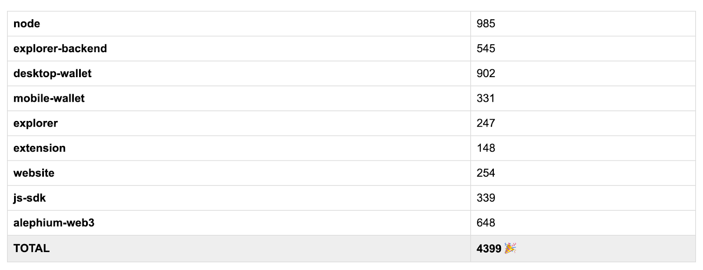
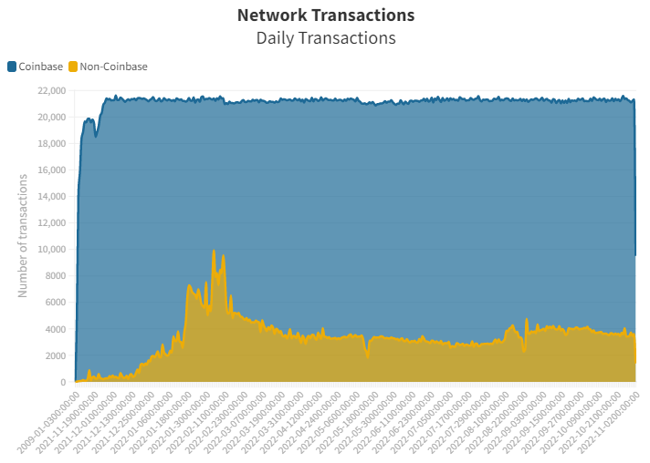
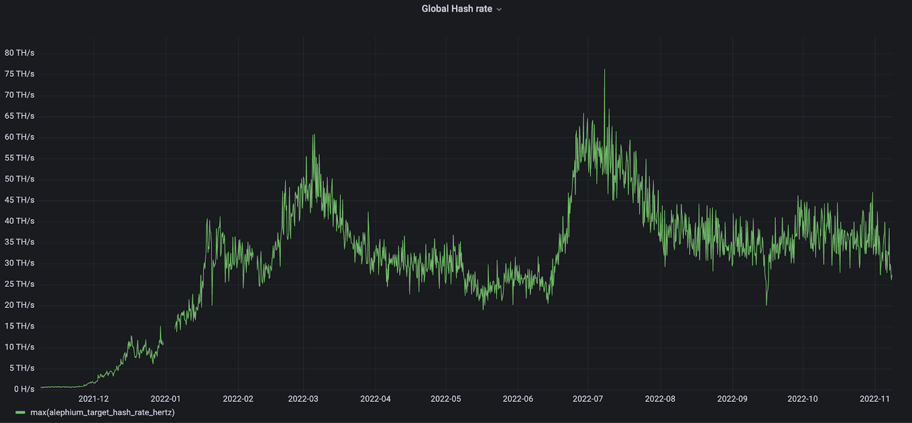
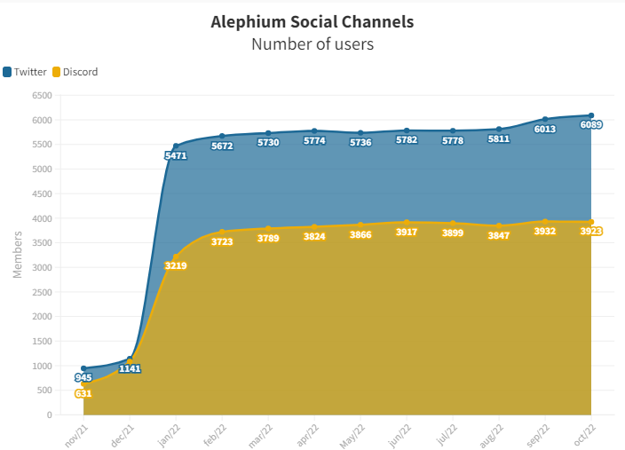

_To celebrate the first anniversary of Alephium’s mainnet launch (8th of November 2021), Alephium’s core team was asked for their insight on the past year. Here’s a small retrospective of what happened, where Alephium is today, and where it is going!_

**The Front End**

_The front end covers all the parts of Alephium that users interact with! The explorer, website, and desktop wallet are the main products of Alephium’s front-end work._

From the beginning, Alephium has given itself the goal of being a user-friendly chain and directed resources & attention to provide the **best user experience of all chains**. This is why Alephium had a slick desktop wallet and an explorer with all the necessary features already at the mainnet launch

Throughout the year, the focus has been on adding features, some of them advanced, like <a href="https://medium.com/@alephium/bip39-passphrase-implementation-f87adecd6f59" >the passphrase</a>. As a result, Alephium has an extensive set of native **high-quality frontend apps**: functional and good-looking <a href="https://explorer.alephium.org/#/" >explorer</a>, a high-end <a href="https://github.com/alephium/desktop-wallet/releases/tag/v1.4.0" >desktop wallet</a>, and a beautiful [Website](/).

The Front-end team is now preparing all front-end properties for the <a href="https://medium.com/@alephium/announcing-the-leman-network-upgrade-c01a81e65f0e" >Leman Upgrade</a>: tokens management, NFTs, and smart contract interactions are a big part of the roadmap for the coming months. The “**front-end stack 2.0”** is coming: expect a mobile wallet, a browser extension, Wallet Connect & bridge integration, and much more. A complete set of dApps for the community to reuse, tinker with, and create crazy stuff from is also on the cards further down the line!

During this journey, the team tremendously enjoyed the engagement of **the community**, its constructive feedback, and valuable contributions like the <a href="https://twitter.com/alephium/status/1580824436613468161" >mobile wallet</a> launched last month and the community desktop wallet translation. Keep it coming!

**The Blockchain**

_The core-dev team is building everything below the hood of the front end. It creates the engine and all the main components allowing the blockchain to run, such as the full node, the virtual machine (Alphred), the DSL language Ralph, the SDK & APIs, the language, and much more!_

Mainnet launch was already the culmination of years of work! It’s been surprisingly uneventful, as the network ran smoothly from the beginning. **Miner’s response** to the launch has been tremendous and surprising, as hashrate reached the 6-months objective in less than 48 hours. The community asked for and Alephium delivered the reference implementation for mining pools that is widely used today.

The **full node** has evolved a lot. It is very stable, lightweight, and easy to use and set up. Monitoring systems work well. This is important to the stated objective of having a very decentralized blockchain. Anyone can spin off a node on a Raspberry Pi in 5 minutes and sync it in less than 30 minutes with the new snapshotting feature.

The support for smart contracts at the **Virtual Machine** level was basic at launch, but a <a href="https://twitter.com/alephium/status/1582033265783111681" >lot of work has been done</a> to improve its expressiveness and the VM instructions. It will get even better very soon: the <a href="https://medium.com/@alephium/announcing-the-leman-network-upgrade-c01a81e65f0e" >Leman upgrade</a> will give it a huge boost on the interoperability/token support front.

The **SDK & APIs** have evolved greatly to improve the Developer Experience, with a smart contract framework and abstractions to make it easier to build dApps. The upcoming Bridge will also be a huge incentive to improve the dApps ecosystem.

Until the Leman Network Upgrade, the focus is on **building the tools and infrastructure** allowing developers to create dApps in a dev-friendly environment and with a great toolkit. While supporting the ecosystem growth, the core team will focus on **optimizations and improvements** to hand the developer’s community a friendly tech stack and all tools needed to _\#BuildWithAlephium._

**Infrastructure & backend**

_The infrastructure is the necessary foundation on which everything else runs! The backend team ensures everyone can see and query what’s going on in the chain by maintaining this crucial piece of infrastructure that is the backend of the explorer._

We have today a **fully distributed, geographically diverse infrastructure**. Alephium runs some full nodes (especially bootstrapping nodes) worldwide. On the **security** front, technical choices were made at the beginning that added work but helped mitigate many security risks.

On top of that, Alephium implements a lot of best practices, and things are tested again and again and again… to have enormous test/code coverage because the aim is the stability of the infrastructure.

**The** <a href="https://explorer.alephium.org/#/" ><strong>explorer</strong></a> was initially created to be a simple tool to show new blocks & transactions. We thought it would remain a small but useful contribution to be developed further by the community, but things changed! Important parts of our ecosystem, such as <a href="https://www.gate.io/trade/ALPH_USDT" >Gate.io</a> & others, rely on the explorer backend to check transactions, compute user balances, follow deposits, etc…

The **testnet** has been running well, too, with many people using features such as our faucet (<a href="https://twitter.com/alephium/status/1577302092586553344" >try it yourself</a>)! The upcoming Leman Network Upgrade is already live there for a while, and you can test the Bridge architecture and implementation. It is a crucial infrastructure that gives Alephium the preparation needed to perform the mainnet upgrades, allowing the experimentation of new features and ironing out any bugs!

For the **infrastructure**, the next step is to prepare for the arrival of the bridge, and it is constantly striving to **improve the developer experience.** That means being more agile with backward compatibility, offering better stability guarantees on APIs endpoints, making it easier to sync a node (snapshot functionality lowers the sync time to 30 minutes), and many other smaller features and capabilities!

For the **explorer** backend, the focus is on providing the front-end team with the right tools to integrate tokens and smart contracts management with the upcoming Leman Network Upgrade. The community has requested a CSV export (initially for tax-report purposes), and it is in the works. New suggestions are always welcomed; keep them coming!

**Operations, Marketing & Community**

_The operations team makes sure everything else runs smoothly! From strategic partnerships to human management, legal, and taxes, without it, everything else is more complicated. The marketing & community team creates and maintains lively & active communication channels, explains Alephium’s technology to the world one post at a time & partners with other communities, projects, and services._

Operations accomplished much in the past year, which started off to a flying start with Alephium’s **first exchange listing** on Gate.io & quickly onboarded strategic partners such as <a href="https://cetacean.capital/" >Cetacean Capital</a>. The move to **Neuchatel, Switzerland,** allowed Alephium to have a closer and more transparent relationship with the authorities and the flourishing local crypto community.

At launch of the mainnet, the **community** was small, engaged & very technically oriented. It started growing with the raging end of the bull market & took fire with the listing on Gate. It’s now a large and engaged set of people providing <a href="https://github.com/sven-hash/" >great help</a> and <a href="https://github.com/wilhelmkallstrom" >encouragement</a>. They have filled the <a href="https://github.com/alephium/awesome-alephium" >Awesome Alephium</a> repo with a lot of <a href="https://sezame.app/" >apps</a> and <a href="https://alph-top.web.app/" >services</a>!

The community has been instrumental in Alephium’s ability to aggregate a lot of **great partners**, such as <a href="https://ergoplatform.org/en/" >Ergo</a>, <a href="https://runonflux.io/" >Flux</a>, <a href="https://www.dappnode.io/" >Dappnode</a>, <a href="https://sezame.app/" >Sezame</a>, <a href="https://xoxo.com.br/" >XoXo</a>, and has joined organizations like the <a href="https://utxo-alliance.org/" >UTXO Alliance</a> & the <a href="https://cryptovalley.swiss/" >CVA</a>. Alephium is relentlessly creating links and connections to other people, ecosystems, and builders to strengthen the community, in part by being present in events like PBWC, EthCC, the CVA summit, PlanB, Neuchâtel’s CryptoTalks & more…

Marketing & community have created and maintained **many communication channels** which have grown by an order of magnitude during this momentous year: <a href="https://twitter.com/alephium" >Twitter</a> followers & [Discord](/discord) members have 10x over a year as most of our channels such as <a href="https://t.me/alephiumgroup" >Telegram</a>, <a href="https://www.reddit.com/r/Alephium" >Reddit</a>, <a href="https://medium.com/@alephium" >Medium</a> & <a href="https://www.linkedin.com/company/alephium/?miniCompanyUrn=urn%3Ali%3Afs_miniCompany%3A74304166&amp;lipi=urn%3Ali%3Apage%3Ad_flagship3_feed%3BKBfaEf7RQ%2BKgmIwYzNAvEA%3D%3D" >Linkedin</a>… Alephium has also produced **a lot of content** to <a href="https://medium.com/@alephium/tech-talk-1-the-ultimate-guide-to-proof-of-less-work-the-universe-and-everything-ba70644ab301?source=user_profile---------13----------------------------" >explain</a>, <a href="https://twitter.com/alephium/status/1541711510178758658?s=20&amp;t=MtJUKoK3e1aw-2UYvL3YEQ" >dissect</a>, <a href="https://medium.com/@alephium/core-team-interview-series-episode-1-3472f8295af6?source=user_profile---------20----------------------------" >showcase</a> & <a href="https://medium.com/@alephium/announcing-the-leman-network-upgrade-c01a81e65f0e?source=user_profile---------2----------------------------" >announce</a>! One key goal is to make <a href="https://medium.com/@alephium/bip39-passphrase-implementation-f87adecd6f59?source=user_profile---------12----------------------------" >Alephium’s tech</a> more accessible; it needs to be described <a href="https://medium.com/@alephium/tech-talk-1-proof-of-less-work-ama-3d5afbf78c71?source=user_profile---------9----------------------------" >carefully</a> and in <a href="https://wiki.alephium.org/" >detail</a>! <a href="https://youtu.be/r_5U7ZgByt4" >Stateful UTXO</a>, <a href="https://youtu.be/VVYH9rBJAdA" >Alphred VM</a>, the Ralph Language, and many other topics are on the menu for the coming weeks/months. And you can expect <a href="https://www.buzzsprout.com/2058047/11607475" >more</a> <a href="https://youtu.be/vBVbKIuHbLc" >podcasts</a>!

After the Leman Network Upgrade, Alephium will be in a good position to move forward with additional exchange listings, the bridge deployment, the first hackathon, and attracting more people to federate a strong and passionate ecosystem of projects and developers. At the same time, it keeps popularizing the tech stack, increasing its footprint in the PoW/UTXO industry niche, and building on the foundations laid this past year!

### The year in numbers

Here are a few interesting numbers and charts to give you a rapid overview of Alephium’s trajectory this year!

**GitHub commits**

Our GitHub saw more than **4’400 commits** over the past year: that’s almost 17 per business day! Alephium’s dev has been intensely active in coding, develop, expand everything! You can check our repos and see how Alephium prepares for the future with the Leman Network Upgrade.

**Wallets & transactions**

**50’761 wallets have been created** since the mainnet launch! While this doesn’t mean that it is the number of users, it is an interesting order of magnitude! The chart below shows the transactions on the blockchain over this first year (Coinbase transactions are ALPH minting as rewards to the miners and non-coinbase transactions are all the others, such as when you send ALPHs to someone). Almost **9M transactions** have filled **7.7M blocks** <a href="https://explorer.alephium.org/#/" >over the last 12 months</a>!

**Hashrate**

The network hashrate has exceeded the most optimistic predictions for the mainnet launch. The fact that Alephium helped mining pools and provided mining software implementations, as well as the possibility of dual (and even <a href="https://www.youtube.com/watch?v=mtEkSIQzNeg" >triple</a>) <a href="https://www.youtube.com/watch?v=EqlKCvWzrfU" >mining</a>, attracted a lot of interest from the mining community early on. This bootstrapped enough hashpower to secure the network and make it reliable. On this graph, you can see how The Merge and other events influenced the global hashrate!

**Socials**

Following the mainnet launch, Alephium’s followers increased slowly. The Gate.io listing in early January gave it a big push, and it’s mostly steadily and organically growing since then!

The community has been actively contributing since the beginning. Alephium has distributed more than **356'896 ALPH** to more than **85 contributors** for bounties & grants, as well as various tasks such as translations of <a href="https://medium.com/@alephium-pt/alephium-se-associa-%C3%A0-cetacean-capital-5b1f14a9e0d8" >articles</a>/content/<a href="https://docs.alephium.org/fr/full-node/getting-started" >documentation</a>, maintenance of community channels, video/article creation, etc… Thanks to all of you!

_Here it is for Year 1. The daily interaction with our community is a great reward for the whole project! You guys are fantastic, and we can’t wait to see what you come up with the tools we are building._

_To many more years of mainnet!_

_As always, you can follow the evolution of our code on_ <a href="https://github.com/alephium" ><em>Github</em></a>_, our news on_ <a href="https://twitter.com/alephium" ><em>Twitter</em></a> _&_ <a href="https://medium.com/@alephium" ><em>Medium</em></a>, _or come interact with us on_ <a href="https://discord.com/invite/GEbcpajCJG" ><em>Discord</em></a> _&_ <a href="https://t.me/alephiumgroup" ><em>Telegram</em></a>_._
