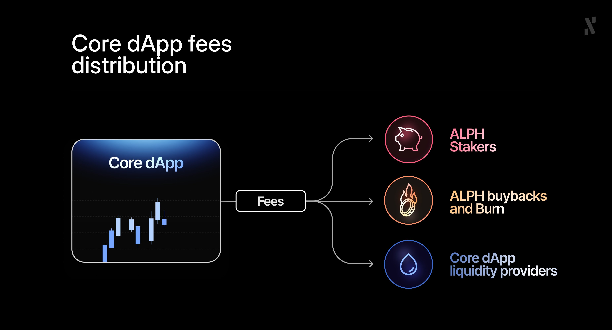
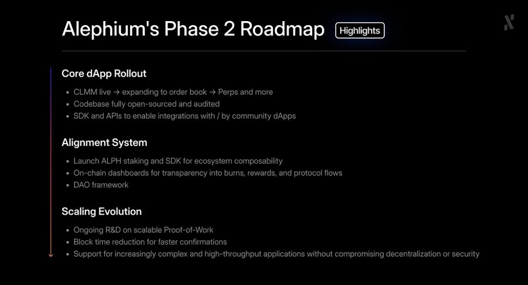

For several months now, the Alephium frontend and backend teams have been executing the most crucial [phase](https://x.com/alephium/status/1958886335202435548) of our development: building the Core dApp and its integrated staking solution from the ground up. 

What they are building is a strategic, protocol-owned beacon that demonstrates the full power, security, and scalability of the Alephium L1. Something this important takes time and patience, as we must get it right on the first attempt to maximize the opportune [timing](https://x.com/alephium/status/1981661943191732273).

**The launch date for the Testnet is coming, but before we announce the "when," we must show you the "how."** 

This article delivers a consolidated look at the technical foundation, both frontend and backend, that has already been built. Every component listed below is a committed step that ensures when the Core dApp goes live, it will be the most secure and resilient application possible.

First, let’s reflect on the vision.

## Full Recap, Phase 2: Aligned Economics

The countdown to Core dApp Testnet is on, and it will mark a critical transition into strategic economic alignment (Phase Two) built upon a battle-tested foundation (Phase One).

For those who may be reading this without a full picture of Alephium’s history, here’s the abridged version.

### Phase One: The Secure and Scalable Foundation

We set out to deliver a scalable, secure, and easy-to-use Proof-of-Work infrastructure. We did this in a way that eliminated the compromises made by most L1s (either speed, security, or decentralization).

Along the way, we built:

* **Native Sharding**: built into the protocol from day one
* **The Danube Upgrade:** Next-gen performance without zk or Layer 2 complexity.
* **The sUTXO Model**: security-first smart contracts that stop re-entrancy and approval exploits at the VM level.
* **UX as a Protocol Primitive**: built-in DevX improvements, fast confirmations, and no fragmentation.
* **New Deflationary Features:** 
* * **100% of the blocks’ transaction fees are burned**, directly linking usage to deflation.
  * **PoLW (Proof-of-Less-Work)** will deepen this alignment by tightening supply as network security increases.

### Phase Two: Activating the Aligned Ecosystem Loop

With the infrastructure firmly in place, Phase Two allows us to engineer the missing economic pieces to create a truly self-sustaining cycle.

* **The Core dApp**: Launching initially as a CLMM [DEX](https://x.com/alephium/status/1983903694581346644), will deliver a protocol-owned, open-source benchmark to secure liquidity, while the generated fees will be distributed to Liquidity Providers, ALPH stakers, and the remaining used for ALPH buybacks & burns.

* **Staked $ALPH**: Staking $ALPH provides participants with fee sharing from the Core dApp, governance rights, and composability for generating additional yield.
* **Aligned Loop**: The entire system connects to form a loop, whereby usage drives protocol fees, which drive deflation/distribution, which drives staking and governance, which drives usage. This is our path to long-term resilience and sustained utility for $ALPH.

The work detailed below is the developers’ execution of the strategy above, ensuring the Core dApp delivers on its original promise to be a secure and institution-ready benchmark for the entire ecosystem. 

## Core dApp Progress Milestones (Completed Work)

This list is a full production history of key frontend and backend achievements that have paved the road toward the Core dApp Testnet between August 25th (when Phase 2 was announced) and November 21st, when this article was published.

### Backend and Smart Contract Progress

* **DEX Contracts**
* * Implemented the fully functional CLMM DEX in Ralph
  * Support multi-hop swapping in CLMM
  * Support referral system in the CLMM and CPMM contracts 
  * Completed rigorous testing and fixed issues across the main user flows.
* **Staking Contracts**
* * Implemented the core staking contracts
  * Implemented example fee-sharing and governance contracts to demonstrate how to integrate with staking contracts
* **SDK**
* * Provide functionality to integrate with CLMM DEX
  * Provide functionality to integrate with CPMM DEX
  * Provide functionality to integrate with staking contracts
* **Backend & Frontend**
* * Implemented the basic frontend for CLMM & CPMM DEXes and staking contracts that supports core functionalities such as create pools, add liquidity, swapping, staking, etc.
  * Implemented the backend required to support the development of the frontend. 

### Frontend and Design Progress

* **Design & User Experience (UX) Foundation**
* * Ongoing wireframe and mockup design
  * Performed deep dives into competitor analysis (especially CLMMs).
  * Finished the design for the New Position screen.
  * Started designing the Pools screen interface.
  * Explored and experimented with new modal layout ideas.
* **Component Building**
* * Exported bridge code into a reusable widget to integrate into the Core dApp.
  * Continued intensive front-end design work, with numerous screens and components built in parallel.

**Phase 2 Roadmap Image here**

### Live Roadmap, Now Live!

This deep dive into our frontend and backend progress shows how the Core dApp has moved from concept to production. Now, as we get closer to the Testnet launch, we are committing to a new level of transparency and accountability to match the scale of this delivery.

In line with the release of this article, you can now visit [our roadmap page](/roadmap), where you can access the history of Alephium upgrades, roadmap highlights, and see what the developers are working on next in preparation for Testnet.

More interestingly, it includes a Live Roadmap Dashboard. This new system has been built by our developers to cover marketing, ecosystem, dApps, and more, for full transparency and accountability. For those waiting on the Core dApp, you can now get one degree closer to the action. 

**One final point to leave with you** - the Testnet will be launched as a testing ground to try out the smart contracts and backend. It is far from a finished product. During this time, we’ll be using a temporary front-end. The real Alephium quality UX/UI that you know and love will be saved for the Mainnet launch!

For further information and regular updates, be sure to check [Alephium’s ](http://www.twitter.com/alephium)[X](http://www.x.com/alephium) account.
