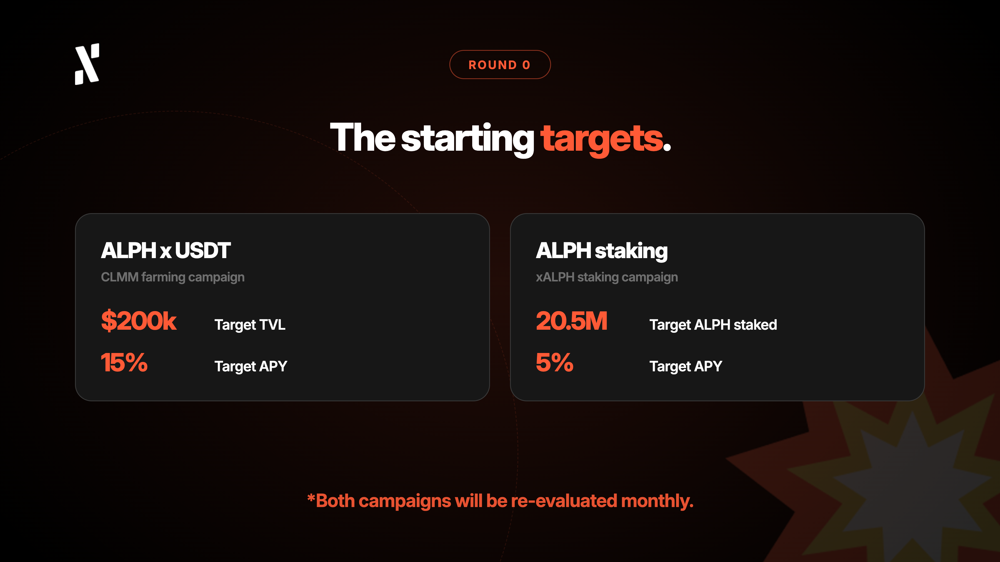
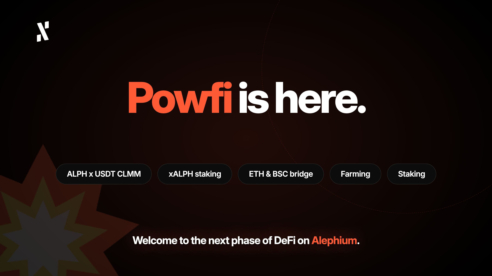

With great excitement, we announce that [Powfi](http://powfi.alephium.org), Alephium's Core dApp, is now live on mainnet.

The day has finally come.

Shipping Powfi marks the full activation of Phase Two of our roadmap: Aligned Economics. After more than a year of rigorous development and an intensive testnet period filled with community feedback, bug hunts, and iterative refinements, Powfi has graduated to production.

Credit is due to the entire development team for taking on and completing the challenge of bringing another key proprietary DeFi infrastructure to Alephium's Proof-of-Work ecosystem, in addition to the existing [Alephium Bridge](http://www.bridge.alephium.org) to Ethereum and Binance Smart Chain.

What began as a vision to move beyond high-performance infrastructure has become a reality for Alephium. With Powfi live, we enter a new chapter focused on building a more connected and self-reinforcing economic ecosystem, where DeFi activity strengthens ALPH utility and creates new opportunities for long-term adoption of our Layer 1.

### What does Powfi bring to DeFi on Alephium?

For those just discovering Powfi, it goes beyond a simple DEX to act as a foundational DeFi protocol built from the ground up on Alephium's native stateful UTXO (sUTXO) model.

Powfi delivers both a high-performance Concentrated Liquidity Market Maker (CLMM) and classic Constant Product Market Maker (CPMM) pools, alongside liquid staking through xALPH. 

All smart contract components are written in Ralph, Alephium's purpose-built programming language, and have gone through months of internal and public testing, including an intensive community-led bug hunt.

## Why Powfi Solves Real Problems in DeFi in 2026

One of the most persistent challenges for Layer-1 ecosystems is fragmentation. Successful decentralized applications can generate significant activity while much of the resulting value remains isolated at the application layer.

**Phase Two directly addresses this through the Aligned Ecosystem Loop.**

Powfi's share of protocol fees will be used to buy back ALPH. Of the ALPH purchased:

* 50% will be burned
* 50% will be distributed to stakers

This decision creates a direct relationship between protocol activity and ALPH. As Powfi activity grows, a portion of the resulting fees feeds back into the ALPH economy through buybacks, burns, and rewards for stakers.

The goal is a more unified economic model where application-layer activity and long-term ALPH participation reinforce one another.

## A New Liquidity Layer for ALPH

For liquidity providers, Powfi's CLMM introduces concentrated liquidity to Alephium.

Instead of spreading capital across the entire price curve, liquidity providers can allocate capital within specific price ranges that they choose. This can make capital more efficient and give LPs greater control over how their liquidity is deployed.

**The initial flagship market is ALPH x USDT.**

Powfi creates an on-chain liquidity venue for ALPH that can compete for trading flow alongside centralized exchange markets on Bitget, MEXC, and Gate.

The opportunity, however, extends beyond Alephium itself.

With the Alephium Bridge connecting Ethereum, BNB Smart Chain, and Alephium, ALPH x USDT markets can now form a more connected multi-chain liquidity network across Uniswap, PancakeSwap, and Powfi.

Powfi therefore becomes the Alephium-side liquidity layer in a broader ALPH x USDT market structure, creating new opportunities for liquidity to move between ecosystems through the Alephium Bridge.

The CLMM also opens the door to a broader range of liquidity providers, including institutional and professional LPs. Concentrated liquidity allows larger and more sophisticated participants to deploy capital strategically around defined price ranges and market conditions.

## Liquid Staking Through xALPH

The introduction of liquid staking through xALPH adds another foundational layer to Powfi.

Users can stake their ALPH and receive xALPH, a liquid representation of their staked ALPH that remains usable throughout DeFi.

This means users no longer have to choose between staking their ALPH and using it as DeFi capital. xALPH allows staked ALPH to remain liquid and composable.

It can support future integrations across the ecosystem, including lending, collateralized applications, yield strategies, and other DeFi use cases.

For example, a user could stake ALPH, receive xALPH, and use that xALPH as collateral in a lending protocol such as [Linx](http://www.app.linxlabs.org). As more applications integrate xALPH, the number of potential strategies and use cases can expand.

**This is the core value of liquid staking: staked assets can continue participating in the broader economy rather than becoming isolated capital**.

## Built for Developers, Businesses, and Liquidity Providers

Powfi was never meant to exist in isolation. From day one, it was designed as a set of DeFi primitives that other applications and businesses can build on.

Comprehensive SDKs for pricing, routing, and liquidity provisioning give third-party developers access to Powfi's infrastructure, allowing them to build trading interfaces, aggregators, yield strategies, and entirely new applications on top of the protocol.

Open building blocks lower the barrier for innovation across the Alephium ecosystem. Developers can build on existing liquidity and staking infrastructure rather than having to recreate every component from scratch.

Through Powfi's staking infrastructure, third-party businesses can integrate ALPH staking and xALPH directly into their own products and services. There is a full B2B package with custom reward commissions available. As an initial B2B2C pilot, ASIC manufacturer Goldshell Stake, together with DXPool, are integrating Powfi's White Label staking solution to offer ALPH staking directly to their miners (more details coming soon).

This creates a new distribution model for xALPH. Instead of relying exclusively on individual DeFi users discovering Powfi, liquid staking can reach ALPH users through businesses and platforms they already use.

The same principle applies to liquidity.

Powfi's CLMM creates infrastructure that can accommodate not only individual LPs, but also professional and institutional liquidity providers looking for more precise ways to deploy capital into ALPH markets.

Together, these capabilities position Powfi as infrastructure that can connect users, developers, businesses, and larger liquidity providers to the ALPH economy.

## Decentralization, Scalability, and Sustainable Innovation Remain Our Priority

At Alephium, we have always believed that blockchain infrastructure should combine strong security, scalability, and programmability without compromising the principles that make decentralized networks valuable.

Powfi puts that foundation to work in a real DeFi environment.

Its CLMM and CPMM provide the liquidity layer. xALPH provides the liquid staking layer. The Alephium Bridge connects ALPH to external ecosystems. Incentives bootstrap liquidity and staking participation (see more details on [staking](https://x.com/alephium/status/2102019961665593547) and [farming](https://x.com/alephium/status/2101309131298898250)). Finally, protocol fees create a mechanism through which activity can feed back into ALPH.

In an industry often driven by short-term hype, we chose the longer path.

That meant months of patient internal development, community-driven testnet phases, iterative refinements, and a relentless focus on quality over speed.

We believe Powfi embodies three principles that remain central to Alephium:

* **Decentralization:** building open infrastructure governed by transparent on-chain rules.
* **Scalability:** leveraging Alephium's sharded architecture to support a growing ecosystem.
* **Sustainability:** creating economic mechanisms that reward long-term participation and strengthen the relationship between applications and ALPH.

Powfi's launch is an important step toward an Alephium ecosystem where technological infrastructure and economic alignment reinforce one another.

As more applications integrate with Powfi, more businesses distribute xALPH, more liquidity enters ALPH markets, and additional revenue streams join the Aligned Ecosystem Loop, the ecosystem can become stronger, more connected, and more useful for everyone who participates.

## Building the Next Phase of ALPH DeFi

Powfi's mainnet launch opens an exciting new chapter for Alephium's DeFi ecosystem. With core liquidity infrastructure and liquid staking now firmly in place, the work ahead will focus on enabling more of the ecosystem to grow around these foundations.

That means supporting the launch and expansion of community-built applications including [Linx](http://app.linx.org), [Aura](https://aurabets.io/), [Factor](http://factor.cx), and many more. It will also involve creating the ideal conditions for new integrations, tokenized assets, liquidity providers, businesses, and institutional participants to enter the ALPH economy.

Progress comes layer by layer, as liquidity deepens, adoption widens, and infrastructure matures. Our aim is to realize a future where each new integration, application launch, and participant adds to the foundation rather than replacing it.

The opportunity ahead is larger than any single application. It belongs to every team, builder, and participant who chooses to build on top of what has been established here.

## Your Invitation to Explore Powfi

Powfi mainnet is live and ready for you.

\> [powfi.alephium.org](http://powfi.alephium.org)

Experience the CLMM DEX, provide ALPH x USDT liquidity, try liquid staking with xALPH, or swap assets through Powfi.

Whether you are a DeFi user, a liquidity provider looking for greater capital efficiency, an institutional LP exploring ALPH markets, a business looking to offer ALPH staking to its users, or a developer ready to build the next wave of applications, Powfi provides a new foundation to build on.

We remain deeply grateful to the community that stress-tested Powfi on testnet, reported bugs, suggested improvements, and helped shape this milestone. Your feedback was instrumental in getting us here.

The journey continues.

Phase Two is just beginning, and the best is yet to come.

Made with love by the humans at Alephium.

